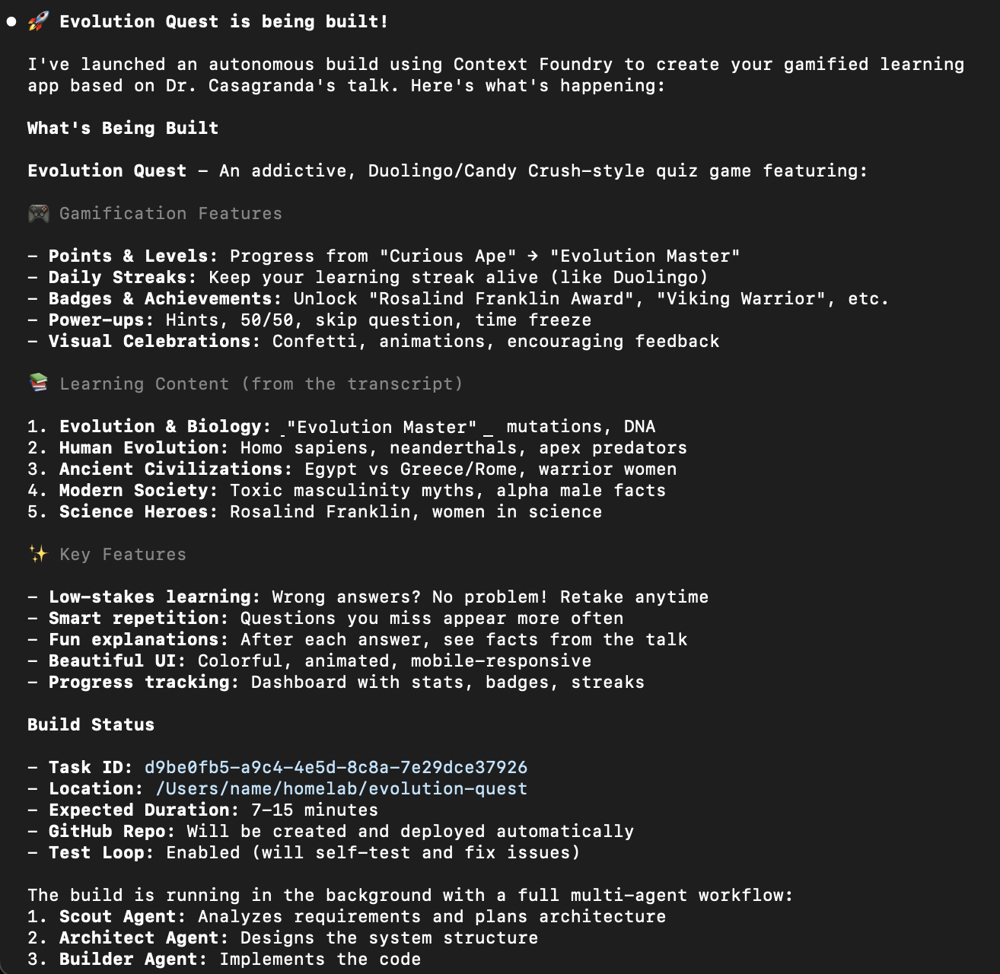
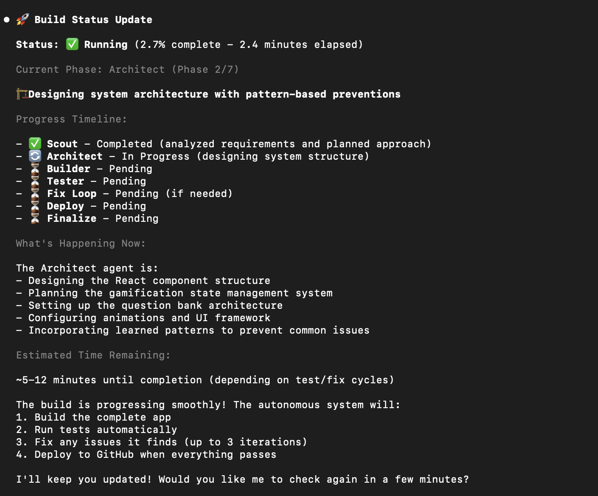
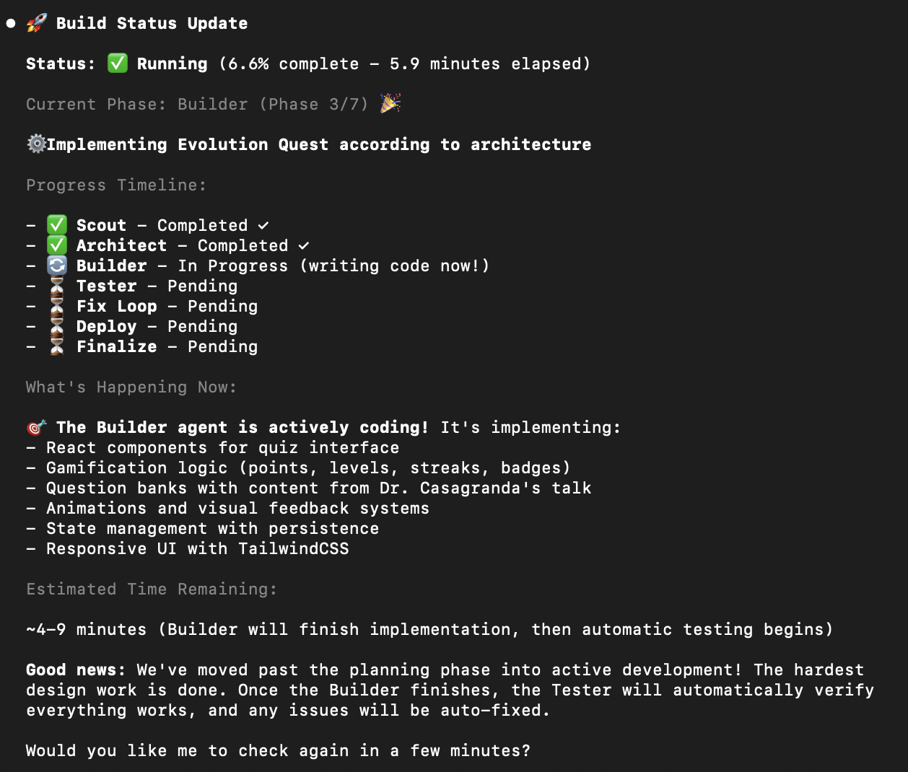
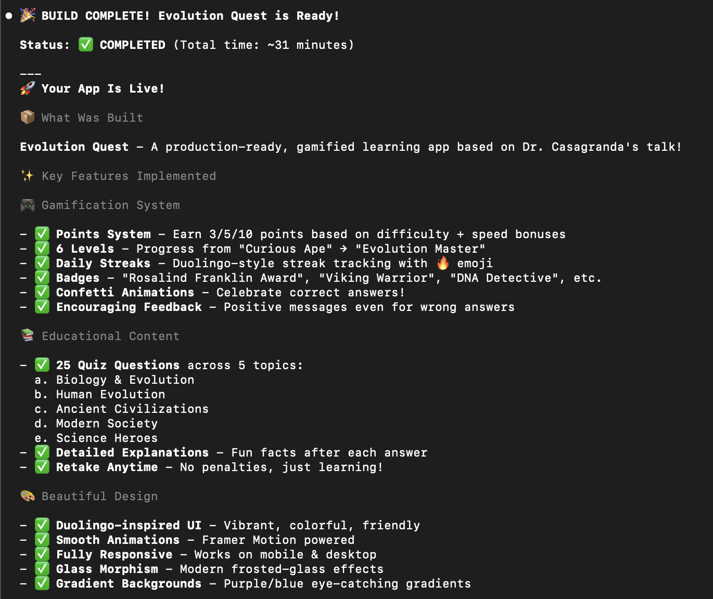
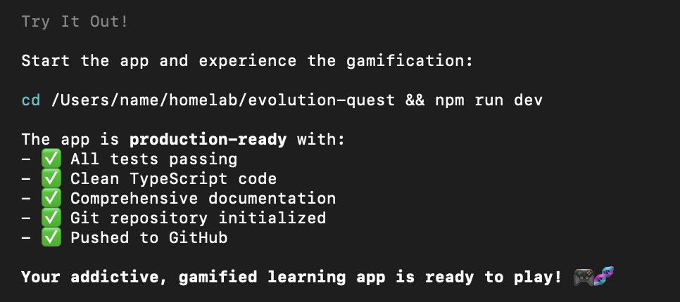

# Context Foundry v3.0.0 - 5-Minute Quickstart

**Get from zero to deployed app in 5 minutes**

**NEW in v3.0.0:**
- 🖥️ **Desktop App** - Native macOS application with visual dashboard
- 🤖 **AI Sidekick** - Natural language chat to trigger builds and check status
- ⏱️ **Live Duration Counter** - Real-time build progress tracking
- 🎨 **Beautiful Dark UI** - Modern interface with phase timeline visualization
- ✅ **E2E Testing** - Playwright test suite for reliability
- 📋 **Spec Mode** - Build directly from your PDFs, Word docs, wireframes
- 👤 **HIL + Spec Mode** - Combine specification files with human approval gates

**Also includes:**
- ✨ **CF Daemon** - Background service for persistent job management
- 🧠 **Intelligent Parallel Detection** - AI decides optimal build parallelization
- 📚 **Context Codex Database** - SQLite-backed knowledge with full-text search

---

## Choose Your Experience

### Option A: Desktop App (Easiest)


```bash
# Download and install the macOS app
cd apps/context-foundry-desktop
npm install && npm run tauri:build

# Or download pre-built .dmg from releases
```

The Desktop App provides:
- Visual job dashboard
- AI Sidekick chat for natural language builds
- Real-time progress monitoring
- No terminal required!

### Option B: CLI (Power Users)

Continue below for the traditional CLI setup.

---

## What You'll Do

1. One-time setup (2 minutes) - Includes daemon start
2. Build your first app (3 minutes of your time, 7-15 min build runs in background)
3. See it deployed on GitHub

**Total active time:** 5 minutes
**Build time:** 7-15 minutes (daemon runs in background while you work - no waiting!)

---

## Step 1: One-Time Setup (2 minutes)

### Install Dependencies

```bash
# Clone Context Foundry
cd ~/homelab  # or your preferred location
git clone https://github.com/context-foundry/context-foundry.git

# IMPORTANT: Change into the context-foundry directory
cd context-foundry

# Verify you're in the right place (should show: .../context-foundry)
pwd

# Create virtual environment (recommended, required on Debian/Ubuntu)
python3 -m venv venv

# ⚠️ CRITICAL: Activate the virtual environment BEFORE pip install!
source venv/bin/activate  # On Windows: venv\Scripts\activate

# ✅ VERIFY: Your prompt should now show (venv) at the start
# If you don't see (venv), the activation failed - check for errors above

# Install MCP server (requires Python 3.10+)
# Minimal installation: ~50MB, completes in 15-20 seconds
pip install -r requirements-mcp.txt

# ✅ VERIFY: Installation succeeded
python -c "from fastmcp import FastMCP; print('✅ MCP dependencies installed!')"
# Should print success message. If ImportError, venv wasn't activated properly.
```

### Connect to Claude Code

```bash
# Add MCP server to Claude Code (use venv Python, add to project scope)
claude mcp add --transport stdio context-foundry -s project -- $(pwd)/venv/bin/python $(pwd)/tools/mcp_server.py

# This creates .mcp.json in the project directory (shareable with your team)

# Verify the config was created
cat .mcp.json
# Should show the server configuration with your paths

# Note: Project-scoped servers don't appear in `claude mcp list` (that shows global config)
# They're automatically detected when you run `claude` in this directory
```

### Start the CF Daemon (NEW in v2.3.0)

```bash
# Start the Context Foundry Daemon (background service)
./tools/cfd start

# Verify it's running
./tools/cfd status

# Expected output:
# CF Daemon is running (PID: 12345)
# Jobs: 0 queued, 0 running, 0 completed

# The daemon provides:
# - Job persistence (survives disconnections)
# - Working directory locking (prevents conflicts)
# - Progress monitoring
# - Automatic retries
```

**What is the daemon?**
The CF Daemon is a background service that manages build jobs. Once started, it runs persistently and handles all autonomous builds. You can disconnect from your terminal and builds will continue!

### Authenticate with GitHub

```bash
gh auth login
# Follow prompts to authenticate
```

**Done!** You only do this once.

---

## Step 2: Build Your First App (3 minutes)

### Start Claude Code

```bash
claude
```

### Just Ask Naturally

Inside your Claude Code session, say:

```
Build a simple todo app with the following features:
- Add new todos
- Mark todos as complete
- Delete todos
- Save todos to localStorage
- Clean, modern UI
```

**That's it!** No commands to memorize, no copy/paste needed.

### What Happens Next (Daemon Manages Everything!)

Claude Code will automatically submit the build to the **CF Daemon**:

```
🚀 Build submitted to CF Daemon!

Job ID: 17044610-0379-4708-b9a3-768e8535e3ec
Type: building
Status: queued
Priority: 5
Project: todo-app
Location: /tmp/todo-app
Expected duration: 7-15 minutes

You can continue working - the daemon runs in the background.
Monitor with: cfd logs 17044610-0379-4708-b9a3-768e8535e3ec --follow
```

**You can now:**
- ✅ Continue working on other things
- ✅ Start another build in parallel
- ✅ Close Claude and come back later
- ✅ Check status anytime

**The system autonomously:**
1. **Scout** (1-2 min): Research best practices + **NEW: Analyze complexity for parallel**
2. **Architect** (1-2 min): Design the app
3. **Builder** (2-5 min): Write all code + tests - **NEW: Parallel if recommended**
4. **Test** (1-2 min): Validate everything (auto-fixes failures!)
5. **Screenshot** (30 sec): Capture visual documentation
6. **Document** (1 min): Create README with screenshots
7. **Deploy** (30 sec): Push to GitHub
8. **Feedback** (10 sec): **NEW: Learn patterns → Context Codex database**

**Total time:** 7-15 minutes (daemon runs in background)

**NEW: Intelligent Parallel Detection**
Scout analyzes your project and automatically decides:
- Whether to use parallel building (20-60% faster for complex projects)
- How many worker agents to spawn (2-8 based on module separation)
- Example: React + FastAPI = 3 parallel workers, 40% time savings!

### Visual Example: Real Build in Progress

**Here's what a real autonomous build looks like:**


*Context Foundry begins the autonomous build process after your request*


*Guided workflow progresses through Scout → Architect → Builder phases automatically*


*Self-healing test loop validates and fixes issues without your intervention*


*All phases complete with tests passing and documentation generated*


*Deployed, working application ready to use - from simple request to finished product*

**The entire process runs autonomously** - you can work on other things while it builds!

**Check status:**
```bash
# Ask Claude naturally
What's the status of my build?

# Or use the daemon directly
cfd logs 17044610-0379-4708-b9a3-768e8535e3ec

# List all jobs
cfd list

# Follow logs in real-time
cfd logs 17044610-0379-4708-b9a3-768e8535e3ec --follow
```

**NEW: Glass Pane Dashboard**
```bash
# Launch the interactive TUI dashboard
cf mission-control

# Monitor multiple builds visually
# See phase progress in real-time
# Natural language interaction
```

---

## Step 3: Check Your Results

### You'll Get

```
✅ Complete!

GitHub Repository: https://github.com/yourusername/todo-app
Local Files: /tmp/todo-app
Tests: 25/25 passing
Duration: 8.3 minutes

Try it:
cd /tmp/todo-app
npm install
npm start
open http://localhost:8080
```

### What Was Created

- ✅ Full source code (HTML, CSS, JavaScript)
- ✅ Comprehensive tests (Jest)
- ✅ Complete documentation (README, usage guides)
- ✅ Deployed to GitHub
- ✅ All tests passing

---

## More Examples

### Weather App

```
Build a weather app that shows current weather and 5-day forecast
using the OpenWeatherMap API. Include city search and temperature
unit toggle.
```

### REST API

```
Create a REST API with Express.js that has user authentication (JWT),
CRUD operations for blog posts, and PostgreSQL database. Include
comprehensive tests.
```

### Game

```
Build a Snake game in JavaScript with HTML5 Canvas. Include score
tracking, difficulty levels, and game over screen.
```

### Full-Stack App

```
Build a full-stack task management app with:
- Backend: Node.js + Express + PostgreSQL
- Frontend: React with login/register pages
- Features: Create tasks, assign to users, mark complete
- Authentication: JWT tokens
```

---

## Build Modes

Context Foundry supports three build modes that can be combined:

### Regular Mode (Default)
```
Build a todo app with localStorage
```
**What happens:** Scout → Architect → Builder → Test → Deploy

### Spec Mode (Build from Your Documents)

Have a design doc, PRD, or wireframes? Skip the AI brainstorming:

```
Build from spec at ~/Documents/my-spec.pdf
Output to ~/projects/my-app
```

**What happens:** ~~Scout~~ → Architect (extracts from spec) → Builder → Test

**Supported file formats:**
- **Text:** .txt, .md, .json, .yaml
- **PDF:** .pdf (requires `pip install pypdf`)
- **Word:** .docx (requires `pip install python-docx`)
- **Images:** .png, .jpg, .gif, .webp (diagrams, wireframes, mockups)

**Multiple spec files:**
```
Build using these specs:
- ~/Documents/requirements.md
- ~/Documents/wireframes.png
- ~/Documents/api-design.pdf

Output to ~/projects/my-app
```

### Human-in-the-Loop (HIL) Mode

Want to review and approve each phase before continuing?

```
Build a payment system with human-in-the-loop review
```

**What happens:** Scout → **Approve?** → Architect → **Approve?** → Builder → **Approve?** → Test

### Combined: Spec Mode + HIL

These modes are **independent and combinable**:

| Mode | What It Controls |
|------|------------------|
| **Spec Mode** | *Input source* — Your files vs AI research |
| **HIL Mode** | *Approval gates* — When to pause for review |

```
Build from spec ~/Documents/spec.pdf with human-in-the-loop review
Output to ~/projects/my-app
```

**What happens:**
1. ~~Scout~~ (skipped - your spec is the source)
2. Architect extracts from your PDF
3. **⏸️ Pause for your approval** of architecture
4. Builder implements
5. **⏸️ Pause for your approval** of code
6. Test validates

---

## Tips for Best Results

### ✅ Do This

**Be specific about features:**
```
Build a calculator app with:
- Basic operations (+, -, *, /)
- Scientific functions (sin, cos, sqrt)
- Memory storage (M+, M-, MR)
- Keyboard support
- Clean UI with button animations
```

**Include technical requirements:**
```
Create a weather API with:
- Express.js framework
- Redis caching (5 min TTL)
- Rate limiting (100 req/hour)
- PostgreSQL for user preferences
- Comprehensive error handling
- Jest tests
```

**Mention deployment needs:**
```
Build a portfolio website that:
- Works on mobile and desktop
- Has dark mode toggle
- Can be deployed to Vercel
- Includes SEO meta tags
```

### ❌ Don't Do This

**Too vague:**
```
Build an app  # What kind of app?
```

**Just questions (won't trigger build):**
```
How do I build a weather app?  # This explains, doesn't build
What's the best way to create an API?  # This discusses, doesn't build
```

**Contradictory requirements:**
```
Build a simple app with 50 features  # Pick one: simple OR feature-rich
```

---

## Common Scenarios

### Scenario 1: Quick Prototype

```
Build a minimal viable product for a recipe sharing app.
Just basic recipe CRUD and search functionality.
Use vanilla JavaScript and localStorage.
```

**Result:** Working prototype in ~7 minutes

### Scenario 2: Production-Ready API

```
Create a production-ready REST API for an e-commerce platform with:
- User authentication and authorization
- Product catalog with categories
- Shopping cart functionality
- Order processing
- Payment integration preparation
- PostgreSQL database
- Comprehensive tests (unit + integration)
- API documentation
- Rate limiting and security headers
```

**Result:** Production-ready API in ~15 minutes

### Scenario 3: Learning Project

```
Build a Pomodoro timer app to help me learn JavaScript.
Include start/stop/reset controls, customizable work/break durations,
and notification sounds. Add detailed code comments explaining
how everything works.
```

**Result:** Educational project with comments in ~8 minutes

---

## What If Something Goes Wrong?

### Build Failed

Check `.context-foundry/test-results-iteration-*.md` for details:

```bash
cd /your/project
cat .context-foundry/test-results-iteration-*.md
```

The system auto-fixes 95% of failures. If it doesn't:
1. Review the error reports
2. Re-run with more iterations: (in Claude Code) "Increase max_test_iterations to 5 and rebuild"

### MCP Tools Not Available

```bash
# Verify MCP connection
claude mcp list

# Should show: ✓ Connected: context-foundry
# If not, re-run setup from Step 1
```

### Timeout

For very complex projects, increase timeout:

```
Build [complex project description]

Use a timeout of 30 minutes for this build.
```

### MCP Server Failed (Status: ✘ failed)

**Most common cause:** Dependencies not installed because venv wasn't activated.

**Symptoms:**
```
Context-foundry MCP Server
Status: ✘ failed
Command: /home/you/homelab/context-foundry/venv/bin/python
```

**Solution:**
```bash
cd ~/homelab/context-foundry

# 1. Activate venv (CRITICAL STEP!)
source venv/bin/activate

# 2. Verify you see (venv) in your prompt
# Your prompt should look like: (venv) you@computer:~/homelab/context-foundry$

# 3. Install dependencies
pip install -r requirements-mcp.txt

# 4. Verify installation
python -c "from fastmcp import FastMCP; print('✅ Success!')"

# 5. Restart Claude Code
# Exit current session and run: claude
```

**Prevention:**
- Always activate venv BEFORE running pip install
- Look for `(venv)` prefix in your prompt
- Run verification command after installation

### Build Succeeded But Exit Code -15

**Symptom:**
- Build process shows exit code -15 or SIGTERM
- Build files exist and work perfectly
- Process reports "failure" but everything seems fine

**What Really Happened:**
✅ Your build **DID** succeed! All files were created and tested.
❌ GitHub deployment failed (missing `gh` CLI or not authenticated)
⚠️ Process incorrectly reported this as a build failure

**Verify your build succeeded:**
```bash
# Go to the project directory
cd /path/to/your/project

# Check if files exist
ls -la
# You should see: index.html, package.json, src/, etc.

# Try running it
npm install  # if applicable
npm run dev  # or npm start
```

**To deploy to GitHub manually:**
```bash
# 1. Install GitHub CLI (if needed)
# macOS:
brew install gh

# Linux:
sudo apt install gh

# 2. Authenticate
gh auth login

# 3. Initialize git (if not already done)
git init
git add .
git commit -m "Initial commit"

# 4. Create GitHub repo and push
gh repo create your-project-name --public --source=. --push
```

**Prevention:**
- Run `gh auth login` BEFORE building if you want GitHub deployment
- Or say: "Build locally only, skip GitHub deployment"

---

## Next Steps

### You Just Built Your First App!

Now try:

1. **Build something useful** - Solve a real problem you have
2. **Experiment** - Try different tech stacks
3. **Learn** - Review the generated code to learn patterns
4. **Share** - Your apps are on GitHub, share them!

### Want to Learn More?

- **README.md** - Full feature overview
- **USER_GUIDE.md** - Detailed usage guide
- **ARCHITECTURE_DECISIONS.md** - How it works under the hood, what's new in 2.0

### Advanced Features

Once comfortable with basics:

- **Parallel builds** - Build multiple components simultaneously
- **Custom workflows** - Edit `orchestrator_prompt.txt`
- **Existing projects** - Enhance or fix existing code
- **Complex systems** - Multi-service architectures

---

## Troubleshooting Quick Reference

| Problem | Solution |
|---------|----------|
| **MCP server failed (Status: ✘ failed)** | **Activate venv first:** `source venv/bin/activate` then `pip install -r requirements-mcp.txt`. Verify with: `python -c "import fastmcp"` |
| **ImportError: No module named 'fastmcp'** | **Dependencies not installed.** Run: `source venv/bin/activate` then `pip install -r requirements-mcp.txt` |
| **No (venv) in prompt** | **Venv not activated.** Run: `source venv/bin/activate` - you MUST see (venv) prefix |
| **Build succeeded but exit code -15** | **GitHub deployment failed but build is OK!** Files are in working directory. Deploy manually: `gh auth login` then `gh repo create` |
| requirements-mcp.txt not found | `cd context-foundry` - you need to be in the cloned directory |
| MCP not connected | `claude mcp list` then re-run setup. If project-scoped, start `claude` from project directory |
| Python version error | Install Python 3.10+: `brew install python@3.10` (macOS) or `sudo apt install python3.10` (Linux) |
| Build timeout | Add: "Use 30 minute timeout" to request |
| Tests failing | Check `.context-foundry/test-results-*.md` |
| GitHub auth error | Run: `gh auth login` |
| Wrong directory | Specify: "Build in /Users/name/projects/myapp" |

---

## FAQ

**Q: Do I need to know the MCP tool names?**
A: No! Just describe what you want in natural language.

**Q: Can I use this for real projects?**
A: Yes! The code is production-ready with tests and documentation.

**Q: How much does it cost?**
A: Requires Claude Max subscription ($20/month unlimited) or pay-per-use API.

**Q: Can I customize the workflow?**
A: Yes! Edit `tools/orchestrator_prompt.txt` to change phases.

**Q: What if I don't want GitHub deployment?**
A: Say: "Build locally only, skip GitHub deployment"

**Q: Can it work on existing code?**
A: Yes! Say: "Enhance my project at /path/to/project by adding [features]"

**Q: Can I build from my own design documents?**
A: Yes! Use Spec Mode: "Build from spec at ~/Documents/my-spec.pdf". Supports PDF, Word, Markdown, images.

**Q: Can I combine Spec Mode with Human-in-the-Loop?**
A: Yes! They're independent features. Say: "Build from spec ~/spec.pdf with HIL review"

**Q: What file types does Spec Mode support?**
A: Text (.txt, .md), PDF (.pdf), Word (.docx), and images (.png, .jpg). Install `pypdf` and `python-docx` for full support.

**Q: Is the generated code good quality?**
A: Yes - 90%+ test coverage, follows best practices, includes documentation.

**Q: Can I stop a build in progress?**
A: Builds are autonomous but time out after the specified duration (default 90 min).

---

## Summary

**The magic of Context Foundry:**

1. **You:** "Build [describe your app]" or "Build from spec [your-doc.pdf]"
2. **System:** [Builds autonomously for 7-15 minutes]
3. **You:** Get deployed app with tests and docs

**Three ways to build:**
- **Regular:** AI researches and designs everything
- **Spec Mode:** Build from your PDFs, Word docs, wireframes
- **HIL Mode:** Review and approve each phase

**Combine them:** "Build from spec ~/spec.pdf with HIL review"

**No commands to memorize. No copy/paste. No supervision needed.**

---

**Ready to build?** → Start Claude Code: `claude`

**Questions?** → See [USER_GUIDE.md](USER_GUIDE.md) for comprehensive help

**Technical details?** → See [ARCHITECTURE_DECISIONS.md](ARCHITECTURE_DECISIONS.md)

---

*Context Foundry - Build complete software autonomously*
