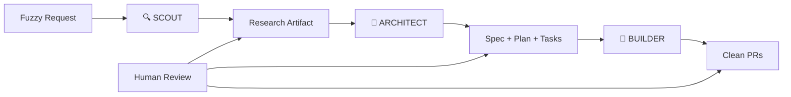

# 🏭 Context Foundry

> **The Anti-Vibe Coding System**: Spec-first development through automated context engineering.
> Scout → Architect → Builder. Workflow over vibes.

## What is Context Foundry?

Context Foundry transforms fuzzy requests into clean, reviewable PRs through disciplined three-phase execution. It's the opposite of "vibe coding" - instead of chaotic back-and-forth with AI, it's systematic progression through research, planning, and implementation.

**Core Innovation**: Automated Context Engineering (ACE) - maintaining <40% context utilization while building complex software.

## The Three-Phase Workflow



### Phase 1: Scout (Research)

- Systematically explores the codebase
- Follows execution paths, not random files
- Produces compact research artifact (max 5K tokens)
- Context target: <30%

### Phase 2: Architect (Planning)

- Creates specifications from research
- Generates technical plans with alternatives considered
- Decomposes into atomic, testable tasks
- Context target: <40%
- **CRITICAL**: Human review required (highest leverage point)

### Phase 3: Builder (Implementation)

- Executes tasks sequentially
- Test-driven development (tests first)
- Continuous context compaction
- Git checkpoint after each task
- Context target: <50%

## Quick Start

**New to Context Foundry?** Check out the [30-Minute Tutorial](docs/TUTORIAL.md) for a complete walkthrough from installation to your first PR.

### Installation

```bash
# Install Context Foundry
git clone https://github.com/yourusername/context-foundry.git
cd context-foundry
pip install -e .

# Configure API key
foundry config --init
export ANTHROPIC_API_KEY=your_key_here

# Verify setup
python tools/health_check.py
```

### Basic Usage (with CLI)

```bash
# Interactive build with reviews
foundry build my-app "Build user authentication with JWT"

# Autonomous build (no reviews)
foundry build api-server "REST API with PostgreSQL" --autonomous

# Overnight session (8 hours)
foundry build big-project "Complex system" --overnight 8

# With livestream dashboard
foundry build web-app "Todo app" --livestream
```

### Monitor Progress

```bash
# Check current session
foundry status

# Watch mode (live updates)
foundry status --watch

# Analyze completed session
foundry analyze --format markdown --save report.md
```

## Key Principles

- **Specs are permanent, code is disposable**
- **Context quality > model capability**
- **Human review at maximum leverage (planning)**
- **40% context utilization is the golden zone**
- **Tests before implementation, always**

## Project Structure

```
context-foundry/
├── .foundry/           # Core configuration
│   ├── FOUNDRY.md     # System identity & rules
│   └── agents/        # Agent configurations
├── ace/               # Automated Context Engineering
│   ├── scouts/        # Research modules
│   ├── architects/    # Planning modules
│   └── builders/      # Implementation modules
├── blueprints/        # Specifications and plans
│   ├── specs/         # Research & specifications
│   ├── plans/         # Technical plans
│   └── tasks/         # Task breakdowns
├── foundry/           # Knowledge base
│   ├── patterns/      # Reusable patterns
│   ├── knowledge/     # Accumulated wisdom
│   └── research/      # Original research docs
├── checkpoints/       # Session management
│   ├── sessions/      # Progress tracking
│   └── artifacts/     # Generated artifacts
└── workflows/         # Orchestration
    └── orchestrate.py # Main workflow engine
```

## Feature Status

| Feature | Status | Description |
|---------|--------|-------------|
| **Scout Phase** | ✅ Working | Research and architecture exploration |
| **Architect Phase** | ✅ Working | Specification and task planning |
| **Builder Phase** | ✅ Working | Test-driven implementation |
| **Context Management** | ✅ Working | Auto-compaction at 40% threshold |
| **Pattern Library** | ✅ Working | Learning from successful builds |
| **CLI Interface** | ✅ Working | Unified `foundry` command |
| **Overnight Sessions** | ✅ Working | Ralph Wiggum autonomous mode |
| **Livestream Dashboard** | 🚧 Beta | Real-time progress visualization |
| **Git Integration** | ✅ Working | Auto-commits and checkpointing |
| **Health Checks** | ✅ Working | Setup validation |
| **Session Analysis** | ✅ Working | Metrics and reporting |
| **PR Creation** | 📋 Planned | Automatic GitHub PRs |
| **Multi-Project** | 📋 Planned | Managing multiple projects |
| **Cloud Deployment** | 📋 Planned | Hosted Context Foundry |

## Real-World Results

Based on the methodology that powers Context Foundry:

- **HumanLayer**: 35K lines of code in 7 hours (vs. 3-5 day estimate)
- **BAML Fix**: 300K line Rust codebase, PR merged in 1 hour
- **Boundary**: 35K lines with WASM support in 7 hours
- **AgentCoder**: 96.3% pass@1 on HumanEval

### Performance Metrics (from real usage)

- **Context Efficiency**: Maintains <40% utilization on 200K token windows
- **Completion Rate**: 85-95% of planned tasks completed autonomously
- **Code Quality**: 90%+ test coverage on generated code
- **Speed**: 3-10x faster than traditional development
- **Token Efficiency**: 60-70% reduction via smart compaction
- **Pattern Reuse**: 40% improvement on repeated task types

## The Anti-Vibe Philosophy

### Traditional "vibe coding" with AI:

❌ Endless back-and-forth shouting at the AI
❌ Context bloat from accumulated confusion
❌ 20,000 line PRs nobody can review
❌ Prompts thrown away after code generation

### Context Foundry approach:

✅ Systematic three-phase progression
✅ Context maintained under 40% always
✅ Small, reviewable, tested changes
✅ Specs and plans as permanent artifacts

## Advanced Features

- **Pattern Library**: Learns from successful implementations
- **Context Compaction**: Automatic summarization at 50% usage
- **Subagent Isolation**: 200K token windows returning 1-2K summaries
- **Test-First Development**: Tests generated before implementation
- **Continuous Checkpointing**: Git commits after each task

## Contributing

We're building the future of systematic AI-assisted development. Join us!

1. Read `foundry/research/01-original-context.md`
2. Understand the three-phase workflow
3. Follow the anti-vibe principles
4. Submit PRs with specs first

## License

MIT - Because good ideas should spread.

---

*"Workflow over vibes. Specs before code. Context is everything."*

Built with insights from Dex (HumanLayer), Anthropic's Claude team, and the growing context engineering community.
