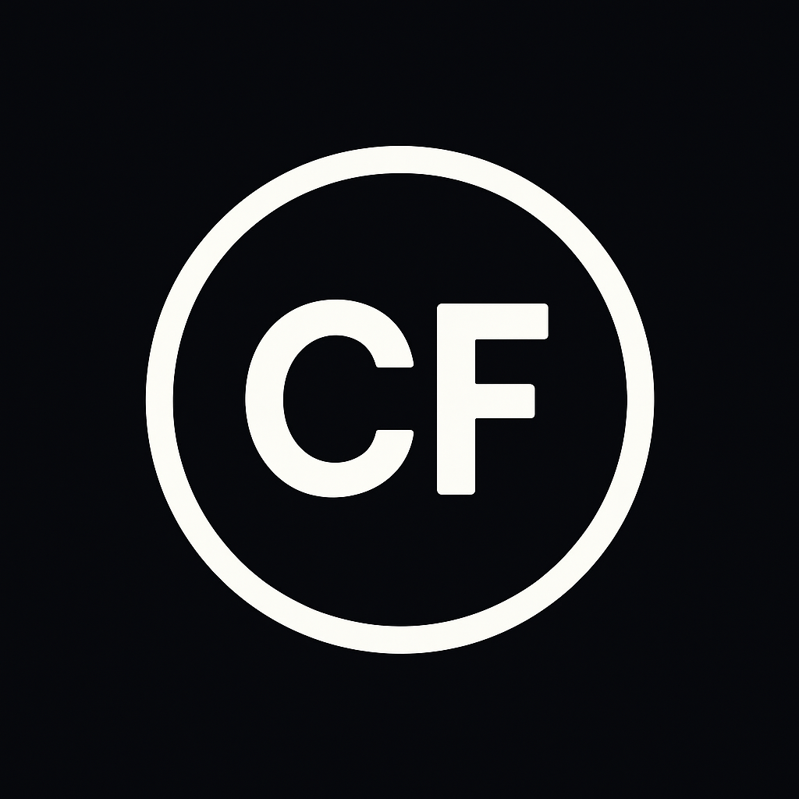
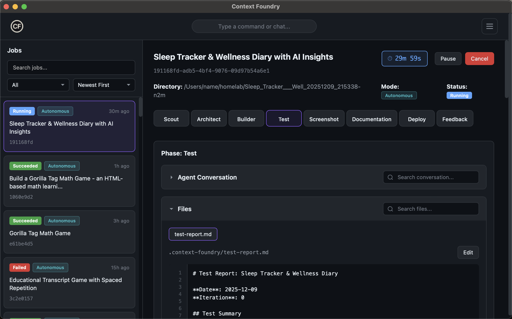
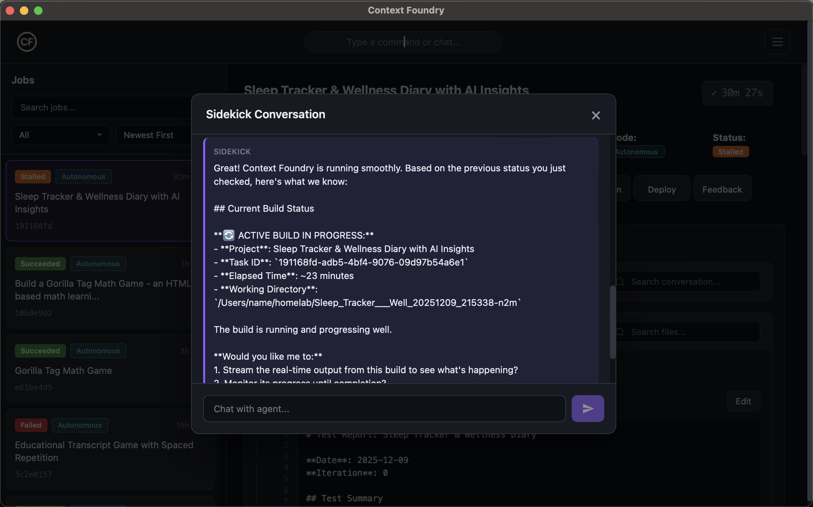
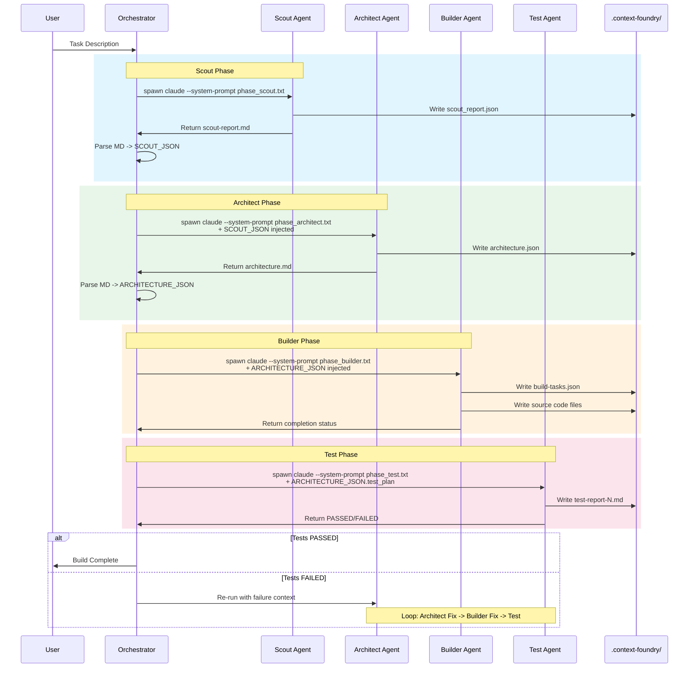

<div align="center">
  
</div>

# Context Foundry

**What if you could describe what you want to build, walk away, and come back to working code?**

Context Foundry is an autonomous build system that does the tedious parts for you. Give it a task, and it researches, designs, builds, tests, and deploys—without you babysitting every step.

[Quick Start](QUICKSTART.md) | [Documentation](docs/) | [Desktop App](#desktop-app)

---

<div align="center">
  
  <p><em>Context Foundry Desktop - Monitor builds, view artifacts, track progress</em></p>
</div>

<div align="center">
  
  <p><em>AI Sidekick - Chat with your builds, ask questions, get insights</em></p>
</div>

---

## What is Context Foundry?

Most AI coding assistants need you to hold their hand—approving every file change, fixing their mistakes, keeping them on track. Context Foundry works differently.

You describe what you want. It figures out the rest.

```
You: "Build an interactive math game for kids learning multiplication"

[Go grab coffee]

Result: Working React app with 4 difficulty levels, progress tracking,
        animated feedback, and tests—all pushed to GitHub.
```

Behind the scenes, it spawns specialized AI agents for each phase: one to research, one to design the architecture, one to write code, one to test. Each agent has fresh context and a focused job.

---

## How It Works

Each build runs through phases, and each phase gets a **fresh AI agent** with its own context window:

1. **Scout** — Researches the problem, existing patterns, and constraints
2. **Architect** — Designs the solution structure, makes technical decisions, and writes [Gherkin acceptance criteria](docs/gherkin-acceptance-criteria.md)
3. **Builder** — Writes the actual code against the acceptance criteria
4. **Test** — Validates each Gherkin scenario, catches failures, triggers fixes if needed

If tests fail, it loops back and fixes itself. No manual intervention required.

The key insight: instead of one AI that runs out of context, you get specialized agents that each do one thing well and pass artifacts to the next.

---

## Key Features

| Feature | What it does |
|---------|--------------|
| **Self-Healing Builds** | Tests fail? It automatically fixes and retries. |
| **Pattern Learning** | Remembers solutions that worked, avoids mistakes it's made before. |
| **Human-in-the-Loop** | Review Gherkin acceptance criteria before Builder starts. Clear sign-off gates. |
| **Desktop App** | Visual dashboard to watch builds, browse artifacts, chat with the AI. |
| **Daemon Service** | Runs in the background, manages job queues, handles resource limits. |

### Extensions

Want to build Roblox games? Flowise workflows? Something domain-specific?

Extensions let you teach Context Foundry your domain. Add patterns, examples, and constraints to `extensions/<your-domain>/` and it'll reference them during builds.

---

## Architecture


```mermaid
sequenceDiagram
    participant U as User
    participant O as Orchestrator
    participant S as Scout Agent
    participant A as Architect Agent
    participant B as Builder Agent
    participant T as Test Agent
    participant FS as .context-foundry/

    U->>O: Task Description

    rect rgb(225, 245, 254)
        Note over O,S: Scout Phase
        O->>S: spawn claude --system-prompt phase_scout.txt
        S->>FS: Write scout_report.json
        S->>O: Return scout-report.md
        O->>O: Parse MD -> SCOUT_JSON
    end

    rect rgb(232, 245, 233)
        Note over O,A: Architect Phase
        O->>A: spawn claude --system-prompt phase_architect.txt<br/>+ SCOUT_JSON injected
        A->>FS: Write architecture.json
        A->>O: Return architecture.md
        O->>O: Parse MD -> ARCHITECTURE_JSON
    end

    rect rgb(255, 243, 224)
        Note over O,B: Builder Phase
        O->>B: spawn claude --system-prompt phase_builder.txt<br/>+ ARCHITECTURE_JSON injected
        B->>FS: Write build-tasks.json
        B->>FS: Write source code files
        B->>O: Return completion status
    end

    rect rgb(252, 228, 236)
        Note over O,T: Test Phase
        O->>T: spawn claude --system-prompt phase_test.txt<br/>+ ARCHITECTURE_JSON.test_plan
        T->>FS: Write test-report-N.md
        T->>O: Return PASSED/FAILED
    end

    alt Tests PASSED
        O->>U: Build Complete
    else Tests FAILED
        O->>A: Re-run with failure context
        Note over A,T: Loop: Architect Fix -> Builder Fix -> Test
    end
```

Each phase spawns a **fresh Claude instance** with isolated context, preventing token bloat and ensuring consistent quality across long builds.

---

## Understanding Phases and Agents

A common question: **Are Scout, Architect, Builder, etc. "agents" or "phases"?**

**Answer: Both.** They are **phases** from an orchestration perspective, and **ephemeral agent instances** from an execution perspective.

### How It Works

```
┌─────────────────────────────────────────────────────────────────┐
│                     DAEMON (Orchestrator)                        │
│  runner.py manages pipeline state, spawns agents sequentially   │
└─────────────────────────────────────────────────────────────────┘
                              │
        ┌─────────────────────┼─────────────────────┐
        ▼                     ▼                     ▼
   ┌─────────┐          ┌─────────┐          ┌─────────┐
   │  Scout  │    →     │Architect│    →     │ Builder │  → ...
   │ Agent   │          │ Agent   │          │ Agent   │
   └─────────┘          └─────────┘          └─────────┘
   200K tokens          200K tokens          200K tokens
   (ephemeral)          (ephemeral)          (ephemeral)
        │                     │                     │
        ▼                     ▼                     ▼
   scout-prompt.json    architect-prompt.json  builder-prompt.json
   scout-report.md      architecture.md        (code files)
```

### Key Characteristics

| Aspect | Reality |
|--------|---------|
| **Context Window** | Each phase gets its own fresh 200K tokens |
| **Lifecycle** | Ephemeral - spawned, runs, exits, context gone |
| **Communication** | Via **disk artifacts** (not shared memory) |
| **Implementation** | Each is a `claude` CLI subprocess |
| **State** | Persisted in `.context-foundry/` between phases |

### Why This Design?

1. **Fresh context every phase** — Most builds use only 30-50K tokens per phase, leaving plenty of headroom
2. **Isolation** — If Builder crashes, you don't lose Scout's analysis
3. **Resumability** — Can restart from any phase since state lives on disk
4. **Focus** — Each agent has one job and a tailored prompt for it

They're essentially **stateless workers** that read artifacts, do work, write artifacts, and disappear.

---

### Features

| Feature | Description |
|---------|-------------|
| **Visual Dashboard** | See all jobs at a glance with status, duration, and phase progress |
| **Live Duration Counter** | Real-time timer showing build progress in seconds |
| **AI Sidekick Chat** | Natural language interface to check status, trigger builds, and get help |
| **Phase Timeline** | Visual progress through Scout → Architect → Builder → Test phases |
| **Conversation View** | See what the AI is thinking during each phase |
| **Artifact Browser** | View generated code with syntax highlighting and line numbers |
| **Dark Theme** | Native dark mode with beautiful purple accents |

### Install Desktop App

```bash
# Download from releases (macOS)
curl -L https://github.com/your-org/context-foundry/releases/latest/download/ContextFoundry.dmg -o ContextFoundry.dmg
open ContextFoundry.dmg

# Or build from source
cd apps/context-foundry-desktop
npm install
npm run tauri:build
```

See [Desktop App Documentation](apps/context-foundry-desktop/README.md) for full details.

---

## Quick Start

### Option 1: Desktop App (Recommended)

1. Download and install the Desktop App (see above)
2. Launch Context Foundry Desktop
3. Use the Sidekick chat to start your first build:
   ```
   "Build a todo app with React"
   ```

### Option 2: CLI

```bash
# Install via npm
npm install -g context-foundry

# Start the daemon
cfd start

# Build something
cf build "Create a weather dashboard with React"
```

This installs the package and automatically configures Claude Code. (Alternative: `pip install context-foundry && cf setup`)

### Option 3: Claude Code Integration

In Claude Code, just ask in natural language:

```
"Use CF to build a weather dashboard with React"
```

Walk away. Come back to deployed code on GitHub.

See [Quick Start Guide](QUICKSTART.md) for detailed setup instructions.

---

## CLI Tools

```bash
cfd start             # Start the daemon
cfd status            # Check status
cfd logs <job-id>     # View build logs
cfd list              # List active builds
cfd stop              # Stop the daemon
```

---

## Documentation

| Guide | Description |
|-------|-------------|
| [Quick Start](QUICKSTART.md) | Get running in 5 minutes |
| [Desktop App](apps/context-foundry-desktop/README.md) | Native macOS/Windows application |
| [Dashboard](tools/dashboard/README.md) | Web dashboard development guide |
| [User Guide](docs/USER_GUIDE.md) | Detailed usage instructions |
| [Architecture](docs/ARCHITECTURE.md) | How it works under the hood |
| [Features](docs/FEATURES.md) | Complete feature reference |
| [Innovations](docs/INNOVATIONS.md) | Technical breakthroughs explained |
| [Phase Handoff Flow](docs/phase-handoff-flow.md) | Inter-phase data contracts |
| [Troubleshooting](docs/TROUBLESHOOTING.md) | Common issues and fixes |
| [FAQ](docs/FAQ.md) | Frequently asked questions |

### Extension Development

| Guide | Description |
|-------|-------------|
| [Extension Development](docs/EXTENSION_DEVELOPMENT_GUIDE.md) | Create domain-specific extensions |
| [Teaching New Languages](docs/TEACHING_NEW_LANGUAGES.md) | Teach Claude languages not in its training data |

---

## File Structure

```
context-foundry/
├── apps/
│   └── context-foundry-desktop/  # Native macOS/Windows desktop app (Tauri)
├── tools/
│   ├── dashboard/             # React dashboard frontend
│   ├── mcp_server.py          # MCP server entry point
│   ├── mcp_utils/             # Build orchestration, delegation, patterns
│   ├── prompts/phases/        # Phase-specific system prompts
│   ├── evolution/             # Daemon, self-improvement, safety
│   ├── cli.py                 # Main CLI (cf command)
│   └── cfd                    # Daemon CLI script
├── context_foundry/
│   └── daemon/                # Python daemon (HTTP API, job management)
├── extensions/                # Domain-specific extensions
├── npm/                       # npm package wrapper
├── docs/                      # Documentation
└── CLAUDE.md                  # Instructions for AI agents
```

---

## Contributing

We welcome contributions. See [Contributing Guide](docs/CONTRIBUTING.md) for details.

---

## License

MIT License. See [LICENSE](LICENSE) for details.
