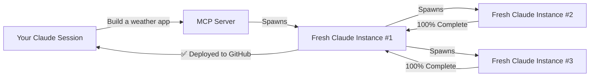

<div align="center">
  
</div>

# 🏭 Context Foundry

> **The AI That Builds Itself: Recursive Claude Spawning via Meta-MCP**
> Context Foundry uses Claude Code to spawn fresh Claude instances that autonomously build complete projects. Walk away and come back to production-ready software.

**Version 2.4.0 - November 2025** 🎯 **BAML JSON-First Architecture: First-Try Success!**

[](https://github.com/context-foundry/context-foundry/releases/latest)
[](LICENSE)

---

## 🚀 Quick Start

Get up and running in 2 minutes.

👉 **[Read the Quick Start Guide](QUICKSTART.md)**

---

## 🤔 What is Context Foundry?

Context Foundry is an **MCP (Model Context Protocol) server** that empowers Claude Code CLI to build complete software projects autonomously with **self-healing test loops** and **automatic GitHub deployment**.

Unlike traditional AI coding tools that require constant supervision, Context Foundry lets you describe what you want and **walk away** while it researches, designs, builds, tests, documents, and deploys your application.

**Real Example:**
```
User: "Build a Mario platformer game in JavaScript"
[User walks away for 7 minutes]
Result: ✅ Complete game deployed to GitHub, all tests passing
```

---

## ✨ Key Features

Context Foundry is packed with innovations to make autonomous development reliable and powerful.

- **[BAML Type-Safe Outputs](docs/FEATURES.md#baml-type-safe-outputs-v240)**: Structured JSON outputs for reliable, first-try success.
- **[Mission Control TUI](docs/FEATURES.md#mission-control-tui-v230)**: A terminal user interface for real-time build monitoring and chat.
- **[Context Codex](docs/FEATURES.md#context-codex-v230)**: Database-backed self-learning system that remembers patterns and fixes.
- **[Intelligent Parallel Build](docs/FEATURES.md#intelligent-parallel-build-detection)**: AI automatically decides when to spawn parallel agents for faster builds.
- **[Self-Healing Test Loop](docs/FEATURES.md#automation-innovations)**: Automatically fixes test failures without human intervention.
- **[Meta-MCP Architecture](docs/FEATURES.md#architecture-innovations)**: Recursively spawns fresh Claude instances with full context windows.

👉 **[See All Features](docs/FEATURES.md)**

---

## 🏗️ Architecture

Context Foundry uses a unique **Meta-MCP** architecture that allows Claude to orchestrate itself.


```mermaid
graph LR
    A[Your Claude Session] -->|"Build a weather app"| B[MCP Server]
    B -->|Spawns| C[Fresh Claude Instance #1]
    C -->|Spawns| D[Fresh Claude Instance #2]
    C -->|Spawns| E[Fresh Claude Instance #3]
    D -->|100% Complete| C
    E -->|100% Complete| C
    C -->|✅ Deployed to GitHub| A
```

👉 **[Read the Architecture Guide](docs/ARCHITECTURE.md)**
👉 **[Explore Innovations](docs/INNOVATIONS.md)**

---

## 📚 Documentation

- **[Quick Start](QUICKSTART.md)**: Start here.
- **[User Guide](docs/USER_GUIDE.md)**: Detailed usage instructions.
- **[Troubleshooting](docs/TROUBLESHOOTING.md)**: Common issues and fixes.
- **[Features](docs/FEATURES.md)**: In-depth look at features.
- **[Architecture](docs/ARCHITECTURE.md)**: How it works under the hood.
- **[FAQ](docs/FAQ.md)**: Frequently asked questions.

---

## 🤝 Contributing

We welcome contributions! Please see our **[Contributing Guide](docs/CONTRIBUTING.md)** for details on how to submit pull requests, report issues, and suggest features.

---

<div align="center">
  <sub>Built with ❤️ by the Context Foundry Team</sub>
</div>
