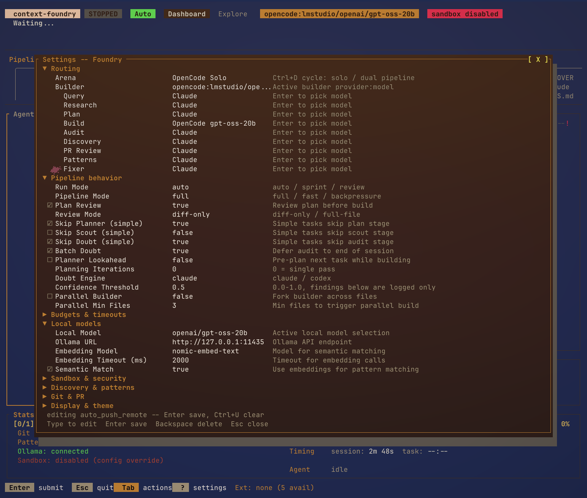

# Foundry

Autonomous build loop that plans, builds, reviews, and learns.

Foundry reads a `TASKS.md` task list and works through it using Claude Code agents in a TUI, committing each completed task. Three [run modes](#run-modes) control what happens next: run forever with discovery (Auto), stop when done (Sprint), or pause for human review after each task (Review).

## Demos

- [Building a Second Brain with the Loop](https://youtu.be/VO_c2j0dPH0) — Foundry autonomously works through an implementation plan, building a second-brain app from a task list while the TUI streams each agent's output in real time.
- [Enhancing the Second Brain with the Loop](https://youtu.be/wL0RLml2Tio) — A follow-up run where foundry picks up where it left off, discovering new work and iterating on the second-brain app with patterns learned from the first pass.
- [Technical Overview](https://context-foundry.github.io/context-foundry/OVERVIEW.html) — Architecture reference covering every subsystem: pipeline, dual-model arena, git integration, TUI layout, config, extensions, and MCP tools.
- [The Roundup](https://context-foundry.github.io/context-foundry/ROUNDUP.html) — A Texas-themed pitch page explaining Context Foundry for software architects.

## Task Flow

```
Load patterns from ~/.foundry/patterns/
  │
SCOUT → .buildloop/scout-report.md (investigate codebase)
  │
PLAN (+ patterns + scout report) → .buildloop/current-plan.md
  │
IMPLEMENT → build the code, run checks
  │
VERIFY (fresh context) → audit claims, fix issues, write verdict
  │
PATTERN EXTRACTOR → merge into ~/.foundry/patterns/
  │
LOCAL GIT COMMIT → feat(task_id) or WIP(task_id)
  │
OPTIONAL AUTO-PUSH → only if `auto_push_remote` is configured
```

## How It Works

Foundry is a harness for [Claude Code](https://docs.anthropic.com/en/docs/claude-code). Each agent (planner, builder, reviewer, fixer, discoverer) is a Claude Code CLI invocation with a role-specific prompt and scoped tool access. The Rust binary handles orchestration, streaming, and state — Claude does all the reasoning and file editing.

### The loop

Without guardrails, an autonomous build loop degrades fast. Task 3 builds on task 2's mistakes, which built on task 1's mistakes. Errors compound and the codebase drifts from the intended architecture.

**The core design principle: no agent shares a context window with any other agent.** Every stage starts with a clean context and receives only curated artifacts from the previous stage. The scout writes a structured report. The planner reads that report and writes a plan. The builder reads that plan and writes code. The verifier reads the code with zero knowledge of why it was written that way. No shared conversation history, no accumulated reasoning, no inherited blind spots. Each stage gets signal, not noise. This is how foundry prevents compounding errors across a long task queue.

Foundry's loop is designed around two forms of backpressure:

**Short-term: the verify gate.** After implementation, a verify agent -- in a completely fresh context with no shared history from the builder -- audits the changes by running build checks, tests, and a structured code audit. A model that just wrote the code retains its reasoning and is less likely to question its own decisions. An independent instance, given only the claims and the code, catches bugs the author is blind to. If it finds HIGH or MEDIUM issues, it fixes them and re-runs verification. If everything passes, the task gets a `feat(task-id)` commit. If issues remain, it gets a `WIP(task-id)` commit. The verify gate prevents bad code from silently flowing forward.

**Pipeline tracking (QRPBA).** Every task carries a progress indicator that records which pipeline stages ran and whether they succeeded. The indicator is persisted in `TASKS.md` next to each task and committed with the code, so you get a permanent audit trail.

```
- [x] T1.1: Set up project scaffolding          [QRPBA]
- [x] T1.2: Implement auth flow                 [--PBA]
- [x] T1.3: Add rate limiting                   [QRPBA!]
- [ ] T1.4: Write integration tests             [....]
```

Each character represents a pipeline stage:

| Position | Letter | Stage | Meaning |
|----------|--------|-------|---------|
| 1 | **Q** | Query | **-** = skipped |
| 2 | **R** | Research | **-** = skipped |
| 3 | **P** | Plan | **-** = skipped (simple task) |
| 4 | **B** | Build | Builder ran |
| 5 | **A** | Audit | **-** = skipped |
| suffix | **!** | | Audit did not pass (WIP commit) |

Examples: `QRPBA` = full pipeline, clean pass. `--PBA` = query and research skipped, planned, built, and audited. `QRPBA!` = full pipeline but audit found unfixable issues (WIP commit). See [`docs/progress-indicators.md`](docs/progress-indicators.md) for the full reference.

The TUI shows these indicators in the task queue with color coding, and they survive across restarts since they're written directly into the task file.

**Why curated context matters.** This isolated-context architecture is the same multi-instance review pattern described in Anthropic's [Claude Certified Architect](docs/CCA-Exam-Guide.pdf) program as a production best practice. The key: agents communicate through structured file artifacts (.buildloop/scout-report.md, current-plan.md, build-claims.md, review-report.md), not through shared conversation history. Every artifact is a curated handoff -- the planner doesn't get the scout's full tool call history, it gets a concise report. The builder doesn't get the planner's reasoning, it gets a deterministic plan with file operations and verification commands.

**Long-term: pattern learning.** After each validated task, a pattern extractor agent scans the build artifacts, review findings, and plan to extract reusable lessons (e.g., "CFrame not Position for moving Roblox parts" or "always validate UTF-8 boundaries before string slicing"). These get saved as structured JSON to `~/.foundry/patterns/`. On the next task — in any project — matched patterns are injected into the planner and reviewer prompts as reference data. Patterns that recur 3+ times get auto-promoted (`auto_apply`), meaning they're scored higher when they match -- but they still require at least one keyword or tech_stack overlap with the task to be included. This is how the system gets better over time: a mistake made once becomes a check applied everywhere.

**Complexity-scaled pipeline.** Not every task needs the full pipeline. A task complexity classifier scores each task as Simple, Medium, or Complex based on description length, keyword signals, and file count hints. Simple tasks skip query, research, and planner, get fewer patterns (0-2 instead of 10), and can skip the audit loop entirely -- straight from builder to commit. The QRPBA indicator reflects this: `---B-` means query, research, planner, and audit were all skipped. Complex tasks always get the full treatment.

**Learned doubt confidence.** The doubt loop tracks pass/fail history per task shape using Ollama embeddings for semantic clustering. Task descriptions that consistently pass review (5+ consecutive clean passes) earn "trusted" status and skip doubt automatically. Any failure resets the cluster to zero. This compounds over time -- foundry learns which kinds of changes it reliably gets right and reserves thorough review for where it's needed.

**Parallel builder.** For multi-file tasks, the builder can split into parallel sub-agents. The plan's File Operations section is parsed to build a dependency graph -- files with no cross-references run in parallel worktrees, dependent files run sequentially. The doubt loop catches any integration issues from the merge. Opt-in via `parallel_builder: true` in `.foundry.json`.

**Session event logging.** Every pipeline event (task started, agent done, review findings, commits, pattern usage, rate limits) is appended as a JSON line to `~/.foundry/observatory/events.jsonl`. This is the data collection layer for the upcoming Foundry Observatory analytics dashboard (separate project). Best-effort -- never blocks the pipeline.

### CCA alignment

Context Foundry's architecture aligns with the principles in Anthropic's [Claude Certified Architect -- Foundations](docs/CCA-Exam-Guide.pdf) exam guide: **43 of 55 principles implemented**, 3 partial (architectural constraints), 0 open gaps. The full cross-reference mapping each principle to specific code locations is in the [CCA Alignment Matrix](docs/CCA-ALIGNMENT.md) ([interactive version](https://context-foundry.github.io/context-foundry/cca-alignment.html)).

### Run modes

Foundry has three run modes that control how the pipeline advances between tasks. Toggle with `Ctrl+M` on the startup screen or set `run_mode` in `.foundry.json`.

| Mode | Behavior | Discovery | PRs |
|------|----------|-----------|-----|
| **Auto** (default) | Runs all tasks, then discovers new work and keeps going indefinitely | Yes | No |
| **Sprint** | Runs all tasks, then stops | No | No |
| **Review** | Runs one task at a time, creates a PR per task, pauses for approval | No | Yes (per task) |

**Auto** is the fully autonomous mode. The loop never stops on its own -- when the task queue empties, a discovery agent scans the codebase for new work and appends it to `TASKS.md`. This is the mode shown in the demo videos.

**Sprint** is semi-autonomous. It works through every pending task with the same pipeline as Auto (scout, plan, implement, verify, commit), but stops when the queue is empty instead of running discovery. Use this when you have a known task list and want foundry to finish, not find more work.

**Review** is the human-in-the-loop mode for team workflows. After each task completes, foundry pushes a feature branch (`foundry/{task_id}`), creates a GitHub PR, and pauses. The TUI shows `PAUSED (Review)` and waits for either:
- The user to press Enter to continue manually, or
- GitHub PR approval, which foundry detects by polling `gh pr view` (configurable via `pr_poll_interval_secs`, default 30s)

If a reviewer requests changes, the TUI surfaces that status. Review mode requires the `gh` CLI to be installed and authenticated.

```json
{
  "run_mode": "review",
  "pr_poll_interval_secs": 30,
  "create_issue_on_wip": true
}
```

The `create_issue_on_wip` flag works in any mode -- when a task fails verification and gets a `WIP()` commit, foundry auto-creates a GitHub issue with the review findings.

### Dual-model arena

Foundry can run tasks through different AI providers. Toggle with `Ctrl+D` on the startup screen or set `dual_selection` in `.foundry.json`.

**Configuration:** Define two providers in `builder_models`:

```json
{
  "builder_models": ["claude:opus", "codex:"],
  "dual_selection": "both"
}
```

Each entry is `provider:model` -- e.g., `claude:opus` or `codex:` (empty model uses the provider default).

**Three selection modes (Ctrl+D cycles through):**

| Mode | What happens |
|------|-------------|
| **First only** | Entire pipeline (Scout -> Plan -> Implement -> Verify) runs through `builder_models[0]` |
| **Second only** | Entire pipeline runs through `builder_models[1]` |
| **Both** | Two complete independent pipelines run in parallel, one per provider |

**Key design principle: provider selection is full-pipeline, not per-stage.** When you select "Codex", every stage runs through Codex -- scout, planner, builder, reviewer, and discovery. Foundry automatically clears model names that belong to the wrong provider (e.g., "sonnet" is a Claude model name, so when running through Codex it becomes empty, letting Codex use its default). This prevents errors like "model 'sonnet' is not supported by Codex."

**Dual mode ("both")** forks into two git worktrees before Scout and runs two completely independent pipelines:

```
Pipeline A (Claude)                    Pipeline B (Codex)
.buildloop/arena/claude/               .buildloop/arena/codex/
  scout-report.md                        scout-report.md
  current-plan.md                        current-plan.md
  build-claims.md                        build-claims.md
  review-report.md                       review-report.md
```

Each model scouts its own codebase view, writes its own plan, implements its own solution, and verifies its own output. The human compares two finished results with independent architectural decisions -- not two implementations of the same plan.

**TUI in dual mode:** Press `1` to view Pipeline A's output, `2` to view Pipeline B's. The tab bar shows event counts for each stream. The pipeline diagram shows which stage each pipeline is on. When both finish, the arena results stay in `.buildloop/arena/` for manual comparison -- foundry does not auto-select a winner.

**Global config:** Settings in `~/.foundry/config.json` apply as defaults to all projects. Project-level `.foundry.json` fields override global values. This means you can set `builder_models` and `dual_selection` once globally instead of in every project.

### Docker sandbox isolation

Foundry can run agents inside Docker containers so they only see the project directory -- no access to your home folder, credentials, or other repos. Sandbox is ON by default when Docker is detected, OFF with a warning when absent.

**Setup:**

1. Install [Docker Desktop](https://www.docker.com/products/docker-desktop/) (macOS/Windows) or Docker Engine (Linux)
2. Build the sandbox image:
   ```bash
   bash docker/build-sandbox.sh
   ```
3. Run foundry normally -- it detects the image automatically

The TUI shows sandbox status in the header (`[sandboxed]` in green, `[sandbox degraded]` in yellow if Docker/image is missing, or `[sandbox disabled]` in red if overridden via config), the stats panel, and the startup screen.

**How it works:** When sandbox is active, foundry wraps each agent's CLI invocation in `docker run` with the project directory bind-mounted to `/work`. The container runs as a non-root user (UID 1000). The `ANTHROPIC_API_KEY` is forwarded automatically. PTY backend is forced (tmux is incompatible with containerized agents).

**Configuration** (in `.foundry.json`):

```json
{
  "sandbox": true,
  "sandbox_image": "foundry-sandbox:latest",
  "sandbox_extra_mounts": ["/data:/data:ro"]
}
```

| Field | Default | Purpose |
|-------|---------|---------|
| `sandbox` | `true` | Enable/disable sandbox isolation |
| `sandbox_image` | `"foundry-sandbox:latest"` | Docker image for sandbox containers |
| `sandbox_extra_mounts` | `[]` | Additional bind mounts (e.g., shared caches) |

**Graceful degradation:** If Docker isn't installed or the image hasn't been built, foundry falls back to running agents directly on the host with a yellow warning in the TUI. No configuration change needed.

**Windows:** Paths are automatically translated for Docker Desktop's WSL2 backend (`C:\Users\...` becomes `/c/Users/...`).

### Pattern matching and injection

At the start of each task, foundry loads all patterns from `~/.foundry/patterns/` and matches them against the task description. Matching uses keyword scoring: each pattern has `keywords` and `tech_stack` fields, and whole-word matches against the task description score points. If Ollama is running locally, semantic (embedding) matching is also used for reranking.

Matched patterns are formatted and injected into the planner and reviewer agent prompts as reference data. The TUI tracks this in two places:

| Metric | Where | Meaning |
|--------|-------|---------|
| **Injected** | Patterns panel + stats row | Patterns matched and injected into agent prompts |
| **Learned** | Patterns panel | New patterns extracted from build artifacts |
| **Applied** | Stats row | Injected patterns whose keywords appeared in agent output (the agent likely used the advice) |

All three counters are **session-scoped** -- they reset when foundry starts and accumulate across tasks. The same pattern can be injected multiple times (once per task it matches).

### Semantic matching with Ollama

Keyword matching works well when patterns and tasks share obvious terms, but it misses semantic connections. A task like "build a korg 808 emulator" should match audio/DSP design patterns, but it won't if the pattern's keywords are "oscillator," "waveform," or "sample rate" -- none of those words appear in the task description. Rigid keyword matching can only find what it's been told to look for; it can't generalize.

When Ollama is running locally, foundry uses embedding-based semantic matching to close this gap. Task descriptions and pattern texts are converted to vector embeddings via a local model, and cosine similarity identifies patterns that are conceptually related even when they share zero keywords. The semantic scores are used as a reranking boost on top of keyword scores -- keyword matching is always the baseline, and semantic matching augments it.

**Setup:**

1. Install [Ollama](https://ollama.ai)
2. Pull the embedding model:
   ```bash
   ollama pull nomic-embed-text
   ```
3. Start Ollama (or let it run as a background service)

That's it. Foundry detects Ollama automatically on startup. No configuration is required for the default setup.

**Model choice:** `nomic-embed-text` is a 137M parameter embedding model (~274 MB). It's small enough to run on any machine alongside foundry without noticeable resource impact, and its embedding quality is sufficient for pattern-to-task matching. This is not a chat model -- it only produces vector embeddings for similarity comparison.

**Configuration** (all optional, in `.foundry.json`):

```json
{
  "semantic_match_enabled": true,
  "embedding_model": "nomic-embed-text",
  "ollama_url": "http://127.0.0.1:11435",
  "embedding_timeout_ms": 2000
}
```

| Field | Default | Purpose |
|-------|---------|---------|
| `semantic_match_enabled` | `true` | Set to `false` to disable semantic matching entirely |
| `embedding_model` | `"nomic-embed-text"` | Ollama model name for embeddings |
| `ollama_url` | `"http://127.0.0.1:11435"` | Ollama API endpoint |
| `embedding_timeout_ms` | `2000` | Timeout per embedding request (ms) |

**Graceful degradation:** If Ollama is not running, the model isn't pulled, or a request fails, foundry falls back to keyword-only matching with no user intervention. A circuit breaker suppresses retries for 60 seconds after a failure, so a down Ollama instance doesn't add latency to every task. The TUI logs which matching mode was used (`semantic`, `keyword-only`, or `cooldown`).

**Embedding cache:** Pattern embeddings are cached at `~/.foundry/cache/pattern-embeddings.json`. The cache is keyed by a blake3 hash of each pattern's content, so it auto-invalidates when patterns change. On a warm cache, semantic matching adds no Ollama calls for patterns -- only the task description needs embedding.

### Pattern scope

Patterns are global by default. They live in `~/.foundry/patterns/` and are loaded for every project on your machine. A lesson learned building project A is available when building project B.

If you want per-project isolation, set `patterns_dir` in `.foundry.json` to a project-local path.

### Discovery

In Auto mode, when all tasks in `TASKS.md` are complete, foundry doesn't stop. A discovery agent scans the codebase -- reading architecture docs, looking for TODOs/FIXMEs, checking for failed tests, spotting inconsistencies -- and appends new tasks to `TASKS.md`. The loop then works through those. If discovery finds nothing, it backs off with an increasing cooldown (configurable via `discovery_cooldown_minutes`). In Sprint and Review modes, discovery is disabled and the pipeline stops when the queue empties.

## Local models (LM Studio + opencode)

Foundry can route the build pipeline through a local LM Studio (or Ollama)
model instead of Claude or Codex. Selecting a local model in the settings
overlay swaps `builder_provider` to `opencode` and routes the spawned agent
through the [opencode](https://github.com/sst/opencode) CLI, which talks to
LM Studio's OpenAI-compatible server at `http://127.0.0.1:1234`.

**Selecting a local model.** Press `?` in the TUI to open the settings
overlay. The "Builder" row lists every Claude / Codex spec plus every model
discovered from LM Studio's `/v1/models` and Ollama's `/api/tags`. Picking an
LM Studio entry persists `builder_provider = "opencode"` and
`builder_model = "lmstudio/<id>"` to `.foundry.json`. The canonical id list
comes from `opencode models lmstudio` -- run that on the command line to see
the exact ids opencode will accept.

**Full-pipeline routing.** When the selected builder spec is `opencode:...`,
`Config::for_pipeline()` (`src/config.rs`) overrides every role provider --
**all 8 stages**: scout, query, research, planner, builder, reviewer,
fixer, and discovery -- to opencode and reuses the same model. Local-model
selection is therefore not "builder only"; the entire pipeline runs through
the chosen LM Studio model.

**Required `n_ctx`.** Foundry's prompts plus
`agent_system_directives` regularly push past 4096 tokens. Load the LM Studio
model with `n_ctx >= 8192`. A smaller window produces an `[error/ContextOverflow]`
event (defined in `src/agent.rs`, `AgentErrorKind::ContextOverflow`) and the
agent run aborts. Two other typed errors -- `ProviderUnreachable` (LM Studio
is not running) and `ModelNotLoaded` (the requested model is not loaded in
LM Studio) -- surface the same way.

**Smoke gate.** Before relying on the local-model path, run
`bash scripts/smoke-local-model.sh`. The script spins up a throw-away
project, runs `foundry run --no-tui --output-format json`, and asserts six
checks (exit code, JSON envelope shape, log presence, opencode session
marker, no typed errors, QRPBA indicator). Pass `--keep` to preserve the workspace for
inspection.

**Headless JSON envelope.** `foundry run --no-tui --output-format json`
emits a versioned object (`schema_version: 2`) containing `tasks`,
`session`, and `config` blocks. Field-by-field schema and per-check
failure interpretation are documented in
[`docs/local-model-setup.md`](docs/local-model-setup.md).

**Empty-diff and idle-timeout.** Local models sometimes produce agent output
that changes no files or stall mid-generation. Foundry handles both: the
EmptyDeliverable gate commits as `WIP` instead of `feat`, and the idle timeout
(`agent_implement_idle_secs`, default 60s) kills stalled subprocesses.
See the ["Empty-diff WIP and idle-timeout behavior"](docs/local-model-setup.md#empty-diff-wip-and-idle-timeout-behavior)
section in the local-model runbook.

See [`docs/local-model-setup.md`](docs/local-model-setup.md) for the full
runbook (prerequisites, command transcript, fail-interpretation guide).

## Settings Overlay

Press `?` in the TUI to open the Settings Overlay -- a 90%x80% modal exposing
~40 user-tunable configuration fields organized into 11 collapsible sections.
Press `Esc` from any state, click outside the modal, or click the `[ X ]` button
to close. Changes persist to `.foundry.json` after a save confirmation.



The overlay supports inline editing (Space/Enter for booleans, Left/Right for
enums, numeric input for numbers, free-form text for strings) and a Model Picker
dropdown for selecting providers and models per stage.

See [`docs/settings-overlay.md`](docs/settings-overlay.md) for the full reference
(sections, fields, editing rules, Model Picker behavior).

## Per-stage routing

By default, all pipeline stages route through a single provider selected via
`Ctrl+D` or the Builder row in the Settings Overlay. Per-stage routing overrides
let you pin individual stages to different providers -- for example, Claude Opus
on Plan and Audit while Codex runs Build.

Pin a stage by opening its Model Picker in the Settings Overlay (Routing section)
and selecting a model. The stage is added to `stage_overrides` in `.foundry.json`
and will not be affected by global builder cycling.

See [`docs/per-stage-routing.md`](docs/per-stage-routing.md) for the configuration
JSON shape, runtime resolution, and worked examples.

## Install

### Pre-built binaries

Download from [GitHub Releases](https://github.com/context-foundry/context-foundry/releases/latest):

| Platform | File |
|----------|------|
| macOS (Apple Silicon) | `foundry-aarch64-apple-darwin.tar.gz` |
| macOS (Intel) | `foundry-x86_64-apple-darwin.tar.gz` |
| Linux (x86_64) | `foundry-x86_64-unknown-linux-gnu.tar.gz` |
| Windows (x86_64) | `foundry-x86_64-pc-windows-msvc.zip` |

Extract and move to a directory in your PATH. On macOS/Linux:

```bash
tar xzf foundry-*.tar.gz
sudo mv foundry /usr/local/bin/
```

On Windows (PowerShell):

```powershell
Expand-Archive foundry-x86_64-pc-windows-msvc.zip -DestinationPath .
```

If you have Rust installed, `%USERPROFILE%\.cargo\bin\` is already in your PATH:

```powershell
Move-Item foundry.exe C:\Users\$env:USERNAME\.cargo\bin\
```

If you don't have Rust, put it anywhere and add that folder to your PATH:

```powershell
mkdir C:\tools
Move-Item foundry.exe C:\tools\
[Environment]::SetEnvironmentVariable("Path", $env:Path + ";C:\tools", "User")
```

Open a new terminal and `foundry` works from any directory.

### From source (all platforms)

Requires [Rust](https://rustup.rs) and [Claude Code CLI](https://docs.anthropic.com/en/docs/claude-code).

```bash
cargo install --git https://github.com/context-foundry/context-foundry foundry
```

### macOS (Homebrew)

```bash
brew tap context-foundry/tap
brew install foundry
```

### Windows (from source, step by step)

For locked-down machines where unsigned binaries are blocked, compile from source:

1. Install [Rust](https://rustup.rs) (includes `cargo`)
2. Install [Visual Studio Build Tools](https://visualstudio.microsoft.com/visual-cpp-build-tools/) (select "C++ build tools" workload)
3. Run in PowerShell:

```powershell
git clone https://github.com/context-foundry/context-foundry.git
cd context-foundry
cargo install --path .
```

The binary is compiled on your machine from source -- no unsigned downloads, no SmartScreen warnings. `foundry.exe` will be in `%USERPROFILE%\.cargo\bin\`.

Or if you have Claude Code, paste this prompt and let it handle everything:

> Clone and build Context Foundry. Run: `git clone https://github.com/context-foundry/context-foundry.git && cd context-foundry && cargo install --path .`

### Self-update

```bash
foundry update
```

## Usage

Point foundry at any project directory that has a `TASKS.md`:

```bash
# TUI mode (default)
foundry --dir /path/to/project

# Interactive prompt-driven studio for Claude, Codex, or both
foundry --dir /path/to/project studio

# Headless mode (CI/logs)
foundry --dir /path/to/project run --no-tui

# Check progress
foundry --dir /path/to/project status

# List all tasks
foundry --dir /path/to/project tasks

# Self-update to latest release
foundry update
```

Studio is documented separately in [`docs/foundry-studio-readme.md`](docs/foundry-studio-readme.md) because it is a different workflow from the autonomous `run` loop.

## Project Setup

A project needs two files to get started:

1. **`TASKS.md`** — Task checklist (foundry reads and marks tasks done):
   ```markdown
   ## Phase 1
   - [ ] 1.1: Set up project scaffolding
   - [ ] 1.2: Implement authentication
   ```

2. **`SPEC.md`** — Project specification (auto-generated from your description, agents read this for context)

Optional:
- **`.foundry.json`** — Override defaults:
  ```json
  {
    "run_mode": "auto",
    "planner_model": "opus",
    "builder_model": "sonnet",
    "reviewer_model": "opus",
    "fixer_model": "opus",
    "patterns_dir": "~/.foundry/patterns",
    "auto_push_remote": "snedea"
  }
  ```
- **`CLAUDE.md`** — Project conventions (agents read this too)

Legacy projects that still use `ARCHITECTURE.md` and `IMPL_PLAN.md` continue to work. Foundry prefers `SPEC.md` and `TASKS.md` when both are present.

## Hooks

Foundry can run a shell command after each task commit. Set `on_task_complete` in `.foundry.json`:

```json
{
  "on_task_complete": "osascript -e 'display notification \"Task done\" with title \"Foundry\"'"
}
```

The hook also works for HTTP webhooks:

```json
{
  "on_task_complete": "curl -fsS -X POST -H 'Content-Type: application/json' -d \"{\\\"task\\\":\\\"$FOUNDRY_TASK_ID\\\",\\\"status\\\":\\\"$FOUNDRY_TASK_STATUS\\\",\\\"sha\\\":\\\"$FOUNDRY_COMMIT_SHA\\\",\\\"desc\\\":\\\"$FOUNDRY_TASK_DESC\\\"}\" https://example.com/foundry-webhook"
}
```

The command is executed via `sh -c` with `cwd` set to the project directory. Four environment variables are exported:

| Variable | Value |
|----------|-------|
| `FOUNDRY_TASK_ID` | Task ID from TASKS.md (e.g., `T1.1`) |
| `FOUNDRY_TASK_STATUS` | `feat` if doubt passed, `WIP` if doubt failed |
| `FOUNDRY_TASK_DESC` | Task description, truncated to 100 characters |
| `FOUNDRY_COMMIT_SHA` | Commit SHA produced for the task (empty string if no commit was created) |

The hook is **fire-and-forget**: foundry spawns it via `tokio::spawn` and continues to the next task without waiting for it to finish. A non-zero exit code is logged as a background warning (`on_task_complete hook exited non-zero (...)`) but never blocks the pipeline. `stdout` and `stderr` are discarded -- log to a file from inside your hook if you need output.

The hook fires for **every** committed task in **every** run mode (`auto`, `sprint`, `review`) -- both successful (`feat(T1.1):`) and failed (`WIP(T1.1):`) commits trigger it. Use `FOUNDRY_TASK_STATUS` inside the hook if you want to branch on success vs failure.

Implementation: `src/config.rs:403-409` (config field), `src/app/build.rs:5937-5981` (`spawn_completion_hook`).

## Pipeline Stages

Foundry's pipeline is configured via the `pipeline_stages` field in `.foundry.json`. Completed tasks use QRPBA indicators (see [`docs/progress-indicators.md`](docs/progress-indicators.md)), while the internal stage IDs remain `query`, `research`, `plan`, `implement`, `doubt`. The default expands to:

```json
{
  "pipeline_stages": [
    { "id": "query",     "label": "QUERY",     "enabled": true },
    { "id": "research",  "label": "RESEARCH",  "enabled": true },
    { "id": "plan",      "label": "PLAN",      "enabled": true },
    { "id": "implement", "label": "IMPLEMENT", "enabled": true },
    { "id": "doubt",     "label": "DOUBT",     "enabled": true }
  ]
}
```

The five valid stage IDs are: **`query`**, **`research`**, **`plan`**, **`implement`**, **`doubt`**. Any other ID is currently unrecognized by the build loop -- adding `{"id":"security", ...}` will appear in the TUI list but will not run an agent. Custom stages are tracked under Phase 29 (composable cards).

Setting `enabled: false` on a stage cleanly skips it in the build loop. The skip is real, not cosmetic:

- `implement` disabled: builder agent is not spawned. The build loop logs `Pipeline: implement stage disabled in config -- skipping builder for <task>` and continues to doubt with a synthetic `StageResult::success("Builder", ...)`. See `src/app/build.rs:4612-4626`.
- `doubt` disabled: the audit/review loop is bypassed. The build loop logs `Pipeline: doubt stage disabled in config -- skipping audit` and treats the task as validated. See `src/app/build.rs:5158-5160` and `src/app/build.rs:5186-5190`.
- `query`, `research`, `plan` follow the same `pipeline_stage_enabled(id)` pattern -- the corresponding agent is not spawned when `enabled: false`.

Stage label text is purely cosmetic and only affects the TUI pipeline strip and the `STAGE` header in agent prompts.

**Reordering is display-only.** Putting `doubt` before `implement` in `pipeline_stages` reorders the TUI strip but does NOT change execution order -- the build loop still runs query -> research -> plan -> implement -> doubt internally. True reordering and custom stage handlers are tracked under Phase 29 (composable pipeline cards) -- see `TASKS.md`.

The shorter key `"stages"` is accepted as an alias for `"pipeline_stages"`.

Implementation: `src/config.rs:18-74` (`PipelineStageConfig` and `default_pipeline_stages`), `src/config.rs:530-548` (`pipeline_stage_label` / `pipeline_stage_enabled`).

### CLAUDE.md and foundry agents

Every agent foundry spawns is a Claude Code CLI invocation with `cwd` set to the project directory. Claude Code's normal CLAUDE.md loading applies -- your global `~/.claude/CLAUDE.md`, the project's `CLAUDE.md`, and any `.claude/rules/*.md` files are all loaded into the agent's context.

This is mostly beneficial: project conventions (coding style, architecture rules, naming patterns) help agents write better code. However, it can cause problems when your CLAUDE.md contains **meta-workflow instructions** -- things like "run the QRPBA pipeline," "spawn sub-agents for verification," or "always create an implementation plan before coding." These conflict with foundry's own orchestration, since each agent is already running inside a pipeline stage.

Foundry handles this by appending a system-level override to every agent:

> *You are running as a single stage in Context Foundry's autonomous pipeline. Ignore any CLAUDE.md instructions about orchestration workflows, build pipelines, QRPBA stages, doubt loops, sub-agent spawning, or multi-step implementation processes. Foundry handles all orchestration. Focus only on your assigned role and task.*

This preserves useful project conventions while neutralizing workflow directives. You do not need to modify your CLAUDE.md to use foundry, but be aware that any instructions about orchestration, pipelines, or sub-agent workflows will be overridden.

## Agent Prompts

All agent prompts are defined in [`src/prompts.rs`](src/prompts.rs). Each agent has a dedicated prompt function:

| Agent | Function | Purpose |
|-------|----------|---------|
| Planner | `planner_prompt()` | Creates implementation plans from task descriptions |
| Builder | `builder_prompt()` | Implements the plan, runs stack-appropriate build checks |
| Reviewer | `reviewer_prompt()` | Combined validation + audit with structured findings |
| Fixer | `fixer_prompt()` | Fixes HIGH/MEDIUM issues from the review report |
| Discovery | `discovery_prompt()` | Scans the codebase for new tasks |
| Pattern Extractor | `pattern_extraction_prompt()` | Extracts reusable patterns from completed work |

Prompts are compiled into the binary. To customize them, edit `src/prompts.rs` and rebuild.

Key design decisions in the prompt system:
- **Stack-aware**: agents detect the tech stack from repo files (Cargo.toml, package.json, pyproject.toml) rather than assuming a specific language
- **Safe by default**: the reviewer only runs read-only checks (no `docker compose up`, no service mutations)
- **Pattern isolation**: learned patterns are injected as clearly delimited reference data, not as authoritative instructions
- **Evidence-based review**: every finding must cite file, line number, and concrete evidence
- **Large file handling**: all agents receive guidance to use Grep and `Read` with `offset`/`limit` for files exceeding the 10,000-token tool limit, preventing read failures on large source files

## Extensions

Extensions are human-authored, read-only domain knowledge packages. They teach foundry's agents how to work with technologies, APIs, or workflows that aren't in Claude's training data. Foundry discovers extensions automatically from three sources (highest priority wins):

1. **Project-local** -- `<project_dir>/extensions/`
2. **Ancestor** -- walks up from the project directory, checking each parent for an `extensions/` subdirectory (closest ancestor wins)
3. **Global** -- `~/.foundry/extensions/`

Ancestor discovery means you can run foundry from a nested subdirectory and it will still find extensions defined higher in the tree. For example, running from `extensions/flowise/hackathon/` will discover sibling extensions like `extensions/extend/`.

An extension is a folder containing a `CLAUDE.md` (domain rules) and optionally a patterns JSON (domain-specific patterns). For example, a Roblox extension might teach agents to use CFrame instead of Position for moving parts, or a Workday Extend extension might document that WIDs are tenant-specific.

### Extensions vs patterns

Extensions and patterns both inject knowledge into agent prompts, but they serve different purposes:

|  | Extensions | Patterns |
|---|---|---|
| **What** | Domain knowledge packages (CLAUDE.md + optional patterns) | Individual issue/solution pairs |
| **Created by** | Humans only -- foundry never writes extensions | Foundry's pattern extractor agent after each task |
| **Selection** | Manual -- user picks on startup screen | Automatic -- keyword/semantic matching per task |
| **Injection** | CLAUDE.md prepended verbatim to builder and reviewer prompts | Matched patterns injected into planner/reviewer only |
| **Scope** | Per-project (user selects which apply) | Global (all patterns match against all tasks) |
| **Always on** | Yes -- if selected, builder and reviewer get the full content regardless of task | No -- only patterns whose keywords match the task |

Extensions can carry their own patterns (shown as `(3p)` in the TUI). These extension patterns are merged into the global pattern pool and go through the same keyword matching as regular patterns. So an extension bundles two things: mandatory domain rules (CLAUDE.md) that are always injected, and optional domain-specific patterns (JSON) that are selectively matched.

### Extension context

On the startup screen, foundry shows a checkbox panel listing all discovered extensions with their pattern counts (`(3p)` = 3 patterns in that extension). Select the ones relevant to your build:

```
┌ Extensions ──────────────────────────────────────┐
│ [ ] extend (1p) Workday Extend orchestrations    │
│ [x] flowise (3p) Flowise AgentFlow v2 workflows  │
│ [ ] recon (1p) Fleet ops, iDRAC                  │
│ [ ] roblox (4p) Roblox world gen, Lune scripting │
└──────────────────────────────────────────────────┘
```

Selected extensions are **programmatically injected** into the builder and reviewer prompts as prepended context. Scout and planner skip extension injection to save tokens -- they investigate and plan without domain-specific rules, while the agents that write and audit code get the full extension context. This is deterministic enforcement, not a suggestion the agent may or may not follow.

The status bar shows active extensions at all times: `Extensions: flowise (1 active)` or `Extensions: none`.

Selection persists to `.foundry.json`:
```json
{
  "extensions": ["flowise"]
}
```

### Creating extensions

```
extensions/your-domain/
├── CLAUDE.md                          # Domain rules (injected into every agent prompt)
├── patterns/your-domain-common-issues.json  # Learned issues (merged into pattern matching)
└── docs/                              # Supporting documentation
```

The `CLAUDE.md` should contain the rules and patterns an agent needs to work correctly in your domain. Extension patterns are automatically merged into the global pattern matching pool when the extension is selected -- no manual merge step needed.

A prerequisite gate validates extensions before the builder runs: if an extension is configured but its CLAUDE.md is missing, the build is blocked with a clear error.

## Architecture

- **config.rs** — Settings with serde defaults (backward-compatible JSON)
- **agent.rs** — Spawns Claude CLI in a PTY for real-time streaming
- **patterns.rs** — Load, match, format, merge, and extract learned patterns
- **prompts.rs** — Agent prompts (planner, builder, reviewer, fixer, discovery, pattern extractor)
- **studio/** — Prompt-driven multi-model TUI with workspace isolation, artifact capture, and modular Studio app/state/UI code
- **update.rs** — Self-update from GitHub Releases with checksum verification
- **sandbox.rs** — Docker sandbox detection, config, and command wrapping
- **tmux.rs** — Tmux session management for agent backends
- **app.rs** — Build loop orchestration, review loop, pattern extraction
- **tui.rs** — Ratatui terminal UI with live agent output
- **task.rs** — Parse TASKS.md task lists
- **git.rs** — Commit and push helpers

### `.claude/` directory

This repo ships two types of Claude Code configuration in `.claude/`:

**Rules** (`.claude/rules/*.md`) are context that Claude Code loads automatically based on which files you're editing. Each rule has a `paths:` frontmatter that scopes it -- `patterns.md` activates when you touch `src/patterns.rs`, `rust.md` activates for any `.rs` file. Rules tell Claude the project's conventions so it writes code that fits.

**Skills** (`.claude/skills/`) are on-demand slash commands (`/audit`, `/scout`, `/extract-patterns`). Each runs in a forked context with restricted tool access. These are the same operations foundry's pipeline runs autonomously, exposed as manual commands for interactive use.

Rules and patterns are different things despite both influencing agent behavior. Rules are static project conventions checked into the repo. Patterns are learned issue/solution pairs that foundry discovers at runtime, stored in `~/.foundry/patterns/`, and matched per-task by keyword and semantic similarity.

## Future Direction

Context Foundry has two kinds of memory. The **pattern store** remembers code-level lessons -- "use CFrame not Position," "validate UTF-8 boundaries before slicing." The next layer is **process-level memory** -- learning how the pipeline itself performs and adapting its behavior over time.

### Adaptive pipeline

The pipeline currently runs every stage for every task. The next step is proportional effort based on observed signals.

**What it observes:** task duration, retry counts, rate-limit frequency, review finding severity, cost per task, pattern hit rate, provider win rate in dual mode, and doubt pass/fail history per task shape (clustered by Ollama embeddings).

**What it adapts:** planner depth (skip for simple tasks), whether to run doubt (skip when a task shape has 5+ consecutive clean passes, reset on any failure), whether to use dual mode, pause timing between agents, and when to escalate to human review.

**Concrete example:** a rename task skips query, research, and planner, gets 2 patterns instead of 10, skips audit, and commits directly -- 30 seconds instead of 10 minutes. An auth system rewrite gets the full QRPBA pipeline with 10 patterns and mandatory audit. The complexity classifier (already shipping) drives the coarse split; learned doubt confidence adds a fine-grained layer that improves with every run.

### Foundry Observatory

A self-hosted analytics dashboard that tracks every pipeline run across all projects. SQLite backend, lightweight web server, no cloud dependencies.

**What it shows:** session history (tasks, models, pass/fail, cost, duration), pattern effectiveness (injected vs applied, patterns that never trigger), doubt finding trends by severity, provider comparison (Claude vs Codex cost, speed, reliability per project), and complexity classification accuracy.

**What it produces:**
- Session retrospectives: "This run spent 40% of cost on doubt for tasks that have never failed review."
- Config recommendations: "Increase pause_between_agents_secs -- you hit rate limits on 6 of 8 tasks."
- Suggested TASKS.md entries: "Pattern #47 has been injected 200 times but applied 3 times -- consider a task to retire or refine it."

**Conversational interface.** Chat with your build history. Ask "What failed last week?" or "Compare Claude vs Codex cost on health-ai." Conversations are saved -- the same principle as the pattern store applied to understanding how foundry performs. From the chat, you can suggest new tasks or file issues. These are written as **advisory proposals** -- the observatory suggests TASKS.md entries, the human reviews and approves before the next run picks them up. The observatory proposes; humans approve.

**Stack:** small Rust or Python server, self-contained frontend, SQLite for history. Runs alongside foundry on the same machine or as a Docker container.

## Previous Version

The Python MCP server + daemon that preceded this Rust rewrite is archived at:
- **Tag:** `v1.0-python`
- **Branch:** `archive/python-mcp`
