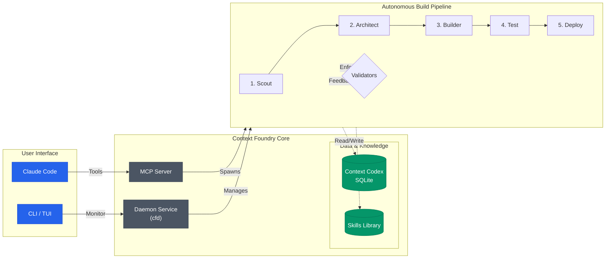

<div align="center">
  
</div>

# Context Foundry

> *"Generate probabilistically, validate deterministically."*

**Autonomous AI development platform** that spawns fresh Claude instances to research, design, build, test, and deploy complete software projects. Walk away and come back to production-ready code.

**Version 2.5.0** | [Quick Start](QUICKSTART.md) | [Documentation](docs/) | [Features](docs/FEATURES.md)

---

## What is Context Foundry?

Context Foundry is an **autonomous development platform** with three main components:

| Component | Description |
|-----------|-------------|
| **MCP Server** | Model Context Protocol server that exposes build tools to Claude Code |
| **Daemon (cfd)** | Background service managing build queues, resource limits, and process monitoring |
| **CLI Tools** | Terminal interface for monitoring builds and managing the system |

Unlike traditional AI coding assistants that require constant supervision, Context Foundry runs complete build pipelines autonomously:

```
You: "Build a weather dashboard with React"
[Walk away for 10 minutes]
Result: Complete app deployed to GitHub, tests passing
```

---

## Core Philosophy

Context Foundry combines **probabilistic AI generation** with **deterministic validation**:

- **Probabilistic**: AI agents generate code freely using their full capabilities
- **Deterministic**: Code-level validators verify outputs, checksums detect unauthorized changes, phase contracts enforce handoffs

This hybrid approach makes autonomous operation reliable. See [Architecture](docs/ARCHITECTURE.md) for details.

---

## Key Features

### Build Pipeline

| Feature | Description |
|---------|-------------|
| **8-Phase Workflow** | Scout -> Architect -> Builder -> Test -> Docs -> Deploy -> Feedback |
| **Self-Healing Tests** | Automatically fixes test failures through redesign/rebuild cycles |
| **Parallel Execution** | AI decides when to spawn parallel agents for faster builds |
| **Incremental Builds** | Smart change detection rebuilds only what changed |

### Pattern Learning

| Feature | Description |
|---------|-------------|
| **Context Codex** | SQLite database tracking issues, solutions, and build metrics |
| **Skills Library** | Reusable code implementations with success rate tracking |

### Infrastructure

| Feature | Description |
|---------|-------------|
| **Daemon Service** | Background process with task queue, resource limits, watchdog |
| **Mission Control TUI** | Terminal interface for real-time build monitoring |
| **BAML Type Safety** | Structured JSON outputs with schema validation |
| **Deterministic Enforcement** | Post-phase validators, checksum verification, state machine |

### Extensions

Extensions let you specialize Context Foundry for specific domains. Think of them as giving the AI a business case, architectural blueprints, and success criteria before asking it to build something complex.

Create an extension by adding domain-specific patterns, example implementations, and validation rules to `extensions/<your-domain>/`. The AI will reference these during builds to produce domain-appropriate solutions.

---

## Architecture


```mermaid
graph LR
    subgraph User_Interface [User Interface]
        CLI["CLI / TUI"]
        Claude[Claude Code]
    end

    subgraph Core_System [Context Foundry Core]
        Daemon["Daemon Service<br/>(cfd)"]
        MCP[MCP Server]
        
        subgraph Data_Layer [Data & Knowledge]
            Codex[("Context Codex<br/>SQLite")]
            Skills[("Skills Library")]
        end
    end

    subgraph Build_Pipeline [Autonomous Build Pipeline]
        direction TB
        Scout[1. Scout] --> Architect[2. Architect]
        Architect --> Builder[3. Builder]
        Builder --> Test[4. Test]
        Test --> Deploy[5. Deploy]
        
        Validators{Validators}
    end

    %% Connections
    CLI -->|Monitor| Daemon
    Claude -->|Tools| MCP
    MCP -->|Spawns| Build_Pipeline
    Daemon -->|Manages| Build_Pipeline
    
    Build_Pipeline -->|Enforce| Validators
    Validators -->|Feedback| Build_Pipeline
    
    Build_Pipeline -.->|Read/Write| Codex
    Build_Pipeline -.->|Use| Skills

    %% Styling
    classDef primary fill:#2563eb,stroke:#1d4ed8,color:white;
    classDef secondary fill:#4b5563,stroke:#374151,color:white;
    classDef database fill:#059669,stroke:#047857,color:white;
    
    class CLI,Claude primary;
    class Daemon,MCP secondary;
    class Codex,Skills database;
```

Each phase spawns a **fresh Claude instance** with isolated context, preventing token bloat and ensuring consistent quality across long builds.

---

## Quick Start

### 1. Install

```bash
npm install -g context-foundry
```

This installs the package and automatically configures Claude Code. (Alternative: `pip install context-foundry && cf setup`)

### 2. Build Something

In Claude Code, just ask in natural language:

```
"Use CF to build a weather dashboard with React"
```

Walk away. Come back to deployed code on GitHub.

See [Quick Start Guide](QUICKSTART.md) for detailed setup instructions.

---

## CLI Tools

### Mission Control TUI

```bash
cf                    # Launch interactive terminal UI
```

### Daemon Management

```bash
cfd start             # Start the daemon
cfd status            # Check status
cfd logs <job-id>     # View build logs
cfd list              # List active builds
cfd stop              # Stop the daemon
```

---

## MCP Tools Available

| Tool | Description |
|------|-------------|
| `autonomous_build_and_deploy` | Full build pipeline: research -> design -> build -> test -> deploy |
| `delegate_to_claude_code` | Spawn fresh Claude instance for subtasks |
| `delegate_to_claude_code_async` | Non-blocking delegation with progress tracking |
| `search_skills` | Find reusable code implementations |
| `save_skill` | Save successful implementation as reusable skill |
| `create_evolution_task` | Create self-improvement task |
| `get_daemon_status` | Check daemon health and resource usage |

See [MCP Tools Reference](docs/MCP_SETUP.md) for complete documentation.

---

## Documentation

| Guide | Description |
|-------|-------------|
| [Quick Start](QUICKSTART.md) | Get running in 5 minutes |
| [User Guide](docs/USER_GUIDE.md) | Detailed usage instructions |
| [Architecture](docs/ARCHITECTURE.md) | How it works under the hood |
| [Features](docs/FEATURES.md) | Complete feature reference |
| [Innovations](docs/INNOVATIONS.md) | Technical breakthroughs explained |
| [Phase Handoff Flow](docs/phase-handoff-flow.md) | Inter-phase data contracts |
| [Troubleshooting](docs/TROUBLESHOOTING.md) | Common issues and fixes |
| [FAQ](docs/FAQ.md) | Frequently asked questions |

---

## File Structure

```
context-foundry/
├── tools/
│   ├── mcp_server.py          # MCP server entry point
│   ├── mcp_utils/             # Build orchestration, delegation, patterns
│   ├── prompts/phases/        # Phase-specific system prompts
│   ├── evolution/             # Daemon, self-improvement, safety
│   ├── cli.py                 # Main CLI (cf command)
│   └── cfd                    # Daemon CLI script
├── extensions/                # Domain-specific extensions
├── npm/                       # npm package wrapper
├── docs/                      # Documentation
└── CLAUDE.md                  # Instructions for AI agents
```

---

## Contributing

We welcome contributions. See [Contributing Guide](docs/CONTRIBUTING.md) for details.

---

## License

MIT License. See [LICENSE](LICENSE) for details.
