<div align="center">
  
</div>

# 🏭 Context Foundry

> **The AI That Builds Itself: Recursive Claude Spawning via Meta-MCP**
> Context Foundry uses Claude Code to spawn fresh Claude instances that autonomously build complete projects. Walk away and come back to production-ready software.

**Version 2.1.0 - October 2025**

> **📌 Version Note:** This is Context Foundry **v2.x** (MCP server for Claude Code). For the legacy **v1.0** Python CLI with multi-provider support, see the [`v1.x-legacy` branch](https://github.com/context-foundry/context-foundry/tree/v1.x-legacy) or download [`v1.0-final` release](https://github.com/context-foundry/context-foundry/releases/tag/v1.0-final).

---

## What is Context Foundry?

Context Foundry is an **MCP (Model Context Protocol) server** that empowers Claude Code CLI to build complete software projects autonomously with **self-healing test loops** and **automatic GitHub deployment**.

Unlike traditional AI coding tools that require constant supervision, Context Foundry lets you describe what you want and **walk away** while it:
- Researches requirements (Scout phase)
- Designs architecture (Architect phase)
- Implements code with tests (Builder phase)
- Auto-fixes test failures (Test phase with self-healing)
- **Captures screenshots automatically** (Screenshot phase - NEW!)
- Documents everything with visual guides (Documentation phase)
- Deploys to GitHub (Deployment phase)

**Real Example:**
```
User: "Build a Mario platformer game in JavaScript"
[User walks away for 7 minutes]
Result: ✅ Complete game deployed to GitHub, all tests passing
```

---

## 🚀 The Breakthrough: Meta-MCP Innovation

**What makes Context Foundry unique?** Most MCP servers call external tools. Context Foundry does something radical: **it uses MCP to recursively spawn Claude Code itself**.


**The paradigm shift:**
- **Traditional MCP**: Claude → MCP → External System (database, API, etc.)
- **Context Foundry**: Claude → MCP → **Claude** (recursive spawning)

**Why this matters:**
- 🧠 **Fresh 200K context windows** - Each spawned Claude starts clean, no token accumulation
- 🔄 **Parallel execution** - Multiple Claude instances work simultaneously
- 🎯 **Autonomous decision-making** - Agents decide when to spawn new agents
- 🏗️ **Self-orchestration** - AI orchestrates AI through meta-prompts

**Learn more:** Read the complete technical breakdown in **[docs/INNOVATIONS.md](docs/INNOVATIONS.md)** - all 15 innovations explained with code examples.

---

## 🎮 See It In Action: Evolution Quest

**Real build example** - Watch Context Foundry autonomously build a complete game from a simple request:

### Starting the Build


*User makes a request, then walks away. Context Foundry's autonomous workflow begins.*

### Guided Progress Updates


*Scout phase completes research. Architect phase designs the game architecture. Builder phase begins implementation.*


*Tests running and passing. Self-healing test loop ensures quality. Screenshot capture phase documents the UI.*

### Build Complete


*All phases complete automatically. Tests passing. Documentation generated. Ready for deployment.*

### The Result


*Complete, working game deployed to GitHub with tests, documentation, and screenshots. Total time: 12 minutes. User interaction: Just the initial request.*

**Key Takeaway:** User described what they wanted, walked away, came back to a finished, tested, documented, and deployed application.

---

## 💬 Just Ask Naturally (No Commands to Memorize!)

**The easiest way to use Context Foundry:** Just describe what you want in plain English.

### ✅ Say This

```
Build a weather app with current weather and 5-day forecast
using the OpenWeatherMap API
```

```
Create a todo app with add, complete, and delete functionality
```

```
Make a REST API with user authentication and PostgreSQL
```

**That's it!** Claude Code automatically uses Context Foundry's autonomous build system. No need to remember tool names or syntax.

### 📚 Quick Start

**1. One-time setup** (2 minutes) - See [QUICKSTART.md](QUICKSTART.md)

**2. Start Claude Code:**
```bash
claude
```

**3. Just ask:**
```
Build a calculator app with basic and scientific functions
```

**4. Walk away** - System builds autonomously (7-15 min)

**5. Get results** - Deployed to GitHub with tests and docs

### 🎯 Say This, Not That

| ✅ Say This (Easy) | ❌ Not This (Hard) |
|-------------------|-------------------|
| "Build a blog with React" | "Use mcp__autonomous_build_and_deploy with task: 'Build a blog', working_directory: '/tmp/blog', ..." |
| "Create a Snake game" | "I need to call the autonomous build tool with parameters..." |
| "Make a weather API" | "How do I use the MCP server to build an API?" |

**Claude Code handles the MCP calls automatically when you ask to build something!**

### 💡 Tips for Best Results

**Be specific:**
```
Build a weather app with:
- Current weather display
- 5-day forecast
- City search
- Temperature unit toggle
- Responsive design
```

**Include tech requirements:**
```
Create a REST API using Express.js, PostgreSQL, and JWT authentication
with comprehensive tests and error handling
```

**Want to learn more?** → [QUICKSTART.md](QUICKSTART.md) for 5-minute tutorial

---

## 🎨 Key Innovations

Context Foundry introduces **15 groundbreaking innovations** that transform AI software development. Here's a quick overview organized by category:

### 🏗️ Architecture Innovations

1. **Meta-MCP Innovation** - Use MCP to recursively spawn Claude Code instances (the breakthrough that enabled v2.0)
2. **Subprocess Delegation** - Spawn fresh Claude instances via `subprocess.Popen()` with auth inheritance
3. **Context Window Isolation** - Each agent gets a fresh 200K token window, no accumulation
4. **File-Based Context System** - Shared memory via filesystem, `.context-foundry/` artifacts
5. **Markdown-First Design** - `.md` files over JSON for human+AI readability

### 🤖 Automation Innovations

6. **Self-Healing Test Loop** - Auto-fix test failures through redesign→rebuild→retest cycles
7. **Parallel Execution Architecture** - Phase 2.5 and 4.5 spawn concurrent agents (30-45% faster)
8. **Meta-Prompt Orchestration** - AI orchestrates AI via `orchestrator_prompt.txt` (no Python)
9. **8-Phase Workflow** - Scout→Architect→Builder→Test→Screenshot→Docs→Deploy→Feedback
10. **Async Task Management** - Non-blocking subprocess execution, work while builds run

### 🧠 Intelligence Innovations

11. **Global Pattern Learning** - Cross-project knowledge accumulation in `~/.context-foundry/patterns/`
12. **Output Truncation Strategy** - 45-45-10 split keeps critical context visible

### 🎨 User Experience Innovations

13. **Screenshot Capture Phase** - Playwright-based visual documentation (Phase 4.5)
14. **TUI Real-time Monitoring** - Textual framework terminal dashboard
15. **Livestream Integration** - WebSocket-based remote monitoring

**Want the complete technical breakdown?** See **[docs/INNOVATIONS.md](docs/INNOVATIONS.md)** for in-depth explanations with code examples, real-world impact analysis, and paradigm shifts for each innovation.

### What Changed from 1.x?

| Feature | 1.x (Python CLI) | 2.0 (MCP Server) |
|---------|------------------|-------------------|
| **Orchestration** | Python scripts + API calls | Native Claude `/agents` + meta-prompts |
| **Cost Model** | Pay-per-token API | Claude Max subscription ($20/month unlimited) |
| **Testing** | Manual review at checkpoints | Self-healing auto-fix loops |
| **Deployment** | Manual git operations | Automatic GitHub deployment |
| **Tool Access** | Limited to Python functions | Full Claude Code tool suite (Read, Edit, Bash, etc.) |
| **Context** | API conversation history | File-based artifacts (.context-foundry/) |
| **Providers** | 7 AI providers supported | Claude only (optimized for quality) |
| **Complexity** | ~3000 lines of Python | ~1400 lines (MCP + meta-prompt) |

**Want the technical details?** See [ARCHITECTURE_DECISIONS.md](ARCHITECTURE_DECISIONS.md) for comprehensive explanations of what changed and why.

**Using Context Foundry 1.x?** The Python CLI is preserved in `LEGACY_README.md` and still functional.

---

## 🔄 How It Works: 8-Phase Architecture

Context Foundry orchestrates autonomous builds through **8 distinct phases**, with parallel execution at key stages for maximum performance:

```mermaid
graph TD
    START[User Request] --> P1[Phase 1: Scout]
    P1 --> P2[Phase 2: Architect]
    P2 --> P25[Phase 2.5: Parallel Builders]

    P25 --> B1[Builder Agent #1]
    P25 --> B2[Builder Agent #2]
    P25 --> B3[Builder Agent #N...]

    B1 --> P3[Phase 3: Integration]
    B2 --> P3
    B3 --> P3

    P3 --> P4[Phase 4: Test]
    P4 -->|Tests Pass| P45[Phase 4.5: Screenshot Capture]
    P4 -->|Tests Fail| HEAL{Self-Healing Loop}

    HEAL -->|Iteration < 3| P2
    HEAL -->|Max Iterations| FAIL[Report Failure]

    P45 --> P5[Phase 5: Documentation]
    P5 --> P6[Phase 6: Deploy to GitHub]
    P6 --> P7[Phase 7: Feedback Analysis]
    P7 --> DONE[✅ Complete]

    style P1 fill:#e3f2fd
    style P2 fill:#fff3e0
    style P25 fill:#fce4ec
    style P3 fill:#f3e5f5
    style P4 fill:#e8f5e9
    style P45 fill:#fff9c4
    style P5 fill:#e0f2f1
    style P6 fill:#fce4ec
    style P7 fill:#e1bee7
    style HEAL fill:#ffebee
    style DONE fill:#c8e6c9
```



**Key Features:**

- **Phase 2.5**: Spawns 2-8 concurrent Builder agents based on project complexity
- **Phase 4**: Self-healing loop with up to 3 auto-fix iterations
- **Phase 4.5**: Parallel screenshot capture using Playwright
- **Phase 7**: Extracts patterns and updates global knowledge base

**Total Duration:** 7-15 minutes for most projects (autonomous, zero human intervention)

---

## 📚 Understanding Context Foundry

### How It Really Works (No Magic, Just Transparency)

**Key Insight:** Context Foundry does NOT modify Claude Code. It uses **delegation** to spawn separate Claude instances that do the work.

```
Your Claude Window (stays clean)
    ↓
    "Build a weather app"
    ↓
MCP Server spawns → Fresh Claude Instance
                    (runs all 7 phases)
                    (builds entire project)
                    ↓
                    Returns summary
    ↓
Your Claude Window shows: "Build complete! ✅"
```

**Why your context usage stays low:** The heavy work happens in a separate Claude instance!

### Where Are My Build Artifacts?

**Every project gets a `.context-foundry/` directory:**

```
your-project/
└── .context-foundry/
    ├── architecture.md      ← Architect's complete plan (30-90KB!)
    ├── scout-report.md      ← Research findings
    ├── build-log.md         ← Implementation log
    ├── test-final-report.md ← Test results
    └── session-summary.json ← Build metadata
```

**Example - View VimQuest's architecture plan:**
```bash
cat /Users/name/homelab/vimquest/.context-foundry/architecture.md
```

### Pattern Library Location

**Global patterns** (shared across ALL builds):
```
/Users/name/homelab/context-foundry/.context-foundry/patterns/
├── common-issues.json
├── test-patterns.json
├── architecture-patterns.json
└── scout-learnings.json
```

**How it works:**
- Each build reads global patterns
- Applies past learnings automatically
- Discovers new patterns
- Updates library for future builds

**See what Context Foundry has learned:**
```bash
cat /Users/name/homelab/context-foundry/.context-foundry/patterns/common-issues.json
```

### Common Questions

❓ **Did Context Foundry change Claude Code's system prompt?**
✅ **No!** It spawns separate Claude instances via delegation. Your regular Claude Code usage is unaffected.

❓ **Where can I find the architect's plan?**
✅ `<your-project>/.context-foundry/architecture.md`

❓ **Why is my context usage so low?**
✅ The build runs in a **separate Claude instance**. Your main window just monitors progress.

❓ **What happens to the agents after the build?**
✅ They're ephemeral - disappear after the build. Only artifacts and patterns persist.

❓ **Can I review the plan before building?**
✅ Yes! Use `autonomous=False` to enable checkpoints, or review `architecture.md` after completion.

### 📖 Full FAQ

**Want comprehensive answers?** See **[FAQ.md](FAQ.md)** for:
- Complete delegation model explanation
- Where all prompts are located
- How agents work and disappear
- Build artifact locations
- Pattern library details
- Control options (autonomous vs manual)
- And much more!

**Additional Documentation:**
- **[FAQ.md](FAQ.md)** - Comprehensive Q&A (transparency focus)
- **[USER_GUIDE.md](USER_GUIDE.md)** - Step-by-step usage guide
- **[docs/DELEGATION_MODEL.md](docs/DELEGATION_MODEL.md)** - Technical deep dive on delegation
- **[FEEDBACK_SYSTEM.md](FEEDBACK_SYSTEM.md)** - How self-learning works
- **[docs/BAML_INTEGRATION.md](docs/BAML_INTEGRATION.md)** - Type-safe LLM outputs with BAML (v1.3.0+)

---

## Quick Start

### Prerequisites

- **Python 3.10 or higher** (for MCP server)
- **Claude Code CLI** installed and in PATH
- **Claude Max subscription** ($20/month) or Anthropic API key
- **Git** and **GitHub CLI** (for deployment features)

### Installation

#### Stable Release (Recommended)

```bash
# 1. Clone Context Foundry
git clone https://github.com/context-foundry/context-foundry.git

# IMPORTANT: Change into the context-foundry directory
cd context-foundry

# 2. Create virtual environment (recommended, required on Debian-based systems)
python3 -m venv venv
source venv/bin/activate  # On Windows: venv\Scripts\activate

# 3. Install MCP server dependencies (Python 3.10+ required)
# This is a minimal installation - only ~50MB, installs in 15-20 seconds
pip install -r requirements-mcp.txt

# 3a. [Optional] Install BAML for type-safe LLM outputs
pip install -r requirements-baml.txt

# 4. Configure Claude Code to connect to MCP server
# Use absolute paths with $(pwd) and add to project scope (-s project)
claude mcp add --transport stdio context-foundry -s project -- $(pwd)/venv/bin/python $(pwd)/tools/mcp_server.py

# This uses $(pwd) to automatically get absolute paths
# The -s project flag creates .mcp.json in the project directory (shareable with team)

# 5. Verify the config was created
cat .mcp.json
# Should show the server configuration with your paths

# Note: Project-scoped servers don't appear in `claude mcp list` (that shows global config)
# They're automatically detected when you run `claude` in this directory

# 6. Authenticate with GitHub (for deployment)
gh auth login
```

**Detailed setup guide:** See [CLAUDE_CODE_MCP_SETUP.md](CLAUDE_CODE_MCP_SETUP.md) for troubleshooting and advanced configuration.

#### Nightly Builds (Bleeding Edge)

For the latest features and fixes before they're in a stable release:

```bash
# 1. Clone and checkout the latest nightly
git clone https://github.com/context-foundry/context-foundry.git
cd context-foundry

# 2. List available nightly releases
git tag --list 'v*-nightly.*' --sort=-v:refname | head -5

# 3. Checkout specific nightly (example)
git checkout v2.1.0-nightly.20251025

# 4. Continue with standard setup (venv, pip install, etc.)
```

**About Nightly Releases:**
- 🌙 **Built daily** at midnight UTC if there are new commits
- 🏷️ **Format:** `v{VERSION}-nightly.{YYYYMMDD}` (e.g., `v2.1.0-nightly.20251025`)
- ⚡ **Latest features** that haven't been released in stable yet
- 🔬 **Pre-release quality** - May contain bugs, use stable releases for production
- 📋 **Auto-generated release notes** - Grouped by commit type (feat, fix, docs, etc.)
- 🔄 **Retained for 30 days** then automatically cleaned up

**View nightly releases:** [GitHub Releases (Pre-releases)](https://github.com/context-foundry/context-foundry/releases?q=prerelease%3Atrue)

### Basic Usage

Start Claude Code CLI:

```bash
claude
```

Inside your Claude Code session:

#### Build a New Project (Autonomous)

```
Use mcp__autonomous_build_and_deploy with:
- task: "Build a weather API with Express.js that fetches data from OpenWeatherMap"
- working_directory: "/tmp/weather-api"
- github_repo_name: "weather-api"
- enable_test_loop: true
```

**What happens:**
1. Build starts immediately in the background
2. You get a task_id to check progress
3. **You can continue working** while it builds!
4. System completes autonomously:
   - Scout researches requirements (1-2 min)
   - Architect designs system (1-2 min)
   - Builder implements code + tests (2-5 min)
   - Tester validates (tests fail? auto-fixes up to 3x)
   - **Screenshot Capturer takes visual documentation (30-60 sec)**
   - Documentation created with screenshots (1 min)
   - Deployed to GitHub (30 sec)

**Total:** ~7-15 minutes, zero human input required.

**Check status anytime:**
```
What's the status of my build?
```

Claude will automatically check and report progress.

#### Delegate a Simple Task

```
Use mcp__delegate_to_claude_code with:
- task: "Create a Python script that fetches weather data and prints it nicely"
- working_directory: "/tmp/weather-script"
```

Returns when complete with full output.

#### Parallel Task Execution

```
Use mcp__delegate_to_claude_code_async to start these tasks in parallel:

Task 1: "Create Flask REST API for user authentication"
  working_directory: "/tmp/project/backend"

Task 2: "Create React frontend with login UI"
  working_directory: "/tmp/project/frontend"

Task 3: "Create PostgreSQL schema and migrations"
  working_directory: "/tmp/project/database"

Then use mcp__list_delegations to monitor progress
And mcp__get_delegation_result to collect results when ready
```

**Time saved:** 3 sequential tasks (30 min) → parallel tasks (10 min) = 3x faster

---

## Background Builds (Non-Blocking Execution)

**The best part:** Builds run in the background by default! You can continue working in your Claude Code session while projects build autonomously.

### How It Works

When you trigger a build (by saying "Build a weather app" or using the MCP tool directly), the system:

1. **Starts immediately** - Spawns a background Claude Code process
2. **Returns task_id** - Gives you a tracking ID
3. **Runs autonomously** - Completes all phases without blocking you
4. **Notifies when done** - You can check status anytime

### Example Workflow

```
You: Build a todo app with React and localStorage

Claude: 🚀 Autonomous build started!

Project: todo-app
Task ID: abc-123-def-456
Location: /tmp/todo-app
Expected duration: 7-15 minutes

You can continue working - the build runs in the background.

You: [Continue working on other things]

[10 minutes later]

You: What's the status of task abc-123-def-456?

Claude: ✅ Build completed!

GitHub: https://github.com/snedea/todo-app
Tests: 25/25 passing
Duration: 8.3 minutes
```

### Checking Build Status

**Ask naturally:**
```
What's the status of my build?
How's the todo app build going?
Is task abc-123-def-456 done?
```

**Or use the MCP tool directly:**
```
Use mcp__get_delegation_result with task_id "abc-123-def-456"
```

### Listing All Active Builds

```
What builds are running?
Show me all active tasks
```

Or:

```
Use mcp__list_delegations
```

### Benefits of Background Builds

- ✅ **No blocking** - Keep working while builds run
- ✅ **Parallel work** - Build multiple projects simultaneously
- ✅ **Better UX** - Natural workflow, no waiting
- ✅ **Check anytime** - Monitor progress when convenient

**Note:** If you want synchronous execution (wait for completion), you can explicitly request the non-async version, but async is recommended for the best experience.

---

## MCP Tools Reference

### 🚀 `autonomous_build_and_deploy_async()` (Recommended)

Fully autonomous Scout → Architect → Builder → Test → Deploy workflow that runs in the **background** (non-blocking).

**Why async is better:**
- ✅ Continue working while build runs
- ✅ Build multiple projects simultaneously
- ✅ No session blocking (7-15 min builds don't freeze Claude)
- ✅ Check status anytime

**Parameters:**
- `task` (required): What to build (e.g., "Build a todo app")
- `working_directory` (required): Where to build it
- `github_repo_name` (optional): Deploy to this GitHub repo
- `existing_repo` (optional): Enhance existing repo instead
- `mode` (default: "new_project"): "new_project" | "fix" | "enhance"
- `enable_test_loop` (default: true): Enable self-healing when tests fail
- `max_test_iterations` (default: 3): Max auto-fix attempts
- `timeout_minutes` (default: 90.0): Total timeout

**Returns:** JSON with task_id and status message (build continues in background)

**Note:** When you naturally say "Build a weather app", Claude Code automatically uses this async version.

### 🚀 `autonomous_build_and_deploy()` (Synchronous)

Same as async version above, but **blocks** your Claude Code session until complete.

**When to use:**
- You specifically want to wait for the build
- You're debugging and need immediate output
- You prefer synchronous workflows

**Returns:** JSON with complete results after build finishes (7-15 min wait)

**Example:**
```python
{
  "status": "completed",
  "phases_completed": ["scout", "architect", "builder", "test", "docs", "deploy"],
  "github_url": "https://github.com/snedea/weather-api",
  "files_created": ["server.js", "tests/api.test.js", "README.md", ...],
  "tests_passed": true,
  "test_iterations": 2,
  "duration_minutes": 7.42
}
```

### ⚡ `delegate_to_claude_code()`

Synchronous delegation - starts task and waits for completion.

**Parameters:**
- `task` (required): Task description
- `working_directory` (optional): Where to run (default: current)
- `timeout_minutes` (default: 10.0): Max execution time
- `additional_flags` (optional): CLI flags to pass

**Returns:** JSON with status, stdout, stderr, duration

### 🔄 `delegate_to_claude_code_async()`

Asynchronous delegation - starts task in background, returns immediately.

**Parameters:** Same as `delegate_to_claude_code()`

**Returns:** JSON with `task_id` for tracking

### 📊 `get_delegation_result(task_id)`

Check status and retrieve results of async task.

**Returns:**
- If running: `{"status": "running", "elapsed_seconds": X}`
- If complete: `{"status": "completed", "stdout": "...", "stderr": "...", "duration_seconds": X}`
- If timeout: `{"status": "timeout"}`

### 📋 `list_delegations()`

List all active and completed async tasks.

**Returns:** JSON array of tasks with status and elapsed time

---

## Real-World Examples

### Example 1: Build Express.js Weather API

```
Use mcp__autonomous_build_and_deploy:
- task: "Build Express.js weather API that fetches from OpenWeatherMap, includes caching with Redis, rate limiting, error handling, and comprehensive tests"
- working_directory: "/tmp/weather-api"
- github_repo_name: "weather-api"
- enable_test_loop: true
```

**Result:**
- Duration: 8.3 minutes
- Files: 12 (server.js, routes/, controllers/, tests/, README.md, etc.)
- Tests: 15/15 passed (iteration 1 failed, auto-fixed)
- Deployed: https://github.com/snedea/weather-api

### Example 2: Build Mario Platformer Game

```
Use mcp__autonomous_build_and_deploy:
- task: "Build a Mario-style platformer game in vanilla JavaScript with HTML5 Canvas. Include player movement (left, right, jump), collision detection, multiple levels, enemies, and score tracking"
- working_directory: "/tmp/mario-game"
- github_repo_name: "mario-game"
- enable_test_loop: true
```

**Result:**
- Duration: 7.42 minutes
- Files: 8 (index.html, game.js, player.js, level.js, physics.js, tests/, docs/)
- Tests: 12/12 passed (iteration 2 after collision fix)
- Deployed: https://github.com/snedea/mario-game

### Example 3: Parallel Full-Stack Build

```
# Start backend
Use mcp__delegate_to_claude_code_async:
- task: "Create Python Flask REST API with JWT authentication, PostgreSQL database, user registration/login endpoints, and tests"
- working_directory: "/tmp/fullstack/backend"

# Start frontend (in parallel)
Use mcp__delegate_to_claude_code_async:
- task: "Create React SPA with login form, registration form, protected routes, JWT token management, and tests"
- working_directory: "/tmp/fullstack/frontend"

# Start database (in parallel)
Use mcp__delegate_to_claude_code_async:
- task: "Create PostgreSQL schema with users table, migrations, seed data, and setup scripts"
- working_directory: "/tmp/fullstack/database"

# Monitor progress
Use mcp__list_delegations

# Collect results
Use mcp__get_delegation_result for each task_id
```

**Result:**
- Sequential time: ~30 minutes (10 min each)
- Parallel time: ~12 minutes (limited by slowest task)
- Time saved: 18 minutes (60% faster)

---

## Self-Healing Test Loop in Action

**Scenario:** Building Express.js authentication API

```
PHASE 4 - TEST (Iteration 1):

Running: npm test

❌ FAIL: POST /auth/login should return JWT token
   Expected: 200
   Received: 500
   Error: UnhandledPromiseRejectionWarning: JWT secret not defined

[SYSTEM ANALYZES FAILURE]

Tester Agent:
- Root cause: generateToken() throws when JWT_SECRET undefined
- Missing: Error handling in auth controller
- Fix needed: Add try-catch, validate environment on startup

[SYSTEM REDESIGNS]

Architect Agent:
- Updates architecture.md with error handling requirements
- Creates fixes-iteration-1.md with specific code changes

[SYSTEM RE-IMPLEMENTS]

Builder Agent:
- Adds try-catch to auth controller
- Adds JWT_SECRET validation at startup
- Updates .env.example with required variables

[SYSTEM RE-TESTS]

PHASE 4 - TEST (Iteration 2):

Running: npm test

✅ PASS: All tests (3/3)
   ✓ POST /auth/login should return JWT token
   ✓ POST /auth/login should reject invalid credentials
   ✓ GET /auth/verify should validate token

[SYSTEM CONTINUES TO DEPLOYMENT]
```

**Total auto-fix time:** ~2 minutes

**Human intervention:** Zero

---

## Configuration

### Custom Python Version

If you need a specific Python version for the MCP server:

Edit `~/.config/claude-code/mcp_settings.json`:

```json
{
  "mcpServers": {
    "context-foundry": {
      "command": "/usr/local/bin/python3.11",
      "args": ["/path/to/context-foundry/tools/mcp_server.py"]
    }
  }
}
```

### Environment Variables

Pass environment variables to MCP server:

```json
{
  "mcpServers": {
    "context-foundry": {
      "command": "python3.10",
      "args": ["/path/to/context-foundry/tools/mcp_server.py"],
      "env": {
        "ANTHROPIC_API_KEY": "your-key",
        "OPENWEATHERMAP_API_KEY": "your-key"
      }
    }
  }
}
```

### Disable MCP Server

Temporarily disable without deleting configuration:

```json
{
  "mcpServers": {
    "context-foundry": {
      "disabled": true
    }
  }
}
```

---

## Troubleshooting

### MCP Server Won't Start

**Error:** `ImportError: No module named 'fastmcp'`

**Solution:**
```bash
# Make sure you're in the virtual environment
source venv/bin/activate  # On Windows: venv\Scripts\activate

# Then install dependencies (minimal installation, ~50MB)
pip install -r requirements-mcp.txt
# Or specifically:
pip install fastmcp>=2.0.0 nest-asyncio>=1.5.0
# Note: Previous versions required ~3-4GB of ML libraries - no longer needed!
```

**Error:** `externally-managed-environment` (Debian/Ubuntu systems)

**Solution:**
```bash
# Create a virtual environment first (best practice)
python3 -m venv venv
source venv/bin/activate

# Then install dependencies
pip install -r requirements-mcp.txt
```

**Error:** Python version too old

**Solution:**
```bash
# Check version (must be 3.10+)
python3 --version

# Use specific version if available
python3.10 -m venv venv
source venv/bin/activate
pip install -r requirements-mcp.txt
```

### Claude Code Doesn't See MCP Tools

**Symptoms:** `mcp__autonomous_build_and_deploy` not available

**Solutions:**

1. Verify MCP settings exist:
   ```bash
   cat ~/.config/claude-code/mcp_settings.json
   ```

2. Check path is correct:
   ```bash
   ls /path/to/context-foundry/tools/mcp_server.py
   ```

3. Restart Claude Code:
   ```bash
   # Exit current session and restart
   claude
   ```

4. Verify connection:
   ```bash
   claude mcp list
   # Should show: ✓ Connected: context-foundry
   ```

### Delegations Timeout

**Symptoms:** Tasks consistently hit timeout

**Solutions:**

1. Increase timeout:
   ```
   Use mcp__autonomous_build_and_deploy:
   - timeout_minutes: 120.0
   ```

2. Break into smaller tasks:
   - Instead of "Build entire application"
   - Use: Multiple delegations for modules

3. Check if task requires manual input (shouldn't happen with `--permission-mode bypassPermissions`)

### Tests Keep Failing

**Symptoms:** Test loop reaches max iterations without passing

**Solutions:**

1. Check test failure reports:
   ```bash
   cat .context-foundry/test-results-iteration-*.md
   ```

2. Review fix attempts:
   ```bash
   cat .context-foundry/fixes-iteration-*.md
   ```

3. Increase max iterations if issue seems fixable:
   ```
   Use mcp__autonomous_build_and_deploy:
   - max_test_iterations: 5
   ```

4. Disable test loop to see raw test output:
   ```
   Use mcp__autonomous_build_and_deploy:
   - enable_test_loop: false
   ```

**More help:** See [CLAUDE_CODE_MCP_SETUP.md](CLAUDE_CODE_MCP_SETUP.md) for comprehensive troubleshooting.

---

## Project Structure

```
context-foundry/
├── tools/
│   ├── mcp_server.py              # MCP server (all delegation tools)
│   └── orchestrator_prompt.txt    # Meta-prompt for autonomous workflow
├── .context-foundry/              # Generated during builds (in working_directory)
│   ├── scout-report.md            # Scout phase findings
│   ├── architecture.md            # Architect phase design
│   ├── build-log.md               # Builder phase log
│   ├── test-iteration-count.txt   # Current test iteration (1, 2, 3)
│   ├── test-results-iteration-*.md # Test failure analysis per iteration
│   ├── fixes-iteration-*.md       # Fix strategies per iteration
│   ├── test-final-report.md       # Final test results
│   └── session-summary.json       # Complete session metadata
├── examples/                      # Test delegation examples
│   └── test_claude_code_delegation.md
├── docs/
│   ├── CLAUDE_CODE_MCP_SETUP.md   # MCP setup and troubleshooting
│   └── (other documentation)
├── ARCHITECTURE_DECISIONS.md       # Technical deep dive (v2.0 changes)
├── LEGACY_README.md                # Original 1.x documentation
├── README.md                       # This file (v2.0)
└── requirements-mcp.txt            # MCP server dependencies
```

---

## 💰 Cost Model & BAML Integration

### **CRITICAL: What Runs on Your Subscription vs API Keys**

Context Foundry has **two layers** - understanding this is essential:

#### **Layer 1: Core Build System (FREE - Uses Your Claude Code Subscription)**

**ALL the main work runs on your Claude Code subscription:**
- ✅ **Scout Agent** - Codebase research, requirement analysis
- ✅ **Architect Agent** - System design, architecture planning
- ✅ **Builder Agents** (2-8 parallel) - ALL code implementation
- ✅ **Test Agent** - Running tests, analyzing failures
- ✅ **Self-Healing Loop** - Auto-fixing test failures (redesign → rebuild → retest)
- ✅ **Screenshot Agent** - Visual documentation capture
- ✅ **Documentation Agent** - README and guide generation
- ✅ **Deploy Agent** - GitHub deployment

**These agents account for 99%+ of the token usage** and run entirely under your **$20/month Claude Max subscription** (unlimited usage).

#### **Layer 2: BAML Type-Safety (OPTIONAL - Requires API Key)**

**BAML is an optional add-on for type-safe validation:**
- ⚙️ Phase tracking validation (~10-15 calls/build)
- ⚙️ Scout report structure validation (1 call/build)
- ⚙️ Architecture blueprint validation (1 call/build)
- ⚙️ Build result validation (5-10 calls/build)

**BAML token usage: ~17,000 tokens per build**

**BAML cost: ~$0.20 per build** (20 cents)

**What you get:**
- Guaranteed valid JSON structures
- Compile-time schema validation
- Type-safe outputs
- Multi-provider support (Claude/GPT/Gemini)

**What you lose if disabled:**
- Simple JSON validation instead (works fine!)
- No type checking (but JSON parsing still works)

### Cost Comparison Table

| Component | Runs On | Cost | Token Usage | What It Does |
|-----------|---------|------|-------------|--------------|
| **Scout Agent** | Claude Code subscription | $0 (included) | ~15,000 tokens | Research & requirements |
| **Architect Agent** | Claude Code subscription | $0 (included) | ~25,000 tokens | System design |
| **Builder Agents (2-8×)** | Claude Code subscription | $0 (included) | ~100,000 tokens | **All code implementation** |
| **Test Agent** | Claude Code subscription | $0 (included) | ~20,000 tokens | Test execution & analysis |
| **Self-Healing (1-3×)** | Claude Code subscription | $0 (included) | ~30,000 tokens/iteration | Auto-fix test failures |
| **Screenshot Agent** | Claude Code subscription | $0 (included) | ~5,000 tokens | Visual docs |
| **Docs Agent** | Claude Code subscription | $0 (included) | ~10,000 tokens | README generation |
| **Deploy Agent** | Claude Code subscription | $0 (included) | ~5,000 tokens | GitHub deployment |
| **BAML Validation** | API key (optional) | **~$0.20/build** | ~17,000 tokens | Type-safe validation |

**Total per build:**
- **With BAML:** $0.20 (subscription covers 99%, BAML adds $0.20)
- **Without BAML:** $0 (100% covered by subscription)

### BAML: Keep or Disable?

**Disable BAML (Recommended for most users):**
```bash
# Simply don't set API keys in .env
# BAML automatically falls back to JSON mode
# Zero additional cost
```

**Enable BAML (If you want type safety):**
```bash
# Set API key in .env
export ANTHROPIC_API_KEY="sk-ant-..."

# Cost: ~$0.20 per build
# ~$2/month for 10 builds
# ~$10/month for 50 builds
```

**Our recommendation:** Try Context Foundry without BAML first. If you need stronger type guarantees, enable it later.

---

## Performance & Cost

### Performance Metrics

Based on real-world usage:

| Metric | Value |
|--------|-------|
| **Avg build time** | 7-15 minutes (simple to moderate projects) |
| **Test auto-fix success** | 95% (within 3 iterations) |
| **Parallel speedup** | 3-10x (vs sequential) |
| **Token efficiency** | No limits (file-based context) |
| **Code quality** | 90%+ test coverage |

### Cost Comparison

**Context Foundry 1.x (API mode):**
```
Per project: $3-10 (pay-per-token)
100 projects: $300-1000
```

**Context Foundry (Claude Max):**
```
Subscription: $20/month (unlimited)
100 projects: $20/month

Break-even: ~5 projects per month
```

**Savings:** 95%+ for heavy users

---

## Documentation

### 📘 Getting Started

| Document | Description | Audience |
|----------|-------------|----------|
| **[README.md](README.md)** (this file) | Quick start and overview | Everyone |
| **[QUICKSTART.md](QUICKSTART.md)** | 5-minute setup guide | New users |
| **[USER_GUIDE.md](USER_GUIDE.md)** | Step-by-step usage guide with examples | New users |
| **[FAQ.md](FAQ.md)** | Comprehensive Q&A - transparency focused | Everyone |

### 🔧 Setup & Configuration

| Document | Description | Audience |
|----------|-------------|----------|
| **[CLAUDE_CODE_MCP_SETUP.md](CLAUDE_CODE_MCP_SETUP.md)** | Complete MCP setup and troubleshooting | All users |
| **[.mcp.json](.mcp.json)** | Project-shareable MCP configuration | Team leads |

### 🏗️ Architecture & Technical Deep Dives

| Document | Description | Audience |
|----------|-------------|----------|
| **⭐ [docs/INNOVATIONS.md](docs/INNOVATIONS.md)** | **All 15 innovations explained with code examples** | **Everyone - START HERE!** |
| **[docs/FAQ.md](docs/FAQ.md)** | Technical FAQ (52 questions): parallelization, token management, MCP architecture, prompt engineering | Developers, architects, AI engineers |
| **[docs/ARCHITECTURE_DIAGRAMS.md](docs/ARCHITECTURE_DIAGRAMS.md)** | 🎨 Visual flowcharts and sequence diagrams (Mermaid) | Visual learners, everyone! |
| **[docs/MCP_SERVER_ARCHITECTURE.md](docs/MCP_SERVER_ARCHITECTURE.md)** | Complete MCP server technical architecture | Developers, contributors |
| **[docs/CONTEXT_PRESERVATION.md](docs/CONTEXT_PRESERVATION.md)** | How context flows between agents (ephemeral agents + persistent files) | Developers, curious users |
| **[docs/DELEGATION_MODEL.md](docs/DELEGATION_MODEL.md)** | Why delegation keeps main context clean | Technical users |
| **[ARCHITECTURE_DECISIONS.md](ARCHITECTURE_DECISIONS.md)** | What changed in v2.0 and why | Technical users |
| **[docs/ARCHITECTURE.md](docs/ARCHITECTURE.md)** | Stateless conversation architecture | Developers |

### 🧠 Self-Learning & Patterns

| Document | Description | Audience |
|----------|-------------|----------|
| **[FEEDBACK_SYSTEM.md](FEEDBACK_SYSTEM.md)** | Self-learning pattern library documentation | All users |
| **~/.context-foundry/patterns/common-issues.json** | Global pattern library (on your machine) | Curious users |

### 📚 Reference & Legacy

| Document | Description | Audience |
|----------|-------------|----------|
| **[CHANGELOG.md](CHANGELOG.md)** | Version history and release notes | Everyone |
| **[ROADMAP.md](ROADMAP.md)** | Future plans | Contributors |
| **[LEGACY_README.md](LEGACY_README.md)** | Original Context Foundry 1.x documentation | v1.x users |

### 💡 Recommended Reading Order

**New Users:**
1. [README.md](README.md) - Understand what Context Foundry does
2. [QUICKSTART.md](QUICKSTART.md) - Get set up in 5 minutes
3. [USER_GUIDE.md](USER_GUIDE.md) - Learn how to use it
4. [docs/INNOVATIONS.md](docs/INNOVATIONS.md) - Deep dive into all 15 innovations
5. [FAQ.md](FAQ.md) - Common questions answered

**Developers/Contributors:**
1. [docs/INNOVATIONS.md](docs/INNOVATIONS.md) - 🎨 START HERE! All 15 innovations with code examples
2. [docs/FAQ.md](docs/FAQ.md) - Technical FAQ (52 questions on architecture, parallelization, etc.)
3. [docs/ARCHITECTURE_DIAGRAMS.md](docs/ARCHITECTURE_DIAGRAMS.md) - Visual flowcharts and sequence diagrams
4. [ARCHITECTURE_DECISIONS.md](ARCHITECTURE_DECISIONS.md) - Why v2.0 architecture
5. [docs/MCP_SERVER_ARCHITECTURE.md](docs/MCP_SERVER_ARCHITECTURE.md) - How MCP server works
6. [docs/CONTEXT_PRESERVATION.md](docs/CONTEXT_PRESERVATION.md) - How context flows
7. [docs/DELEGATION_MODEL.md](docs/DELEGATION_MODEL.md) - Delegation architecture

**Troubleshooting:**
1. [CLAUDE_CODE_MCP_SETUP.md](CLAUDE_CODE_MCP_SETUP.md) - Setup issues
2. [FAQ.md](FAQ.md) - Common questions
3. [docs/FAQ.md](docs/FAQ.md) - Technical troubleshooting (parallel execution, test loops, etc.)
4. [docs/MCP_SERVER_ARCHITECTURE.md](docs/MCP_SERVER_ARCHITECTURE.md#troubleshooting--debugging) - Advanced debugging

---

## Philosophy

**Context Foundry Philosophy:**
- **Autonomous over supervised**: Walk away while it builds
- **Self-healing over manual debugging**: Auto-fix test failures
- **File-based over conversation-based**: No token limits
- **Quality over speed**: Tests must pass before deployment
- **Simplicity over features**: Do one thing excellently

**Design Principles:**
- ✅ AI orchestrates itself (meta-prompts, not Python)
- ✅ Native tools over custom wrappers (Claude Code Read/Edit/Bash)
- ✅ File artifacts over conversation memory (.context-foundry/ directory)
- ✅ Self-healing over checkpoints (auto-fix instead of human review)
- ✅ GitHub deployment over local-only (share your work)

---

## Roadmap

### v2.2.0 (Next Release)
- [ ] Enhanced test failure analysis
- [ ] Configurable test frameworks (Jest, pytest, etc.)
- [ ] Better error recovery in deployment phase
- [ ] Pattern library (save successful builds as reusable patterns)
- [ ] Multi-project orchestration (build related projects together)
- [ ] Cost tracking for API mode users
- [ ] Enhanced logging and debugging tools

### v3.0 (Vision)
- [ ] Visual progress dashboard
- [ ] Support for additional version control systems
- [ ] Integration with CI/CD pipelines
- [ ] Team collaboration features

---

## Contributing

We welcome contributions! To contribute:

1. **Read the technical docs**: [ARCHITECTURE_DECISIONS.md](ARCHITECTURE_DECISIONS.md)
2. **Understand the workflow**: Scout → Architect → Builder → Test → Deploy
3. **Follow the principles**: Autonomous, self-healing, file-based
4. **Submit PRs**: With clear descriptions and tests

---

## License

MIT License - See LICENSE file for details

---

## Credits

Context Foundry builds upon:
- **Anthropic's Claude Code** - Native agent capabilities and MCP protocol
- **Context Foundry 1.x** - Original Scout/Architect/Builder workflow
- **[Dexter Horthy's](https://youtu.be/IS_y40zY-hc) "anti-vibe coding"** - Systematic approach over chaotic iteration
- **[Anthropic Agent SDK patterns](https://www.anthropic.com/engineering/building-agents-with-the-claude-agent-sdk)** - Agent orchestration techniques

---

## Support

- **Issues**: [GitHub Issues](https://github.com/snedea/context-foundry/issues)
- **Discussions**: [GitHub Discussions](https://github.com/snedea/context-foundry/discussions)
- **Documentation**: Start with this README, then [ARCHITECTURE_DECISIONS.md](ARCHITECTURE_DECISIONS.md)

---

**Context Foundry** - *Build complete software autonomously with self-healing AI workflows*

**Version:** 2.1.0 | **Release Date:** October 2025 | **License:** MIT
