# 🏭 Context Foundry

> **The Anti-Vibe Coding System**: Spec-first development through automated context engineering.
> Scout → Architect → Builder. Workflow over vibes.

## What is Context Foundry?

Context Foundry transforms fuzzy requests into clean, reviewable PRs through disciplined three-phase execution. It's the opposite of "vibe coding" - instead of chaotic back-and-forth with AI, it's systematic progression through research, planning, and implementation.

**Core Innovation**: Automated Context Engineering (ACE) - maintaining <40% context utilization while building complex software. Inspired by [Dexter Horthy's approach at HumanLayer](https://youtu.be/IS_y40zY-hc?si=ZMg7I3FKILvI8Fff) and Anthropic's [agent SDK patterns](https://www.anthropic.com/engineering/building-agents-with-the-claude-agent-sdk).

## Philosophy: Workflow Over Prompt Perfection

**You don't need to master prompt engineering.** Context Foundry's power comes from structured refinement, not from crafting the perfect initial prompt:

- **Initial prompt**: Just describe what you want (1-2 sentences, "good enough")
- **Scout phase**: AI researches and proposes architecture
- **Architect phase**: You review and edit the SPEC/PLAN/TASKS files directly
- **Builder phase**: AI builds exactly what you approved

**The difference:**
```
Traditional approach:          Context Foundry approach:
├─ Perfect prompt (30 min)    ├─ Quick prompt (2 min)
├─ Hope for the best          ├─ Review plan (5 min)
├─ Get 70% of what you want   ├─ Edit to 100% accuracy
└─ Iterate via chat           └─ Approve and build
```

Your initial prompt gets you ~80% there. Editing the plan at the critical checkpoint gets you to 100%. **This is workflow over vibes.**

## The Three-Phase Workflow

```mermaid
graph LR
    A[Fuzzy Request] --> B[🔍 SCOUT]
    B --> C[Research Artifact]
    C --> D[📐 ARCHITECT]
    D --> E[Spec + Plan + Tasks]
    E --> F[🔨 BUILDER]
    F --> G[Clean PRs]

    H[Human Review] --> C
    H --> E
    H --> G
```



### Phase 1: Scout Agent (Research)

**Autonomous AI agent** that systematically explores the codebase:
- Follows execution paths, not random files
- Produces compact research artifact (max 5K tokens)
- Context target: <30%
- Uses [subagent isolation patterns](https://www.anthropic.com/engineering/building-agents-with-the-claude-agent-sdk) for efficient exploration

### Phase 2: Architect Agent (Planning)

**Autonomous AI agent** that transforms research into actionable plans:
- Creates specifications from research
- Generates technical plans with alternatives considered
- Decomposes into atomic, testable tasks
- Context target: <40%
- **CRITICAL**: Human review required (highest leverage point)
- **Customizable**: Edit the generated SPEC/PLAN/TASKS files before approving - your changes will be used by the Builder

### Phase 3: Builder Agent (Implementation)

**Autonomous AI agent** that executes the approved plan:
- Executes tasks sequentially
- Test-driven development (tests first)
- Continuous context compaction
- Git checkpoint after each task
- Context target: <50%

## Quick Start

**New to Context Foundry?** Check out the [30-Minute Tutorial](docs/TUTORIAL.md) for a complete walkthrough from installation to your first PR.

### Installation

```bash
# Install Context Foundry
git clone https://github.com/yourusername/context-foundry.git
cd context-foundry

# Base installation (works with Python 3.9+)
pip install -r requirements.txt

# Optional: MCP mode (requires Python 3.10+)
pip install -r requirements-mcp.txt

# On macOS, add foundry to PATH
export PATH="$HOME/Library/Python/3.9/bin:$PATH"  # Adjust Python version as needed
source ~/.zshrc

# Choose your mode:

# Option A: API Mode (standalone CLI - recommended for now)
# Set your Anthropic API key
export ANTHROPIC_API_KEY=your_key_here

# Verify setup
foundry --version
```

**Two Ways to Use Context Foundry:**

| Mode | Cost | Setup | Status |
|------|------|-------|--------|
| **API Mode** | ~$3-10 per project (pay per token) | Set `ANTHROPIC_API_KEY` | ✅ **Works now - Recommended** |
| **MCP Mode** | Terminal-based MCP server (uses API key) | [Setup Guide](docs/MCP_SETUP.md) | ✅ **Works now** - uses API like CLI mode |

💡 **Both modes work**: API mode (CLI) and MCP mode (MCP server) both use API keys. Future enhancement: Claude Desktop integration would allow using paid subscription instead of API keys.

### Basic Usage

**Build New Projects (from scratch)**

```bash
# Interactive build with reviews
foundry build my-app "Build user authentication with JWT"
# Creates project in: examples/my-app/

# Autonomous build (no reviews)
foundry build api-server "REST API with PostgreSQL" --autonomous

# Overnight session (8 hours)
foundry build big-project "Complex system" --overnight 8

# With livestream dashboard
foundry build web-app "Todo app" --livestream
```

**Note:** Projects are created in the `examples/` directory to keep generated code organized and separate from the Context Foundry codebase.

**Auto-Push to GitHub** ✨ *New*

```bash
# Build and automatically push to GitHub
foundry build my-app "Build user auth" --push

# The --push flag works with all commands
foundry fix my-app "Fix broken tests" --push
foundry enhance my-app "Add dark mode" --push
```

**Fix Issues in Existing Projects** ✨ *New*

```bash
# Fix by describing the issue (works on any codebase)
foundry fix my-app "CSS files are missing"
foundry fix https://github.com/user/repo "Login button broken"
foundry fix ./local-project "API timeout errors"

# Fast session resume (for foundry-built projects)
# Reuses existing blueprints, re-runs only failed tasks
foundry fix weather-web "Fix tasks 12,14" --session 20251004_214024 --tasks 12,14

# Autonomous mode with auto-push
foundry fix my-app "Fix broken endpoints" --autonomous --push
```

**Enhance Existing Projects (add features)** ✨ *New*

```bash
# Add features to any codebase (GitHub, local, or foundry projects)
foundry enhance weather-web "Add 7-day forecast view"
foundry enhance https://github.com/user/repo "Add dark mode toggle"
foundry enhance ./my-app "Add TypeScript support"

# With auto-push and autonomous mode
foundry enhance my-project "Add JWT authentication" --autonomous --push
```

**When to use which:**
- `foundry build` - Create a new project from scratch
- `foundry fix` - Repair bugs or missing files in existing code
- `foundry enhance` - Add new features to existing projects

All three modes support GitHub URLs, local paths, and foundry project names!

## 🎨 Multi-Provider AI Support

Context Foundry supports **7 AI providers** with complete flexibility to mix and match models across phases.

### Supported Providers

| Provider | Best For | Cost Range | Models Available |
|----------|----------|------------|------------------|
| **Anthropic (Claude)** | Reasoning, planning | $0.80-75/1M tokens | Opus, Sonnet, Haiku |
| **OpenAI (GPT)** | Coding, general tasks | $0.15-60/1M tokens | GPT-4o, GPT-4o-mini |
| **Google (Gemini)** | Huge context (2M), multimodal | $0.075-5/1M tokens | Gemini 2.0 Flash, 1.5 Pro |
| **Groq** | Ultra-fast inference | $0.05-0.79/1M tokens | Llama 3.1 8B, 70B |
| **Cloudflare** | Code generation | $0.10/1M tokens | Qwen 2.5 Coder |
| **Fireworks** | Code models | $0.20/1M tokens | StarCoder2 |
| **Mistral** | Code specialist | $0.20-6/1M tokens | Codestral, Mistral Large |

### Configuration

Edit `.env` to choose providers per phase:

```bash
# Use Claude for planning, GPT-4o-mini for coding (recommended)
SCOUT_PROVIDER=anthropic
SCOUT_MODEL=claude-sonnet-4-5-20250929

ARCHITECT_PROVIDER=anthropic
ARCHITECT_MODEL=claude-sonnet-4-5-20250929

BUILDER_PROVIDER=openai
BUILDER_MODEL=gpt-4o-mini
```

**Cost Optimization Example:**
- Scout + Architect: Claude Sonnet ($3-15/1M) - Best planning
- Builder: GPT-4o-mini ($0.15-0.60/1M) - Cheap coding

**Result:** ~50-70% cost reduction vs all-Claude, same quality planning!

### CLI Commands

```bash
# List all available models
foundry models --list

# Update pricing from all providers
foundry pricing --update

# Estimate cost before building
foundry estimate "Build a todo app"
```

**Learn more:** See [Multi-Provider Guide](docs/MULTI_PROVIDER_GUIDE.md) for detailed configuration and cost optimization strategies.

---

## 💡 Quick Start Examples

New to Context Foundry? Try these **ready-to-run examples**:

### 1. Todo CLI App (15-20 min, $4-8)
```bash
foundry build todo-cli "Build a command-line todo app with add, list, complete, and remove commands. Use JSON for storage and colorful terminal output with the Rich library."
```

### 2. URL Shortener (20-30 min, $6-12)
```bash
foundry build url-shortener "Create a URL shortener REST API with Flask. Generate short codes, redirect to original URLs, track click counts. Include a basic web UI and SQLite database."
```

### 3. Expense Tracker (20-25 min, $5-10)
```bash
foundry build expense-tracker "Build a CLI expense tracker. Add expenses with amount, category, and description. View spending by category, generate monthly reports, and set budget alerts. Store in SQLite database."
```

### 4. Weather CLI (15-20 min, $3-7)
```bash
foundry build weather-cli "Create a command-line weather app that fetches current weather and 5-day forecast from OpenWeatherMap API. Beautiful terminal output with weather icons and color-coded temperatures."
```

### 5. Note Manager (20-25 min, $5-9)
```bash
foundry build note-manager "Build a CLI note-taking app. Create, edit, search, and tag notes. Store as markdown files. Include full-text search and tag management."
```

**More examples:** See [Quick Start Examples](QUICK_START_EXAMPLES.md) and [Detailed Examples](docs/EXAMPLES.md)

---

### Monitor Progress

```bash
# Check current session
foundry status

# Watch mode (live updates)
foundry status --watch

# Analyze completed session
foundry analyze --format markdown --save report.md
```

## MCP Mode

**MCP Mode (Model Context Protocol)** is fully implemented and functional. It runs as a terminal-based MCP server using your Anthropic API key, just like CLI mode.

**Current Status:** ✅ Working (terminal-based MCP server)
**Future Enhancement:** Claude Desktop integration (would use subscription instead of API charges - blocked by lack of sampling support)
**Technical Details:** See [MCP Setup Guide](docs/MCP_SETUP.md)

## Key Principles

- **Specs are permanent, code is disposable**
- **Context quality > model capability**
- **Human review at maximum leverage (planning)**
- **40% context utilization is the golden zone**
- **Tests before implementation, always**

## How Context Foundry Works

Context Foundry uses a unique **stateless conversation architecture** to maintain context efficiency:

- **Scout, Architect, Builder** each run as separate conversations with Claude
- **Context resets** between phases clear conversation history but persist state to files
- **File-based state** instead of conversation memory enables unlimited session length
- Maintains **<40% context utilization** even during hours-long builds

**Want the technical details?** See [Architecture Deep Dive](docs/ARCHITECTURE.md) to understand exactly what happens when you see "🔄 Context reset - starting fresh conversation"

## Project Structure

```
context-foundry/
├── .foundry/           # Core configuration
│   ├── FOUNDRY.md     # System identity & rules
│   └── agents/        # Agent configurations
├── ace/               # Automated Context Engineering
│   ├── scouts/        # Research modules
│   ├── architects/    # Planning modules
│   └── builders/      # Implementation modules
├── blueprints/        # Specifications and plans
│   ├── specs/         # Research & specifications
│   ├── plans/         # Technical plans
│   └── tasks/         # Task breakdowns
├── foundry/           # Knowledge base
│   ├── patterns/      # Reusable patterns
│   ├── knowledge/     # Accumulated wisdom
│   └── research/      # Original research docs
├── checkpoints/       # Session management
│   ├── sessions/      # Progress tracking
│   └── artifacts/     # Generated artifacts
└── workflows/         # Orchestration
    └── orchestrate.py # Main workflow engine
```

## Feature Status

| Feature | Status | Description |
|---------|--------|-------------|
| **Scout Phase** | ✅ Working | Research and architecture exploration |
| **Architect Phase** | ✅ Working | Specification and task planning |
| **Builder Phase** | ✅ Working | Test-driven implementation |
| **Multi-Provider AI** | ✅ Working | 7 AI providers, per-phase configuration, cost optimization |
| **Context Management** | ✅ Working | Auto-compaction at 40% threshold |
| **Pattern Library** | ✅ Working | Learning from successful builds |
| **CLI Interface** | ✅ Working | Unified `foundry` command |
| **Overnight Sessions** | ✅ Working | Ralph Wiggum autonomous mode |
| **Livestream Dashboard** | 🚧 Beta | Real-time progress visualization |
| **Git Integration** | ✅ Working | Auto-commits and checkpointing |
| **Git as Memory** | 🧪 Experimental | Commit agent reasoning to git (feature branch) |
| **Health Checks** | ✅ Working | Setup validation |
| **Session Analysis** | ✅ Working | Metrics and reporting |
| **MCP Mode** | ✅ Working | Terminal-based MCP server (uses API key) |
| **PR Creation** | 📋 Planned | Automatic GitHub PRs |
| **Multi-Project** | 📋 Planned | Managing multiple projects |
| **Cloud Deployment** | 📋 Planned | Hosted Context Foundry |

## Real-World Results

Based on the methodology that powers Context Foundry:

- **[HumanLayer](https://youtu.be/IS_y40zY-hc?si=ZMg7I3FKILvI8Fff)**: 35K lines of code in 7 hours (vs. 3-5 day estimate) - demonstrated by Dexter Horthy
- **BAML Fix**: 300K line Rust codebase, PR merged in 1 hour
- **Boundary**: 35K lines with WASM support in 7 hours
- **AgentCoder**: 96.3% pass@1 on HumanEval

### Performance Metrics (from real usage)

- **Context Efficiency**: Maintains <40% utilization on 200K token windows
- **Completion Rate**: 85-95% of planned tasks completed autonomously
- **Code Quality**: 90%+ test coverage on generated code
- **Speed**: 3-10x faster than traditional development
- **Token Efficiency**: 60-70% reduction via smart compaction
- **Pattern Reuse**: 40% improvement on repeated task types

## The Anti-Vibe Philosophy

### Traditional "vibe coding" with AI:

❌ Endless back-and-forth shouting at the AI
❌ Context bloat from accumulated confusion
❌ 20,000 line PRs nobody can review
❌ Prompts thrown away after code generation

### Context Foundry approach:

✅ Systematic three-phase progression
✅ Context maintained under 40% always
✅ Small, reviewable, tested changes
✅ Specs and plans as permanent artifacts

## Advanced Features

- **Pattern Library**: Self-improving system that learns from each successful build
  - Automatically extracts proven code patterns from completed projects
  - Stores patterns in local database with semantic embeddings
  - Injects relevant patterns (>70% success rate) into Builder prompts
  - Enabled by default (`--no-patterns` to disable)
  - **Example**: When building "FastAPI authentication", automatically includes proven OAuth2 patterns from past builds
  - **Benefits**: Faster builds, higher quality code, cost savings from reduced trial-and-error
  - Starts empty and grows: ~50 patterns after 10 builds, ~500 after 100 builds
  - See [Pattern Library Guide](foundry/patterns/README.md) for details
- **Context Compaction**: Automatic summarization at 50% usage (based on [Claude agent SDK patterns](https://www.anthropic.com/engineering/building-agents-with-the-claude-agent-sdk))
- **Subagent Isolation**: 200K token windows returning 1-2K summaries
- **Test-First Development**: Tests generated before implementation
- **Continuous Checkpointing**: Git commits after each task

## 🧪 Experimental Features

> ⚠️ **EXPERIMENTAL**: These features are in active development and may have significant limitations. Use with caution and expect rough edges.

### Git as Memory (Branch: `feature/git-as-memory`)

**Concept**: Commit agent reasoning files (`.context-foundry/`) to git after each phase, treating knowledge evolution as auditable history.

**Status**: 🧪 Experimental - Implementation complete, testing in progress

#### What It Does

After each agent phase (Scout, Architect, Builder), Context Foundry commits `.context-foundry/` files to git with conventional commit messages:

```bash
# After Scout
git commit -m "scout: Research weather-app
- Mode: new
- Tokens: 1789
- Model: claude-sonnet-4-5"

# After Architect
git commit -m "architect: Created implementation plan for weather-app
- 5 tasks identified
- Tokens: 2345"

# After Builder Task 1
git commit -m "builder(task-1): Set up project structure
- Files: 3 created
- Tokens: 1234
  - src/App.js
  - src/index.js
  - public/index.html"
```

#### Potential Benefits

- `git log .context-foundry/` - See complete agent reasoning timeline
- `git blame .context-foundry/PLAN.md` - Trace when specific decisions were made
- `git diff session-1..session-5 .context-foundry/` - Compare how understanding evolved
- `git checkout HEAD~10 .context-foundry/` - Reconstruct what agent knew at any point

#### Critical Limitations (Why I'm Skeptical)

**Merge Conflicts**
- If multiple sessions modify `.context-foundry/` files, you'll get merge conflicts
- Not clear how to resolve "conflicting agent reasoning"
- Could break workflows that expect clean git history

**Commit Noise**
- Adds 3-15+ commits per build session (1 Scout + 1 Architect + N Builder tasks)
- Clutters `git log` - harder to find actual code changes
- `git blame` on code files shows "builder(task-3)" instead of meaningful human commit messages
- May confuse tools that rely on commit patterns

**Repo Bloat**
- `.context-foundry/` can be 10-50KB per commit
- Over 100 builds = 1-5MB of git history just for agent memory
- Git operations (clone, fetch, push) get slower

**Questionable Utility**
- **When is this actually useful?** Most developers care about what the code does, not how the AI reasoned about it
- You already have `.context-foundry/` files on disk - why commit them?
- `git log` doesn't replace proper documentation of architectural decisions
- If the agent made a bad decision, you still have to manually fix the code - knowing "when" it was wrong doesn't help

**Edge Cases That Could Break**
- Non-git projects: Feature silently skips (good), but no way to know it's disabled
- Detached HEAD state: Commits succeed but aren't on any branch
- Shallow clones: Git operations might fail
- Protected branches: Commits might be rejected
- Pre-commit hooks: Could reject agent memory commits

**Performance Impact**
- Each commit adds ~50-200ms overhead per task
- On large builds (50+ tasks), adds 2.5-10s total time
- Git operations block the build process

#### When You Might Want This (Maybe)

- Debugging why an agent made a specific architectural choice
- Compliance/audit requirements for AI-generated code
- Research on agent reasoning evolution
- Multi-week projects where you need to trace decision history

#### When You Definitely Don't Want This

- Clean git history is important to your team
- Building many small projects (commit noise outweighs benefits)
- You don't care about agent reasoning, just the final code
- Working in a monorepo with many developers

#### How to Enable

```bash
# Switch to experimental branch
git checkout feature/git-as-memory

# Build as normal
foundry build my-app "Build a todo app"

# Check git log for agent memory commits
cd examples/my-app
git log --grep="scout:\\|architect:\\|builder"
```

#### My Honest Assessment

This feature solves a problem that **most users don't have**. The primary value proposition - "see how agent reasoning evolved" - is interesting for researchers or debugging rare edge cases, but adds overhead and complexity for everyday use.

**The core issue**: If the agent built what you wanted, you don't need to audit its reasoning. If it built the wrong thing, you need to *fix the code*, not study the commit history.

I implemented this because:
1. It's technically interesting (git as a reasoning audit log)
2. It was requested as an experimental feature
3. It might be useful for compliance/research use cases

But I'm skeptical it will see wide adoption. **Use at your own risk.**

---

## Contributing

We're building the future of systematic AI-assisted development. Join us!

1. Read `foundry/research/01-original-context.md`
2. Understand the three-phase workflow
3. Follow the anti-vibe principles
4. Submit PRs with specs first

## License

MIT - Because good ideas should spread.

## ⚠️ Disclaimer

**Context Foundry is an AI-powered tool and may make mistakes.** Please use with discretion:

- **Always review generated code** before deploying to production
- **Test thoroughly** - AI-generated code may have bugs or security vulnerabilities
- **Verify architectural decisions** - The AI may make suboptimal choices
- **Check for breaking changes** - Especially when using `foundry enhance` or `foundry fix` on existing projects
- **Backup your work** - Context Foundry commits to git automatically, but always backup critical code
- **API costs apply** - Building large projects can consume significant API credits

Context Foundry is a productivity tool, not a replacement for human judgment. Use it to accelerate development, but maintain responsibility for code quality and security.

---

*"Workflow over vibes. Specs before code. Context is everything."*

## Credits & Inspiration

This project builds on foundational work from:
- **[Dexter Horthy](https://youtu.be/IS_y40zY-hc?si=ZMg7I3FKILvI8Fff)** (HumanLayer) - Pioneered the "anti-vibe coding" approach and demonstrated 35K LOC in 7 hours
- **[Anthropic's Claude Agent SDK](https://www.anthropic.com/engineering/building-agents-with-the-claude-agent-sdk)** - Context management patterns and subagent orchestration techniques
- The growing context engineering community exploring systematic AI development
