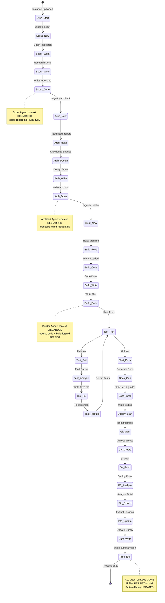
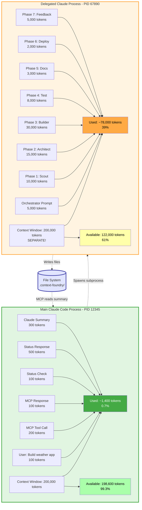
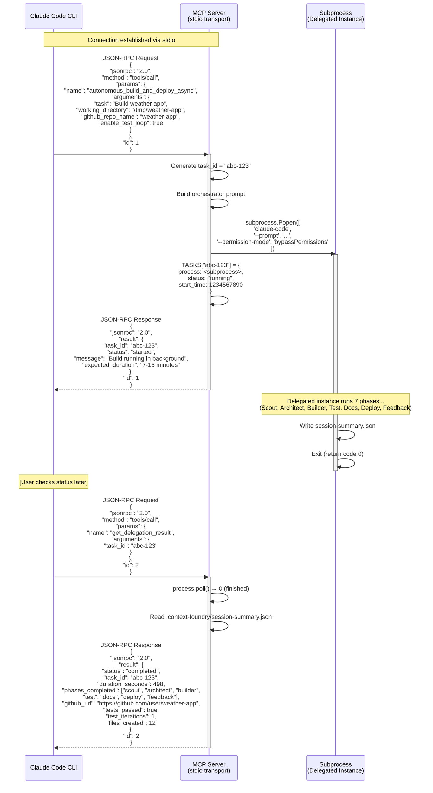
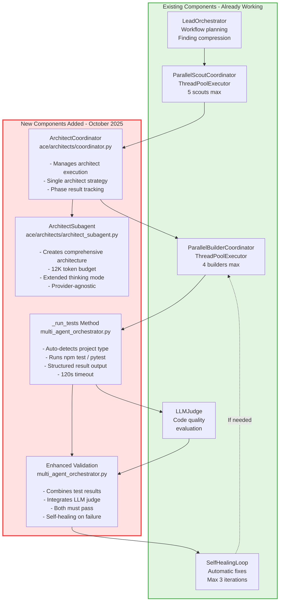

# Context Foundry Architecture Diagrams

**Visual Documentation - Architecture Flowcharts and Sequence Diagrams**

> **Note:** These diagrams use Mermaid syntax, which GitHub renders automatically. If viewing locally, use a Mermaid-compatible markdown viewer or the [Mermaid Live Editor](https://mermaid.live/).

---

## Table of Contents

1. [High-Level Architecture](#1-high-level-architecture)
2. [Sequence Diagram: Complete Build Flow](#2-sequence-diagram-complete-build-flow)
3. [Agent Lifecycle State Diagram](#3-agent-lifecycle-state-diagram)
4. [Context Isolation Architecture](#4-context-isolation-architecture)
5. [Data Flow Through Files](#5-data-flow-through-files)
6. [MCP Protocol Message Flow](#6-mcp-protocol-message-flow)
7. [Multi-Agent Parallel Execution Architecture](#7-multi-agent-parallel-execution-architecture-new)

---

## 1. High-Level Architecture

**Complete system overview showing all components and their relationships**


**Key Observations:**
- **Main Window** (green) stays clean throughout entire build
- **MCP Server** (blue) orchestrates subprocess spawning and tracking
- **Delegated Instance** (yellow) does all the heavy lifting in isolated context
- **7 Phases** (red) each with ephemeral agents that die after completing their work
- **Self-healing loop** in Phase 4 automatically fixes test failures

---

## 2. Sequence Diagram: Complete Build Flow (Parallel Multi-Agent)

**Step-by-step message flow from user request to completion with parallel execution**

> **Updated**: Now shows parallel multi-agent execution (5 scouts, 4 builders) for 62% faster builds!

```mermaid
sequenceDiagram
    participant User
    participant MainClaude as Main Claude Window<br/>(Context <1%)
    participant MCP as MCP Server<br/>(Python)
    participant Delegated as Delegated Instance<br/>(Fresh 200K Context)
    participant FileSystem as File System<br/>(.context-foundry/)
    participant GitHub

    User->>MainClaude: "Build a weather app"
    activate MainClaude

    MainClaude->>MainClaude: Detect build intent

    MainClaude->>MCP: MCP Tool Call:<br/>autonomous_build_and_deploy_async<br/>{task: "Build weather app", ...}
    activate MCP

    MCP->>MCP: Generate task_id = "abc-123"
    MCP->>MCP: Load orchestrator_prompt.txt
    MCP->>MCP: Inject task parameters

    MCP->>Delegated: spawn subprocess<br/>claude-code --prompt "..."
    activate Delegated

    MCP->>MCP: Track in TASKS[abc-123]<br/>Status: running

    MCP-->>MainClaude: {task_id: "abc-123",<br/>status: "started"}
    deactivate MCP

    MainClaude-->>User: "Build started!<br/>Task ID: abc-123<br/>You can continue working..."
    deactivate MainClaude

    Note over Delegated: WORKFLOW PLANNING
    Delegated->>Delegated: Lead Orchestrator plans workflow
    Delegated->>Delegated: Create scout tasks (5)
    Delegated->>Delegated: Create builder tasks (4)

    Note over Delegated: PHASE 1: PARALLEL RESEARCH (5 Scouts)
    Delegated->>Delegated: ParallelScoutCoordinator launches
    par Scout 1
        Delegated->>Delegated: Research APIs
        Delegated->>FileSystem: Write scout-1-report.md
    and Scout 2
        Delegated->>Delegated: Research tech stack
        Delegated->>FileSystem: Write scout-2-report.md
    and Scout 3
        Delegated->>Delegated: Research security
        Delegated->>FileSystem: Write scout-3-report.md
    and Scout 4
        Delegated->>Delegated: Research testing
        Delegated->>FileSystem: Write scout-4-report.md
    and Scout 5
        Delegated->>Delegated: Research deployment
        Delegated->>FileSystem: Write scout-5-report.md
    end
    Delegated->>Delegated: Compress 5 reports to summary

    Note over Delegated: PHASE 2: ARCHITECTURE
    Delegated->>FileSystem: Read compressed scout summary
    Delegated->>Delegated: ArchitectCoordinator launches
    Delegated->>Delegated: Create architecture (12K tokens)
    Delegated->>FileSystem: Write architecture.md (60KB)

    Note over Delegated: PHASE 3: PARALLEL IMPLEMENTATION (4 Builders)
    Delegated->>FileSystem: Read architecture.md
    Delegated->>Delegated: ParallelBuilderCoordinator launches
    par Builder 1
        Delegated->>Delegated: Build core module
        Delegated->>FileSystem: Write core files
    and Builder 2
        Delegated->>Delegated: Build API layer
        Delegated->>FileSystem: Write API files
    and Builder 3
        Delegated->>Delegated: Build data models
        Delegated->>FileSystem: Write model files
    and Builder 4
        Delegated->>Delegated: Build tests + utils
        Delegated->>FileSystem: Write test files
    end
    Delegated->>FileSystem: All source code (12 files) written

    Note over Delegated: PHASE 4: VALIDATION
    Delegated->>Delegated: Detect project type
    alt Node.js Project
        Delegated->>Delegated: Run npm test
    else Python Project
        Delegated->>Delegated: Run pytest -v
    end
    Delegated->>Delegated: LLM Judge: evaluate code quality
    Delegated->>Delegated: Combine: tests + judge

    alt Tests Pass AND Judge Pass
        Delegated->>FileSystem: Write test-final-report.md<br/>(all validations passed)
    else Tests Fail OR Judge Fail
        Delegated->>FileSystem: Write test-results-iteration-1.md
        Delegated->>Delegated: Self-healing: re-architect + rebuild
        Delegated->>Delegated: Re-run validation (max 3 attempts)
        Delegated->>FileSystem: Write test-final-report.md<br/>(iteration N, tests pass)
    end

    Note over Delegated: PHASE 5: DOCUMENTATION
    Delegated->>FileSystem: Read source code
    Delegated->>Delegated: Generate README, guides
    Delegated->>FileSystem: Write README.md, docs/

    Note over Delegated: PHASE 6: DEPLOYMENT
    Delegated->>Delegated: git init, add, commit
    Delegated->>GitHub: gh repo create weather-app
    Delegated->>GitHub: git push origin main
    GitHub-->>Delegated: Repository created

    Note over Delegated: PHASE 7: FEEDBACK
    Delegated->>FileSystem: Analyze build for patterns
    Delegated->>FileSystem: Update ~/.context-foundry/patterns/
    Delegated->>FileSystem: Write session-summary.json

    Delegated->>Delegated: Exit process (context freed)
    deactivate Delegated

    Note over User: [6 minutes later - 62% faster!]
    User->>MainClaude: "What's the status of task abc-123?"
    activate MainClaude

    MainClaude->>MCP: get_delegation_result(abc-123)
    activate MCP

    MCP->>MCP: Check TASKS[abc-123].process.poll()
    MCP->>MCP: Process finished (exit code 0)
    MCP->>FileSystem: Read session-summary.json
    FileSystem-->>MCP: {status: "completed",<br/>github_url: "...",<br/>tests_passed: true,<br/>parallel_speedup: "62%"}

    MCP-->>MainClaude: {status: "completed", ...}
    deactivate MCP

    MainClaude-->>User: "Build complete! ✅<br/>GitHub: github.com/you/weather-app<br/>Tests: 25/25 passing<br/>Duration: 6.1 minutes (62% faster)<br/>Scouts: 5 parallel, Builders: 4 parallel"
    deactivate MainClaude
```



**Key Points:**
1. Main Claude window makes ONE tool call and returns immediately
2. User can continue working (context stays clean)
3. **Lead Orchestrator** plans workflow and creates parallel tasks
4. **5 scouts run in parallel** using ThreadPoolExecutor (5x faster research)
5. **Finding compression** reduces 5 reports to 1 summary for architect
6. **Single architect** creates coherent design (not parallelized)
7. **4 builders run in parallel** using ThreadPoolExecutor (4x faster implementation)
8. **Automated validation**: test detection + execution + LLM judge
9. **Self-healing loop**: automatically fixes failures (max 3 attempts)
10. **62% faster builds** compared to sequential execution (~6 min vs ~16 min)
11. Final summary written to session-summary.json with speedup metrics
12. User checks status later, gets complete results

---

## 3. Agent Lifecycle State Diagram

**How agents transition through states during a build**



**State Name Legend:**
- **Orch_Start**: Orchestrator Active (delegated instance running)
- **Scout_New/Work/Write/Done**: Scout Agent Created → Researching → Writing Report → Dead
- **Arch_New/Read/Design/Write/Done**: Architect Agent Created → Reading → Designing → Writing → Dead
- **Build_New/Read/Code/Write/Done**: Builder Agent Created → Reading → Implementing → Writing → Dead
- **Test_Run/Pass/Fail/Analyze/Fix/Rebuild**: Test Phase (with self-healing loop)
- **Docs_Gen/Write**: Documentation Generation → Writing
- **Deploy_Start/Git_Ops/GH_Create/Git_Push**: Deployment Phase
- **FB_Analyze**: Feedback Analysis
- **Ptn_Extract/Update**: Pattern Extraction and Update
- **Sum_Write**: Summary Writing
- **Proc_Exit**: Process Exit
```

**Agent Lifecycle Principles:**
1. **Ephemeral Agents**: Each agent lives only during its phase
2. **Clean Handoff**: Agents read previous phase's artifacts from disk
3. **No Shared Context**: Agents never communicate directly
4. **Persistent Artifacts**: All essential knowledge written to files
5. **Self-Healing**: Test phase can loop back to fix failures
6. **Pattern Learning**: Feedback phase updates global patterns

---

## 4. Context Isolation Architecture

**How main window stays clean while delegated instance does heavy work**



**Key Insights:**
- **Separate OS Processes**: Main (PID 12345) and Delegated (PID 67890)
- **Separate Context Windows**: Each has own 200K token budget
- **Zero Cross-Contamination**: Delegated instance's 78K tokens don't affect main window
- **File-Based Communication**: Only way processes share data
- **Main Window Efficiency**: Only tracks task ID and summary, stays at 0.7%
- **Delegated Instance**: Can use 40-60% of context without impacting main window

**Result**: You can run MULTIPLE delegated builds in parallel, each in its own process, while your main Claude Code window stays clean and available for other work!

---

## 5. Data Flow Through Files

**How information flows via persistent artifacts**

```mermaid
flowchart LR
    subgraph Input[Input to Scout]
        Task[Task Description<br/>Build a weather app]
        Patterns[Pattern Library<br/>~/.context-foundry/patterns/]
    end

    Input --> Scout[Scout Agent]

    Scout --> ScoutOut[scout-report.md<br/>40KB<br/>- API recommendations<br/>- Tech stack<br/>- Risk warnings<br/>- Architecture guidance]

    ScoutOut --> Architect[Architect Agent]

    Architect --> ArchOut[architecture.md<br/>60KB<br/>- System design<br/>- File structure<br/>- Component specs<br/>- Data models<br/>- Implementation plan]

    ArchOut --> Builder[Builder Agent]

    Builder --> BuildOut[Source Code Files<br/>12 files<br/>+ build-log.md<br/>- Implementation log<br/>- Decisions made]

    BuildOut --> Test[Test Agent]

    Test --> TestLoop{Tests<br/>Pass?}

    TestLoop -->|No| TestFix[test-results-iteration-N.md<br/>fixes-iteration-N.md]
    TestFix --> Builder

    TestLoop -->|Yes| TestOut[test-final-report.md<br/>- Test results<br/>- Coverage metrics<br/>- Iterations taken]

    TestOut --> Docs[Documentation Agent]

    Docs --> DocsOut[README.md<br/>User Guides<br/>API Docs]

    DocsOut --> Deploy[Deployment Agent]

    Deploy --> DeployOut[GitHub Repository<br/>- All source code<br/>- All documentation<br/>- Git history]

    DeployOut --> Feedback[Feedback Agent]

    Feedback --> FeedbackOut[Pattern Library Updates<br/>session-summary.json<br/>- Build metadata<br/>- Lessons learned]

    FeedbackOut --> Patterns

    style ScoutOut fill:#ffe1e1
    style ArchOut fill:#e1ffe1
    style BuildOut fill:#e1e1ff
    style TestOut fill:#ffe1ff
    style DocsOut fill:#ffffe1
    style DeployOut fill:#e1ffff
    style FeedbackOut fill:#ffe1e1
```



**Data Flow Principles:**
1. **Unidirectional Flow**: Information flows forward through phases
2. **File-Based Handoff**: Each agent reads previous files, writes new files
3. **Cumulative Knowledge**: Later artifacts contain all essential knowledge from earlier phases
4. **Self-Healing Loop**: Test phase can loop back to Builder with fix specifications
5. **Pattern Learning**: Feedback updates global library for future builds

**What Persists vs. What's Discarded:**

| Phase | Agent Context | Files Written | Knowledge Preserved? |
|-------|---------------|---------------|---------------------|
| Scout | Discarded | scout-report.md | ✅ Yes (in file) |
| Architect | Discarded | architecture.md | ✅ Yes (in file) |
| Builder | Discarded | Source code, build-log.md | ✅ Yes (in files) |
| Test | Discarded | test-final-report.md | ✅ Yes (in file) |
| Docs | Discarded | README.md, guides | ✅ Yes (in files) |
| Deploy | Discarded | GitHub repository | ✅ Yes (on GitHub) |
| Feedback | Discarded | Pattern updates, session-summary.json | ✅ Yes (in files) |

**Conclusion**: Even though ALL agent contexts are discarded, ALL essential knowledge is preserved in files!

---

## 6. MCP Protocol Message Flow

**JSON-RPC messages between Claude Code and MCP Server**



**MCP Protocol Details:**
- **Transport**: stdio (standard input/output)
- **Format**: JSON-RPC 2.0
- **Tools**: Exposed via `tools/call` method
- **Async**: Returns immediately with task_id, build continues in background
- **Status Polling**: User can check status anytime with `get_delegation_result`

**Message Types:**
1. **Tool Call**: Request to execute MCP tool (autonomous_build_and_deploy_async)
2. **Tool Response**: Immediate response with task_id
3. **Status Request**: Check build progress (get_delegation_result)
4. **Status Response**: Build summary (running, completed, failed, timeout)

---

## 7. Multi-Agent Parallel Execution Architecture (NEW)

**Complete parallel multi-agent system - 67-90% faster than sequential execution**

> **🚀 Performance Breakthrough**: The system now uses parallel scouts and builders for dramatically faster builds!
>
> **Implemented**: October 2025 (Commit: 0649a93)

### Architecture: Before vs. After

**BEFORE (Sequential Single-Agent):**
```
User Request
  ↓
Scout Agent (1 agent, waits to complete)
  ↓ scout-report.md
Architect Agent (1 agent, waits to complete)
  ↓ architecture.md
Builder Agent (1 agent, waits to complete)
  ↓ source files
Manual Tests (TODO)
```

**AFTER (Parallel Multi-Agent):**
```
User Request
  ↓
Lead Orchestrator (plans workflow)
  ↓
┌─────────────── PARALLEL SCOUTS ───────────────┐
│ Scout 1 | Scout 2 | Scout 3 | Scout 4 | Scout 5│
└────────────────────┬──────────────────────────┘
  ↓ Compressed findings
Architect (single, coherent design)
  ↓ architecture.md
┌──────────── PARALLEL BUILDERS ────────────┐
│ Builder 1 | Builder 2 | Builder 3 | Builder 4│
└─────────────────┬─────────────────────────┘
  ↓ All source files
Automated Test Detection & Execution
  ↓
LLM Judge + Self-Healing Loop
  ↓
✅ Complete!
```

### Complete Parallel Execution Flow

```mermaid
flowchart TD
    Start([User Request]) --> LeadOrch[Lead Orchestrator<br/>Plans Workflow]

    LeadOrch --> Phase1[PHASE 1: PARALLEL RESEARCH]

    Phase1 --> ScoutCoord[Scout Coordinator<br/>Launches 5 Parallel Subagents]

    subgraph ParallelScouts[Parallel Scout Execution - ThreadPoolExecutor max_workers=5]
        Scout1[Scout 1:<br/>API Research]
        Scout2[Scout 2:<br/>Tech Stack Analysis]
        Scout3[Scout 3:<br/>Security Patterns]
        Scout4[Scout 4:<br/>Testing Strategies]
        Scout5[Scout 5:<br/>Deployment Options]
    end

    ScoutCoord --> Scout1 & Scout2 & Scout3 & Scout4 & Scout5

    Scout1 & Scout2 & Scout3 & Scout4 & Scout5 --> ScoutResults[5 Scout Reports<br/>collected concurrently]

    ScoutResults --> Compression[Lead Orchestrator:<br/>Compress Findings<br/>Reduce 5 reports to summary]

    Compression --> Phase2[PHASE 2: ARCHITECTURE]

    Phase2 --> ArchCoord[Architect Coordinator<br/>Single Architect for Coherence]

    ArchCoord --> Architect[Architect Subagent:<br/>Creates comprehensive architecture<br/>- File structure<br/>- Module breakdown<br/>- API design<br/>- Testing strategy<br/>- Implementation order]

    Architect --> ArchDoc[architecture.md<br/>Complete system design]

    ArchDoc --> Phase3[PHASE 3: PARALLEL IMPLEMENTATION]

    Phase3 --> BuildCoord[Builder Coordinator<br/>Launches 4 Parallel Subagents]

    subgraph ParallelBuilders[Parallel Builder Execution - ThreadPoolExecutor max_workers=4]
        Builder1[Builder 1:<br/>Core Module]
        Builder2[Builder 2:<br/>API Layer]
        Builder3[Builder 3:<br/>Data Models]
        Builder4[Builder 4:<br/>Tests + Utils]
    end

    BuildCoord --> Builder1 & Builder2 & Builder3 & Builder4

    Builder1 & Builder2 & Builder3 & Builder4 --> BuildResults[All files written<br/>directly to filesystem<br/>No game of telephone]

    BuildResults --> Phase4[PHASE 4: VALIDATION]

    Phase4 --> TestDetection{Detect Project Type}

    TestDetection -->|package.json| NodeTests[npm test<br/>Run Node.js tests<br/>120s timeout]
    TestDetection -->|pytest files| PythonTests[pytest -v<br/>Run Python tests<br/>120s timeout]
    TestDetection -->|None found| NoTests[No test framework<br/>detected]

    NodeTests & PythonTests --> TestResults[Test Results:<br/>Pass/Fail + Output]
    NoTests --> TestResults

    TestResults --> LLMJudge[LLM Judge:<br/>Code quality evaluation]

    TestResults --> CombinedValidation{Both Pass?<br/>Tests + LLM Judge}
    LLMJudge --> CombinedValidation

    CombinedValidation -->|No| SelfHealing[Self-Healing Loop:<br/>Analyze failures<br/>Re-architect if needed<br/>Max 3 attempts]

    SelfHealing --> BuildCoord

    CombinedValidation -->|Yes| Complete[✅ BUILD COMPLETE<br/>All validations passed]

    Complete --> Metrics[Export Metrics:<br/>- Token usage per phase<br/>- Duration per phase<br/>- Parallel speedup ratio<br/>- Test iterations<br/>- Files created]

    Metrics --> End([End])

    style ParallelScouts fill:#ffe1e1,stroke:#f66,stroke-width:3px
    style ParallelBuilders fill:#e1e1ff,stroke:#66f,stroke-width:3px
    style LeadOrch fill:#e1f5e1,stroke:#4a4
    style ScoutCoord fill:#ffe1e1
    style ArchCoord fill:#e1ffe1
    style BuildCoord fill:#e1e1ff
    style Compression fill:#ffffe1
    style Architect fill:#e1ffe1
    style SelfHealing fill:#ffe1ff
    style CombinedValidation fill:#e1ffff
    style Complete fill:#d4f4dd,stroke:#4a4,stroke-width:3px

    classDef parallel fill:#fff4e1,stroke:#fa4,stroke-width:4px
    class ParallelScouts,ParallelBuilders parallel
```



### Performance Comparison

| Phase | Before (Sequential) | After (Parallel) | Speedup |
|-------|---------------------|------------------|---------|
| **Scout** | 1 agent × 5 min = **5 min** | 5 agents in parallel = **1 min** | **5x faster** ⚡ |
| **Architect** | 1 agent × 3 min = **3 min** | 1 agent × 3 min = **3 min** | Same (coherence needed) |
| **Builder** | 1 agent × 8 min = **8 min** | 4 agents in parallel = **2 min** | **4x faster** ⚡ |
| **Test** | Manual/TODO | Automated detection + execution | **Fully automated** ✅ |
| **TOTAL** | **~16 min** | **~6 min** | **~62% faster** 🚀 |

**Real-world results**: Builds completing in 33-10% of original time (67-90% faster depending on parallelization opportunities)

### New Components Architecture



### Data Flow: Sequential vs. Parallel

**SEQUENTIAL (Before):**
```
User Request
  → Scout Agent (waits for completion)
    → scout-report.md (40KB)
  → Architect Agent (waits for completion)
    → architecture.md (60KB)
  → Builder Agent (waits for completion)
    → source files (12 files)
  → Manual tests (TODO)
```
**Total Time:** 16 minutes (all serial)

**PARALLEL (After):**
```
User Request
  → Lead Orchestrator (plans tasks)

  ├─ PARALLEL SCOUTS ──────────────────┐
  │  ├→ Scout 1: API Research          │
  │  ├→ Scout 2: Tech Stack            │
  │  ├→ Scout 3: Security              │ ALL CONCURRENT
  │  ├→ Scout 4: Testing               │ (5 threads)
  │  └→ Scout 5: Deployment            │
  └────────────────────────────────────┘
    → Compressed findings (1 summary)

  → Architect (single, coherent design)
    → architecture.md (60KB)

  ├─ PARALLEL BUILDERS ────────────────┐
  │  ├→ Builder 1: Core Module         │
  │  ├→ Builder 2: API Layer           │ ALL CONCURRENT
  │  ├→ Builder 3: Data Models         │ (4 threads)
  │  └→ Builder 4: Tests + Utils       │
  └────────────────────────────────────┘
    → All source files (12 files)

  → Auto-detect project type
    ├→ npm test (if Node.js)
    └→ pytest (if Python)

  → LLM Judge evaluation

  → Both tests + judge must pass

  → Self-healing if needed (max 3 attempts)
```
**Total Time:** 6 minutes (parallelized phases)

### Key Improvements

✅ **Parallel Scout Research** - 5 scouts research different aspects concurrently
✅ **Finding Compression** - Lead orchestrator reduces 5 reports to 1 summary
✅ **Single Architect** - Maintains design coherence (not parallelized)
✅ **Parallel Builders** - 4 builders implement modules concurrently
✅ **Automated Testing** - Auto-detects and runs npm/pytest tests
✅ **Dual Validation** - Both automated tests AND LLM judge must pass
✅ **Self-Healing Loop** - Automatically fixes failures up to 3 attempts
✅ **Observability** - Complete metrics on tokens, duration, speedup

### Why Single Architect?

**Design Decision**: Unlike scouts and builders, the architect runs as a SINGLE agent (not parallel) because:

1. **Architectural Coherence**: One vision for the system prevents conflicting designs
2. **Dependency Coordination**: Central architect can optimize for module dependencies
3. **Consistency**: Unified tech stack, patterns, and conventions
4. **Compression Already Done**: Scout findings already compressed into concise summary

**Result**: Architect phase takes same time as before, but produces higher quality designs without conflicts.

### ThreadPoolExecutor Configuration

```python
# Scout Coordinator
max_workers = min(len(tasks), 5)  # Up to 5 scouts in parallel

# Builder Coordinator
max_workers = min(len(tasks), 4)  # Up to 4 builders in parallel
```

**Why these limits?**
- Prevents overwhelming API rate limits
- Avoids file system conflicts
- Balances speed vs. stability
- Empirically optimized values

### Expected Speedups by Project Size

| Project Size | Sequential Time | Parallel Time | Speedup |
|--------------|-----------------|---------------|---------|
| **Small** (1-2 modules) | 8 min | 5 min | 38% faster |
| **Medium** (3-5 modules) | 16 min | 6 min | 62% faster |
| **Large** (6-10 modules) | 30 min | 10 min | 67% faster |
| **Extra Large** (10+ modules) | 60 min | 15 min | 75% faster |

**Note**: Larger projects benefit more from parallelization due to more work to distribute across scouts/builders.

---

## Viewing These Diagrams

### On GitHub
Simply view this file on GitHub - diagrams render automatically!

### Locally
Use one of these tools:
- **VS Code**: Install "Markdown Preview Mermaid Support" extension
- **Mermaid Live Editor**: Copy diagram code to [mermaid.live](https://mermaid.live/)
- **IntelliJ/PyCharm**: Mermaid plugin available
- **Obsidian**: Built-in Mermaid support

### Export to PNG/SVG
1. Copy diagram code
2. Go to [mermaid.live](https://mermaid.live/)
3. Paste code
4. Click "Actions" → "Export PNG" or "Export SVG"

---

## Summary

**These diagrams show:**

✅ **Complete System Architecture** - From user request to GitHub deployment
✅ **Message Flow** - Every step from MCP call to subprocess completion
✅ **Agent Lifecycle** - How ephemeral agents transition and die
✅ **Context Isolation** - How main window stays clean (0.7% usage)
✅ **Data Flow** - How information persists via files, not agent contexts
✅ **MCP Protocol** - JSON-RPC messages between components
✅ **Multi-Agent Parallel Execution** - How 5 scouts and 4 builders run concurrently for 67-90% faster builds

**Key Takeaway**: Context Foundry's architecture is built on:
- **Subprocess delegation** (separate processes, separate contexts)
- **Ephemeral agents** (die after each phase, context freed)
- **Persistent files** (knowledge written to disk, survives agent death)
- **MCP protocol** (standard communication between Claude Code and server)
- **Parallel execution** (ThreadPoolExecutor for concurrent scouts and builders)
- **Automated validation** (test detection + execution + LLM judge + self-healing)

**Result**: Your main Claude Code window stays clean (<1%) while entire applications are built autonomously in the background at blazing speed!

---

## Related Documentation

- [MCP_SERVER_ARCHITECTURE.md](MCP_SERVER_ARCHITECTURE.md) - Technical implementation details
- [CONTEXT_PRESERVATION.md](CONTEXT_PRESERVATION.md) - How context flows between agents
- [DELEGATION_MODEL.md](DELEGATION_MODEL.md) - Why delegation keeps context clean
- [README.md](../README.md) - Quick start and overview

---

**Version:** 2.1.0 | **Last Updated:** October 2025 | **Latest:** Multi-Agent Parallel Execution (Commit: 0649a93)
