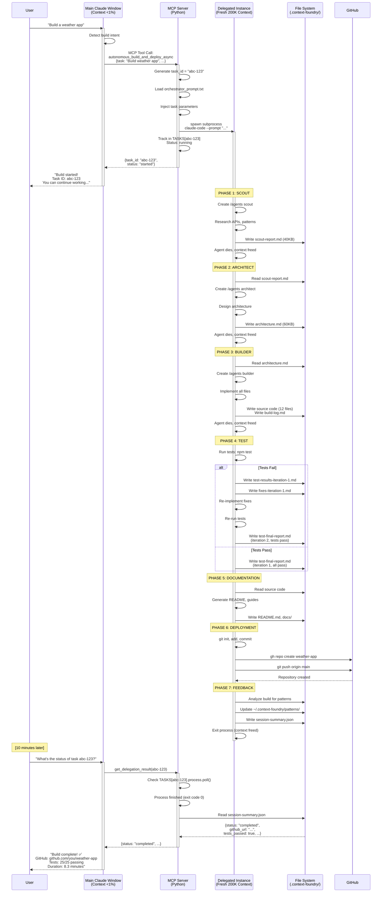
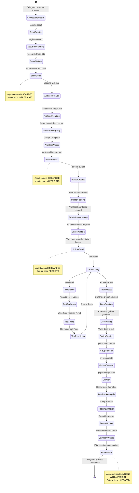
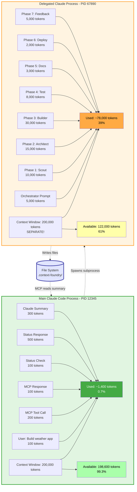
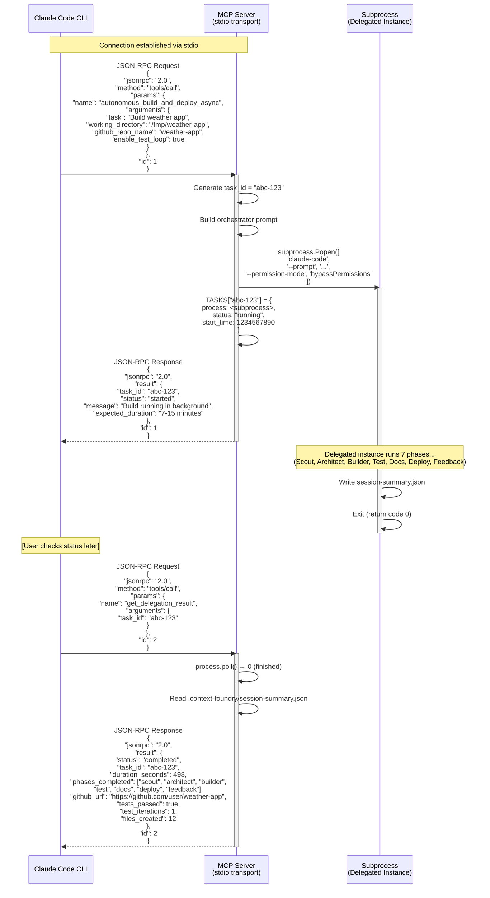

# Context Foundry Architecture Diagrams

**Visual Documentation - Architecture Flowcharts and Sequence Diagrams**

> **Note:** These diagrams use Mermaid syntax, which GitHub renders automatically. If viewing locally, use a Mermaid-compatible markdown viewer or the [Mermaid Live Editor](https://mermaid.live/).

---

## Table of Contents

1. [High-Level Architecture](#1-high-level-architecture)
2. [Sequence Diagram: Complete Build Flow](#2-sequence-diagram-complete-build-flow)
3. [Agent Lifecycle State Diagram](#3-agent-lifecycle-state-diagram)
4. [Context Isolation Architecture](#4-context-isolation-architecture)
5. [Data Flow Through Files](#5-data-flow-through-files)
6. [MCP Protocol Message Flow](#6-mcp-protocol-message-flow)

---

## 1. High-Level Architecture

**Complete system overview showing all components and their relationships**

```mermaid
flowchart TD
    Start([User Request]) --> MainWindow[Main Claude Code Window<br/>Context: <1%]

    MainWindow --> IntentDetection{Build Intent<br/>Detected?}

    IntentDetection -->|No| RegularTask[Regular Claude Code Task]
    IntentDetection -->|Yes| MCPCall[Call MCP Tool:<br/>autonomous_build_and_deploy_async]

    MCPCall --> MCPServer[MCP Server<br/>tools/mcp_server.py]

    MCPServer --> GenerateTaskID[Generate Task ID<br/>UUID]
    GenerateTaskID --> BuildPrompt[Build Orchestrator Prompt<br/>tools/orchestrator_prompt.txt]
    BuildPrompt --> SpawnProcess[Spawn Subprocess:<br/>claude-code --prompt ...]

    SpawnProcess --> TaskTracking[Track in TASKS dict<br/>Status: running]
    TaskTracking --> ReturnTaskID[Return Task ID to<br/>Main Window]

    ReturnTaskID --> MainWindow
    MainWindow --> UserContinues[User Continues Working<br/>Context Still <1%]

    SpawnProcess --> DelegatedInstance[Delegated Claude Code Instance<br/>Separate Process<br/>Fresh 200K Context]

    DelegatedInstance --> Phase1[Phase 1: Scout Agent<br/>Research & Analysis]
    Phase1 --> ScoutReport[Write:<br/>.context-foundry/scout-report.md]
    ScoutReport --> Phase1End[Agent Dies<br/>Context Freed]

    Phase1End --> Phase2[Phase 2: Architect Agent<br/>Read scout-report.md<br/>Design Architecture]
    Phase2 --> ArchReport[Write:<br/>.context-foundry/architecture.md]
    ArchReport --> Phase2End[Agent Dies<br/>Context Freed]

    Phase2End --> Phase3[Phase 3: Builder Agent<br/>Read architecture.md<br/>Implement Code]
    Phase3 --> CodeFiles[Write:<br/>Source code files<br/>Tests<br/>build-log.md]
    CodeFiles --> Phase3End[Agent Dies<br/>Context Freed]

    Phase3End --> Phase4{Phase 4: Test Agent<br/>Run Tests}

    Phase4 -->|Tests Pass| Phase5[Phase 5: Documentation<br/>Generate README, guides]

    Phase4 -->|Tests Fail| TestAnalysis[Analyze Failures<br/>Write test-results-iteration-N.md]
    TestAnalysis --> TestFixes[Write fixes-iteration-N.md<br/>Re-architect if needed]
    TestFixes --> RebuildFixes[Re-implement Fixes]
    RebuildFixes --> TestIteration{Iterations <<br/>Max?}
    TestIteration -->|Yes| Phase5
    TestIteration -->|No| Phase4

    Phase5 --> Docs[Write:<br/>README.md<br/>User guides]
    Docs --> Phase6[Phase 6: Deploy<br/>Git operations]

    Phase6 --> GitCommit[git init<br/>git add .<br/>git commit]
    GitCommit --> GitHubRepo[gh repo create<br/>git push origin main]
    GitHubRepo --> Phase7[Phase 7: Feedback<br/>Extract Patterns]

    Phase7 --> PatternUpdate[Update:<br/>~/.context-foundry/patterns/]
    PatternUpdate --> SessionSummary[Write:<br/>.context-foundry/session-summary.json]

    SessionSummary --> ProcessComplete[Delegated Process Exits<br/>Context Discarded]

    ProcessComplete --> MCPServer
    MCPServer --> ReadSummary[Read session-summary.json]
    ReadSummary --> UpdateTaskStatus[Update TASKS<br/>Status: completed]

    UserContinues --> CheckStatus{User Checks<br/>Status?}
    CheckStatus -->|Yes| GetResult[Call get_delegation_result]
    GetResult --> MCPServer
    UpdateTaskStatus --> ReturnSummary[Return Build Summary]
    ReturnSummary --> MainWindow
    MainWindow --> ShowComplete[Show User:<br/>Build Complete!<br/>GitHub URL<br/>Tests Passed]

    ShowComplete --> End([End])

    style MainWindow fill:#e1f5e1
    style DelegatedInstance fill:#fff4e1
    style MCPServer fill:#e1e5ff
    style Phase1 fill:#ffe1e1
    style Phase2 fill:#ffe1e1
    style Phase3 fill:#ffe1e1
    style Phase4 fill:#ffe1e1
    style Phase5 fill:#ffe1e1
    style Phase6 fill:#ffe1e1
    style Phase7 fill:#ffe1e1
```

**Key Observations:**
- **Main Window** (green) stays clean throughout entire build
- **MCP Server** (blue) orchestrates subprocess spawning and tracking
- **Delegated Instance** (yellow) does all the heavy lifting in isolated context
- **7 Phases** (red) each with ephemeral agents that die after completing their work
- **Self-healing loop** in Phase 4 automatically fixes test failures

---

## 2. Sequence Diagram: Complete Build Flow

**Step-by-step message flow from user request to completion**

**Key Points:**
1. Main Claude window makes ONE tool call and returns immediately
2. User can continue working (context stays clean)
3. Delegated instance does ALL 7 phases autonomously
4. Each phase reads previous artifacts from disk
5. Final summary written to session-summary.json
6. User checks status later, gets complete results

---

## 3. Agent Lifecycle State Diagram

**How agents transition through states during a build**

**Agent Lifecycle Principles:**
1. **Ephemeral Agents**: Each agent lives only during its phase
2. **Clean Handoff**: Agents read previous phase's artifacts from disk
3. **No Shared Context**: Agents never communicate directly
4. **Persistent Artifacts**: All essential knowledge written to files
5. **Self-Healing**: Test phase can loop back to fix failures
6. **Pattern Learning**: Feedback phase updates global patterns

---

## 4. Context Isolation Architecture

**How main window stays clean while delegated instance does heavy work**

**Key Insights:**
- **Separate OS Processes**: Main (PID 12345) and Delegated (PID 67890)
- **Separate Context Windows**: Each has own 200K token budget
- **Zero Cross-Contamination**: Delegated instance's 78K tokens don't affect main window
- **File-Based Communication**: Only way processes share data
- **Main Window Efficiency**: Only tracks task ID and summary, stays at 0.7%
- **Delegated Instance**: Can use 40-60% of context without impacting main window

**Result**: You can run MULTIPLE delegated builds in parallel, each in its own process, while your main Claude Code window stays clean and available for other work!

---

## 5. Data Flow Through Files

**How information flows via persistent artifacts**

```mermaid
flowchart LR
    subgraph Input[Input to Scout]
        Task[Task Description<br/>Build a weather app]
        Patterns[Pattern Library<br/>~/.context-foundry/patterns/]
    end

    Input --> Scout[Scout Agent]

    Scout --> ScoutOut[scout-report.md<br/>40KB<br/>- API recommendations<br/>- Tech stack<br/>- Risk warnings<br/>- Architecture guidance]

    ScoutOut --> Architect[Architect Agent]

    Architect --> ArchOut[architecture.md<br/>60KB<br/>- System design<br/>- File structure<br/>- Component specs<br/>- Data models<br/>- Implementation plan]

    ArchOut --> Builder[Builder Agent]

    Builder --> BuildOut[Source Code Files<br/>12 files<br/>+ build-log.md<br/>- Implementation log<br/>- Decisions made]

    BuildOut --> Test[Test Agent]

    Test --> TestLoop{Tests<br/>Pass?}

    TestLoop -->|No| TestFix[test-results-iteration-N.md<br/>fixes-iteration-N.md]
    TestFix --> Builder

    TestLoop -->|Yes| TestOut[test-final-report.md<br/>- Test results<br/>- Coverage metrics<br/>- Iterations taken]

    TestOut --> Docs[Documentation Agent]

    Docs --> DocsOut[README.md<br/>User Guides<br/>API Docs]

    DocsOut --> Deploy[Deployment Agent]

    Deploy --> DeployOut[GitHub Repository<br/>- All source code<br/>- All documentation<br/>- Git history]

    DeployOut --> Feedback[Feedback Agent]

    Feedback --> FeedbackOut[Pattern Library Updates<br/>session-summary.json<br/>- Build metadata<br/>- Lessons learned]

    FeedbackOut --> Patterns

    style ScoutOut fill:#ffe1e1
    style ArchOut fill:#e1ffe1
    style BuildOut fill:#e1e1ff
    style TestOut fill:#ffe1ff
    style DocsOut fill:#ffffe1
    style DeployOut fill:#e1ffff
    style FeedbackOut fill:#ffe1e1
```

**Data Flow Principles:**
1. **Unidirectional Flow**: Information flows forward through phases
2. **File-Based Handoff**: Each agent reads previous files, writes new files
3. **Cumulative Knowledge**: Later artifacts contain all essential knowledge from earlier phases
4. **Self-Healing Loop**: Test phase can loop back to Builder with fix specifications
5. **Pattern Learning**: Feedback updates global library for future builds

**What Persists vs. What's Discarded:**

| Phase | Agent Context | Files Written | Knowledge Preserved? |
|-------|---------------|---------------|---------------------|
| Scout | Discarded | scout-report.md | ✅ Yes (in file) |
| Architect | Discarded | architecture.md | ✅ Yes (in file) |
| Builder | Discarded | Source code, build-log.md | ✅ Yes (in files) |
| Test | Discarded | test-final-report.md | ✅ Yes (in file) |
| Docs | Discarded | README.md, guides | ✅ Yes (in files) |
| Deploy | Discarded | GitHub repository | ✅ Yes (on GitHub) |
| Feedback | Discarded | Pattern updates, session-summary.json | ✅ Yes (in files) |

**Conclusion**: Even though ALL agent contexts are discarded, ALL essential knowledge is preserved in files!

---

## 6. MCP Protocol Message Flow

**JSON-RPC messages between Claude Code and MCP Server**

**MCP Protocol Details:**
- **Transport**: stdio (standard input/output)
- **Format**: JSON-RPC 2.0
- **Tools**: Exposed via `tools/call` method
- **Async**: Returns immediately with task_id, build continues in background
- **Status Polling**: User can check status anytime with `get_delegation_result`

**Message Types:**
1. **Tool Call**: Request to execute MCP tool (autonomous_build_and_deploy_async)
2. **Tool Response**: Immediate response with task_id
3. **Status Request**: Check build progress (get_delegation_result)
4. **Status Response**: Build summary (running, completed, failed, timeout)

---

## Viewing These Diagrams

### On GitHub
Simply view this file on GitHub - diagrams render automatically!

### Locally
Use one of these tools:
- **VS Code**: Install "Markdown Preview Mermaid Support" extension
- **Mermaid Live Editor**: Copy diagram code to [mermaid.live](https://mermaid.live/)
- **IntelliJ/PyCharm**: Mermaid plugin available
- **Obsidian**: Built-in Mermaid support

### Export to PNG/SVG
1. Copy diagram code
2. Go to [mermaid.live](https://mermaid.live/)
3. Paste code
4. Click "Actions" → "Export PNG" or "Export SVG"

---

## Summary

**These diagrams show:**

✅ **Complete System Architecture** - From user request to GitHub deployment
✅ **Message Flow** - Every step from MCP call to subprocess completion
✅ **Agent Lifecycle** - How ephemeral agents transition and die
✅ **Context Isolation** - How main window stays clean (0.7% usage)
✅ **Data Flow** - How information persists via files, not agent contexts
✅ **MCP Protocol** - JSON-RPC messages between components

**Key Takeaway**: Context Foundry's architecture is built on:
- **Subprocess delegation** (separate processes, separate contexts)
- **Ephemeral agents** (die after each phase, context freed)
- **Persistent files** (knowledge written to disk, survives agent death)
- **MCP protocol** (standard communication between Claude Code and server)

**Result**: Your main Claude Code window stays clean (<1%) while entire applications are built autonomously in the background!

---

## Related Documentation

- [MCP_SERVER_ARCHITECTURE.md](MCP_SERVER_ARCHITECTURE.md) - Technical implementation details
- [CONTEXT_PRESERVATION.md](CONTEXT_PRESERVATION.md) - How context flows between agents
- [DELEGATION_MODEL.md](DELEGATION_MODEL.md) - Why delegation keeps context clean
- [README.md](../README.md) - Quick start and overview

---

**Version:** 2.0.1 | **Last Updated:** October 2025
