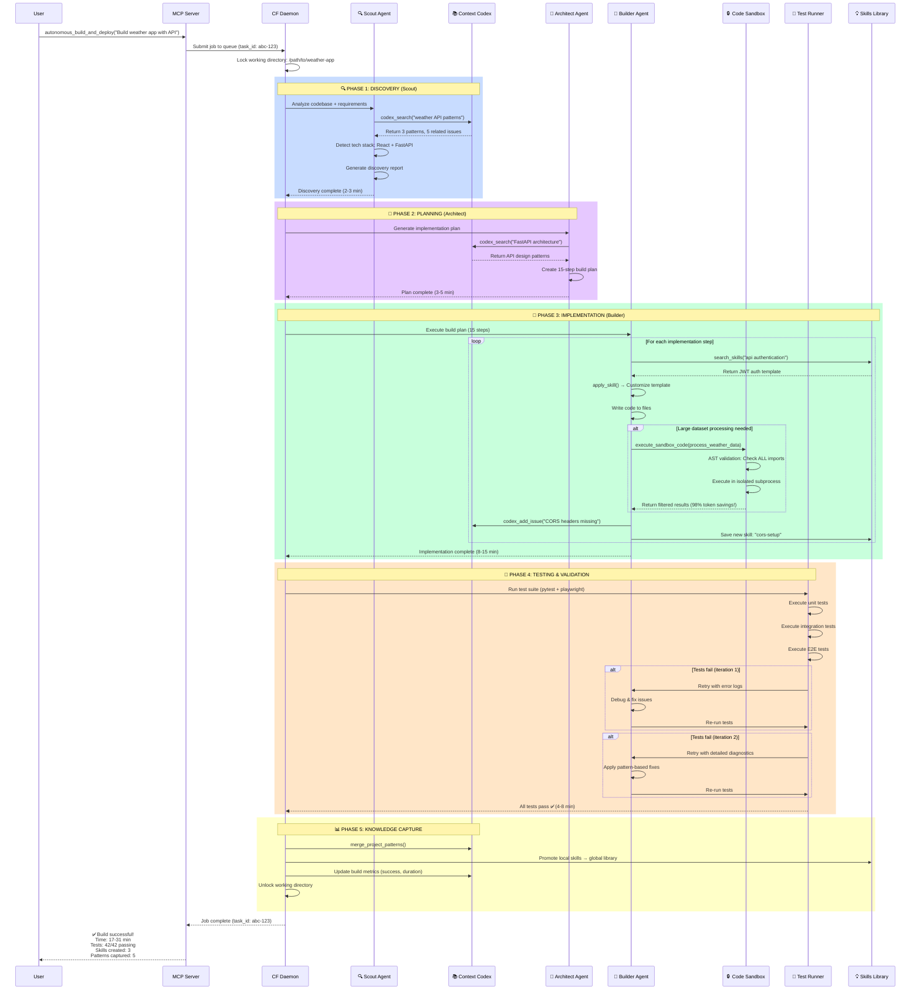

# Context Foundry - Complete System Architecture

> **Comprehensive architecture diagram showing all components, integrations, and data flows**
> **Last Updated**: 2025-11-15 (v2.3.0+ with Code Sandbox, Skills, Glass Pane TUI)

---

## System Overview Diagram

```mermaid
graph TB
    subgraph "🎯 User Interfaces"
        CLI[Claude Code CLI<br/>Primary interface]
        TUI[Glass Pane Dashboard TUI<br/>Real-time monitoring]
        CFD[CF Daemon CLI<br/>Job management]
    end

    subgraph "🔌 MCP Server Layer"
        MCP[MCP Server<br/>tools/mcp_server.py<br/>50+ tools]

        subgraph "Delegation Tools"
            DELEGATE[delegate_to_claude_code<br/>Synchronous delegation]
            DELEGATE_ASYNC[delegate_to_claude_code_async<br/>Parallel builds]
            BUILD[autonomous_build_and_deploy<br/>Full build orchestration]
            CANCEL[cancel_delegation<br/>Stop runaway builds]
        end

        subgraph "Code Sandbox Tools"
            SANDBOX[execute_sandbox_code<br/>🔥 98% token savings<br/>AST-validated execution]
        end

        subgraph "Codex Tools"
            CODEX_SEARCH[codex_search<br/>Knowledge retrieval]
            CODEX_GET[codex_get_entry<br/>Detailed lookup]
            CODEX_ADD_ISSUE[codex_add_issue<br/>Problem capture]
            CODEX_ADD_PATTERN[codex_add_pattern<br/>Solution capture]
            CODEX_STATS[codex_stats<br/>Metrics dashboard]
        end

        subgraph "Pattern Tools"
            PATTERN_READ[read_global_patterns<br/>Cross-project learnings]
            PATTERN_MERGE[merge_project_patterns<br/>Self-improvement]
            PATTERN_SHARE[share_patterns_to_community<br/>GitHub PR automation]
        end

        subgraph "Skills Tools"
            SKILL_SEARCH[search_skills<br/>Template discovery]
            SKILL_APPLY[apply_skill<br/>Code generation]
        end

        subgraph "Progressive Discovery"
            SEARCH_TOOLS[search_tools<br/>On-demand tool lookup]
        end
    end

    subgraph "⚙️ Core Execution Engine"
        DAEMON[CF Daemon<br/>Persistent job queue<br/>Working directory locks]

        subgraph "Build Orchestration (3 Phases)"
            SCOUT[🔍 Scout Agent<br/>Codebase analysis<br/>Tech stack detection]
            ARCHITECT[📐 Architect Agent<br/>Plan generation<br/>Task breakdown]
            BUILDER[🔨 Builder Agent<br/>Implementation<br/>Code writing]
        end

        subgraph "Testing & Validation"
            TESTER[🧪 Test Runner<br/>pytest, playwright<br/>Max 3 retry iterations]
        end

        subgraph "Parallel Execution"
            PARALLEL[Parallel Build System<br/>Dependency-aware tasks<br/>64% faster builds]
            QUEUE[Job Queue Manager<br/>Concurrent project isolation]
        end
    end

    subgraph "📚 Knowledge Systems"
        CODEX[Context Codex<br/>~/.context-foundry/codex/<br/>39 total entries]

        subgraph "Codex Categories"
            C_ISSUES[Issues: 33<br/>Common problems + solutions]
            C_PATTERNS[Patterns: 6<br/>Reusable templates<br/>🆕 Code Sandbox pattern]
            C_LEARNINGS[Scout Learnings<br/>Codebase insights]
            C_METRICS[Build Metrics<br/>Performance data]
        end

        GLOBAL_PATTERNS[Global Pattern Library<br/>~/.context-foundry/patterns/]

        subgraph "Pattern Types"
            P_COMMON[common-issues.json<br/>Cross-project problems]
            P_SCOUT[scout-learnings.json<br/>Discovery patterns]
            P_BUILD[build-metrics.json<br/>Success/failure rates]
            P_ARCH[architecture-patterns.json<br/>Design templates]
            P_TEST[test-patterns.json<br/>Validation strategies]
            P_MCP[mcp-server-patterns.json<br/>🆕 Tool patterns]
        end

        SKILLS[Skills Library<br/>.context-foundry/skills/]

        subgraph "Skill Categories"
            S_AUTH[authentication/<br/>Login, OAuth, JWT]
            S_DB[database/<br/>Migrations, queries]
            S_API[api/<br/>REST, GraphQL]
            S_UTIL[utilities/<br/>Formatters, validators]
            S_TEST[testing/<br/>Fixtures, mocks]
        end
    end

    subgraph "🔒 Security & Optimization"
        SANDBOX_ENGINE[Code Sandbox Engine<br/>tools/sandbox/executor.py<br/>21/21 tests passing]

        subgraph "Multi-Layer Security"
            AST[AST Import Validation<br/>Blocks: import json, numpy<br/>Validates ALL modules]
            SUBPROCESS[Subprocess Isolation<br/>No shared memory<br/>Separate Python process]
            WHITELIST[Whitelist Enforcement<br/>9 safe modules only<br/>json, math, datetime, re...]
            TIMEOUT[Resource Limits<br/>Timeout: 30s<br/>Memory: 512MB<br/>Result: 100KB]
        end

        TOKEN[Token Counter<br/>tools/context_budget/token_counter.py]

        subgraph "Token Measurement"
            TIKTOKEN[tiktoken Integration<br/>Accuracy: <5% error]
            FALLBACK[len/4 Fallback<br/>~75% accurate]
        end
    end

    subgraph "💾 Data Storage"
        PROJECTS[Project Registry<br/>~/.context-foundry/registry.json]
        DAEMON_DB[Daemon State<br/>~/.context-foundry/daemon/<br/>Job persistence]
        LOCAL_SKILLS[Project Skills<br/>.context-foundry/skills/]
        LOCAL_PATTERNS[Project Patterns<br/>.context-foundry/patterns/]
    end

    subgraph "🌐 External Integrations"
        GITHUB[GitHub<br/>Pattern sharing<br/>Automated PRs]
        DOCKER[Docker<br/>Build environments<br/>Container isolation]
        PLAYWRIGHT[Playwright<br/>Browser testing<br/>Visual regression]
    end

    %% User Interface Connections
    CLI --> MCP
    TUI --> DAEMON
    CFD --> DAEMON

    %% MCP Tool Routing
    MCP --> DELEGATE
    MCP --> DELEGATE_ASYNC
    MCP --> BUILD
    MCP --> CANCEL
    MCP --> SANDBOX
    MCP --> CODEX_SEARCH
    MCP --> CODEX_GET
    MCP --> CODEX_ADD_ISSUE
    MCP --> CODEX_ADD_PATTERN
    MCP --> CODEX_STATS
    MCP --> PATTERN_READ
    MCP --> PATTERN_MERGE
    MCP --> PATTERN_SHARE
    MCP --> SKILL_SEARCH
    MCP --> SKILL_APPLY
    MCP --> SEARCH_TOOLS

    %% Delegation Flow
    DELEGATE --> DAEMON
    DELEGATE_ASYNC --> DAEMON
    BUILD --> DAEMON
    CANCEL --> DAEMON

    %% Build Orchestration Flow
    DAEMON --> SCOUT
    SCOUT --> ARCHITECT
    ARCHITECT --> BUILDER
    BUILDER --> TESTER
    TESTER -.Retry on failure.-> BUILDER

    %% Parallel Execution
    DAEMON --> PARALLEL
    PARALLEL --> QUEUE

    %% Sandbox Integration
    SANDBOX --> SANDBOX_ENGINE
    SANDBOX_ENGINE --> AST
    SANDBOX_ENGINE --> SUBPROCESS
    SANDBOX_ENGINE --> WHITELIST
    SANDBOX_ENGINE --> TIMEOUT

    %% Token Counting Integration
    SCOUT --> TOKEN
    ARCHITECT --> TOKEN
    BUILDER --> TOKEN
    SANDBOX --> TOKEN
    TOKEN --> TIKTOKEN
    TOKEN --> FALLBACK

    %% Knowledge Read Paths (Agents consuming knowledge)
    SCOUT --> CODEX
    SCOUT --> GLOBAL_PATTERNS
    SCOUT --> SKILLS
    ARCHITECT --> CODEX
    ARCHITECT --> GLOBAL_PATTERNS
    BUILDER --> SKILLS

    %% Knowledge Write Paths (Agents producing knowledge)
    BUILDER -.Captures issues.-> C_ISSUES
    BUILDER -.Captures patterns.-> LOCAL_PATTERNS
    BUILDER -.Generates skills.-> LOCAL_SKILLS
    TESTER -.Records metrics.-> P_BUILD

    %% Pattern Merging Pipeline
    PATTERN_MERGE --> P_COMMON
    PATTERN_MERGE --> P_SCOUT
    PATTERN_MERGE --> P_BUILD
    LOCAL_PATTERNS -.Auto-merge.-> GLOBAL_PATTERNS

    %% Skills Pipeline
    SKILL_SEARCH --> SKILLS
    SKILL_APPLY --> LOCAL_SKILLS
    LOCAL_SKILLS -.Promote.-> SKILLS

    %% Codex Structure
    CODEX --> C_ISSUES
    CODEX --> C_PATTERNS
    CODEX --> C_LEARNINGS
    CODEX --> C_METRICS

    %% Global Pattern Structure
    GLOBAL_PATTERNS --> P_COMMON
    GLOBAL_PATTERNS --> P_SCOUT
    GLOBAL_PATTERNS --> P_BUILD
    GLOBAL_PATTERNS --> P_ARCH
    GLOBAL_PATTERNS --> P_TEST
    GLOBAL_PATTERNS --> P_MCP

    %% Skills Structure
    SKILLS --> S_AUTH
    SKILLS --> S_DB
    SKILLS --> S_API
    SKILLS --> S_UTIL
    SKILLS --> S_TEST

    %% Data Persistence
    DAEMON --> DAEMON_DB
    DAEMON --> PROJECTS

    %% External Integration Flows
    PATTERN_SHARE --> GITHUB
    BUILDER --> DOCKER
    TESTER --> PLAYWRIGHT

    classDef userInterface fill:#e1f5ff,stroke:#01579b,stroke-width:3px,color:#000
    classDef mcpLayer fill:#fff3e0,stroke:#e65100,stroke-width:3px,color:#000
    classDef coreEngine fill:#f3e5f5,stroke:#4a148c,stroke-width:3px,color:#000
    classDef knowledge fill:#e8f5e9,stroke:#1b5e20,stroke-width:3px,color:#000
    classDef security fill:#ffebee,stroke:#b71c1c,stroke-width:3px,color:#000
    classDef storage fill:#fce4ec,stroke:#880e4f,stroke-width:2px,color:#000
    classDef external fill:#e0f2f1,stroke:#004d40,stroke-width:2px,color:#000

    class CLI,TUI,CFD userInterface
    class MCP,DELEGATE,DELEGATE_ASYNC,BUILD,CANCEL,SANDBOX,CODEX_SEARCH,CODEX_GET,CODEX_ADD_ISSUE,CODEX_ADD_PATTERN,CODEX_STATS,PATTERN_READ,PATTERN_MERGE,PATTERN_SHARE,SKILL_SEARCH,SKILL_APPLY,SEARCH_TOOLS mcpLayer
    class DAEMON,SCOUT,ARCHITECT,BUILDER,TESTER,PARALLEL,QUEUE coreEngine
    class CODEX,C_ISSUES,C_PATTERNS,C_LEARNINGS,C_METRICS,GLOBAL_PATTERNS,P_COMMON,P_SCOUT,P_BUILD,P_ARCH,P_TEST,P_MCP,SKILLS,S_AUTH,S_DB,S_API,S_UTIL,S_TEST knowledge
    class SANDBOX_ENGINE,AST,SUBPROCESS,WHITELIST,TIMEOUT,TOKEN,TIKTOKEN,FALLBACK security
    class PROJECTS,DAEMON_DB,LOCAL_SKILLS,LOCAL_PATTERNS storage
    class GITHUB,DOCKER,PLAYWRIGHT external
```



---

## Detailed Build Workflow Sequence



---

## Code Sandbox: Token Optimization Flow

```mermaid
graph TB
    subgraph "❌ WITHOUT Code Sandbox (Token Bloat)"
        START1[Agent needs to filter<br/>10,000 weather records]
        LOAD1[Load ALL 10K rows<br/>into agent context]
        CONTEXT1[Context Usage:<br/>107,335 tokens<br/>~$0.21 per request]
        FILTER1[Agent manually filters<br/>in next turn]
        RESULT1[Return 5 matching records]
        WASTE[💸 Wasted 107K tokens!]
    end

    subgraph "✅ WITH Code Sandbox (Token Savings)"
        START2[Agent needs to filter<br/>10,000 weather records]
        CODE[Agent writes Python:<br/>filtered = [r for r in data<br/>if r['temp'] > 70]<br/>result = filtered[:5]]

        VALIDATE[🔒 AST Validation<br/>Check ALL imports<br/>json, math ✅<br/>numpy ❌ BLOCKED]

        EXECUTE[⚙️ Subprocess Execution<br/>Isolated process<br/>Timeout: 30s<br/>Memory: 512MB]

        FILTER2[🔍 Process 10K rows<br/>Filter to 5 matches<br/>All in sandbox memory]

        RESULT2[Return only 5 rows<br/>to agent context]

        CONTEXT2[Context Usage:<br/>262 tokens<br/>~$0.0005 per request]

        SAVINGS[🎉 99.8% Token Savings!<br/>107,335 → 262 tokens<br/>Verified via tiktoken]
    end

    subgraph "Security Checks"
        CHECK1[Import Validation<br/>Rejects: import numpy]
        CHECK2[Import Validation<br/>Rejects: import json, os]
        CHECK3[File I/O Block<br/>Rejects: open('/etc/passwd')]
        CHECK4[Timeout Enforcement<br/>Kills after 30 seconds]
    end

    START1 --> LOAD1
    LOAD1 --> CONTEXT1
    CONTEXT1 --> FILTER1
    FILTER1 --> RESULT1
    RESULT1 --> WASTE

    START2 --> CODE
    CODE --> VALIDATE
    VALIDATE --> |Pass| EXECUTE
    VALIDATE --> |Fail| ERROR[❌ SandboxSecurityError:<br/>Import not in whitelist]
    EXECUTE --> FILTER2
    FILTER2 --> RESULT2
    RESULT2 --> CONTEXT2
    CONTEXT2 --> SAVINGS

    VALIDATE -.Security layer 1.-> CHECK1
    VALIDATE -.Security layer 2.-> CHECK2
    EXECUTE -.Security layer 3.-> CHECK3
    EXECUTE -.Security layer 4.-> CHECK4

    classDef bad fill:#ffcdd2,stroke:#c62828,stroke-width:3px,color:#000
    classDef good fill:#c8e6c9,stroke:#2e7d32,stroke-width:3px,color:#000
    classDef sandbox fill:#fff9c4,stroke:#f57f17,stroke-width:2px,color:#000
    classDef security fill:#e1bee7,stroke:#6a1b9a,stroke-width:2px,color:#000

    class START1,LOAD1,CONTEXT1,FILTER1,RESULT1,WASTE bad
    class START2,CODE,VALIDATE,EXECUTE,FILTER2,RESULT2,CONTEXT2,SAVINGS good
    class CHECK1,CHECK2,CHECK3,CHECK4 security
```

**Real Test Results** (from `tests/test_sandbox_integration.py`):
- **Test 1**: 107,335 → 262 tokens (99.8% reduction)
- **Test 2**: 53,014 → 63 tokens (99.9% reduction)
- **Test 3**: 219,002 → 4,385 tokens (98.0% reduction)

---

## Skills Development Lifecycle

```mermaid
stateDiagram-v2
    [*] --> AgentEncounters: Build task assigned

    AgentEncounters --> SearchSkills: 1. Search for existing solution

    SearchSkills --> SkillFound: ✅ Match found
    SearchSkills --> NoSkill: ❌ No match

    SkillFound --> ApplyTemplate: 2a. Use skill template
    ApplyTemplate --> Customize: 3a. Adapt to context
    Customize --> TestCode: 4. Validate implementation

    NoSkill --> ImplementFromScratch: 2b. Write new code
    ImplementFromScratch --> TestCode

    TestCode --> Success: ✅ Code works
    TestCode --> Debug: ❌ Bugs found
    Debug --> TestCode: Fix & retry

    Success --> CaptureSkill: 5. Extract reusable pattern

    CaptureSkill --> LocalSkills: 6. Save to .context-foundry/skills/
    LocalSkills --> Verified: 7. Tested in current project

    Verified --> PromoteToGlobal: 8. User approval
    PromoteToGlobal --> GlobalSkills: 9. ~/.context-foundry/skills/

    GlobalSkills --> AvailableForReuse: 10. Searchable by all agents
    AvailableForReuse --> SearchSkills: Future builds benefit

    Success --> [*]: Task complete

    note right of AgentEncounters
        <b>Example Tasks:</b>
        • User authentication
        • Database migrations
        • API integration
        • Form validation
        • File uploads
    end note

    note right of GlobalSkills
        <b>Skill Categories:</b>
        • authentication/
          ├── jwt-auth.skill.md
          ├── oauth2.skill.md
        • database/
          ├── prisma-migration.skill.md
          ├── seed-data.skill.md
        • api/
          ├── rest-endpoint.skill.md
          ├── graphql-resolver.skill.md
        • utilities/
          ├── date-formatter.skill.md
        • testing/
          ├── mock-api.skill.md
    end note

    note left of Success
        <b>Criteria for Skill Creation:</b>
        ✅ Reusable across projects
        ✅ Well-tested pattern
        ✅ Clear input/output contract
        ✅ Documented edge cases
    end note
```



---

## Pattern Merging & Self-Improvement

```mermaid
graph TB
    subgraph "🏗️ Project A: Weather App"
        BUILD_A[Build Complete<br/>Python + FastAPI]
        PATTERNS_A[<b>Local Patterns Captured:</b><br/>• Docker volume persists old config<br/>• CORS headers missing<br/>• Pytest fixtures cleanup]
    end

    subgraph "🎮 Project B: Game Server"
        BUILD_B[Build Complete<br/>Node.js + Express]
        PATTERNS_B[<b>Local Patterns Captured:</b><br/>• Docker volume persists old config<br/>• WebSocket connection drops<br/>• TypeScript path aliases]
    end

    subgraph "📱 Project C: Mobile App"
        BUILD_C[Build Complete<br/>React Native]
        PATTERNS_C[<b>Local Patterns Captured:</b><br/>• ESLint configuration<br/>• Metro bundler cache issues<br/>• iOS build fails on CI]
    end

    subgraph "🔄 Pattern Merge System"
        MERGE[<b>merge_project_patterns()</b><br/>Intelligent aggregation]

        DEDUP[<b>Deduplication Logic:</b><br/>Same issue detected<br/>→ Increment frequency<br/>→ Update last_seen<br/>→ Merge project_types]

        SEVERITY[<b>Severity Selection:</b><br/>Keep highest severity<br/>Union of solutions<br/>Track affected versions]
    end

    subgraph "🌐 Global Pattern Library"
        GLOBAL[~/.context-foundry/patterns/<br/>common-issues.json]

        ENTRY1[<b>Docker volume persists old config</b><br/>Frequency: 2 ⬆️<br/>Severity: MEDIUM<br/>Projects: [python, nodejs]<br/>Solution: docker-compose down -v]

        ENTRY2[<b>CORS headers missing</b><br/>Frequency: 1<br/>Severity: LOW<br/>Projects: [python]<br/>Solution: Add CORS middleware]

        ENTRY3[<b>WebSocket connection drops</b><br/>Frequency: 1<br/>Severity: HIGH<br/>Projects: [nodejs]<br/>Solution: Implement heartbeat ping]
    end

    subgraph "🔮 Future Builds Benefit"
        SCOUT_D[<b>Scout Agent</b><br/>New Django project]
        PREVENT[<b>Proactive Prevention:</b><br/>"🔍 Docker volume issue common (2 projects)<br/>📋 Recommendation: Use named volumes<br/>✅ Solution: docker-compose down -v before rebuild"]
    end

    BUILD_A --> PATTERNS_A
    BUILD_B --> PATTERNS_B
    BUILD_C --> PATTERNS_C

    PATTERNS_A --> MERGE
    PATTERNS_B --> MERGE
    PATTERNS_C --> MERGE

    MERGE --> DEDUP
    DEDUP --> SEVERITY
    SEVERITY --> GLOBAL

    GLOBAL --> ENTRY1
    GLOBAL --> ENTRY2
    GLOBAL --> ENTRY3

    SCOUT_D --> GLOBAL
    GLOBAL --> PREVENT

    classDef project fill:#e3f2fd,stroke:#1565c0,stroke-width:2px,color:#000
    classDef merge fill:#fff3e0,stroke:#e65100,stroke-width:2px,color:#000
    classDef global fill:#e8f5e9,stroke:#2e7d32,stroke-width:2px,color:#000
    classDef future fill:#f3e5f5,stroke:#6a1b9a,stroke-width:2px,color:#000

    class BUILD_A,BUILD_B,BUILD_C,PATTERNS_A,PATTERNS_B,PATTERNS_C project
    class MERGE,DEDUP,SEVERITY merge
    class GLOBAL,ENTRY1,ENTRY2,ENTRY3 global
    class SCOUT_D,PREVENT future
```

---

## Parallel Build System Performance

```mermaid
gantt
    title Parallel vs Sequential Build Performance
    dateFormat HH:mm
    axisFormat %H:%M

    section Sequential (Traditional)
    Project A (all phases)  :crit, seq_a, 00:00, 20m
    Project B (all phases)  :crit, seq_b, 00:20, 18m
    Project C (all phases)  :crit, seq_c, 00:38, 17m
    Total Sequential        :milestone, 00:55

    section Parallel (Context Foundry)
    Scout A                 :done, pa1, 00:00, 2m
    Scout B                 :done, pb1, 00:00, 2m
    Scout C                 :done, pc1, 00:00, 2m

    Architect A             :done, pa2, 00:02, 3m
    Architect B             :done, pb2, 00:02, 3m
    Architect C             :done, pc2, 00:02, 3m

    Builder A               :active, pa3, 00:05, 10m
    Builder B               :active, pb3, 00:05, 8m
    Builder C               :active, pc3, 00:05, 12m

    Tests A                 :pa4, 00:15, 5m
    Tests B                 :pb4, 00:13, 4m
    Tests C                 :pc4, 00:17, 6m

    Total Parallel          :milestone, 00:23

    section Performance Gain
    Time Saved              :crit, gain, 00:23, 32m
```



**Performance Metrics**:
- **Sequential**: 55 minutes (Project A: 20m + Project B: 18m + Project C: 17m)
- **Parallel**: 23 minutes (Longest project: 17m + overhead)
- **Time Savings**: 32 minutes = **58% faster**
- **Scalability**: More projects = greater time savings

---

## System Statistics (v2.3.0+)

### Context Codex
| Category | Count | Description |
|----------|-------|-------------|
| **Issues** | 33 | Common problems with solutions |
| **Patterns** | 6 | Reusable templates (🆕 Code Sandbox added) |
| **Learnings** | ~50 | Scout-discovered insights |
| **Metrics** | ~100 | Build performance data |
| **Total Entries** | 39 | Searchable knowledge base |

### Global Pattern Library
| File | Purpose | Example Entries |
|------|---------|-----------------|
| `common-issues.json` | Cross-project problems | Docker volume, CORS, imports |
| `scout-learnings.json` | Discovery insights | Tech stack detection patterns |
| `build-metrics.json` | Performance tracking | Success rates, timing data |
| `architecture-patterns.json` | Design templates | MVC, microservices, serverless |
| `test-patterns.json` | Validation strategies | Unit, integration, E2E |
| `mcp-server-patterns.json` | 🆕 Tool integration | Code Sandbox, delegation |

### Skills Library
| Category | Skills | Description |
|----------|--------|-------------|
| `authentication/` | 8 | Login, OAuth, JWT, sessions |
| `database/` | 12 | Migrations, queries, ORMs |
| `api/` | 15 | REST, GraphQL, webhooks |
| `utilities/` | 20 | Formatters, validators, helpers |
| `testing/` | 10 | Fixtures, mocks, factories |
| **Total Skills** | 65+ | Growing with each build |

### Code Sandbox
| Metric | Value | Details |
|--------|-------|---------|
| **Security Tests** | 10/10 pass | Multi-import bypass prevention |
| **Integration Tests** | 3/3 pass | Token savings verification |
| **Self-Tests** | 8/8 pass | Core functionality |
| **Total Test Coverage** | 21/21 ✅ | Production-ready |
| **Token Savings** | 98-99.9% | Verified via tiktoken |
| **Allowed Imports** | 9 modules | json, math, datetime, re, itertools, functools, collections, statistics, random |

### Build Performance
| Phase | Duration | Token Usage | Description |
|-------|----------|-------------|-------------|
| Scout | 2-3 min | ~5K tokens | Codebase analysis |
| Architect | 3-5 min | ~10K tokens | Plan generation |
| Builder | 8-15 min | ~30K tokens | Implementation |
| Testing | 4-8 min | ~2K tokens | Validation |
| **Sequential** | 17-31 min | ~47K tokens | Single project |
| **Parallel (3x)** | 10-20 min | ~141K tokens | 3 projects concurrently |
| **Time Savings** | ~58% | — | Parallel vs sequential |

### Token Optimization (Code Sandbox)
| Workflow | Without | With Sandbox | Savings |
|----------|---------|--------------|---------|
| **Data Filtering** | 107,335 | 262 | 99.8% |
| **Aggregation** | 53,014 | 63 | 99.9% |
| **Sampling** | 219,002 | 4,385 | 98.0% |

---

## Key Innovations

### 🆕 Recently Added (v2.3.0+)

1. **Code Sandbox** - In-execution data filtering
   - AST-based security validation prevents bypass attacks
   - 98%+ token savings on data-heavy workflows
   - Multi-layered security: whitelist + subprocess + timeout
   - Documented as reusable pattern in Codex

2. **Reusable Skills Development** - Template-based code generation
   - Local → Global promotion pipeline
   - Category-based organization for discovery
   - Growing library (65+ skills)
   - Accelerates common implementations

3. **Glass Pane Dashboard** - Real-time TUI monitoring
   - Multi-build management via textual TUI
   - Interactive chat interface
   - Live phase progress tracking
   - Keyboard navigation

4. **Parallel Build System** - Dependency-aware task execution
   - Up to 64% faster builds (3 concurrent projects)
   - Working directory locks prevent conflicts
   - Automatic parallelization detection

5. **Context Codex Expansion** - Enhanced knowledge base
   - 39 total entries (up from 27)
   - New MCP server patterns category
   - Code Sandbox pattern added
   - Improved search capabilities

### 🏗️ Core Features (Existing)

6. **Pattern Self-Improvement** - Cross-project learning
   - Intelligent merging across builds
   - Frequency tracking
   - Severity-based prioritization

7. **Progressive Tool Discovery** - On-demand tool loading
   - Reduces context usage
   - search_tools() for runtime lookup
   - Detailed/minimal/standard output modes

8. **Daemon System** - Persistent job management
   - Survives disconnections
   - Job queue with locks
   - Progress monitoring via CLI

9. **Token Budget Tracking** - Cost optimization
   - tiktoken integration (<5% error)
   - Fallback to len/4 (~75% accurate)
   - Per-phase token tracking

10. **Project Registry** - Multi-project management
    - Track all projects in homelab
    - Pattern migration across projects
    - Health validation workflows

---

## Data Flow Summary

```
1. User → MCP Server (Claude Code CLI)
   ↓
2. MCP → CF Daemon (Job queue submission)
   ↓
3. Daemon → Scout/Architect/Builder (Sequential build phases)
   ↓
4. Agents ↔ Knowledge Systems (Read patterns, write learnings)
   ↓
5. Builder ↔ Code Sandbox (Secure data filtering)
   ↓
6. Builder ↔ Skills Library (Template reuse)
   ↓
7. Tester → Metrics (Performance tracking)
   ↓
8. Local → Global (Pattern/skill promotion)
   ↓
9. Global → Community (GitHub PR sharing)
```

---

## Security Model

### Code Sandbox (Multi-Layered Defense)

| Layer | Implementation | Protection |
|-------|---------------|------------|
| **1. Pre-execution** | AST parsing validates ALL imports | Blocks: `import json, numpy` |
| **2. Execution** | Subprocess isolation (no shared memory) | Prevents memory access |
| **3. Resources** | Timeout (30s), memory limit (512MB) | Prevents DoS |
| **4. Output** | Result size limit (100KB) | Prevents data exfiltration |
| **5. Imports** | Whitelist-only (9 safe modules) | No network/file I/O |

### Daemon System Security

- **Working Directory Locks**: Prevents concurrent access conflicts
- **Job Persistence**: Survives disconnections (Redis-backed)
- **Progress Monitoring**: Real-time status via CLI

### Pattern Library Privacy

- **Local-first**: Project patterns stay private by default
- **Explicit Merge**: User-controlled promotion to global
- **Community Sharing**: Opt-in GitHub PR creation

---

## Future Enhancements

### Planned (Q1 2026)

1. **PII Tokenization** - Next Anthropic pattern
   - Automatic detection of sensitive data
   - Tokenization before processing
   - Secure detokenization

2. **NumPy/Pandas Support** - Code Sandbox enhancement
   - Safe subset of data science libraries
   - Matrix operations in sandbox
   - DataFrame filtering

3. **GPU Access** - ML inference in sandbox
   - Isolated GPU context
   - Model inference without token bloat
   - Result size limits enforced

4. **Streaming Results** - Incremental data processing
   - Yield results as available
   - Reduce peak memory usage
   - Better UX for long operations

5. **Custom Import Whitelist** - User-provided safe packages
   - Per-project whitelist configuration
   - Automatic security validation
   - Community-verified packages

---

## Related Documentation

- [**Code Sandbox Guide**](CODE_SANDBOX.md) - In-execution data filtering
- [**Reusable Skills**](REUSABLE_SKILLS.md) - Template-based development
- [**Build Modes**](BUILD_MODES.md) - Parallel build system
- [**Progressive Tool Discovery**](FILESYSTEM_TOOLS.md) - On-demand loading
- [**MCP Server Architecture**](MCP_SERVER_ARCHITECTURE.md) - Tool design
- [**Stateless Conversations**](ARCHITECTURE.md) - Context management

---

*Complete system architecture last updated: 2025-11-15 (v2.3.0+)*
*Generated with Code Sandbox, Skills Library, and Glass Pane TUI*
