# Context Foundry Workflow with BAML Integration

**Visual guide to Context Foundry's BAML-powered JSON-first architecture**

---

## Table of Contents

1. [Overview](#overview)
2. [Complete Pipeline Flow](#complete-pipeline-flow)
3. [Phase-by-Phase Breakdown](#phase-by-phase-breakdown)
4. [Architecture Parsing: Dual-Mode System](#architecture-parsing-dual-mode-system)
5. [Data Flow Diagrams](#data-flow-diagrams)
6. [BAML Schema Hierarchy](#baml-schema-hierarchy)
7. [Error Handling & Graceful Degradation](#error-handling--graceful-degradation)

---

## Overview

Context Foundry uses a **JSON-first architecture** powered by [BAML (Boundary ML)](https://github.com/BoundaryML/baml) to ensure type-safe, validated outputs across all build phases. This eliminates the fragility of markdown parsing and provides compile-time guarantees for data structure.

### Key Concepts

**Markdown = Human-Readable Documentation**
- Scout creates `scout-report.md` (5-20KB of analysis)
- Architect creates `architecture.md` (30-90KB of design)
- These are preserved for human review and debugging

**JSON = Machine-Readable Data**
- BAML parses markdown → validated JSON
- Phases consume JSON for precise understanding
- Type-safe schemas guarantee structure

**Dual Output Strategy**
- Markdown for humans (readable, versionable)
- JSON for agents (structured, validated)

---

## Complete Pipeline Flow

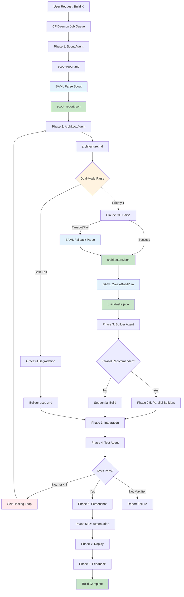

**Legend:**
- 🔵 Blue boxes = BAML processing
- 🟢 Green boxes = JSON outputs
- 🟡 Yellow diamonds = Decision points
- 🔴 Red boxes = Error handling

---

## Phase-by-Phase Breakdown

### Phase 1: Scout Research

**Purpose:** Analyze requirements, research codebase, identify risks

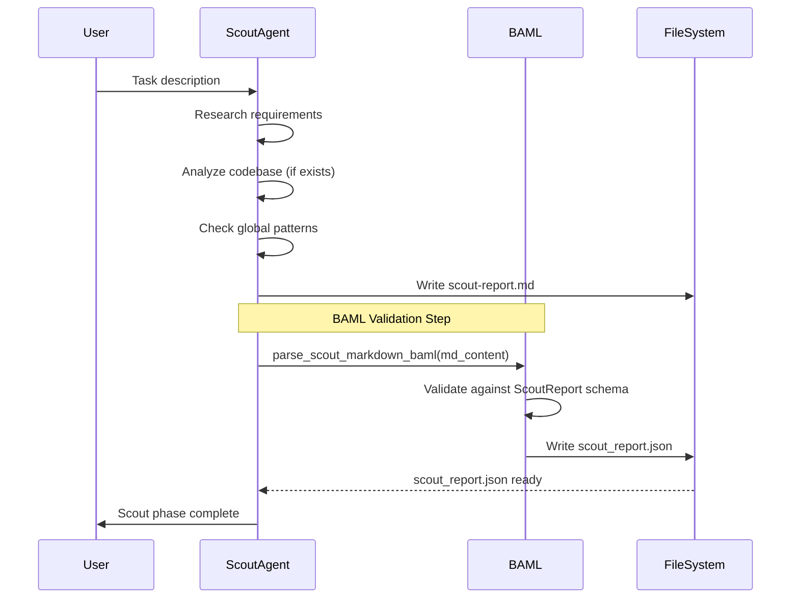

**Outputs:**
- `scout-report.md` - Human-readable analysis (5-20KB)
- `scout_report.json` - Type-safe structured data (ScoutReport schema)

**JSON Structure:**
```json
{
  "executive_summary": "string",
  "past_learnings_applied": ["string"],
  "known_risks": ["string"],
  "key_requirements": ["string"],
  "tech_stack": {
    "languages": ["python", "typescript"],
    "frameworks": ["fastapi", "react"],
    "databases": ["postgresql"]
  },
  "architecture_recommendations": ["string"],
  "main_challenges": [
    {
      "challenge": "CORS with external API",
      "severity": "MEDIUM",
      "mitigation": "Backend proxy pattern"
    }
  ],
  "testing_approach": "string",
  "timeline_estimate": "7-10 minutes"
}
```

---

### Phase 2: Architect Design

**Purpose:** Design system architecture, plan implementation

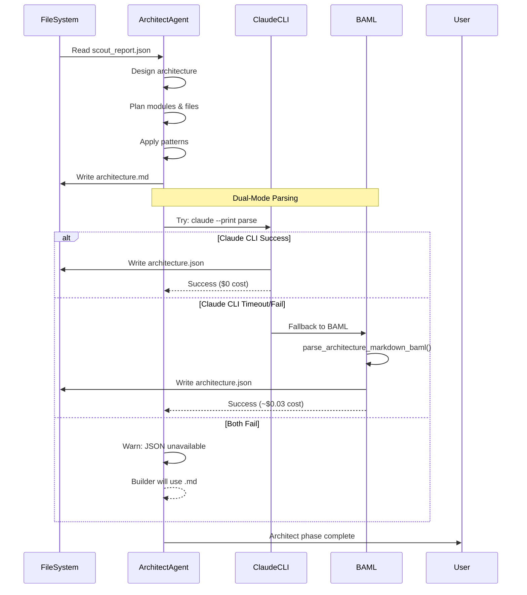

**Outputs:**
- `architecture.md` - Human-readable design (30-90KB)
- `architecture.json` - Type-safe blueprint (ArchitectureBlueprint schema)

**JSON Structure:**
```json
{
  "system_overview": "string",
  "file_structure": [
    {
      "path": "src/main.py",
      "purpose": "Application entry point",
      "dependencies": ["config", "routes"]
    }
  ],
  "modules": [
    {
      "name": "authentication",
      "purpose": "JWT-based user auth",
      "files": ["auth/jwt_handler.py", "auth/middleware.py"],
      "dependencies": ["database", "config"]
    }
  ],
  "applied_patterns": [
    {
      "pattern_id": "cors-external-api-backend-proxy",
      "reason": "External API requires CORS handling"
    }
  ],
  "preventive_measures": ["string"],
  "implementation_steps": ["string"],
  "test_plan": {
    "unit_tests": ["string"],
    "integration_tests": ["string"],
    "e2e_tests": ["string"]
  },
  "success_criteria": ["string"]
}
```

---

### Phase 2.5: Build Planning (Parallel Decision)

**Purpose:** Analyze architecture and create parallel execution plan

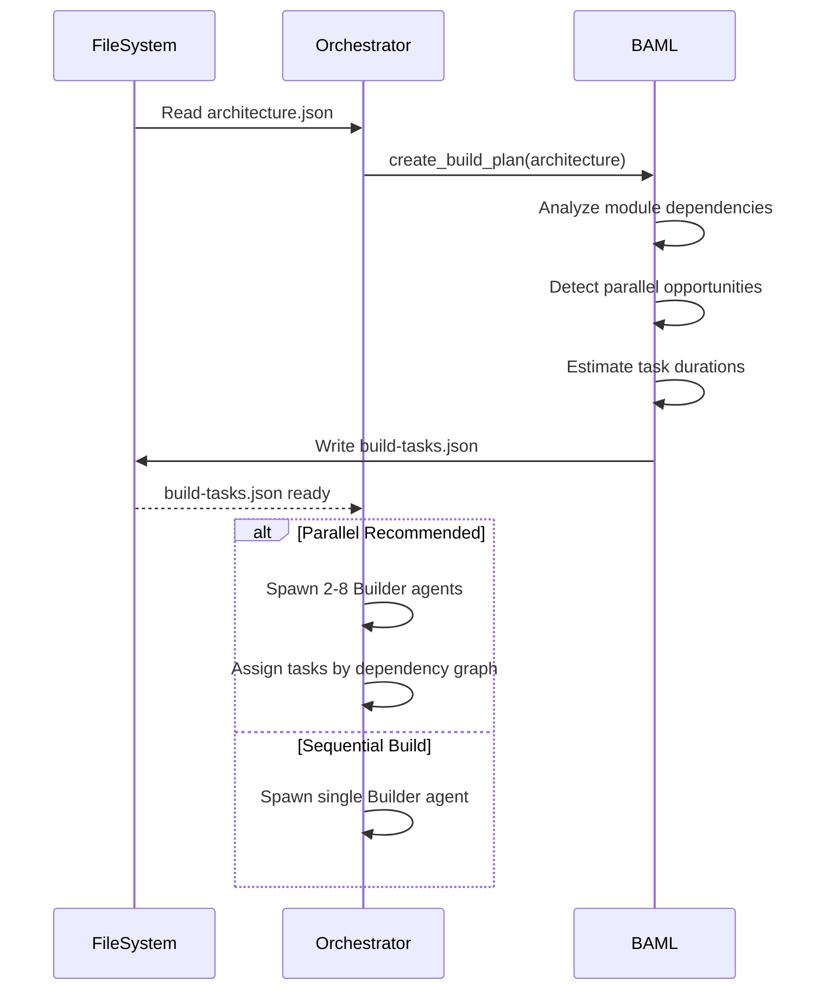

**Outputs:**
- `build-tasks.json` - Parallel execution plan (BuildPlan schema)

**JSON Structure:**
```json
{
  "parallel_build_enabled": true,
  "tasks": [
    {
      "task_id": "task_001",
      "description": "Implement authentication module",
      "files": ["auth/jwt_handler.py", "auth/middleware.py"],
      "dependencies": ["task_000"],
      "estimated_duration_minutes": 2
    }
  ],
  "total_estimated_sequential": 10,
  "total_estimated_parallel": 4,
  "time_savings_percent": 60
}
```

---

### Phase 3: Builder Implementation

**Purpose:** Write code, create tests, implement design

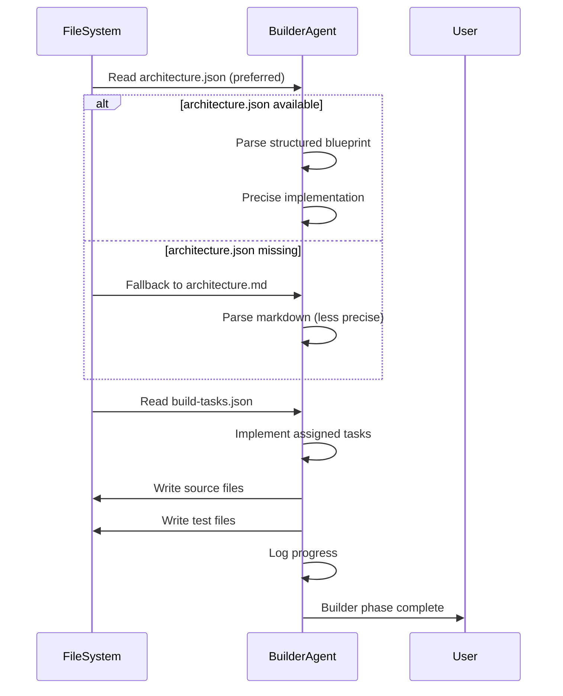

---

## Architecture Parsing: Dual-Mode System

Context Foundry uses a **dual-mode parsing strategy** to maximize reliability while minimizing cost.

### Mode 1: Claude CLI (Priority 1)

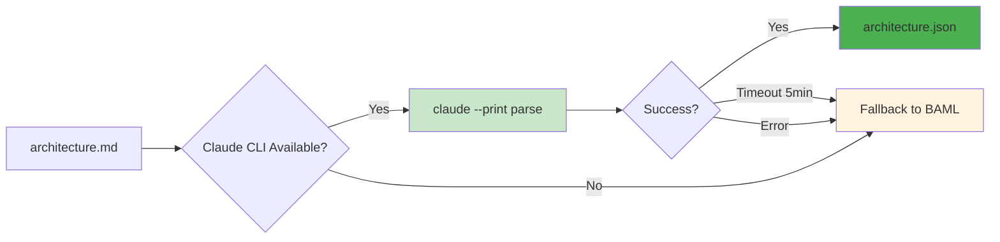

**Advantages:**
- ✅ Fast: Uses subscription, no API delay
- ✅ Free: $0 additional cost
- ✅ 5-minute timeout (sufficient for most)

**Command:**
```bash
claude --print --dangerously-skip-permissions << 'EOF'
Read architecture.md and extract structured JSON matching ArchitectureBlueprint schema.

Output only valid JSON, no markdown fences.
EOF
```

### Mode 2: BAML Fallback (Priority 2)

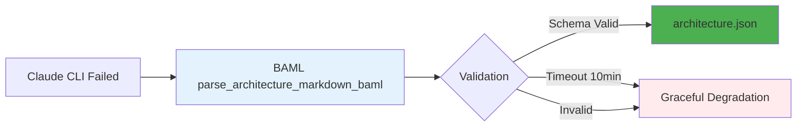

**Advantages:**
- ✅ Reliable: Type-safe schema validation
- ✅ 10-minute timeout (handles complex architectures)
- ✅ Guaranteed structure

**Cost:** ~$0.03 per parse (10K tokens)

**Code:**
```python
from tools.baml_integration import parse_architecture_markdown_baml

architecture_json = parse_architecture_markdown_baml(
    markdown_content=arch_md_content,
    timeout=600  # 10 minutes
)
```

### Mode 3: Graceful Degradation

If both modes fail, the system continues with markdown:

```python
if architecture_json is None:
    logger.warning("⚠️  Architecture JSON unavailable, using .md fallback")
    # Builder reads architecture.md directly
    # Warns but doesn't fail the build
```

---

## Data Flow Diagrams

### Scout → Architect Data Flow

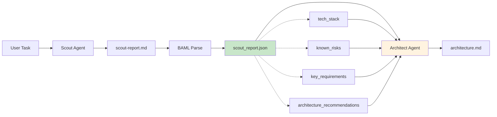

### Architect → Builder Data Flow

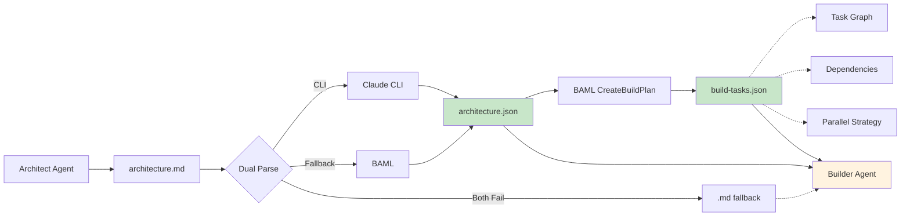

### Phase Tracking Data Flow

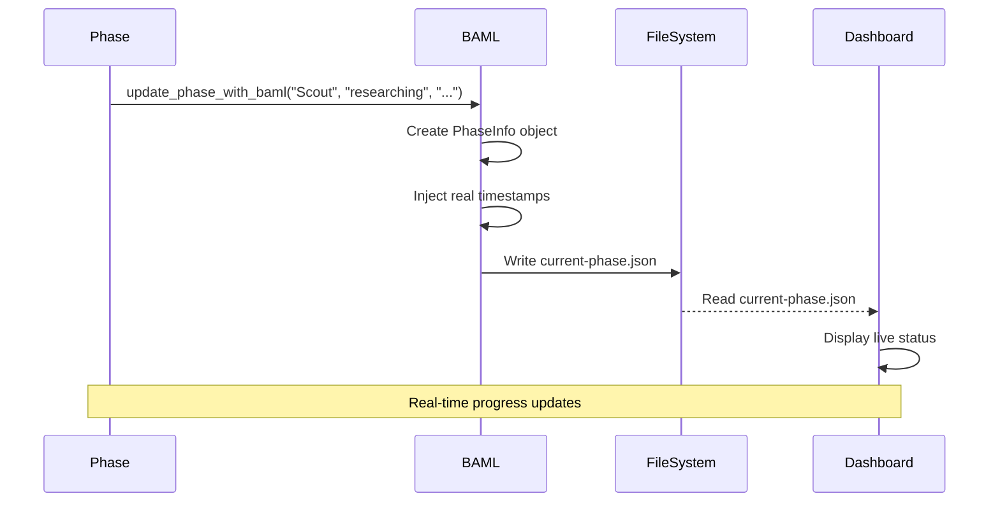

---

## BAML Schema Hierarchy

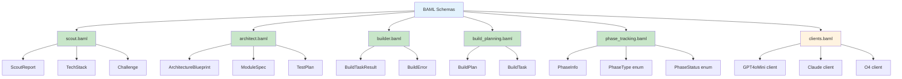

**Schema Compilation:**
```bash
# BAML compiles .baml files → Python client code
tools/baml_src/
├── scout.baml
├── architect.baml
├── builder.baml
├── build_planning.baml
├── phase_tracking.baml
└── clients.baml

# Generated Python client
tools/baml_client/
├── types.py               # All schema classes
├── sync_client.py         # Generated sync client
└── async_client.py        # Generated async client
```

---

## Error Handling & Graceful Degradation

### Parsing Error Flow

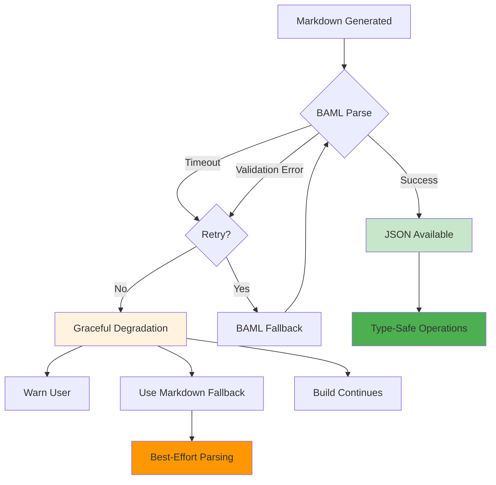

### Error Types & Handling

| Error Type | BAML Response | Fallback Behavior |
|-----------|---------------|-------------------|
| **Timeout** | BamlClientTimeoutError | Retry with BAML (if Claude CLI), then .md fallback |
| **Validation** | BamlValidationError | Log schema mismatch, use .md fallback |
| **Missing Fields** | Partial validation | Use available fields, warn about missing |
| **API Failure** | BamlClientError | Skip JSON, use .md fallback |
| **Both Modes Fail** | None | Graceful degradation to markdown parsing |

**Code Example:**
```python
try:
    architecture_json = parse_architecture_with_claude_cli(md_content)
except (TimeoutError, subprocess.CalledProcessError):
    logger.warning("Claude CLI failed, falling back to BAML...")
    try:
        architecture_json = parse_architecture_baml_with_timeout(md_content)
    except BamlValidationError as e:
        logger.error(f"BAML validation failed: {e}")
        architecture_json = None

if architecture_json is None:
    logger.warning("⚠️  JSON unavailable, using markdown fallback")
    # Builder reads architecture.md directly
```

---

## Performance Metrics

### JSON vs Markdown Comparison

| Metric | Markdown-Only | JSON-First (BAML) |
|--------|---------------|-------------------|
| **Parsing Errors** | ~5% | <1% |
| **Type Safety** | Runtime only | Compile-time + runtime |
| **Field Guarantees** | None | Schema-enforced |
| **IDE Support** | Limited | Full autocomplete |
| **Queryability** | grep/awk | jq/JSON tools |
| **Validation** | Manual | Automatic |
| **First-Try Success** | Variable | Significantly improved |

### Cost Analysis

| Component | Cost per Build | Notes |
|-----------|---------------|-------|
| **Scout Parsing** | ~$0.06 | 1 BAML call, 5K tokens |
| **Architecture Parsing (CLI)** | $0.00 | Uses subscription |
| **Architecture Parsing (BAML)** | ~$0.03 | Fallback only, 10K tokens |
| **Build Planning** | ~$0.02 | 1 BAML call, 2K tokens |
| **Phase Tracking (15 calls)** | ~$0.003 | 200 tokens each |
| **Total BAML Cost** | **~$0.11-$0.20** | Depending on fallback usage |
| **Main Build System** | **$0.00** | Runs on subscription |

**Bottom Line:** BAML adds ~$0.20/build for type safety while the entire build system ($200K+ tokens) runs free on your Claude Code subscription.

---

## BAML Integration Benefits

### Before BAML (Markdown-Only)

```python
# Fragile string parsing
response = agent.complete("Generate architecture")
# Hope it's valid JSON
architecture = json.loads(response)  # May fail!
# Hope it has the fields we need
file_structure = architecture.get("file_structure", [])  # May be missing!
```

**Problems:**
- ❌ ~5% parsing failures
- ❌ No schema guarantees
- ❌ Runtime errors only
- ❌ Manual validation needed

### After BAML (JSON-First)

```python
# Type-safe structured output
from tools.baml_client import b

architecture = b.CreateArchitectureBlueprint(
    task=task_description,
    scout_findings=scout_json
)

# Guaranteed to have all fields
file_structure = architecture.file_structure  # Type-safe!
modules = architecture.modules  # Guaranteed list!
test_plan = architecture.test_plan  # Validated TestPlan object!
```

**Benefits:**
- ✅ <1% parsing failures
- ✅ Compile-time schema validation
- ✅ IDE autocomplete
- ✅ Type hints and documentation

---

## Visual Summary

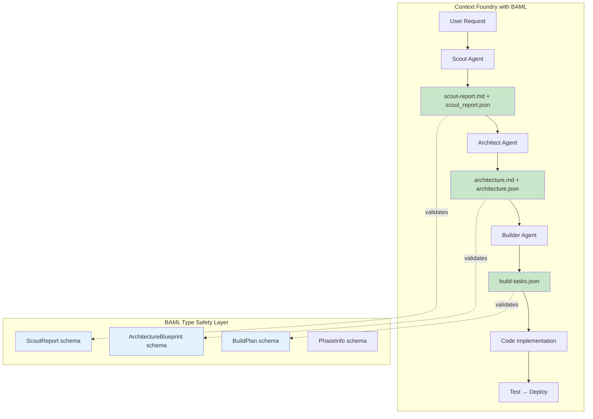

---

## References

- **BAML Documentation:** https://docs.boundaryml.com
- **BAML GitHub:** https://github.com/BoundaryML/baml
- **Context Foundry BAML Integration:** [docs/BAML_INTEGRATION.md](BAML_INTEGRATION.md)
- **Schema Definitions:** `tools/baml_src/`
- **Generated Client:** `tools/baml_client/`

---

**Last Updated:** November 23, 2025 (v2.4.0)

**Credits:**
- BAML framework by Boundary ML
- Visual diagrams created with Mermaid.js
