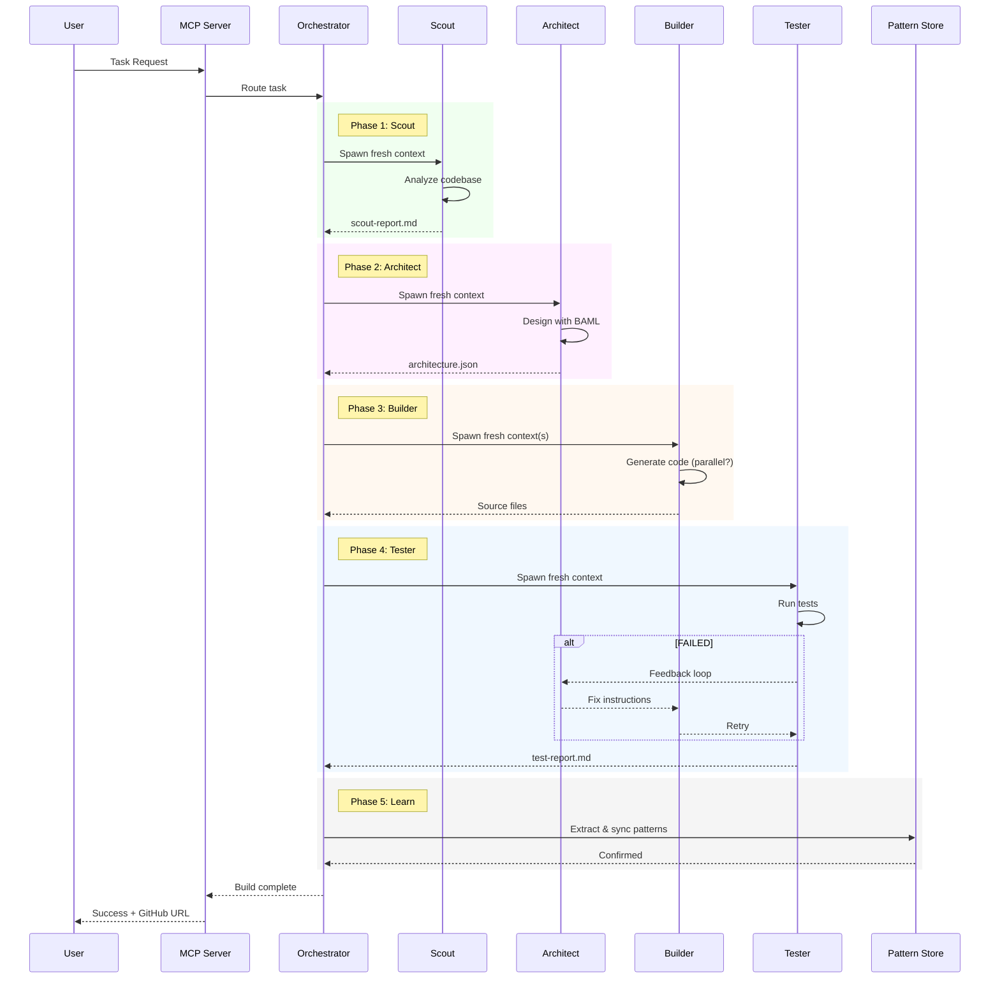

# Context Foundry - Orchestration Flow (Simple)

```mermaid
sequenceDiagram
    participant User
    participant MCP as MCP Server
    participant Orch as Orchestrator
    participant Scout
    participant Arch as Architect
    participant Build as Builder
    participant Test as Tester
    participant S3 as Pattern Store

    User->>MCP: Task Request
    MCP->>Orch: Route task

    rect rgb(240, 255, 240)
        Note right of Orch: Phase 1: Scout
        Orch->>Scout: Spawn fresh context
        Scout->>Scout: Analyze codebase
        Scout-->>Orch: scout-report.md
    end

    rect rgb(255, 240, 255)
        Note right of Orch: Phase 2: Architect
        Orch->>Arch: Spawn fresh context
        Arch->>Arch: Design with BAML
        Arch-->>Orch: architecture.json
    end

    rect rgb(255, 248, 240)
        Note right of Orch: Phase 3: Builder
        Orch->>Build: Spawn fresh context(s)
        Build->>Build: Generate code (parallel?)
        Build-->>Orch: Source files
    end

    rect rgb(240, 248, 255)
        Note right of Orch: Phase 4: Tester
        Orch->>Test: Spawn fresh context
        Test->>Test: Run tests
        alt FAILED
            Test-->>Arch: Feedback loop
            Arch-->>Build: Fix instructions
            Build-->>Test: Retry
        end
        Test-->>Orch: test-report.md
    end

    rect rgb(245, 245, 245)
        Note right of Orch: Phase 5: Learn
        Orch->>S3: Extract & sync patterns
        S3-->>Orch: Confirmed
    end

    Orch-->>MCP: Build complete
    MCP-->>User: Success + GitHub URL
```
