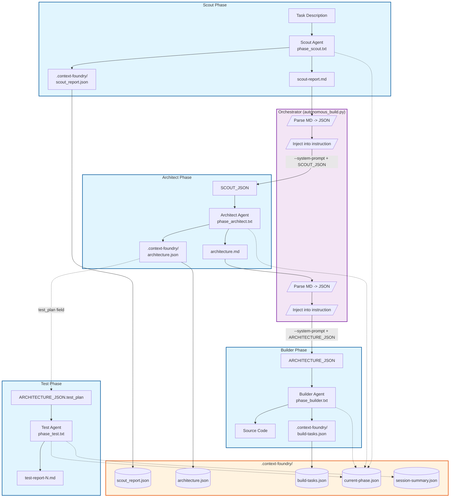
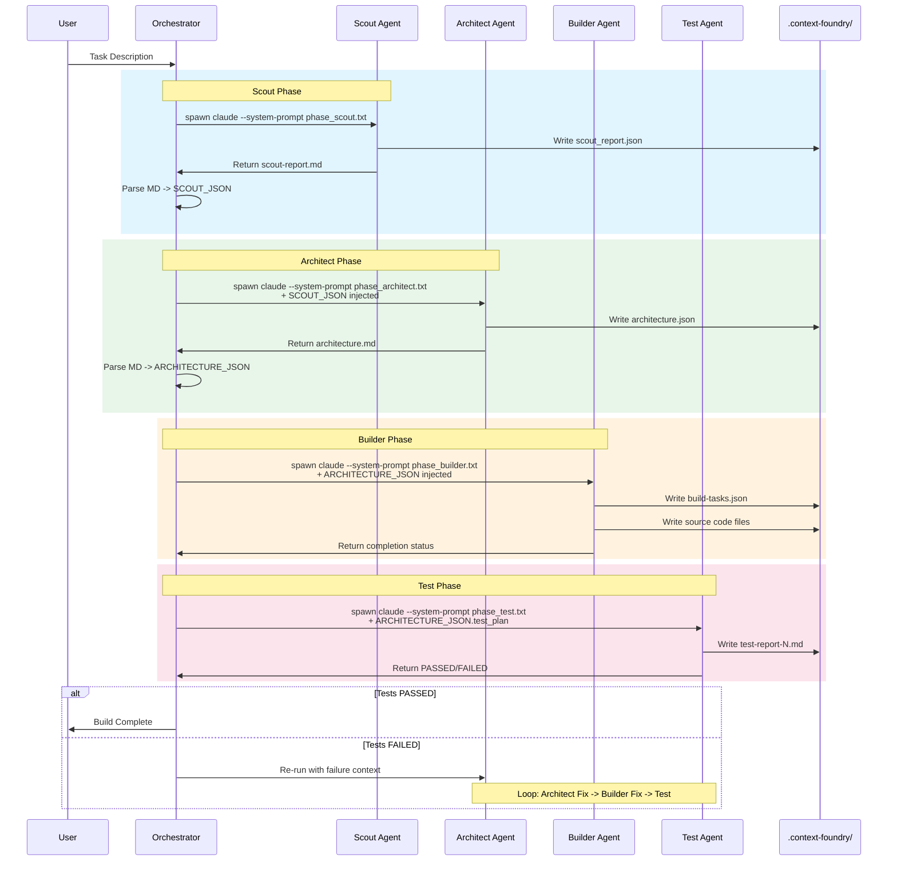

# Context Foundry Inter-Phase Data Contract

> *"Generate probabilistically, validate deterministically."*

This document illustrates how Context Foundry enforces strict adherence to rules through structured JSON handoffs between phases.

## Phase Handoff Table

| Phase | Input Source | Primary Input | Fallback Input | Output Produced | Key Fields |
|-------|--------------|---------------|----------------|-----------------|------------|
| **Scout** | User task | Task description | - | `scout-report.md` → parsed to `SCOUT_JSON` | `executive_summary`, `key_requirements`, `tech_stack`, `architecture_recommendations`, `main_challenges`, `testing_approach` |
| **Architect** | Scout | `SCOUT_JSON` (injected) | `.context-foundry/scout-report.md` | `architecture.json` / `architecture.md` → `ARCHITECTURE_JSON` | `system_overview`, `file_structure`, `modules`, `implementation_steps`, `test_plan` |
| **Builder** | Architect | `ARCHITECTURE_JSON` (injected) | `.context-foundry/architecture.md` | Source code + `build-tasks.json` | `tasks[]`, `dependencies`, `status` |
| **Test** | Architect + Builder | `ARCHITECTURE_JSON.test_plan` | `.context-foundry/architecture.md` | `test-report-{N}.md` | `PASSED`/`FAILED`, iteration count |

---

## Phase Flow Diagram

---

## Sequence Diagram

---

## Key Enforcement Points

| Checkpoint | Mechanism | Location |
|------------|-----------|----------|
| Scout output validation | Must be >100 bytes, contain required sections | `PhaseValidator` |
| JSON injection | Orchestrator parses MD, injects as `SCOUT_JSON`/`ARCHITECTURE_JSON` | `autonomous_build.py:1537-2169` |
| Phase isolation | Each agent spawned as fresh subprocess with `--system-prompt` | `phase_execution.py:633-970` |
| Read-only contract | Builder reads `ARCHITECTURE_JSON`, NOT Scout outputs directly | `phase_builder.txt:26` |
| BAML tracking | `current-phase.json` updated at each transition | `baml_integration.py` |

---

## File Locations

### Phase System Prompt Files

| Phase | Full Path |
|-------|-----------|
| Scout | `/Users/name/homelab/context-foundry/tools/prompts/phases/phase_scout.txt` |
| Architect | `/Users/name/homelab/context-foundry/tools/prompts/phases/phase_architect.txt` |
| Builder | `/Users/name/homelab/context-foundry/tools/prompts/phases/phase_builder.txt` |
| Test | `/Users/name/homelab/context-foundry/tools/prompts/phases/phase_test.txt` |
| Deploy | `/Users/name/homelab/context-foundry/tools/prompts/phases/phase_deploy.txt` |
| Documentation | `/Users/name/homelab/context-foundry/tools/prompts/phases/phase_documentation.txt` |
| Task Builder | `/Users/name/homelab/context-foundry/tools/prompts/phases/phase_task_builder.txt` |

### Orchestration & Execution Code

| Component | Full Path |
|-----------|-----------|
| Autonomous Build Orchestrator | `/Users/name/homelab/context-foundry/tools/mcp_utils/autonomous_build.py` |
| Phase Execution (run_phase, PhaseValidator) | `/Users/name/homelab/context-foundry/tools/mcp_utils/phase_execution.py` |
| BAML Integration | `/Users/name/homelab/context-foundry/tools/baml_integration.py` |

### Build Artifact Locations (per project)

| Artifact | Path Pattern |
|----------|--------------|
| Scout Report (JSON) | `{project_dir}/.context-foundry/scout_report.json` |
| Architecture (JSON) | `{project_dir}/.context-foundry/architecture.json` |
| Build Tasks | `{project_dir}/.context-foundry/build-tasks.json` |
| Current Phase (BAML) | `{project_dir}/.context-foundry/current-phase.json` |
| Session Summary | `{project_dir}/.context-foundry/session-summary.json` |
| Test Report | `{project_dir}/.context-foundry/test-report-{N}.md` |

### Global Pattern Storage

| Pattern Type | Full Path |
|--------------|-----------|
| Common Issues | `~/.context-foundry/patterns/common-issues.json` |
| Scout Learnings | `~/.context-foundry/patterns/scout-learnings.json` |
| Architecture Patterns | `~/.context-foundry/patterns/architecture-patterns.json` |
| MCP Server Patterns | `~/.context-foundry/patterns/mcp-server-patterns.json` |
