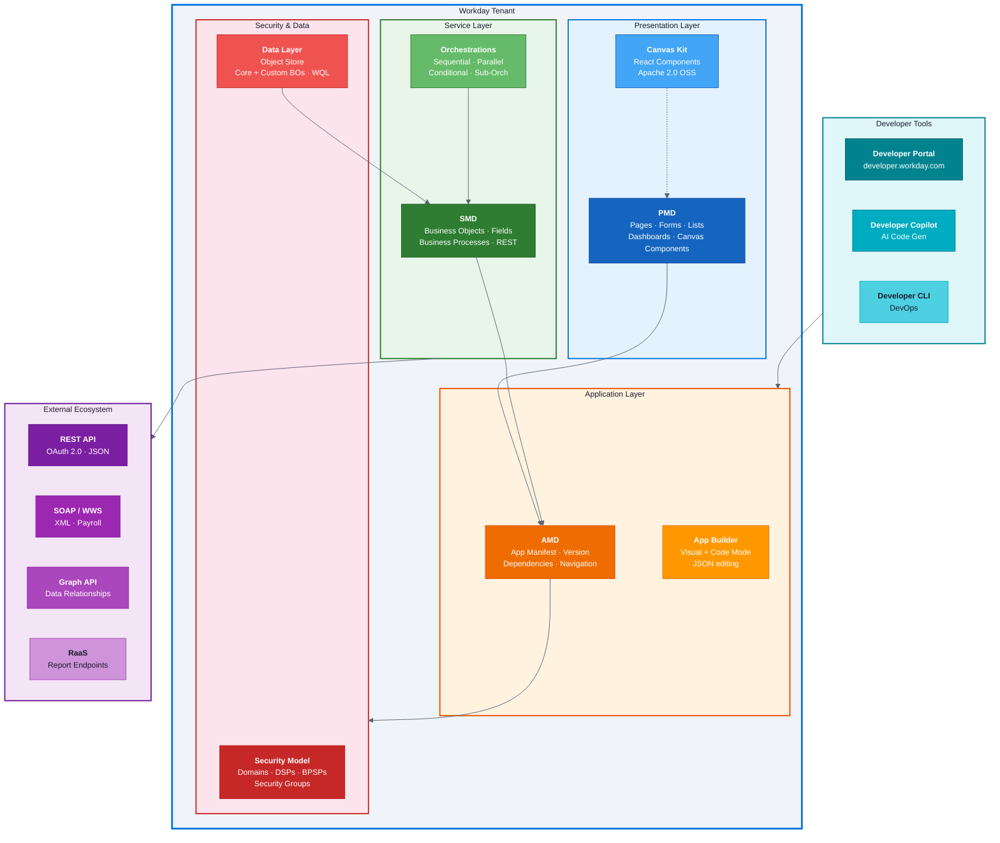

# Workday Extend: Platform Architecture

## Reading Guide

- **Blue (top)**: Presentation layer -- PMD defines pages/forms, Canvas Kit provides the React component library
- **Orange (middle-top)**: Application layer -- AMD is the manifest that ties PMD and SMD together
- **Green (middle)**: Service layer -- SMD defines business objects and processes; Orchestrations handle workflows
- **Red (bottom)**: Security & Data -- Security domains/policies control all access; Data Layer holds business objects
- **Purple (external)**: Four API types for external connectivity (REST, SOAP, Graph, RaaS)
- **Teal (tools)**: Developer Portal, Copilot, and CLI feed into the application layer
