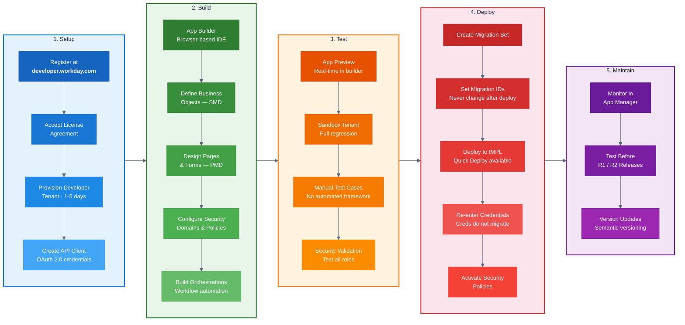

# Workday Extend: Developer Lifecycle

## Key Gotchas by Phase

| Phase | Critical Warning |
|-------|-----------------|
| Setup | Tenant provisioning takes 1-5 business days |
| Build | Everything is metadata-driven — no arbitrary code execution |
| Test | No automated testing framework exists; all testing is manual |
| Deploy | Credentials never migrate; Migration IDs must never change |
| Maintain | Test before every biannual Workday release (R1 March, R2 September) |
