# Workday Extend: Security Model

```mermaid
%%{init: {'theme': 'base', 'themeVariables': {'primaryColor': '#0875e1', 'primaryTextColor': '#fff', 'lineColor': '#576574', 'fontFamily': 'Inter, sans-serif', 'fontSize': '13px'}}}%%

flowchart TB
    subgraph FA["Functional Areas — Product Module Groupings"]
        direction LR
        HCM["HCM Core"]
        BEN["Benefits"]
        FIN["Financial Mgmt"]
        EXTFA["Extend"]
    end

    subgraph SD["Security Domains — Logical Groupings of Securable Items"]
        direction LR
        SD1["Worker Data:<br/>Personal Info"]
        SD2["Worker Data:<br/>Compensation"]
        SD3["Integration:<br/>Build"]
        SD4["Custom App:<br/>Visitor Mgmt"]
    end

    subgraph SI["Securable Items"]
        direction LR
        TASKS["Tasks<br/>BP steps, config"]
        REPORTS["Reports<br/>Definitions"]
        DATAITEMS["Data<br/>BO fields"]
    end

    subgraph SP["Security Policies"]
        direction LR
        DSP["<b>Domain Security<br/>Policies — DSP</b><br/>Get · Put<br/>View · Modify"]
        BPSP["<b>Business Process<br/>Security Policies</b><br/>Initiate · Approve<br/>Review · Complete"]
    end

    subgraph SG["Security Groups — Who Gets Access"]
        direction LR
        ROLE["<b>Role-Based</b><br/>HR Partner<br/>Manager<br/>Benefits Admin"]
        USER["<b>User-Based</b><br/>Named users<br/>ISU accounts"]
        CONSTRAINED["<b>Constrained</b><br/>Org-scoped<br/>Location-scoped"]
        UNCONSTRAINED["<b>Unconstrained</b><br/>All workers<br/>Employee as Self"]
    end

    ACTIVATE["<b>Activate Pending<br/>Security Policy Changes</b><br/>MANDATORY after any change"]

    FA --> SD
    SD --> SI
    SI --> SP
    SP --> SG
    SG --> ACTIVATE

    style FA fill:#1a237e,stroke:#0d47a1,stroke-width:2px,color:#fff
    style SD fill:#283593,stroke:#1a237e,stroke-width:2px,color:#fff
    style SI fill:#303f9f,stroke:#283593,stroke-width:2px,color:#fff
    style SP fill:#3949ab,stroke:#303f9f,stroke-width:2px,color:#fff
    style SG fill:#3f51b5,stroke:#3949ab,stroke-width:2px,color:#fff

    style HCM fill:#0875e1,stroke:#0056b3,color:#fff
    style BEN fill:#0897e1,stroke:#0875e1,color:#fff
    style FIN fill:#0ab0e1,stroke:#0897e1,color:#fff
    style EXTFA fill:#0cc8e1,stroke:#0ab0e1,color:#fff

    style SD1 fill:#1565c0,stroke:#0d47a1,color:#fff
    style SD2 fill:#1976d2,stroke:#1565c0,color:#fff
    style SD3 fill:#1e88e5,stroke:#1976d2,color:#fff
    style SD4 fill:#42a5f5,stroke:#1e88e5,color:#fff

    style TASKS fill:#5c6bc0,stroke:#3f51b5,color:#fff
    style REPORTS fill:#7986cb,stroke:#5c6bc0,color:#fff
    style DATAITEMS fill:#9fa8da,stroke:#7986cb,color:#1a1a2e

    style DSP fill:#c62828,stroke:#b71c1c,color:#fff
    style BPSP fill:#d32f2f,stroke:#c62828,color:#fff

    style ROLE fill:#2e7d32,stroke:#1b5e20,color:#fff
    style USER fill:#388e3c,stroke:#2e7d32,color:#fff
    style CONSTRAINED fill:#43a047,stroke:#388e3c,color:#fff
    style UNCONSTRAINED fill:#66bb6a,stroke:#43a047,color:#fff

    style ACTIVATE fill:#ff6f00,stroke:#e65100,stroke-width:3px,color:#fff
```

## How Security Flows

1. **Functional Areas** group security domains by product module (HCM, Benefits, Extend, etc.)
2. **Security Domains** contain securable items (tasks, reports, data fields)
3. **Security Policies** (DSP for data access, BPSP for process participation) link domains to groups
4. **Security Groups** define who — role-based, user-based, constrained (org-scoped), or unconstrained
5. **Activation is mandatory** — changes do not take effect until "Activate Pending Security Policy Changes" is run
