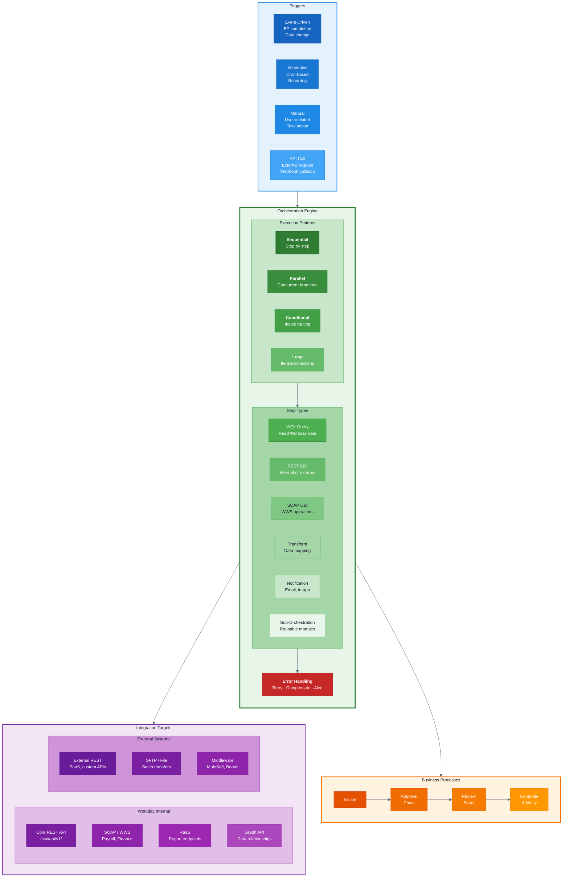

# Workday Extend: Orchestrations & Integrations

## Key Concepts

- **Triggers**: Events, schedules, manual actions, or API calls initiate orchestrations
- **Patterns**: Sequential, parallel, conditional, and loop execution models
- **Steps**: WQL queries, REST/SOAP calls, transforms, notifications, and sub-orchestrations
- **Error Handling**: Retry policies, compensation logic, and alert routing
- **Integration Targets**: Both Workday internal APIs and external systems
- **Business Processes**: Orchestrations can initiate and participate in approval workflows
