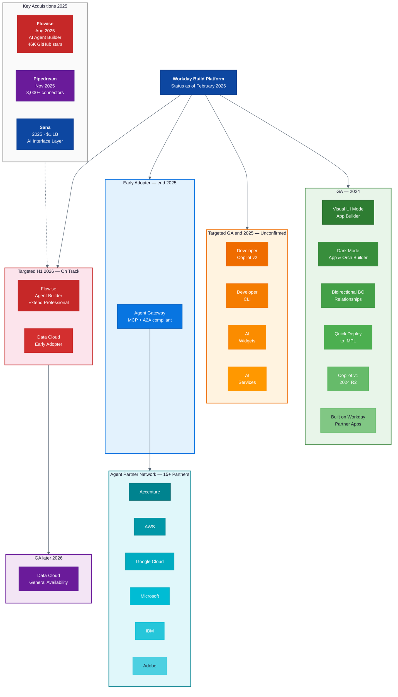

# Workday Build Platform: Roadmap Status (Feb 2026)

## Status Legend

| Color | Meaning |
|-------|---------|
| Green | GA — shipped and available |
| Amber | Targeted GA end 2025 — not yet explicitly confirmed |
| Blue | Early Adopter — limited availability |
| Red | Targeted H1 2026 — on track but unconfirmed |
| Purple | Planned GA later 2026 |
| Teal | Partner ecosystem |
| Gray | Strategic acquisitions feeding the platform |

*Roadmap items should be re-verified against developer.workday.com before relying on them.*
