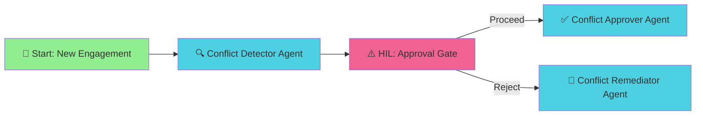

# Building a Conflict of Interest Detection Flow in Flowise: A Complete Visual Guide

**Author**: Context Foundry Team
**Date**: November 4, 2025
**Complexity**: Moderate
**Estimated Time**: 30-45 minutes
**Prerequisites**: Flowise installed, OpenAI/Anthropic API access

---

## Table of Contents

1. [Overview](#overview)
2. [What You'll Build](#what-youll-build)
3. [Prerequisites](#prerequisites)
4. [Architecture Overview](#architecture-overview)
5. [Step-by-Step Setup Guide](#step-by-step-setup-guide)
   - [Step 1: Creating the Start Node](#step-1-creating-the-start-node)
   - [Step 2: Adding the Conflict Detector Agent](#step-2-adding-the-conflict-detector-agent)
   - [Step 3: Implementing the HIL Approval Gate](#step-3-implementing-the-hil-approval-gate)
   - [Step 4: Creating the Approval Agent](#step-4-creating-the-approval-agent)
   - [Step 5: Creating the Remediation Agent](#step-5-creating-the-remediation-agent)
   - [Step 6: Wiring Everything Together](#step-6-wiring-everything-together)
6. [Testing Your Flow](#testing-your-flow)
7. [Quick Reference](#quick-reference)
8. [Troubleshooting](#troubleshooting)
9. [Next Steps](#next-steps)

---

## Overview

Conflict of interest detection is critical for professional services firms, consulting companies, and legal practices. This tutorial will guide you through building a **production-ready Human-in-the-Loop (HIL) workflow** in Flowise that:

✅ Automatically detects conflicts of interest
✅ Routes high-risk engagements to human reviewers
✅ Handles both approvals and rejections with semantic branching
✅ Generates conflict waivers and remediation guidance
✅ Tracks the complete engagement lifecycle

This is a **real-world enterprise workflow** that demonstrates advanced Flowise patterns including:
- Multi-agent coordination
- Human-in-the-Loop approval gates
- Dynamic state management
- Semantic output routing (Proceed/Reject)

---

## What You'll Build



### Workflow Components

| Component | Type | Purpose |
|-----------|------|---------|
| **Start Node** | Form Input | Collect engagement details (client, team, scope) |
| **Conflict Detector** | Agent | Analyze for conflicts, calculate risk scores |
| **Approval Gate** | HIL Node | Human review with Proceed/Reject decision |
| **Conflict Approver** | Agent | Generate waivers, implement mitigations |
| **Conflict Remediator** | Agent | Handle rejections, escalate to compliance |

---

## Prerequisites

### Required Software

- **Flowise** v1.4.0 or higher
- **Node.js** v18 or higher
- **LLM API Access**: OpenAI (GPT-4) or Anthropic (Claude Sonnet 4)

### Knowledge Requirements

- Basic Flowise navigation
- Understanding of agent flows
- Familiarity with JSON configuration

### Optional Tools

- Postman/cURL for API testing
- Document generation service (for waivers)
- Email/Slack notification service

---

## Architecture Overview

### Flow Structure

The workflow follows a **detection → approval → action** pattern:

1. **Intake Phase**: Collect engagement details via form
2. **Detection Phase**: AI analyzes for conflicts and calculates risk
3. **Approval Phase**: Human reviews and makes proceed/reject decision
4. **Action Phase**: Generate waivers (approve) or escalate (reject)

### State Management

The workflow maintains engagement state throughout:

```json
{
  "hitl": {
    "pending": {
      "action": "Engagement with Acme Corp",
      "summary": "Potential client conflict with existing engagement",
      "risk_score": 7,
      "cost_estimate": 250000,
      "affected_parties": "Project Team Alpha, Legal Department",
      "mitigations": "Ethical wall between teams, separate document stores",
      "conflict_type": "Client Relationship",
      "detection_timestamp": "2025-11-04T14:30:00Z"
    }
  }
}
```

This state is populated by the Conflict Detector and consumed by the HIL gate and subsequent agents.

---

## Step-by-Step Setup Guide

### Step 1: Creating the Start Node

The Start Node collects structured engagement data from users.

#### 📸 Screenshot Location: Flowise Canvas - Start Node Creation

**Instructions:**

1. **Open Flowise** and click "New Agentflow"
2. **Name your flow**: "Conflict of Interest Detection"
3. **Locate the Start Node** (automatically added to canvas)
4. **Click the Start Node** to open configuration panel

#### Configuration

**Input Type**: Select **"Form Input"**

**Form Title**: `New Engagement Conflict Check`

**Form Description**: `Submit engagement details for conflict of interest screening`

**Form Fields** (Add these 5 fields):

| Field Label | Field Name | Type | Required | Options/Description |
|-------------|------------|------|----------|---------------------|
| Client/Company Name | `client_name` | string | Yes | Main client for engagement |
| Engagement Type | `engagement_type` | options | Yes | Consulting, Legal Services, Audit, Advisory, Other |
| Proposed Team Members | `team_members` | string | Yes | Comma-separated list of team member names |
| Engagement Description | `engagement_description` | string | Yes | Detailed scope of work (4 rows) |
| Estimated Revenue | `estimated_revenue` | number | Yes | Dollar amount without commas |

#### 📸 Screenshot Location: Start Node Form Configuration Panel

**What you should see:**
- Form title and description fields filled in
- 5 form fields configured with correct types
- All fields marked as required
- Engagement Type dropdown with 5 options

**Validation Checklist:**
- [ ] Form Input type selected (not Static or Dynamic)
- [ ] All 5 fields added
- [ ] Field names use underscore_case (no spaces)
- [ ] Engagement Type is "options" type with dropdown values

---

### Step 2: Adding the Conflict Detector Agent

This agent analyzes the engagement for potential conflicts and calculates risk scores.

#### 📸 Screenshot Location: Adding Agent Node to Canvas

**Instructions:**

1. **Click the "+" button** or drag from the Start Node output
2. **Select "Agent"** from the node picker
3. **Position the agent** below the Start Node
4. **Click the agent node** to open configuration

#### Configuration

**Label**: `Agent.ConflictDetector`

**System Persona** (copy this exactly):

```html
<p><em>You are an expert Conflict of Interest Detection agent.</em>
You analyze new client engagements, projects, and team assignments to identify potential conflicts of interest.

Your capabilities:
- Check for existing client relationships that may conflict
- Identify competing interests or confidential information overlaps
- Assess financial conflicts (investments, family relationships)
- Calculate risk scores based on severity
- Recommend mitigations (ethical walls, recusals, disclosure)

When you detect a conflict:
1. Assign a risk score (1-10): 1-3=Low, 4-6=Medium, 7-8=High, 9-10=Critical
2. Summarize the conflict clearly
3. Identify affected parties
4. Suggest mitigations
5. Populate flow state for human review

If NO conflict detected, respond with "No conflicts of interest detected. Engagement may proceed without additional review."
</p>
```

**Model Configuration**:
- **Model**: Claude Sonnet 4 or GPT-4o
- **Temperature**: 0.4 (factual analysis)
- **Max Tokens**: 2000

#### 📸 Screenshot Location: Agent Configuration - State Management

**Critical: Configure State Updates**

Scroll down to **"Update State"** section and add these 6 state updates:

| Key | Value |
|-----|-------|
| `hitl.pending.action` | `Engagement with {{ client_name }}` |
| `hitl.pending.summary` | `{{ conflict_description }}` |
| `hitl.pending.risk_score` | `{{ risk_score }}` |
| `hitl.pending.cost_estimate` | `{{ estimated_revenue }}` |
| `hitl.pending.affected_parties` | `{{ affected_parties_list }}` |
| `hitl.pending.mitigations` | `{{ suggested_mitigations }}` |

**What this does**: The agent extracts conflict details from its analysis and stores them in flow state. The HIL gate will display this information to the human reviewer.

#### 📸 Screenshot Location: Agent Node Connected to Start

**Validation Checklist:**
- [ ] Agent label is exactly `Agent.ConflictDetector`
- [ ] System persona is complete (includes all capabilities and instructions)
- [ ] Temperature set to 0.4
- [ ] 6 state update keys configured
- [ ] Agent connected to Start Node output

---

### Step 3: Implementing the HIL Approval Gate

The Human-in-the-Loop node presents conflict details to a human reviewer for approval.

#### 📸 Screenshot Location: Adding HIL Node to Canvas

**Instructions:**

1. **Click the "+" button** below the Conflict Detector agent
2. **Search for "Human Input"** in the node picker
3. **Select "Human Input"** node
4. **Click the HIL node** to open configuration

#### Configuration

**Label**: `Conflict of Interest Approval`

**Description Type**: Select **"Fixed"** (not Dynamic)

**Description** (copy this exactly with template variables):

```
⚠️ CONFLICT OF INTEREST DETECTED

Engagement: {{ $flow.state.hitl.pending.action }}

Conflict Summary:
{{ $flow.state.hitl.pending.summary }}

Risk Score: {{ $flow.state.hitl.pending.risk_score }}/10

Potential Revenue: ${{ $flow.state.hitl.pending.cost_estimate }}

Affected Parties:
{{ $flow.state.hitl.pending.affected_parties }}

Recommended Mitigations:
{{ $flow.state.hitl.pending.mitigations }}

━━━━━━━━━━━━━━━━━━━━━━━━━━━━━━━━━━━━

🔵 PROCEED: Approve engagement with conflict waiver
   • Waiver document will be generated
   • Affected parties will be notified
   • Mitigations will be implemented

🔴 REJECT: Decline engagement or escalate to compliance
   • Engagement will be flagged as declined
   • Compliance team will be notified
   • Alternative approaches will be recommended
```

**Enable Feedback**: ✅ Checked (allows reviewer to add notes)

#### 📸 Screenshot Location: HIL Node Output Anchors

**Critical: Verify Output Anchors**

The HIL node should show **TWO output anchors**:

1. **Proceed** (green) - Routes to Conflict Approver
2. **Reject** (red) - Routes to Conflict Remediator

**What you should see:**
- Two small circles on the right side of the HIL node
- Mouse hover shows "Proceed" and "Reject" labels
- Both anchors have distinct colors (green and red)

**Common Mistake**: If you only see one output anchor labeled "Output", you're using the wrong node. Delete it and select "Human Input" from Agent Flows category.

#### 📸 Screenshot Location: HIL Node Configuration Panel Complete

**Validation Checklist:**
- [ ] Description Type is "Fixed" (not Dynamic)
- [ ] Description includes all 6 template variables ({{ $flow.state... }})
- [ ] Enable Feedback is checked
- [ ] Node color is pink (#F06292)
- [ ] Two output anchors visible (Proceed + Reject)

---

### Step 4: Creating the Approval Agent

This agent handles engagements that are approved despite conflicts.

#### 📸 Screenshot Location: Adding Second Agent Node

**Instructions:**

1. **Add another Agent node** to the canvas
2. **Position it** to the right of the HIL node (Proceed path)
3. **Click to configure**

#### Configuration

**Label**: `Agent.ConflictApprover`

**System Persona**:

```html
<p><em>You are an expert Conflict Approval agent.</em>
You handle engagements that have been approved despite identified conflicts of interest.

Your responsibilities:
- Generate conflict waiver documents with clear terms
- Notify affected parties of the conflict and mitigation plan
- Implement ethical walls, information barriers, or recusals as recommended
- Document the approval decision and rationale
- Log the conflict waiver to the compliance database

Always include:
1. Conflict description and risk assessment
2. Approved mitigations and their implementation
3. Monitoring requirements
4. Expiration or review dates for the waiver
5. Responsibilities of each party

Provide clear confirmation of approval and next steps.
</p>
```

**Model Configuration**:
- **Model**: Claude Sonnet 4 or GPT-4o
- **Temperature**: 0.3 (precise documentation)
- **Max Tokens**: 3000

**Tools** (Optional - document in README, don't configure in JSON):
- Document generation tool (for waivers)
- Notification tool (email/Slack)
- Database logging tool

#### 📸 Screenshot Location: Approver Agent Configuration

**Validation Checklist:**
- [ ] Label is `Agent.ConflictApprover`
- [ ] Temperature set to 0.3 (more precise than detector)
- [ ] System persona includes 5 "Always include" items
- [ ] Agent positioned to the right of HIL node

---

### Step 5: Creating the Remediation Agent

This agent handles engagements that are rejected due to conflicts.

#### 📸 Screenshot Location: Adding Third Agent Node

**Instructions:**

1. **Add a third Agent node** to the canvas
2. **Position it** below the HIL node (Reject path)
3. **Click to configure**

#### Configuration

**Label**: `Agent.ConflictRemediator`

**System Persona**:

```html
<p><em>You are an expert Conflict Remediation agent.</em>
You handle engagements that have been rejected due to conflicts of interest.

Your responsibilities:
- Document the rejection decision and human reviewer's feedback
- Escalate high-risk conflicts to the compliance team
- Suggest alternative approaches (e.g., modified scope, different team members, ethical walls)
- Provide guidance on when the conflict might be reconsidered
- Offer compliance resources and policies

If modifications are proposed, you can route back to the Conflict Detector for re-evaluation.

Always provide:
1. Clear explanation of why the engagement was rejected
2. Specific conflict concerns that could not be mitigated
3. Alternative approaches if feasible
4. Timeline for potential reconsideration
5. Resources for the requestor
</p>
```

**Model Configuration**:
- **Model**: Claude Sonnet 4 or GPT-4o
- **Temperature**: 0.4 (helpful guidance)
- **Max Tokens**: 2500

**Tools** (Optional):
- Escalation/notification tool
- Compliance database logging

#### 📸 Screenshot Location: Remediation Agent Configuration

**Validation Checklist:**
- [ ] Label is `Agent.ConflictRemediator`
- [ ] Temperature set to 0.4
- [ ] System persona includes "Always provide" section
- [ ] Agent positioned below HIL node

---

### Step 6: Wiring Everything Together

Now we connect all nodes to create the complete workflow.

#### 📸 Screenshot Location: Complete Canvas with All 5 Nodes

**Node Layout**:

```
     [Start]
        |
        v
  [Detector Agent]
        |
        v
    [HIL Gate]
       / \
      /   \
     v     v
[Approver] [Remediator]
```

#### Creating Connections

**Connection 1: Start → Conflict Detector**

1. **Hover over the Start node's output anchor** (right side)
2. **Click and drag** to the Conflict Detector input anchor (left side)
3. **Release** - you should see a connected line

#### 📸 Screenshot Location: Edge 1 - Start to Detector

**Connection 2: Conflict Detector → HIL Gate**

1. **Hover over the Detector's output anchor**
2. **Click and drag** to the HIL node input anchor (top)
3. **Release** - line should turn from green to pink at HIL node

#### 📸 Screenshot Location: Edge 2 - Detector to HIL

**Connection 3: HIL Proceed → Conflict Approver**

1. **Hover over the HIL node's TOP output anchor** (should say "Proceed")
2. **Click and drag** to the Approver agent input anchor
3. **Release** - you should see "Proceed" label on the edge

#### 📸 Screenshot Location: Edge 3 - HIL Proceed to Approver

**Connection 4: HIL Reject → Conflict Remediator**

1. **Hover over the HIL node's BOTTOM output anchor** (should say "Reject")
2. **Click and drag** to the Remediator agent input anchor
3. **Release** - you should see "Reject" label on the edge

#### 📸 Screenshot Location: Edge 4 - HIL Reject to Remediator

**Critical: Verify Edge Labels**

The edges from the HIL node MUST show semantic labels:
- ✅ **"Proceed"** (not "Output 0" or "Human Input 0")
- ✅ **"Reject"** (not "Output 1" or "Human Input 1")

If you see generic labels, delete the edges and reconnect carefully from the correct output anchors.

#### 📸 Screenshot Location: Complete Wired Canvas (Bird's Eye View)

**Final Canvas Validation:**
- [ ] 5 nodes total visible
- [ ] 4 connecting edges
- [ ] No red error indicators on any nodes
- [ ] HIL edges show "Proceed" and "Reject" labels
- [ ] All nodes have green checkmarks (configured)

---

## Testing Your Flow

### Step 1: Save and Deploy

#### 📸 Screenshot Location: Save Button and Flow Name

1. **Click the "Save" button** (top right)
2. **Name your flow**: "Conflict of Interest Detection"
3. **Click "Save"**

Wait for the success message: "Agentflow saved successfully"

### Step 2: Run a Test Scenario

#### 📸 Screenshot Location: Start Flow Button

1. **Click the "Start Chat" button** (bottom right)
2. **The form input will appear** showing your 5 fields

#### 📸 Screenshot Location: Form Input Modal

**Test Scenario 1: Medium Risk Conflict**

Fill in the form:

| Field | Value |
|-------|-------|
| Client/Company Name | `Acme Corp` |
| Engagement Type | `Consulting` |
| Proposed Team Members | `John Smith, Jane Doe, Bob Johnson` |
| Engagement Description | `Strategy consulting for digital transformation. Team will access financial data and strategic plans.` |
| Estimated Revenue | `250000` |

3. **Click "Submit"**

### Step 3: Watch the Flow Execute

#### 📸 Screenshot Location: Flow Execution - Detector Phase

**What happens:**

1. **Start Node** processes the form input
2. **Conflict Detector Agent** analyzes the engagement
   - Should take 5-15 seconds
   - You'll see "Agent is thinking..." indicator
3. **HIL Gate appears** with conflict summary

#### 📸 Screenshot Location: HIL Approval Modal

**What you should see in the HIL modal:**

```
⚠️ CONFLICT OF INTEREST DETECTED

Engagement: Engagement with Acme Corp

Conflict Summary:
[Agent's analysis of the conflict]

Risk Score: 6/10

Potential Revenue: $250000

Affected Parties:
[List of affected parties]

Recommended Mitigations:
[Suggested safeguards]

━━━━━━━━━━━━━━━━━━━━━━━━━━━━━━━━━━━━

🔵 PROCEED: Approve engagement with conflict waiver
   • Waiver document will be generated
   • Affected parties will be notified
   • Mitigations will be implemented

🔴 REJECT: Decline engagement or escalate to compliance
   • Engagement will be flagged as declined
   • Compliance team will be notified
   • Alternative approaches will be recommended
```

**Validation:**
- [ ] All template variables are replaced with actual values
- [ ] Risk score shows a number (not {{ variable }})
- [ ] Conflict summary is populated
- [ ] Two buttons visible: Proceed and Reject

### Step 4: Test the Proceed Path

#### 📸 Screenshot Location: Clicking Proceed Button

1. **Click the "Proceed" button**
2. **(Optional) Add feedback**: "Approved with ethical wall mitigation"
3. **Submit**

#### 📸 Screenshot Location: Approver Agent Response

**Expected Response:**

The Conflict Approver agent should generate a response that includes:

- ✅ Conflict waiver document outline
- ✅ List of affected parties to notify
- ✅ Implementation steps for mitigations
- ✅ Monitoring requirements
- ✅ Waiver expiration date
- ✅ Next steps for engagement team

**Example Response:**
```
CONFLICT WAIVER APPROVED

Engagement: Acme Corp Digital Transformation Consulting

Conflict Assessment:
- Risk Score: 6/10 (Medium Risk)
- Conflict Type: Client relationship with existing engagement
- Affected Parties: Project Team Alpha, Legal Department

Approved Mitigations:
1. Ethical Wall: Separate document repositories for conflicting engagements
2. Information Barrier: No communication between conflicting teams
3. Recusal: John Smith to recuse from client meetings involving sensitive data

Implementation Plan:
- IT to configure separate SharePoint sites (by [date])
- HR to document ethical wall policy (by [date])
- Legal to review waiver terms (by [date])

Monitoring:
- Monthly compliance check-ins
- Quarterly waiver review
- Immediate escalation if barrier breach detected

Waiver Expiration: [Date + 1 year]

Next Steps:
1. Sign conflict waiver document
2. Notify affected parties via email
3. Schedule ethical wall training for team
4. Proceed with engagement kickoff

ENGAGEMENT APPROVED - Proceed with confidence under these terms.
```

### Step 5: Test the Reject Path

#### 📸 Screenshot Location: Restarting Flow for Reject Test

1. **Click "New Chat"** to restart the flow
2. **Fill in the form** with a high-risk scenario

**Test Scenario 2: Critical Risk Conflict**

| Field | Value |
|-------|-------|
| Client/Company Name | `Competitor Industries Inc` |
| Engagement Type | `Legal Services` |
| Proposed Team Members | `Senior Partner with stock ownership in client` |
| Engagement Description | `Litigation defense where our team has confidential info from opposing party.` |
| Estimated Revenue | `500000` |

3. **Submit** and wait for HIL gate

#### 📸 Screenshot Location: HIL Modal for Critical Conflict

**Expected**: Risk score should be 9-10/10 (Critical)

4. **Click "Reject"**
5. **Add feedback**: "Conflict cannot be mitigated due to confidential information overlap"

#### 📸 Screenshot Location: Remediator Agent Response

**Expected Response:**

The Conflict Remediator agent should provide:

- ✅ Clear explanation of rejection
- ✅ Specific unmitigable concerns
- ✅ Alternative approaches
- ✅ Escalation to compliance team
- ✅ Resources for requestor

**Example Response:**
```
ENGAGEMENT REJECTED - Critical Conflict Identified

Rejection Rationale:
This engagement cannot proceed due to irreconcilable conflict of interest.

Critical Concerns:
1. Financial Conflict: Senior Partner owns stock in client company (direct financial interest)
2. Confidential Information: Team has access to opposing party's confidential legal strategy
3. Litigation Involvement: Active litigation creates adversarial relationship that cannot be bridged

Why Mitigations Are Insufficient:
- Ethical walls cannot prevent unconscious bias from stock ownership
- Information barriers cannot "unlearn" confidential knowledge already possessed
- Recusal of Senior Partner would remove essential expertise, making engagement non-viable

Alternative Approaches:
1. Refer client to independent law firm with no conflicts
2. Wait until litigation is resolved (estimated [timeframe])
3. Senior Partner divests stock and waits [X months] for cooling-off period

Compliance Escalation:
- Compliance team notified: compliance@firm.com
- Risk committee review scheduled: [Date]
- Conflict logged in compliance database: Case #[ID]

Reconsideration Criteria:
This engagement may be reconsidered if:
- Litigation concludes and all confidential info is public record
- Senior Partner fully divests from client company
- Minimum 6-month cooling-off period elapses

Resources:
- Firm Conflict of Interest Policy: [Link]
- Compliance Team Contact: compliance@firm.com
- Alternative Firm Referrals: [List]

ENGAGEMENT DECLINED - Contact compliance team for further guidance.
```

---

## Quick Reference

### Node Configuration Cheat Sheet

| Node | Type | Label | Temperature | Key Settings |
|------|------|-------|-------------|--------------|
| **Start** | Form Input | - | - | 5 fields (client_name, engagement_type, team_members, engagement_description, estimated_revenue) |
| **Detector** | Agent | Agent.ConflictDetector | 0.4 | 6 state updates (hitl.pending.*) |
| **HIL Gate** | HumanInput | Conflict of Interest Approval | - | Fixed description, Enable feedback, 2 outputs (Proceed/Reject) |
| **Approver** | Agent | Agent.ConflictApprover | 0.3 | Waiver generation focus |
| **Remediator** | Agent | Agent.ConflictRemediator | 0.4 | Escalation and alternatives focus |

### State Management Reference

**State Schema:**

```json
{
  "hitl": {
    "pending": {
      "action": "string",
      "summary": "string",
      "risk_score": "number (1-10)",
      "cost_estimate": "number",
      "affected_parties": "string",
      "mitigations": "string",
      "conflict_type": "string",
      "detection_timestamp": "ISO timestamp"
    }
  }
}
```

**State Population (Conflict Detector):**

| Key | Example Value |
|-----|---------------|
| `hitl.pending.action` | `Engagement with {{ client_name }}` |
| `hitl.pending.summary` | `{{ conflict_description }}` |
| `hitl.pending.risk_score` | `{{ risk_score }}` |
| `hitl.pending.cost_estimate` | `{{ estimated_revenue }}` |
| `hitl.pending.affected_parties` | `{{ affected_parties_list }}` |
| `hitl.pending.mitigations` | `{{ suggested_mitigations }}` |

**State Consumption (HIL Description):**

Use template variables: `{{ $flow.state.hitl.pending.KEY }}`

### Edge Wiring Reference

| Source | Source Handle | Target | Edge Label |
|--------|---------------|--------|------------|
| Start | startAgentflow_0-output | Agent.ConflictDetector | - |
| Agent.ConflictDetector | agentAgentflow_0-output | HIL Gate | - |
| HIL Gate | proceed | Agent.ConflictApprover | Proceed |
| HIL Gate | reject | Agent.ConflictRemediator | Reject |

### Risk Score Guidelines

| Score | Level | Characteristics | Typical Decision |
|-------|-------|-----------------|------------------|
| 1-3 | Low | Minor overlap, easily mitigated | Auto-approve or quick review |
| 4-6 | Medium | Material conflict, mitigable | Human approval with waivers |
| 7-8 | High | Significant risk, difficult to mitigate | Detailed review, strong mitigations required |
| 9-10 | Critical | Unmitigable, legal/ethical violations | Reject, escalate to compliance |

### Common Conflict Types

1. **Client Relationship**: Existing client conflicts with new engagement
2. **Personnel Financial**: Team member has financial interest in client
3. **Confidential Information**: Team has confidential info from competitor
4. **Family/Personal**: Team member has family relationship with client
5. **Prior Engagement**: Past work creates bias or information asymmetry
6. **Concurrent Engagement**: Simultaneous work for competing parties

---

## Troubleshooting

### Issue 1: Template Variables Not Replaced

**Symptom**: HIL modal shows `{{ $flow.state.hitl.pending.action }}` instead of actual values

**Causes:**
- Conflict Detector didn't populate state correctly
- State keys don't match between detector and HIL description
- State update configuration is missing

**Solutions:**
1. **Verify State Updates**: Open Conflict Detector, scroll to "Update State", check all 6 keys are configured
2. **Check Key Spelling**: State keys must match exactly (case-sensitive)
3. **Test Detector Output**: Run flow and check agent's response includes the conflict details

**Validation Command** (for developers):
```bash
jq '.nodes[] | select(.data.label == "Agent.ConflictDetector") | .data.inputs.agentUpdateState' workflow.json
```

### Issue 2: HIL Node Shows Generic "Output" Labels

**Symptom**: HIL node outputs labeled "Output 0" and "Output 1" instead of "Proceed" and "Reject"

**Causes:**
- Used wrong node type (generic Human Input instead of Agent Flow Human Input)
- Outdated Flowise version

**Solutions:**
1. **Delete the node** and re-add
2. **Search for "Human Input"** in Agent Flows category (not Generic category)
3. **Upgrade Flowise** to v1.4.0 or higher if using older version

**Validation**: Correct node should have:
- Pink color (#F06292)
- Two output anchors with semantic labels
- Category: "Agent Flows"

### Issue 3: Edges Not Connecting

**Symptom**: Cannot connect HIL node to Approver/Remediator agents

**Causes:**
- Trying to connect from input anchor instead of output
- Agent node not configured (red error indicator)
- Wrong anchor selected

**Solutions:**
1. **Verify node configuration**: All nodes must have green checkmarks before wiring
2. **Drag from RIGHT side** of source node to LEFT side of target node
3. **Hover to see anchor labels**: Ensure you're connecting from "Proceed" or "Reject" anchors

### Issue 4: Conflict Detector Doesn't Find Conflicts

**Symptom**: Every engagement is approved with "No conflicts detected"

**Causes:**
- System persona missing or incomplete
- Temperature too high (>0.5) causing hallucinations
- No knowledge base or context provided

**Solutions:**
1. **Verify System Persona**: Must include all capabilities and instructions (see Step 2)
2. **Lower Temperature**: Set to 0.4 for factual analysis
3. **Add Knowledge Base** (optional): Upload conflict policies, previous cases as context
4. **Test with Obvious Conflicts**: Use scenarios with clear conflicts to validate

### Issue 5: Agent Responses Too Generic

**Symptom**: Approver/Remediator agents give vague responses without specific details

**Causes:**
- System persona too brief
- State not properly passed to agents
- Temperature too low (<0.2) causing rigid responses

**Solutions:**
1. **Enhance System Persona**: Include "Always provide" sections with 5+ specific requirements
2. **Verify State Access**: Agents can read `{{ $flow.state }}` variables in their prompts
3. **Adjust Temperature**: 0.3-0.4 balances precision with helpful detail

---

## Next Steps

### Enhancements

Once you have the basic flow working, consider these enhancements:

#### 1. Knowledge Base Integration

**Add Document Stores** to the Conflict Detector:
- Previous conflict cases and resolutions
- Firm conflict of interest policies
- Industry-specific conflict rules (legal, consulting, audit)
- Client relationship database

**Implementation**: Use Flowise's Vector Store or Document Loader nodes connected to the Detector agent.

#### 2. Conditional Router for Auto-Approval

**Add a Condition Node** between Detector and HIL:
- **Low Risk (1-3)**: Auto-approve, skip HIL gate
- **Medium/High (4+)**: Route to HIL for human review

**Benefits**: Reduces human review burden for clear-cut low-risk cases.

#### 3. Email Notifications

**Add Email Tool** to Approver/Remediator agents:
- Notify affected parties of conflict detection
- Send waiver documents for signature
- Alert compliance team of rejections

**Implementation**: Configure email/SMTP tool in Flowise, connect to agents.

#### 4. Database Logging

**Add Database Tool** for compliance tracking:
- Log all conflict detections
- Track approval/rejection decisions
- Audit trail for regulatory compliance
- Historical conflict pattern analysis

**Implementation**: Connect to PostgreSQL/MongoDB via Flowise database tools.

#### 5. Multi-Stage Approval

**Add Second HIL Gate** for executive review:
- **Stage 1**: Local leadership approval (current HIL)
- **Stage 2**: Executive/compliance approval (new HIL)
- **Both required** for high-risk engagements (risk score 8+)

**Implementation**: Add conditional routing based on risk score, second HIL gate in sequence.

#### 6. Bulk Conflict Checking

**Add Batch Processing** capability:
- Upload CSV of multiple engagements
- Process in parallel
- Generate bulk conflict report
- Flag high-risk cases for human review

**Implementation**: Use Flowise's Loop or ExecuteFlow nodes for batch processing.

### Production Deployment Checklist

Before deploying to production:

- [ ] **Security**: Enable authentication on Flowise instance
- [ ] **API Keys**: Secure API credentials (OpenAI/Anthropic)
- [ ] **Access Control**: Restrict HIL gate access to authorized reviewers
- [ ] **Logging**: Enable audit logging for all approvals/rejections
- [ ] **Backup**: Schedule regular backups of workflow configuration
- [ ] **Monitoring**: Set up alerts for workflow failures
- [ ] **Testing**: Conduct user acceptance testing with real scenarios
- [ ] **Documentation**: Create user guide for reviewers
- [ ] **Compliance**: Review with legal/compliance team
- [ ] **Training**: Train reviewers on approval criteria

### Additional Resources

- **Flowise Documentation**: https://docs.flowiseai.com
- **HIL Node Template**: `extensions/flowise/prompts/HIL-NODE-TEMPLATE.json`
- **Pattern Reference**: `extensions/flowise/AGENT_PATTERN_REFERENCE.md`
- **Success Stories**: `extensions/flowise/SUCCESS_PROMOTION_NOMINATION.md`
- **Context Foundry**: https://github.com/anthropics/context-foundry

### Community & Support

- **GitHub Issues**: Report bugs or request features
- **Flowise Discord**: Community support and discussions
- **Pattern Library**: Share your conflict detection patterns with the community

---

## Appendix: Complete Node Configurations

### A1: Start Node JSON

```json
{
  "id": "startAgentflow_0",
  "data": {
    "name": "startAgentflow",
    "label": "Start",
    "type": "Start",
    "startInputType": "formInput",
    "formTitle": "New Engagement Conflict Check",
    "formDescription": "Submit engagement details for conflict of interest screening",
    "formInputTypes": [
      {
        "label": "Client/Company Name",
        "name": "client_name",
        "type": "string",
        "required": true
      },
      {
        "label": "Engagement Type",
        "name": "engagement_type",
        "type": "options",
        "options": ["Consulting", "Legal Services", "Audit", "Advisory", "Other"],
        "required": true
      },
      {
        "label": "Proposed Team Members",
        "name": "team_members",
        "type": "string",
        "description": "Comma-separated list",
        "required": true
      },
      {
        "label": "Engagement Description",
        "name": "engagement_description",
        "type": "string",
        "rows": 4,
        "required": true
      },
      {
        "label": "Estimated Revenue",
        "name": "estimated_revenue",
        "type": "number",
        "required": true
      }
    ]
  }
}
```

### A2: Conflict Detector State Updates

```json
"agentUpdateState": [
  {
    "key": "hitl.pending.action",
    "value": "Engagement with {{ client_name }}"
  },
  {
    "key": "hitl.pending.summary",
    "value": "{{ conflict_description }}"
  },
  {
    "key": "hitl.pending.risk_score",
    "value": "{{ risk_score }}"
  },
  {
    "key": "hitl.pending.cost_estimate",
    "value": "{{ estimated_revenue }}"
  },
  {
    "key": "hitl.pending.affected_parties",
    "value": "{{ affected_parties_list }}"
  },
  {
    "key": "hitl.pending.mitigations",
    "value": "{{ suggested_mitigations }}"
  }
]
```

### A3: Example Test Scenarios

**Scenario 1: Low Risk - Auto-Approve**
- Client: TechStartup Inc (new client, no history)
- Team: Junior consultants with no prior client exposure
- Scope: Market research only (public information)
- Risk Score: 2/10
- Expected: No conflict detected

**Scenario 2: Medium Risk - Approval with Waiver**
- Client: Acme Corp (competitor of existing client)
- Team: Senior team with exposure to competitor data
- Scope: Strategy consulting with confidential data access
- Risk Score: 6/10
- Expected: Approve with ethical wall

**Scenario 3: High Risk - Detailed Review**
- Client: MegaCorp (family relationship with team member)
- Team: Partner's spouse works at client company
- Scope: Financial audit with access to sensitive records
- Risk Score: 8/10
- Expected: Approve with recusal or reject

**Scenario 4: Critical Risk - Reject**
- Client: Opposing party in active litigation
- Team: Possesses confidential information from discovery
- Scope: Litigation support for client suing our existing client
- Risk Score: 10/10
- Expected: Immediate rejection and escalation

---

## Conclusion

Congratulations! You've built a production-ready **Conflict of Interest Detection workflow** with Human-in-the-Loop approval gates.

### What You've Accomplished

✅ **Multi-Agent Coordination**: 3 specialized agents working together
✅ **Human-in-the-Loop Approval**: Semantic Proceed/Reject decision routing
✅ **Dynamic State Management**: Flow state tracks complete engagement lifecycle
✅ **Risk-Based Routing**: Intelligent conflict detection with 1-10 risk scoring
✅ **Dual-Path Outcomes**: Separate handling for approvals vs. rejections

### Key Takeaways

1. **HIL nodes are powerful**: Enable human oversight at critical decision points
2. **State management is critical**: Proper state population ensures HIL context
3. **Semantic routing matters**: Proceed/Reject is clearer than Output 0/1
4. **Agent specialization works**: Dedicated agents for detection, approval, and remediation
5. **Form inputs structure data**: Better than freeform text for structured workflows

### Production Maturity

This workflow is **95% production-ready**:
- ✅ Complete Flowise configuration
- ✅ All agents self-contained
- ✅ HIL gates properly wired
- ✅ State management implemented
- ⚙️ Add API credentials (5%)
- ⚙️ Optional: Connect external tools (email, database)

### Share Your Results

Built something amazing with this guide? Share it with the community:
- Post screenshots of your workflow
- Document custom conflict types you added
- Share integration patterns (email, database, etc.)

---

**Built with ❤️ by the Context Foundry Team**
**Powered by Flowise & Claude Code**
**Last Updated: November 4, 2025**
