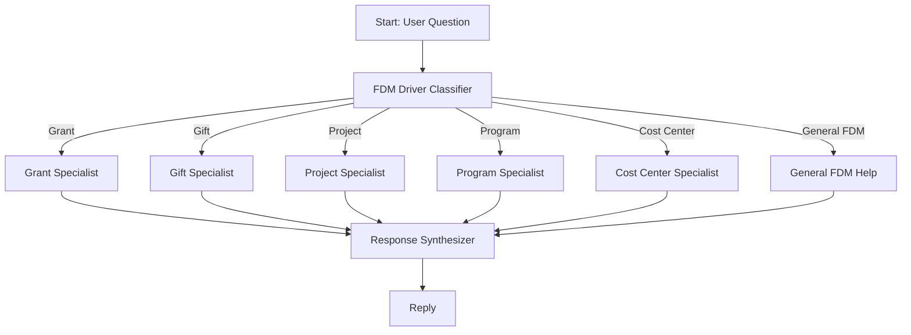

# The Anatomy of Smart Routing

## Video Caption

**"FDM Driver Worktag Router: A 6-way AI classifier routes financial questions to specialized Workday experts"**

---

## Section Content

When a staff member asks "How do I check my NSF grant budget?", they shouldn't wait in a general help queue. That question needs a Grant specialist—someone who understands F&A rates, cost share requirements, and sponsor compliance.

This Flowise flow does exactly that.



### The Core Concept: Driver Worktags

In Workday's Foundation Data Model (FDM), a **Driver Worktag** is the primary classification that automatically populates related worktags. Select "Grant" and the system fills Fund, Cost Center, Function, and Program for you.

There are five primary driver types:
- **Grant** → Sponsored research, external funding (NSF, NIH, DOE)
- **Gift** → Philanthropic donations, endowments, scholarship funds
- **Project** → Capital construction, infrastructure, building renovation
- **Program** → Operational activities, departmental services
- **Cost Center** → Departmental operations, organizational budgets

Each driver type has distinct rules, workflows, and compliance requirements. A gift fund can't be spent on unrelated activities. A grant can't exceed its award budget. A capital project tracks costs inception-to-date across fiscal years.

**This is why routing matters.** One generalist agent can't deeply understand all five domains. The classifier ensures each question reaches an expert who knows the specific worktag relationships, compliance rules, and common pitfalls.

### How the Classifier Works

The FDM Driver Classifier uses Claude Sonnet at temperature 0.1 (low variance for consistent routing). Its instructions include keyword matching and contextual understanding:

```javascript
{
  "model": "claude-sonnet-4-5",
  "temperature": 0.1,
  "scenarios": [
    "Grant - Sponsored research, external funding, awards, PI questions",
    "Gift - Philanthropic donations, endowments, donor funds",
    "Project - Capital construction, infrastructure, building projects",
    "Program - Operational programs, departmental activities",
    "Cost Center - Departmental operations, organizational budgets",
    "General FDM - Basic worktag questions, FDM concepts, general help"
  ]
}
```

The classifier analyzes keywords and context:

| Driver Type | Classification Keywords |
|-------------|------------------------|
| Grant | grant, award, PI, sponsored, NSF, NIH, F&A, indirect costs, effort reporting |
| Gift | donation, endowment, donor, philanthropy, scholarship, stewardship |
| Project | capital, construction, building, CIP, project phase, infrastructure |
| Program | program budget, service, auxiliary, academic program, activity |
| Cost Center | department, cost center manager, org, operating expenses |
| General | FDM, worktag, what is, how do I, explain, related worktag |

When input is ambiguous, the classifier chooses the **most specific** match. "My grant budget" → Grant. "My department budget" → Cost Center. If unclear, it defaults to General FDM (the fallback route).

### The Specialist Agents

Each specialist agent has deep domain knowledge embedded in its system prompt:

**Grant Specialist** knows:
- Related worktags that auto-populate (Fund, Cost Center, Function, Program)
- F&A rates and indirect cost calculations
- Allowable vs. unallowable costs
- Effort reporting requirements
- Sponsor compliance rules

**Gift Specialist** knows:
- Restricted vs. unrestricted gift distinctions
- Endowment principal vs. spendable income
- Donor intent and stewardship obligations
- Spending policies and distribution rates

**Project Specialist** knows:
- Project phases (design, construction, closeout)
- Construction in Progress (CIP) accounting
- Capitalization thresholds
- Inception-to-date vs. fiscal year reporting

And so on for Program, Cost Center, and General FDM.

### State Management: The Routing Audit Trail

When the classifier routes to Grant, the state updates reflect exactly what happened:

```javascript
{
  "$flow": {
    "state": {
      "routing": {
        "driver": "grant",
        "timestamp": "2025-11-18T14:23:15Z"
      },
      "grant": {
        "response": "To check your NSF grant budget, navigate to...",
        "relatedWorktags": "Fund, Cost Center, Function, Program",
        "completed": "true"
      },
      // Other routes remain empty (never executed)
      "gift": {},
      "project": {},
      "program": {},
      "costCenter": {},
      "general": {}
    }
  }
}
```

Only the selected branch writes to state. The five unused branches remain dormant—zero wasted computation.

### Why Six Routes Instead of One General Agent?

Consider the alternative: one mega-agent with all FDM knowledge. Problems emerge immediately:

1. **Prompt bloat**: System prompts become massive, reducing context for actual answers
2. **Shallow expertise**: No agent can be expert in everything
3. **Response quality**: Generalist answers lack specificity
4. **Maintenance burden**: Every update touches all knowledge

With routing:
- Each specialist agent has focused, maintainable prompts
- Domain expertise stays deep and current
- Responses reference specific worktag relationships and compliance rules
- Updates target only the affected specialist

This is the **domain specialization** pattern—let experts be experts.

### The General FDM Fallback

The sixth route handles questions that don't fit a specific driver type:

> "What's the difference between a driver and a related worktag?"

This is foundational FDM knowledge, not specific to Grant or Gift. The General FDM agent explains concepts at the right abstraction level and can redirect to specialists when the question gets specific.

Having a fallback prevents the worst outcome: routing failures that leave users without answers.

---

**The Result**: A staff member asks a Workday financial question. In under 2 seconds, the classifier determines the driver type, routes to the specialist, and returns an expert-level response with specific worktag guidance, compliance context, and next steps.

One classification. One path. The right specialist.

That's smart routing in action.
