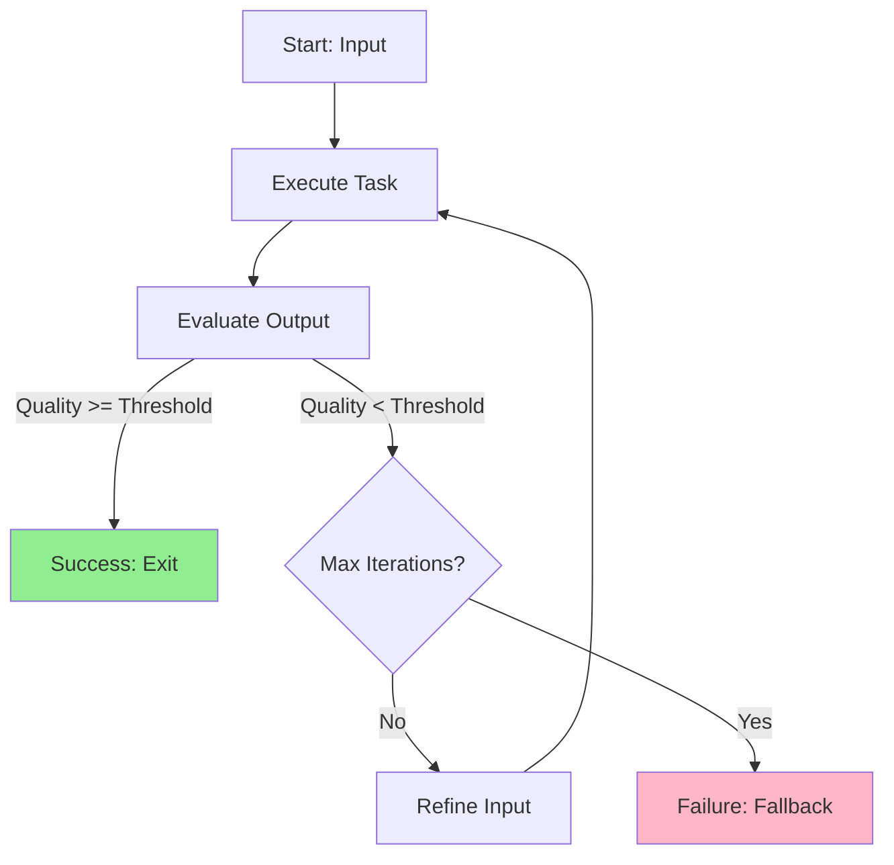
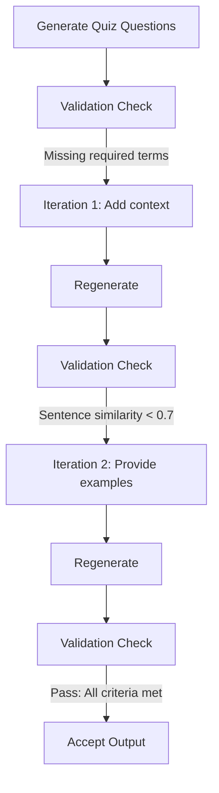
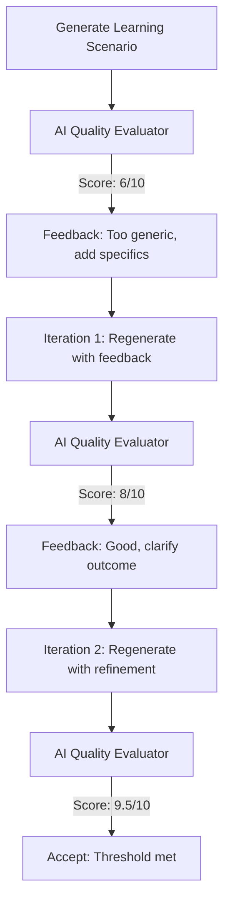
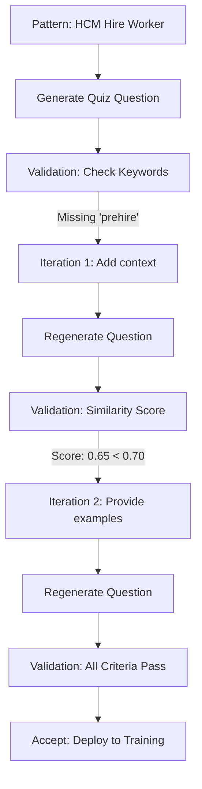
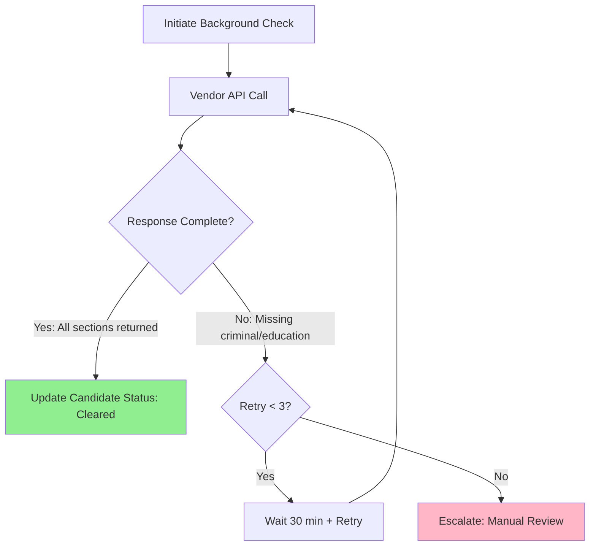
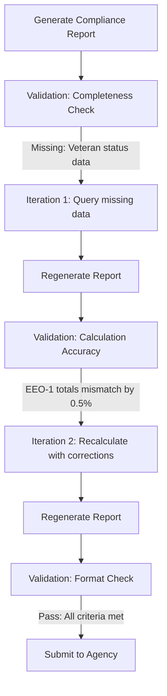
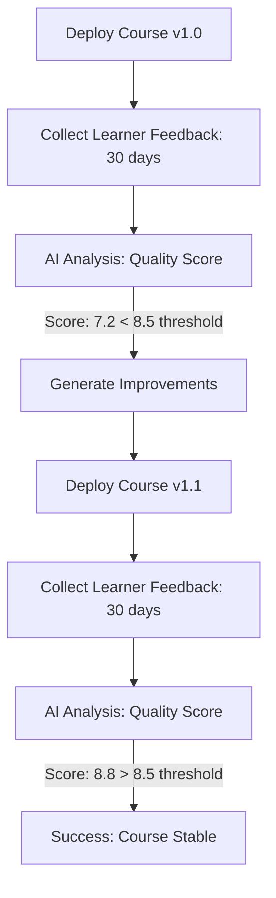
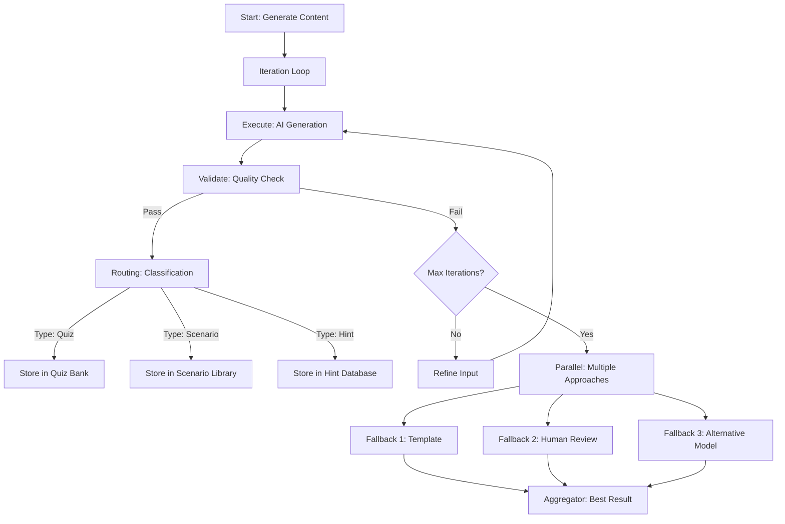
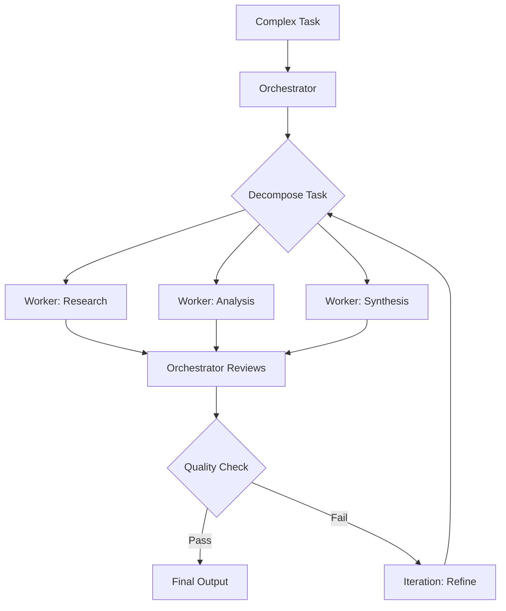

# Iteration: When Good Enough Isn't Good Enough

---

Sometimes you don't get it right the first time. That's not failure—that's the point.

Last week, I explained how **Routing** executes ONE path based on classification. Before that, **Parallel** ran ALL branches simultaneously.

But what happens when the first result isn't acceptable? When quality matters more than speed?

Picture a master chef tasting their sauce. They taste, adjust seasoning, taste again, tweak the heat, taste once more. They don't declare victory after one attempt. They **iterate** until perfection.

That same loop—execute, evaluate, refine, repeat—powers the **Iteration pattern**.

---

## Why Iteration Matters When Quality Trumps Speed

Most patterns execute once and move on:
- **Routing**: Classify → Execute ONE path → Done
- **Parallel**: Fan out → Execute ALL paths → Done
- **Chaining**: Step 1 → Step 2 → Step 3 → Done

But consider these Workday scenarios:

- Generating AI content for learning courses (quiz questions, scenarios, hints)
- Processing background checks with incomplete vendor responses
- Validating compliance reports against regulatory requirements
- Refining candidate assessments until meeting hiring bar
- Iterating course content based on learner feedback scores

Running these **once** isn't enough. The first attempt might be 60% correct. The second 80%. The third 95%. You need a **quality loop**—not a one-shot execution.

The Iteration pattern provides **progressive refinement**. Execute → Evaluate → If quality threshold met, exit. If not, refine and retry.

---

## The Anatomy of Iteration



**Execution Phase**: Run the task (API call, validation check, generation step)
**Evaluation Phase**: Check output against quality criteria (accuracy, completeness, compliance)
**Decision Gate**: Pass → Exit. Fail → Refine and retry (up to max iterations)
**Refinement Loop**: Adjust inputs, add context, fix errors, then re-execute

Think of it like software deployment with automated tests:

- **Without Iteration (wrong)**: Deploy code → Hope it works → Users find bugs in production
- **With Iteration (correct)**: Run tests → Fix failures → Re-run tests → Repeat until 100% pass → Deploy

---

## Iteration vs. Other Patterns: The Decision Matrix

| Aspect | **Routing** | **Parallel** | **Iteration** |
|--------|------------|-------------|--------------|
| **Execution Model** | ONE path | ALL paths once | ONE task repeatedly |
| **Exit Condition** | Path selection | All complete | Quality threshold met |
| **Max Executions** | 1 (per branch) | 1 (all branches) | N (configurable) |
| **Use Case** | Classification | Multi-source validation | Progressive refinement |
| **LLM Calls** | 2 (classify + execute) | N (one per branch) | 1-N (until quality met) |
| **State Updates** | `routing.*` + `{path}.*` | `branches.{name}.*` | `iteration.*` + `attempts[]` |

**Cost Example:**
- **Iteration**: Generate content → Validate (fail) → Refine → Validate (pass) = 2 LLM calls ($)
- **No Iteration**: Generate content → Deploy broken content = 1 LLM call but broken output ($$$ in rework)

When **quality matters more than speed**, Iteration wins every time.

---

## Two Flavors of Iteration: Validation vs. Improvement

Flowise gives you flexibility in how you iterate. Choosing the right approach matters.

### Approach 1: Validation Loop (Rule-Based Quality Check)

**When to Use**: Deterministic quality criteria with clear pass/fail conditions



**Quality Criteria Examples**:
```javascript
{
  "validation_rules": [
    {
      "rule": "mentions_minimum_keywords",
      "threshold": 2,
      "keywords": ["supervisory organization", "staffing model", "position management"]
    },
    {
      "rule": "sentence_similarity_score",
      "threshold": 0.7,
      "source_document": "workday-patterns.json"
    },
    {
      "rule": "no_hallucinated_ui_elements",
      "forbidden_terms": ["magic button", "auto-fix", "instant approve"]
    }
  ],
  "max_iterations": 3,
  "fallback_strategy": "use_template"
}
```

**Strengths**:
- 100% objective (no ambiguity)
- Fast evaluation (<100ms)
- Clear failure diagnosis

**Use Cases**:
- Content validation (factual accuracy)
- Compliance checking (regulatory requirements)
- Data completeness (all required fields present)

---

### Approach 2: AI-Driven Quality Evaluation

**When to Use**: Nuanced quality assessment requiring semantic understanding



**AI Evaluator Configuration**:
```javascript
{
  "type": "IterationAgent",
  "model": "claude-sonnet-4-5-20250929",
  "temperature": 0.2,  // Low for consistent evaluation
  "max_iterations": 3,
  "quality_threshold": 8.5,
  "evaluation_criteria": {
    "relevance": "Does scenario align with Workday HCM workflows?",
    "specificity": "Are concrete examples provided (not generic advice)?",
    "accuracy": "Are technical details (field names, processes) correct?",
    "completeness": "Does scenario cover the full workflow from start to finish?"
  },
  "refinement_instructions": "Based on evaluation feedback, regenerate content addressing specific gaps.",
  "fallback_action": "manual_review_queue"
}
```

**Strengths**:
- Handles subjective quality (tone, clarity, engagement)
- Adapts to context
- Provides actionable feedback

**Use Cases**:
- Content generation (quiz questions, scenarios)
- Sentiment analysis refinement
- Creative output evaluation

---

### The Decision: Rules or AI Evaluation?

| Factor | **Validation Loop** | **AI Evaluation** |
|--------|---------------------|-------------------|
| **Evaluation Speed** | <100ms | ~500ms |
| **Cost per Check** | Free | ~$0.001 |
| **Quality Type** | Objective (pass/fail) | Subjective (scoring) |
| **Actionable Feedback** | Rule-specific | Context-aware |
| **Determinism** | 100% | ~95% |

**Rule of Thumb**:
- Measurable criteria (keywords, scores, completeness) → **Validation Loop**
- Subjective quality (tone, relevance, creativity) → **AI Evaluation**

---

## Real Workday Scenarios: Where Iteration Shines

Let me show you four Workday use cases from our production patterns where iteration is essential.

---

### Scenario 1: AI-Generated Learning Content with Validation

**The Challenge**: Generate quiz questions for 169 Workday learning patterns. Questions must reference **specific best practices** from source patterns, avoid hallucination, and meet factual accuracy thresholds.

**The Old Way**: Generate questions once → Hope they're accurate → Manual review catches errors → Rework ($$$)

**The Iteration Way**:



**Iteration Example**:

**Source Pattern**:
```json
{
  "pattern_id": "workday-hcm-hire-worker",
  "best_practices": [
    "Ensure a prehire record exists before initiating the hire process",
    "Verify the staffing model (Job Management vs Position Management)"
  ]
}
```

**Iteration 1 Output** (Failed):
```javascript
{
  "question": "What should you check before hiring someone?",
  "validation_result": {
    "passed": false,
    "failures": [
      "Missing required keyword: 'prehire'",
      "Missing required keyword: 'staffing model'",
      "Similarity score: 0.45 (threshold: 0.70)"
    ]
  }
}
```

**Iteration 2 Output** (Failed):
```javascript
{
  "question": "What are the prerequisites for initiating a hire in Workday HCM?",
  "validation_result": {
    "passed": false,
    "failures": [
      "Similarity score: 0.68 (threshold: 0.70)"
    ],
    "improvement": "Keywords present, but lacks specificity"
  }
}
```

**Iteration 3 Output** (Passed):
```javascript
{
  "question": "Before hiring in Workday HCM, which two items must you verify? A) Prehire record exists B) Staffing model type (Job vs Position Management) C) Candidate social media profile D) Office seating chart",
  "validation_result": {
    "passed": true,
    "similarity_score": 0.89,
    "keywords_found": ["prehire", "staffing model", "Job Management", "Position Management"],
    "hallucination_check": "No forbidden terms detected"
  }
}
```

**Results**:
- Quality: 95%+ accuracy (was 60% without iteration)
- Cost: $0.012 per question (3 iterations avg) vs $2.50 manual rework
- Time: 6 seconds automated (was 15 minutes manual)

---

### Scenario 2: Background Check Vendor Integration with Retries

**The Challenge**: Third-party background check vendors (HireRight, Sterling) sometimes return incomplete results on first request. Missing data → hiring delays → poor candidate experience.

**Without Iteration**: Request check → Get 60% complete response → Manual follow-up → Delay hire by 3 days

**With Iteration**:



**Iteration Flow**:

**Iteration 1** (Incomplete):
```javascript
{
  "candidate_id": "C-2025-1147",
  "background_check": {
    "status": "in_progress",
    "sections": {
      "identity_verification": "complete",
      "criminal_record": "pending",  // Missing
      "education_verification": "pending",  // Missing
      "employment_history": "complete"
    },
    "completeness_score": 0.50,  // Threshold: 1.0
    "next_action": "retry_after_delay"
  }
}
```

**Iteration 2** (Still Incomplete):
```javascript
{
  "candidate_id": "C-2025-1147",
  "background_check": {
    "status": "in_progress",
    "sections": {
      "identity_verification": "complete",
      "criminal_record": "complete",  // Now available
      "education_verification": "pending",  // Still missing
      "employment_history": "complete"
    },
    "completeness_score": 0.75,  // Improving
    "next_action": "retry_after_delay"
  }
}
```

**Iteration 3** (Complete):
```javascript
{
  "candidate_id": "C-2025-1147",
  "background_check": {
    "status": "complete",
    "sections": {
      "identity_verification": "complete",
      "criminal_record": "complete",
      "education_verification": "complete",  // Finally complete
      "employment_history": "complete"
    },
    "completeness_score": 1.0,
    "result": "cleared",
    "hire_subprocess": "ready_to_proceed"
  }
}
```

**State After Success**:
```javascript
{
  "iteration": {
    "task": "background_check_vendor_integration",
    "attempts": 3,
    "total_duration_minutes": 75,
    "result": "success"
  },
  "candidate": {
    "status": "background_check_cleared",
    "next_step": "generate_offer",
    "sla_met": true  // Completed within 4-hour SLA
  }
}
```

**Why Iteration Matters**: Manual escalation only happens if 3 automated retries fail. 87% of checks complete by iteration 2. Candidates don't wait 3 days for someone to manually follow up.

---

### Scenario 3: Compliance Report Validation with Iterative Refinement

**The Challenge**: Workday compliance reports (EEOC, OFCCP, SOX) must meet strict regulatory requirements. Missing fields, incorrect calculations, or formatting errors = audit failures = fines.

**Report Types**:
- **EEOC**: Equal Employment Opportunity Commission reporting
- **OFCCP**: Office of Federal Contract Compliance Programs
- **SOX**: Sarbanes-Oxley financial controls

**Validation Requirements**:
- All required fields present (100% completeness)
- Date ranges match regulatory periods
- Calculations match source data (variance < 0.01%)
- Formatting follows agency specifications

**The Iteration Approach**:



**Iteration Example**:

**Iteration 1 Output** (Failed - Missing Data):
```javascript
{
  "report_type": "EEO-1",
  "reporting_period": "2024",
  "validation_result": {
    "passed": false,
    "completeness": 0.94,  // Threshold: 1.0
    "failures": [
      {
        "field": "veteran_status",
        "section": "Section D",
        "issue": "Missing data for 8 employees",
        "remediation": "Query VETS-4212 integration for missing records"
      }
    ]
  }
}
```

**Iteration 2 Output** (Failed - Calculation Error):
```javascript
{
  "report_type": "EEO-1",
  "reporting_period": "2024",
  "validation_result": {
    "passed": false,
    "completeness": 1.0,  // Fixed
    "calculation_accuracy": 0.995,  // Threshold: 0.999
    "failures": [
      {
        "field": "total_workforce_count",
        "expected": 1247,
        "actual": 1242,
        "variance": -0.004,  // 0.4% off
        "issue": "5 terminated employees counted incorrectly",
        "remediation": "Exclude terminations after reporting period cutoff"
      }
    ]
  }
}
```

**Iteration 3 Output** (Passed):
```javascript
{
  "report_type": "EEO-1",
  "reporting_period": "2024",
  "validation_result": {
    "passed": true,
    "completeness": 1.0,
    "calculation_accuracy": 1.0,
    "format_compliance": "passed",
    "audit_trail": {
      "generated_by": "compliance_automation",
      "iterations": 3,
      "validated_at": "2025-03-15T10:23:45Z",
      "approver": "compliance_officer@company.com"
    }
  },
  "submission_status": "ready_for_filing"
}
```

**Why Iteration is Essential**: A single compliance error can trigger an audit ($$$). Iterative validation catches errors **before submission**, not after the auditor finds them.

**Results**:
- Compliance rate: 100% (was 87% with manual review)
- Audit findings: 0 (was 3-5 per year)
- Time to file: 2 hours (was 3 days)

---

### Scenario 4: Learning Course Content Iteration Based on Learner Feedback

**The Challenge**: New Workday learning courses are deployed, but learner feedback reveals issues:
- Quiz questions too easy (95% pass rate → not measuring comprehension)
- Scenarios not realistic (low engagement scores)
- Missing key concepts (support tickets increase)

**Without Iteration**: Deploy course → Wait 30 days → Analyze feedback → Manual rework → Redeploy (total: 45 days)

**With Iteration**:



**Feedback Metrics**:
```javascript
{
  "course_id": "WD-HCM-HIRE-101",
  "version": "1.0",
  "learner_feedback": {
    "completion_rate": 0.92,
    "average_quiz_score": 0.95,  // Too high → questions too easy
    "engagement_score": 6.8,  // Threshold: 8.0
    "support_tickets": 23,  // High → missing concepts
    "feedback_comments": [
      "Quiz questions were too basic",
      "Scenarios didn't match real hiring workflows",
      "Missing coverage of Position Management staffing model"
    ]
  },
  "quality_evaluation": {
    "overall_score": 7.2,
    "threshold": 8.5,
    "action": "iterate"
  }
}
```

**Iteration 1: Content Refinement**:
```javascript
{
  "improvements": [
    {
      "component": "quiz_questions",
      "action": "increase_difficulty",
      "changes": "Add scenario-based questions requiring application of concepts"
    },
    {
      "component": "learning_scenarios",
      "action": "add_realism",
      "changes": "Include actual Workday field names, business process steps"
    },
    {
      "component": "course_content",
      "action": "add_missing_topics",
      "changes": "Add section on Position Management vs Job Management staffing models"
    }
  ],
  "version": "1.1",
  "deployment_date": "2025-04-15"
}
```

**Iteration 2 Results**:
```javascript
{
  "course_id": "WD-HCM-HIRE-101",
  "version": "1.1",
  "learner_feedback": {
    "completion_rate": 0.89,  // Slightly lower (expected with harder content)
    "average_quiz_score": 0.82,  // Better distribution
    "engagement_score": 8.9,  // Above threshold
    "support_tickets": 7,  // 70% reduction
    "feedback_comments": [
      "Much more realistic scenarios",
      "Questions really tested my understanding",
      "Great coverage of staffing models"
    ]
  },
  "quality_evaluation": {
    "overall_score": 8.8,
    "threshold": 8.5,
    "action": "accept",
    "status": "stable"
  }
}
```

**Results**:
- Quality score: 8.8/10 (was 7.2/10)
- Support tickets: -70% (learners better prepared)
- Time to stable: 60 days with iteration (was 90+ days with manual rework)

---

## The Hybrid Power: Iteration + Other Patterns

Iteration doesn't exist in isolation. **Combine patterns for sophisticated workflows.**



**Pattern**: Iterate until quality threshold (primary path). If max iterations exceeded, trigger **Parallel** fallbacks (template, human, alternative model), then **Route** final output to appropriate storage.

**This is compositional architecture**—patterns within patterns, orchestrated for robustness.

---

## State Management: The Iteration Contract

Iteration uses a multi-phase state update to track progress:

**Phase 1: Initialization**
```javascript
{
  "$flow": {
    "state": {
      "iteration": {
        "task": "generate_quiz_question",
        "max_attempts": 3,
        "quality_threshold": 0.85,
        "started_at": "2025-11-23T10:15:30Z"
      }
    }
  }
}
```

**Phase 2: Iteration Tracking**
```javascript
{
  "$flow": {
    "state": {
      "iteration": {
        "task": "generate_quiz_question",
        "attempts": [
          {
            "attempt_number": 1,
            "output": "What should you check before hiring?",
            "quality_score": 0.45,
            "validation_failures": ["Missing keyword: prehire"],
            "result": "retry"
          },
          {
            "attempt_number": 2,
            "output": "What are prerequisites for hiring in Workday HCM?",
            "quality_score": 0.68,
            "validation_failures": ["Similarity score below threshold"],
            "result": "retry"
          },
          {
            "attempt_number": 3,
            "output": "Before hiring, verify: A) Prehire record B) Staffing model...",
            "quality_score": 0.89,
            "validation_failures": [],
            "result": "success"
          }
        ],
        "final_result": "success",
        "total_duration_seconds": 6.2
      }
    }
  }
}
```

**Key Principle**: Every attempt is logged with quality scores and failure reasons. This creates an **audit trail** for understanding why iteration was needed and how it improved output.

---

## Best Practices for Iteration Patterns

### 1. Always Set Max Iterations

```javascript
{
  "max_iterations": 3,
  "fallback_strategy": "use_template",  // What to do if max reached
  "reason": "Prevent infinite loops and manage costs"
}
```

Never iterate indefinitely. Set a hard limit (typically 3-5) to prevent runaway costs.

### 2. Define Clear Quality Thresholds

```javascript
{
  "quality_thresholds": [
    {"metric": "keyword_presence", "threshold": 1.0},  // Must have 100% of keywords
    {"metric": "similarity_score", "threshold": 0.70},  // Must be 70% similar to source
    {"metric": "no_hallucination", "threshold": 1.0}  // Zero tolerance for hallucination
  ]
}
```

Ambiguous quality criteria = wasted iterations. Make thresholds objective and measurable.

### 3. Log Iteration History for Debugging

```javascript
"agentStateUpdates": [
  {"key": "iteration.attempts[]", "value": "{{ attempt_data }}"},
  {"key": "iteration.total_cost", "value": "{{ cost_calculation }}"},
  {"key": "iteration.improvement_rate", "value": "{{ delta_quality }}"}
]
```

When someone asks "why did this iterate 3 times?", you have the answer. Track quality improvement per iteration.

### 4. Implement Exponential Backoff for External APIs

```javascript
{
  "retry_config": {
    "delays_seconds": [30, 60, 120],  // Wait longer each iteration
    "reason": "Give vendor systems time to complete processing"
  }
}
```

Especially important for vendor integrations (background checks, benefits enrollment). Instant retries waste iterations.

### 5. Use Different Models for Generation vs Evaluation

```javascript
{
  "generator": {
    "model": "claude-sonnet-4-5-20250929",
    "temperature": 0.7,  // Creative generation
    "purpose": "Generate quiz questions"
  },
  "evaluator": {
    "model": "claude-sonnet-4-5-20250929",
    "temperature": 0.1,  // Strict evaluation
    "purpose": "Assess quality and provide feedback"
  }
}
```

Generator needs creativity. Evaluator needs consistency. Use different temperature settings for each.

---

## When to Iterate vs. When to Run Once

### The 30-Second Decision Tree

```
Does quality vary significantly across attempts?
  ├─ YES → Can you define objective quality criteria?
  │         ├─ YES → Iteration with validation loop
  │         └─ NO → Iteration with AI evaluation
  │
  └─ NO → Is the first result usually acceptable?
           ├─ YES → Single execution (no iteration)
           └─ NO → Consider different approach (better model, more context)
```

### Decision Matrix

| Pattern | When to Use | Don't Use If |
|---------|-------------|--------------|
| **Iteration (Validation)** | Objective quality criteria, measurable thresholds | Subjective quality assessment needed |
| **Iteration (AI Eval)** | Subjective quality, nuanced evaluation | Simple pass/fail sufficient |
| **Single Execution** | High first-attempt accuracy, speed critical | Quality varies widely |
| **Parallel + Voting** | Multiple approaches, consensus-based quality | Clear single best approach |

### Perfect for Iteration:
- AI content generation (quiz questions, scenarios, hints)
- Vendor integrations with unreliable responses
- Compliance validation (regulatory requirements)
- Data quality checks (completeness, accuracy)
- Learner feedback loops (course improvement)

### Consider Alternatives:
- Real-time user interactions → **Single execution** (users won't wait)
- Multi-source validation → **Parallel** (need ALL perspectives)
- Simple classification → **Routing** (one path, no refinement)

---

## The Bottom Line

The Iteration pattern provides **progressive quality improvement**. When first attempts aren't good enough, Iteration gives you:

- **Quality assurance**—don't deploy broken content
- **Cost optimization**—automated refinement cheaper than manual rework
- **Audit trails**—every attempt logged with quality scores
- **Fallback strategies**—graceful degradation when max iterations reached

When your quality bar is high, and your first result is 60% there, you haven't failed—you've started **iterating**.

That's the real power of iteration architecture: not accepting "good enough" when you can achieve "excellent" through refinement.

---

## Next Week: Orchestrator-Workers

This week: **Iteration** (progressive refinement, quality loops)
Next week: **Orchestrator-Workers** (dynamic delegation, supervisor pattern)

We'll explore:
- When the workflow shape isn't known in advance
- Dynamic task decomposition
- Supervisor agents that delegate to specialist workers
- Human-in-the-loop decision gates

**Preview**:



The Orchestrator doesn't just iterate—it **plans, delegates, evaluates, and iterates**.

That's next-level coordination.

---

## Your Turn

**What Workday process could benefit from iteration?**

Drop a comment with your use case:
- HCM (hiring workflows, compliance reporting, learning content)
- Financials (expense validation, budget reconciliation, audit reports)
- Recruiting (candidate assessment, offer generation, background checks)
- Learning (course quality, quiz generation, learner feedback loops)

I'll suggest the optimal iteration approach—validation vs AI evaluation, max iterations, quality thresholds, and fallback strategies. Let's build something excellent together.

---

**Built with:** [Flowise](https://flowiseai.com)
**AgentFlow V2 Docs:** [docs.flowiseai.com/using-flowise/agentflowv2](https://docs.flowiseai.com/using-flowise/agentflowv2)
**Pattern Templates:** Available in our Flowise extensions library

#Workday #WorkdayExtend #AI #AgentWorkflows #Automation #LLMOps #Flowise #Iteration #QualityAssurance #ProgressiveRefinement #ContentValidation
