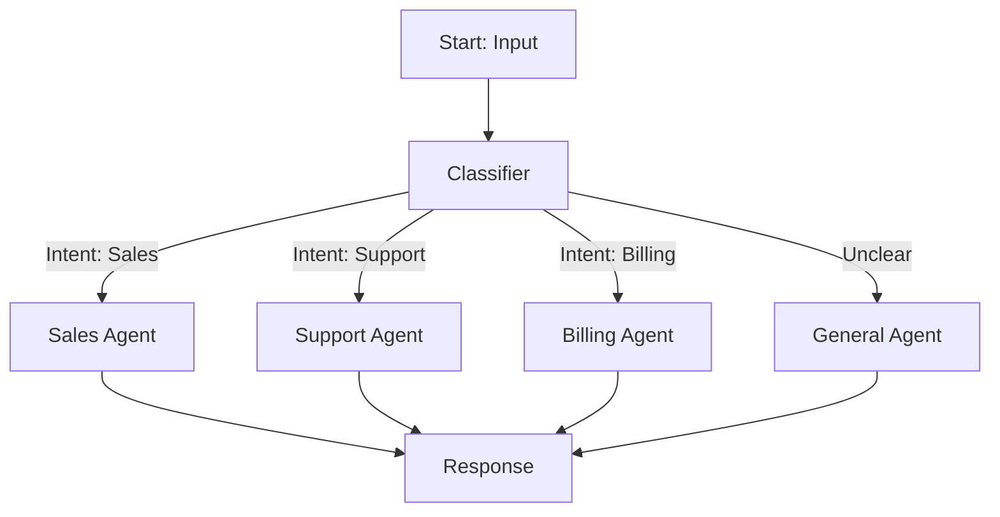
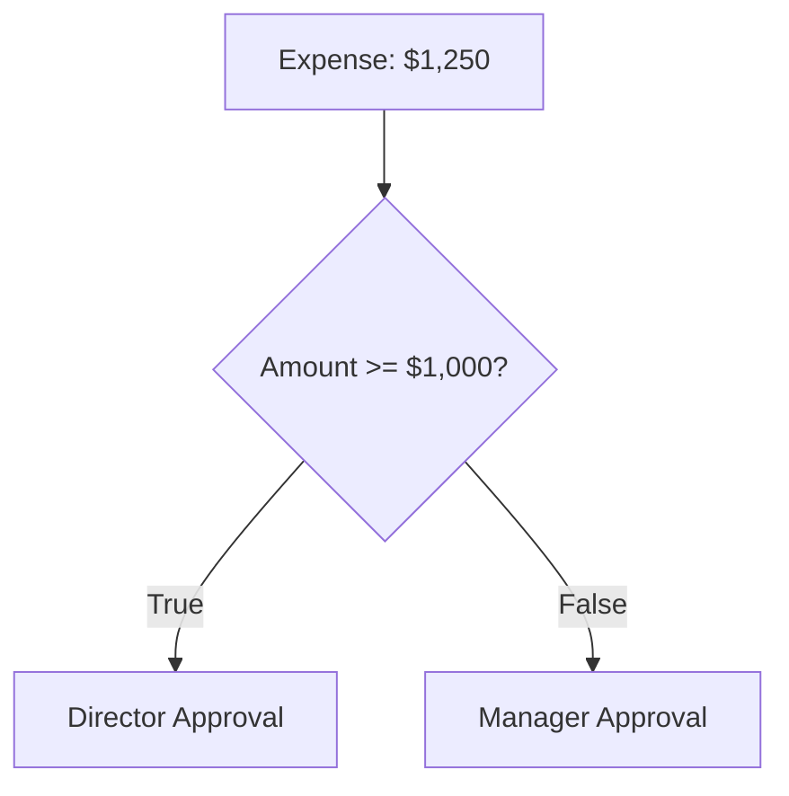
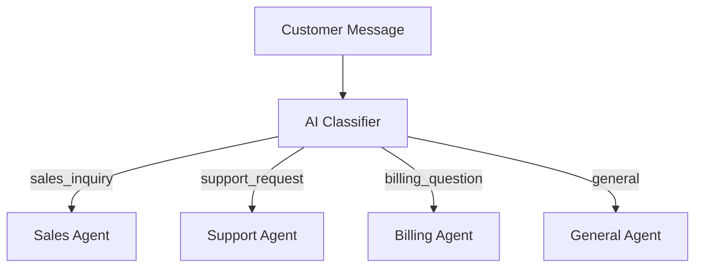
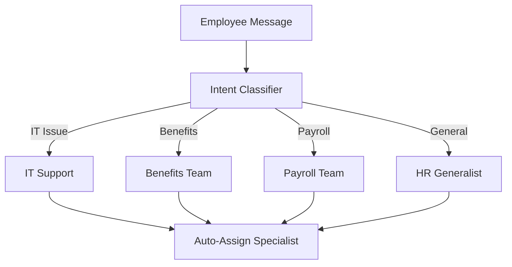
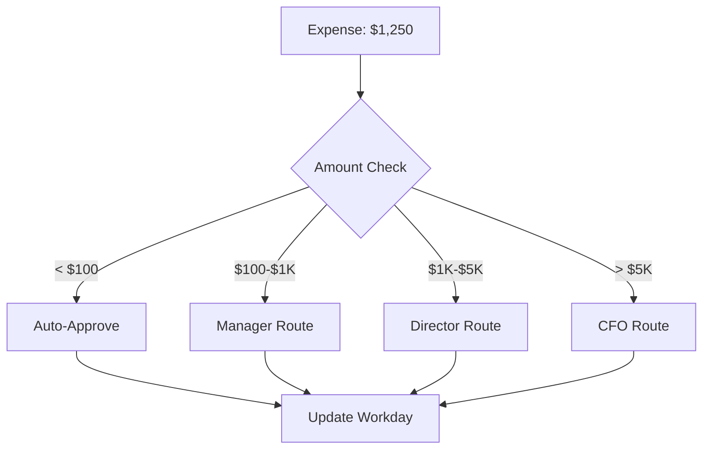
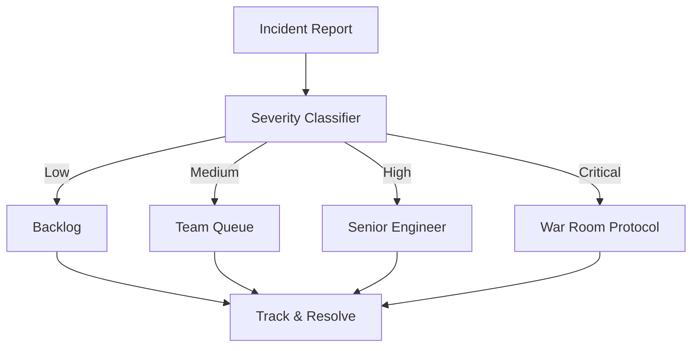
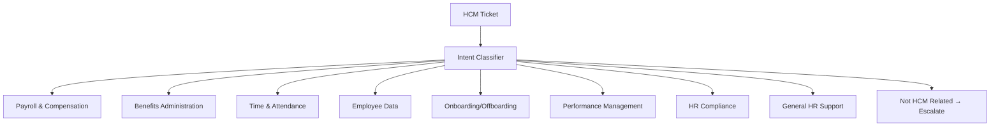
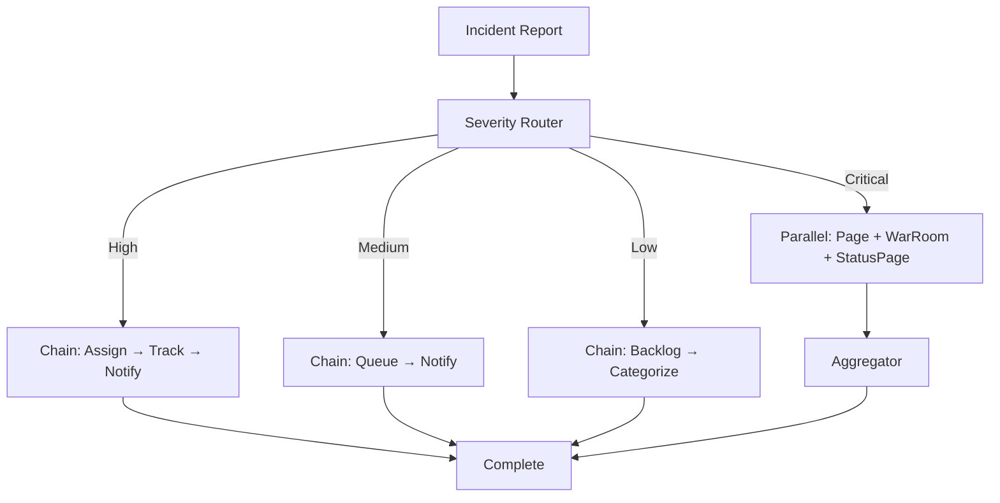
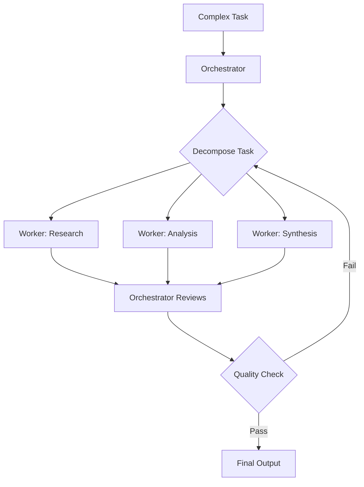

# Smart Routing: When Only ONE Path Executes

---

Only one route executes. That's the difference between Parallel and Smart Routing.

Last week, I explained how Parallel runs ALL branches simultaneously—perfect when you need comprehensive context from multiple perspectives before deciding.

But what happens when you *shouldn't* run all branches?

Picture an emergency room triage nurse. A patient arrives. In 30 seconds, the nurse assesses:

- Chest pain? → Code Red, cardiac unit
- Broken finger? → Urgent care, 15-minute wait
- Flu symptoms? → General examination room

The nurse doesn't send every patient through every department. That would be chaos.

One assessment. One path. The right specialist at the right time.

That's Smart Routing.

---

## Why Routing Matters When Parallel Wastes Resources

Parallel is powerful when tasks are independent and you need ALL results. But consider:

- Classifying customer intent (support vs. sales vs. billing)
- Routing by severity (low → queue, critical → page oncall)
- Domain specialization (HR vs. Finance vs. IT)
- Approval thresholds ($100 vs. $5,000)

Running **all branches** when you only need **one** isn't just wasteful—it's architecturally wrong.

If the expense is $75, why invoke the CFO approval workflow? If the intent is "billing question," why spin up the Sales and Technical agents?

The Routing pattern is about **intelligent classification** followed by **selective execution**.

---

## The Anatomy of Smart Routing



**Classification**: Analyze input to determine the appropriate path
**Route Selection**: Choose ONE branch based on classification
**Execution**: Run only the selected branch—others remain dormant

Think of it like a corporate switchboard:

- **Parallel (wrong)**: Connect caller to Sales, Support, AND Billing simultaneously → chaos
- **Routing (correct)**: "How can I help you?" → connect to ONE department → efficient

---

## Routing vs. Parallel: The Decision Matrix

| Aspect | **Parallel** | **Routing** |
|--------|-------------|------------|
| **Branches Executed** | ALL run | ONE runs |
| **Decision Point** | None (always fan-out) | Classifier decides path |
| **Use Case** | Multi-source validation | Intent classification |
| **LLM Calls** | N (one per branch) | 2 (classifier + selected branch) |
| **Resource Usage** | High | Low |
| **State Updates** | `branches.{name}.*` for all | `routing.*` + `{selectedPath}.*` |

**Cost Example:**
- **Parallel**: Run [Support, Sales, Billing] = 3 LLM calls ($$$)
- **Routing**: Classify → run only Sales = 2 LLM calls ($)

When branches are mutually exclusive, Routing wins every time.

---

## The Two Faces of Routing: Rules vs. Intelligence

Flowise gives you two routing mechanisms. Choosing the right one matters.

### Approach 1: Condition Node (Rule-Based)

**When to Use**: Deterministic logic based on explicit values



**Operators**: `equal`, `notEqual`, `contains`, `larger`, `smaller`, `isEmpty`, `regex`

**Output**: Binary (true/false)

**Example Configuration**:
```javascript
{
  "type": "Condition",
  "conditions": [
    {
      "variable": "$flow.state.expense.amount",
      "operation": "larger",
      "value": 1000
    }
  ]
}
```

**Strengths**:
- Instant (<1ms)
- Zero LLM cost
- 100% deterministic

**Use Cases**:
- Amount thresholds (>$1000 → escalate)
- Status gates (approved → proceed)
- Role checks (admin → grant access)

---

### Approach 2: Condition Agent (AI-Driven)

**When to Use**: Complex intent requiring nuanced understanding



**Output**: N paths (one per scenario)

**Example Configuration**:
```javascript
{
  "type": "ConditionAgent",
  "model": "claude-sonnet-4-5-20250929",
  "temperature": 0.1,  // Low for deterministic classification
  "instructions": "Classify customer intent into ONE scenario",
  "scenarios": [
    {"name": "sales_inquiry", "description": "Interested in purchasing, pricing, demos"},
    {"name": "support_request", "description": "Help with existing product, troubleshooting"},
    {"name": "billing_question", "description": "Invoices, payments, subscriptions"},
    {"name": "general", "description": "Unclear intent, feedback, other"}
  ]
}
```

**Strengths**:
- Handles ambiguity and nuance
- Multiple output paths (not just binary)
- Adapts to context

**Use Cases**:
- Intent classification
- Document type detection
- Sentiment-based routing
- Severity assessment

---

### The Decision: Rules or Intelligence?

| Factor | **Condition Node** | **Condition Agent** |
|--------|-------------------|---------------------|
| **Complexity** | Simple comparisons | Nuanced understanding |
| **Paths** | 2 (true/false) | N (one per scenario) |
| **Cost** | Free | ~$0.001 per call |
| **Speed** | <1ms | ~500ms |
| **Determinism** | 100% | ~95% |

**Rule of Thumb**:
- Measurable values → **Condition Node**
- Contextual understanding → **Condition Agent**

---

## Real Workday Scenarios: Where Routing Shines

Let me show you four Workday use cases from our production patterns.

---

### Scenario 1: HCM Ticket Routing

**The Challenge**: Employees submit support requests via Workday. Requests range from password resets to benefits questions to payroll discrepancies. Each needs a different specialist.

**The Old Way**: All tickets → general queue → HR admin manually routes → 15-minute delay

**The Routing Way**:



**Classification Example**:

Employee message:
> "I'm trying to enroll in the HSA plan but the deadline page won't load. I keep getting an error when I click 'Confirm Enrollment'."

```javascript
{
  "routing": {
    "intent": "benefits_team",
    "confidence": 0.94,
    "keywords": ["enroll", "HSA plan", "deadline", "error"],
    "reasoning": "HSA enrollment + technical portal issue"
  }
}
```

**State After Routing**:
```javascript
{
  "routing": {...},  // preserved for audit trail
  "benefits": {
    "ticketId": "BEN-2025-1147",
    "issue": "HSA enrollment portal error",
    "priority": "HIGH",  // deadline-sensitive
    "assignedTo": "benefits_specialist@company.com",
    "sla": "4 hours"
  }
}
```

**Results**:
- Time: 2 seconds (was 15 minutes)
- Improvement: 87% faster
- Impact: Employees get instant specialist assignment

---

### Scenario 2: Expense Approval Workflow

**The Challenge**: Expenses need different approvers based on amount:
- <$100: Auto-approve
- $100-$1,000: Manager
- $1,000-$5,000: Director
- >$5,000: CFO + audit trail

**This is Rule-Based**—no AI needed:



**Routing Decision** (for $1,250 expense):
```javascript
{
  "routing": {
    "amount": 1250,
    "selectedPath": "director_approval",
    "rule": "amount >= 1000 && amount < 5000",
    "approver": "Jane Smith (Director, Engineering)"
  }
}
```

**State After Director Route**:
```javascript
{
  "director_approval": {
    "approver": "jane.smith@company.com",
    "expense": {
      "employee": "John Doe",
      "amount": 1250,
      "category": "Client Entertainment",
      "businessPurpose": "Q4 partnership discussions"
    },
    "approvalDeadline": "2025-11-16T17:00:00Z",
    "escalationRules": {
      "noResponse": "Auto-escalate to CFO after 48hrs"
    }
  }
}
```

**Why This Matters**: The manager never sees this expense (it's above their authority). The director gets it immediately. Zero manual escalation, zero bottleneck.

---

### Scenario 3: Incident Severity Routing

**The Challenge**: IT incidents range from "printer jam" to "Workday is down." Each severity level needs different response:

- **Low**: Add to backlog
- **Medium**: Queue for team
- **High**: Assign senior engineer + notify manager
- **Critical**: Page oncall + open war room + customer notice

**This Needs AI**—severity assessment requires context:



**Classification Example**:

Incident:
> "Workday login page returning 503 errors. All employees unable to access HCM."

```javascript
{
  "routing": {
    "severity": "critical",
    "confidence": 0.97,
    "reasoning": "Production system down, affects all users, no workaround",
    "impactScore": 10,
    "urgencyScore": 10
  }
}
```

**Critical Route Execution**:
```javascript
{
  "critical": {
    "incidentId": "INC-2025-8821",
    "severity": "P0 - Critical Outage",
    "actions": [
      {
        "type": "page_oncall",
        "method": ["PagerDuty", "SMS", "Phone"],
        "status": "SENT"
      },
      {
        "type": "war_room",
        "channel": "#incident-8821",
        "participants": ["SRE", "Engineering leads", "CTO"]
      },
      {
        "type": "status_page",
        "message": "Workday HCM login experiencing issues. Investigating."
      }
    ],
    "sla": "15 min acknowledge, 1 hour resolve"
  }
}
```

**Why Routing Matters**: A printer jam doesn't page the oncall engineer at 2am. A production outage doesn't sit in a queue for 3 hours. Each severity gets the appropriate response—automatically.

---

### Scenario 4: ServiceNow HCM Ticket Router

This is a real pattern from our template library—9-way routing for HCM support tickets:



**Classification Keywords** (from the pattern):

| Route | Keywords |
|-------|----------|
| Payroll | invoice, payment, salary, bonus, deduction |
| Benefits | HSA, enrollment, benefits deadline, 401k |
| Time | timesheet, PTO, leave request, overtime |
| Employee Data | name change, address update, emergency contact |
| Onboarding | new hire, orientation, termination, exit interview |
| Performance | review, goals, development plan, feedback |
| Compliance | policy, regulations, audit, violation |

**SLAs by Route**:
- Payroll: 4 hours (critical), 24 hours (standard)
- Benefits: 8 hours (deadline-sensitive)
- General HR: 24 hours

One classifier, nine specialized response paths, automatic SLA assignment.

---

## The Hybrid Power: Routing + Parallel

Here's where it gets interesting. **Routing and Parallel aren't mutually exclusive.**



**Pattern**: Route first (determine severity), then execute the appropriate sub-pattern within that route.

For Critical incidents, you run parallel actions (page, war room, status page—all simultaneously). For Low incidents, you run a simple chain.

**The routing decides WHICH pattern to use. Then that pattern executes.**

This is compositional architecture—patterns within patterns.

---

## State Management: The Routing Contract

Routing uses a two-phase state update:

**Phase 1: Classification**
```javascript
{
  "$flow": {
    "state": {
      "routing": {
        "intent": "billing_question",
        "confidence": 0.91,
        "reasoning": "Keywords: invoice, payment, overdue",
        "timestamp": "2025-11-14T10:23:15Z"
      }
    }
  }
}
```

**Phase 2: Selected Route Execution**
```javascript
{
  "$flow": {
    "state": {
      "routing": {...},  // preserved
      "billing": {
        "ticketId": "BIL-2025-8833",
        "issue": "Invoice payment status",
        "response": "Your invoice #4521 was processed...",
        "completed": true
      },
      // Other routes remain empty (never executed)
      "sales": {},
      "support": {}
    }
  }
}
```

**Key Principle**: Only the selected branch writes to state. Non-selected branches remain dormant—zero wasted resources.

---

## Best Practices for Smart Routing

### 1. Always Have a Fallback Route

```javascript
"scenarios": [
  {"name": "sales_inquiry", "description": "..."},
  {"name": "support_request", "description": "..."},
  {"name": "billing_question", "description": "..."},
  {"name": "general", "description": "Unclear intent, other topics"}  // Catch-all
]
```

Never leave unclassifiable inputs hanging. The "general" route handles edge cases gracefully.

### 2. Set Confidence Thresholds

```javascript
if (routing.confidence < 0.6) {
  route = "manual_review_queue"
  reason = "AI confidence below threshold"
}
```

When the classifier isn't sure, escalate to a human. Don't guess.

### 3. Log Classification Decisions

```javascript
"agentStateUpdates": [
  {"key": "routing.intent", "value": "{{ selectedScenario }}"},
  {"key": "routing.confidence", "value": "{{ confidence }}"},
  {"key": "routing.reasoning", "value": "{{ reasoning }}"},
  {"key": "routing.timestamp", "value": "{{ timestamp }}"}
]
```

Every routing decision should be traceable. When someone asks "why did this go to Billing?", you have the answer.

### 4. Test Edge Cases

Challenge your classifier with:
- Boundary values (expense = exactly $1,000)
- Ambiguous messages ("I want a demo but my current system is broken")
- Multi-intent queries ("billing question AND feature request")
- Sarcasm and non-standard phrasing

### 5. Use Low Temperature for Classification

```javascript
{
  "model": "claude-sonnet-4-5-20250929",
  "temperature": 0.1  // Deterministic classification
}
```

You want consistent routing, not creative routing. Low temperature reduces variance.

---

## When to Route vs. When to Parallel

### The 30-Second Decision Tree

```
Is only ONE branch relevant at a time?
  ├─ YES → Can you define explicit rules?
  │         ├─ YES → Condition Node (rules-based)
  │         └─ NO → Condition Agent (AI-driven)
  │
  └─ NO → Are branches independent?
           ├─ YES → PARALLEL
           └─ NO → CHAINING
```

### Decision Matrix

| Pattern | When to Use | Don't Use If |
|---------|-------------|--------------|
| **Routing (Rules)** | Binary decisions, thresholds, status gates | Need nuanced classification |
| **Routing (AI)** | Intent classification, multi-way routing | Simple true/false logic |
| **Parallel** | Independent tasks, all results needed | Mutually exclusive branches |
| **Chaining** | Sequential dependencies, order matters | No dependencies exist |

### Perfect for Routing:
- ✅ Customer support intent classification
- ✅ Severity-based escalation
- ✅ Approval workflows (amount-based)
- ✅ Document type detection
- ✅ Domain-specific specialization

### Consider Alternatives:
- ❌ Multi-source research → **Parallel** (need ALL perspectives)
- ❌ Sequential pipelines → **Chaining** (order matters)
- ❌ Iterative refinement → **Iteration** (loops until quality threshold)

---

## The Bottom Line

The Routing pattern provides **selective intelligence**. When you have mutually exclusive paths, Routing gives you:

- **Efficient execution**—run ONE branch, not all
- **Intelligent classification**—AI or rules, your choice
- **Clear audit trails**—every decision logged with reasoning
- **Resource optimization**—2 LLM calls instead of N

When your classifier determines intent accurately, and your routes are properly specialized, you haven't just built a workflow—you've built a **dispatcher**.

That's the real power of routing architecture: not just branching, but *intelligent branching*.

---

## Next Week: Orchestrator-Workers

This week: **Routing** (selective, one path executes)
Next week: **Orchestrator-Workers** (dynamic delegation, supervisor pattern)

We'll explore:
- When the workflow shape isn't known in advance
- Dynamic task decomposition
- Supervisor agents that delegate to specialist workers
- Human-in-the-loop decision gates

**Preview**:



The Orchestrator doesn't just route—it **plans, delegates, and evaluates**.

That's next-level coordination.

---

## Your Turn

**What Workday process could benefit from smart routing?**

Drop a comment with your use case:
- HCM (ticket triage, onboarding flows, performance routing)
- Financials (expense approval, invoice classification, budget routing)
- Recruiting (candidate pipeline, role-based screening)
- IT Operations (incident severity, change management)

I'll suggest the optimal routing approach—rules vs. AI, threshold design, and fallback strategies. Let's build something intelligent together.

---

**Built with:** [Flowise](https://flowiseai.com)
**AgentFlow V2 Docs:** [docs.flowiseai.com/using-flowise/agentflowv2](https://docs.flowiseai.com/using-flowise/agentflowv2)
**Pattern Templates:** Available in our Flowise extensions library

#Workday #WorkdayExtend #AI #AgentWorkflows #Automation #LLMOps #Flowise #SmartRouting #ConditionalBranching #IntentClassification
