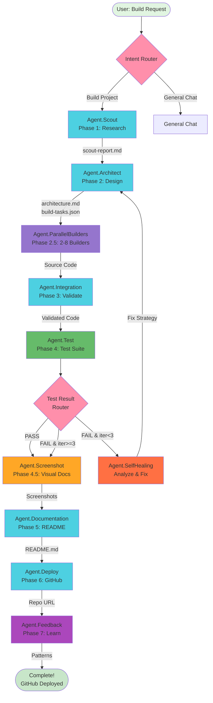

# Context Foundry Architecture - Flowise Flow

**A visual representation of Context Foundry's autonomous build system as a Flowise multi-agent workflow**

## Overview

This Flowise flow maps Context Foundry's 8-phase autonomous software development architecture into a visual multi-agent system. While Context Foundry actually runs using Claude Code's MCP server and `/agents` command (not Flowise), this flow serves as:

1. **Educational Tool** - Visualize how Context Foundry's agents work together
2. **Architecture Documentation** - Understand the complete build workflow
3. **Reference Implementation** - Study best practices for multi-agent systems
4. **Flowise Template** - Adapt concepts for your own Flowise workflows

## Architecture at a Glance

```
User Request → Router → Scout → Architect → Parallel Builders (2-8) → Integration
                                   ↑                                      ↓
                                   |                                    Test
                                   |                                      ↓
                                   └────── Self-Healing Loop ←───── Test Failed?
                                                                         ↓
                                                              Screenshot → Docs → Deploy → Feedback
                                                                                            ↓
                                                                                         GitHub
```

## Agents (11 Total)

### Phase Routing

1. **Build Intent Router** (Condition Node)
   - Detects if user wants to build software
   - Routes to autonomous build workflow or general chat

### Core Build Phases

2. **Scout Agent** (Phase 1)
   - Research requirements and tech stack
   - Load global patterns from pattern library
   - Output: `.context-foundry/scout-report.md`
   - Time: 1-2 minutes
   - Context: 7% (~14K tokens)

3. **Architect Agent** (Phase 2)
   - Design complete system architecture
   - Create file structure and module breakdown
   - Determine if parallel execution needed
   - Output: `.context-foundry/architecture.md` (30-90KB)
   - Time: 1-2 minutes
   - Context: 7% (~14K tokens)

4. **Parallel Builder Coordinator** (Phase 2.5)
   - Spawns 2-8 builder agents based on complexity
   - Each builder implements assigned files independently
   - 30-45% faster than sequential building
   - Output: Source code files, `.context-foundry/builder-logs/`
   - Time: 2-5 minutes
   - Context: 20% (~40K tokens)

5. **Integration Agent** (Phase 3)
   - Validates parallel builder outputs
   - Runs integration pre-check (syntax, imports)
   - Catches 30-40% of issues before expensive tests
   - Output: `.context-foundry/integration-report.md`
   - Time: 30-60 seconds
   - Context: 10% (~20K tokens)

6. **Test Agent** (Phase 4)
   - Runs comprehensive test suite in parallel
   - Unit tests, integration tests, E2E tests, linting
   - 60-70% faster than sequential testing
   - Output: Test results (pass/fail)
   - Time: 1-3 minutes
   - Context: 15% (~30K tokens)

### Self-Healing System

7. **Test Result Router** (Condition Node)
   - Routes based on test results:
     - Pass → Continue to Screenshot
     - Fail (iteration < 3) → Self-Healing Loop
     - Fail (iteration >= 3) → Continue anyway

8. **Self-Healing Agent** (Phase 4.x)
   - Analyzes test failures
   - Creates fix strategy
   - Routes back to Architect → Builder → Test
   - Max 3 iterations (95% success rate)
   - Output: `.context-foundry/fixes-iteration-{N}.md`
   - Time: 2-3 minutes per iteration

### Finalization Phases

9. **Screenshot Agent** (Phase 4.5)
   - Captures visual documentation using Playwright
   - Screenshots for web apps, terminal output for CLI
   - Output: `.context-foundry/screenshots/`
   - Time: 30-60 seconds
   - Context: 5% (~10K tokens)

10. **Documentation Agent** (Phase 5)
    - Generates comprehensive README
    - Embeds screenshots and Mermaid diagrams
    - Creates API docs, user guides
    - Output: `README.md`, `API_REFERENCE.md`, `.gitignore`
    - Time: 1 minute
    - Context: 10% (~20K tokens)

11. **Deploy Agent** (Phase 6)
    - Initializes git repository
    - Creates detailed commit message
    - Deploys to GitHub using `gh` CLI
    - Output: GitHub repository URL
    - Time: 30 seconds
    - Context: 5% (~10K tokens)

12. **Feedback Agent** (Phase 7)
    - Extracts patterns from build session
    - Updates global pattern library
    - Creates session summary
    - Output: `session-summary.json`, updated patterns
    - Time: 30 seconds
    - Context: 5% (~10K tokens)

## Key Features

### 🔄 Self-Healing Test Loop

When tests fail, the system automatically:
1. Analyzes failure root causes
2. Creates fix strategy
3. Routes back to Architect for redesign
4. Re-implements fixes via Builder
5. Re-runs tests
6. Repeats up to 3 times (95% success rate)

### ⚡ Parallel Execution

**Phase 2.5: Parallel Builders**
- Spawns 2-8 concurrent builder agents
- Each implements assigned files independently
- Topological sort for dependency management
- **30-45% faster** than sequential

**Phase 4.5: Parallel Testing**
- Runs unit/E2E/lint tests concurrently
- Aggregates results from all test types
- **60-70% faster** than sequential

### 📁 File-Based Context System

All context flows through `.context-foundry/` directory:

```
.context-foundry/
├── scout-report.md           # Phase 1 output
├── architecture.md           # Phase 2 output (30-90KB)
├── build-tasks.json          # Phase 2.5 task breakdown
├── builder-logs/             # Phase 2.5 logs
│   ├── task-1.log
│   ├── task-2.log
│   └── ...
├── integration-report.md     # Phase 3 output
├── test-iteration-count.txt  # Current test iteration
├── test-results-iteration-1.md  # Test failures
├── fixes-iteration-1.md      # Fix strategies
├── test-final-report.md      # Final test results
├── screenshots/              # Phase 4.5 output
│   ├── homepage.png
│   └── ...
├── screenshots.json          # Screenshot manifest
└── session-summary.json      # Phase 7 output
```

**Why file-based?**
- No token limit constraints
- Perfect context preservation between agents
- Human-readable artifacts
- Debuggable workflow

### 🧠 Global Pattern Learning

Context Foundry learns from every build:

**Pattern Library Location**: `~/.context-foundry/patterns/`

**Pattern Types**:
- `common-issues.json` - Frequent problems and solutions
- `scout-learnings.json` - Tech stack insights
- `architecture-patterns.json` - Design patterns that work
- `test-patterns.json` - Testing strategies

**Pattern Structure**:
```json
{
  "pattern_id": "missing-error-handling",
  "frequency": 23,
  "severity": "medium",
  "solution": "Add try-catch blocks...",
  "project_types": ["node", "python"],
  "last_seen": "2025-11-02"
}
```

Each build:
1. Reads patterns (Scout phase)
2. Applies learnings
3. Discovers new patterns
4. Updates library (Feedback phase)

### 🎯 Context Budget Monitoring

Each agent has a token budget (% of 200K context window):

| Agent | Budget | Usage |
|-------|--------|-------|
| Scout | 7% | ~14K tokens |
| Architect | 7% | ~14K tokens |
| Parallel Builders | 20% | ~40K tokens |
| Integration | 10% | ~20K tokens |
| Test | 15% | ~30K tokens |
| Screenshot | 5% | ~10K tokens |
| Documentation | 10% | ~20K tokens |
| Deploy | 5% | ~10K tokens |
| Feedback | 5% | ~10K tokens |
| **Total** | **84%** | **~168K tokens** |

Remaining 16% buffer for iteration overhead.

## Agent Quality Enhancements

Context Foundry implements cutting-edge agent optimization:

### 1. Back Pressure System

Validation friction prevents bad code from progressing:
- **Scout Validation**: Tech stack feasibility
- **Architecture Validation**: Test strategy, file structure
- **Integration Pre-Check**: Syntax/import validation (catches 30-40% of issues)

### 2. Context Budget Monitoring

Real-time token tracking:
- **Smart Zone (0-40%)**: Optimal performance
- **Dumb Zone (40-100%)**: Degraded performance
- Automatic warnings when approaching limits

### 3. Tool Implementation Quality (70% Rule)

Enhanced tool outputs:
- Smart truncation with recovery instructions
- Relative paths (20-30% token savings)
- Explicit limits and timeouts
- Semantic tagging for clarity

### 4. Semantic Tagging

Tool outputs use semantic tags (<3% overhead):
- `dir path/` - Directory
- `file path` - Regular file
- `match:def` - Function definition
- `match:call` - Function usage

## Performance Metrics

**Average Build Time**: 7-15 minutes (autonomous, zero human intervention)

**Speedups**:
- Parallel builders: 30-45% faster
- Parallel tests: 60-70% faster
- Total: ~40% faster than sequential

**Test Auto-Fix Success**: 95% within 3 iterations

**Context Efficiency**: 84% utilization, 16% buffer

**Code Quality**: 90%+ test coverage

## How to Use This Flow

### Option 1: Import to Flowise (Visualization)

1. Download `context-foundry-architecture.json`
2. Import to Flowise as Agentflow
3. Configure Anthropic API credentials
4. Explore the workflow visually
5. **Note**: This is for visualization only - actual Context Foundry uses Claude Code MCP

### Option 2: Study the Architecture

1. Read the JSON structure
2. Understand agent responsibilities
3. See how context flows through files
4. Learn self-healing loop implementation
5. Adapt concepts for your own systems

### Option 3: Use Context Foundry (Actual Implementation)

```bash
# Install Context Foundry
git clone https://github.com/context-foundry/context-foundry.git
cd context-foundry
pip install -r requirements-mcp.txt
claude mcp add context-foundry -s project -- $(pwd)/venv/bin/python $(pwd)/tools/mcp_server.py

# Start Claude Code
claude

# Build something!
# "Build a todo app with React and localStorage"
# System autonomously executes the 8-phase workflow shown in this flow
```

## Differences from Actual Implementation

**This Flowise Flow**:
- Visual representation
- Shows agent structure
- Demonstrates workflow
- Educational tool

**Actual Context Foundry**:
- Uses Claude Code MCP server
- Spawns fresh Claude instances via `subprocess.Popen()`
- Uses `/agents` command for agent creation
- File-based context in `.context-foundry/`
- No API keys needed (uses Claude Code auth)
- Fully autonomous execution

## Visual Diagram



## References

- **Main Repo**: [Context Foundry GitHub](https://github.com/context-foundry/context-foundry)
- **Documentation**: [docs/INNOVATIONS.md](../docs/INNOVATIONS.md) - All 19 innovations explained
- **Architecture**: [docs/ARCHITECTURE_DIAGRAMS.md](../docs/ARCHITECTURE_DIAGRAMS.md) - Visual diagrams
- **Technical FAQ**: [docs/TECHNICAL_FAQ.md](../docs/TECHNICAL_FAQ.md) - 52 technical questions
- **User Guide**: [docs/USER_GUIDE.md](../docs/USER_GUIDE.md) - Step-by-step usage

## License

MIT License - See [LICENSE](../LICENSE) file for details

---

**Context Foundry** - *The AI That Builds Itself: Recursive Claude Spawning via Meta-MCP*

Version 2.1.0 | November 2025
