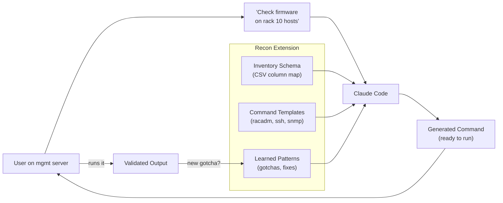
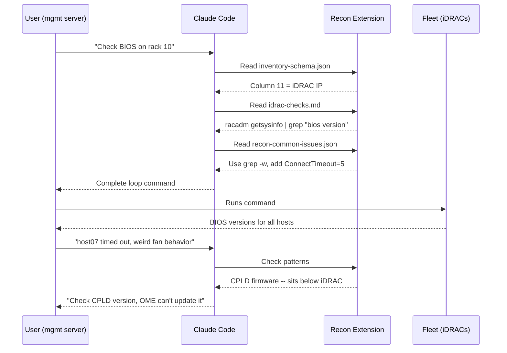
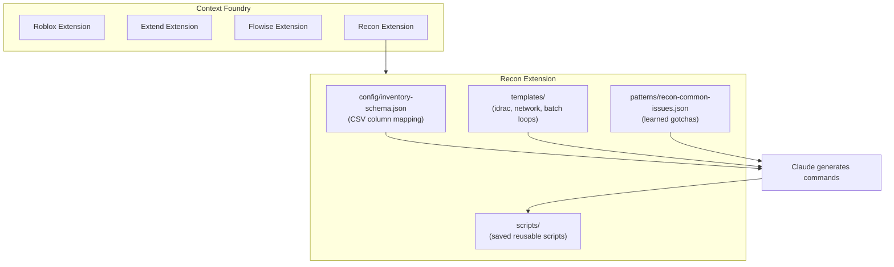

# Recon -- Fleet Reconnaissance Extension

> Quick infrastructure checks across server fleets, powered by inventory knowledge and learned patterns.

## What Is This?

Recon is a [Context Foundry](https://github.com/context-foundry/context-foundry) extension for **operational reconnaissance** -- the quick, ad-hoc checks sysadmins run from a management server to inspect fleet configuration, health, and state.

Instead of remembering CSV column numbers, `racadm` flags, and `awk` field positions, you describe what you need and Recon provides the context Claude needs to generate the right commands instantly.

**Repo:** [`context-foundry/context-foundry`](https://github.com/context-foundry/context-foundry) -- extension lives at `extensions/recon/`

## Quickstart

### Prerequisites

- [Claude Code](https://docs.anthropic.com/en/docs/claude-code) installed
- SSH access to a management server with iDRAC connectivity
- A server inventory CSV (e.g., `sourceoftruth.csv`)
- Host list files (e.g., `hosts.r10` for rack 10)

### Setup (5 minutes)

```bash
# 1. Clone the repo
git clone https://github.com/context-foundry/context-foundry.git
cd context-foundry

# 2. Configure your inventory schema
#    First, see what columns your CSV has:
head -1 ~/sourceoftruth.csv | awk -F, '{for(i=1;i<=NF;i++) print i": "$i}'

#    Then edit the schema to match your CSV:
vi extensions/recon/config/inventory-schema.json

# 3. That's it. Start Claude Code from the repo root:
claude
```

### Usage

Once Claude Code is running, just ask for what you need in plain English:

```
You: Check BIOS version on all rack 10 hosts via iDRAC

Claude reads:
  - extensions/recon/config/inventory-schema.json  (knows column 11 = iDRAC IP)
  - extensions/recon/templates/idrac-checks.md      (knows the racadm command)
  - extensions/recon/patterns/recon-common-issues.json (uses grep -w, adds timeouts)

Claude generates:
  for h in $(cat hosts.r10); do
    ip=$(grep -w "$h" ~/sourceoftruth.csv | awk -F, '{print $11}')
    echo "=== $h ($ip) ==="
    sshpass -f ~/.idrac_pass ssh -o StrictHostKeyChecking=no \
      -o ConnectTimeout=5 root@"$ip" racadm getsysinfo | grep -i "bios version"
  done
```

You copy-paste and run it. Or if Claude Code is on the management server, it runs it for you.

## The Problem

```
# You know what you want:
"Check BIOS version on all rack 10 hosts"

# But you have to remember:
# - Which file has rack 10 hosts?          (hosts.r10)
# - Which CSV column is the iDRAC IP?      (column 11)
# - What's the racadm command for BIOS?    (racadm getversion? getsysinfo? get BIOS.Setup.1-1?)
# - How to format the output?              (awk -F, '{print $11}')

# So you cobble together:
for i in `cat hosts.r10`; do echo $i; grep $i ~/sourceoftruth.csv | awk -F, '{print $11}'; done
# ...then SSH into each iDRAC and run the right racadm command
# ...then wonder if you got the right column
```

## How It Works



### Detailed Flow



## Architecture



## Folder Structure

```
extensions/recon/
├── CLAUDE.md                              # Domain rules -- read before ops work
├── README.md                              # This file
├── config/
│   └── inventory-schema.json              # CSV column mapping (EDIT THIS FIRST)
├── patterns/
│   └── recon-common-issues.json           # Learned gotchas and fixes
├── templates/
│   ├── idrac-checks.md                    # iDRAC/racadm command reference
│   ├── batch-loops.md                     # Loop patterns (sequential, parallel, error-handling)
│   └── network-checks.md                  # DNS, ping, port, SSL cert checks
├── scripts/
│   └── (saved scripts go here)            # Reusable scripts generated from sessions
└── docs/
    └── PLAN_recon-v1.md                   # Build plan for extending via Ralph loop
```

## Configuring Your Inventory

The single most important file is `config/inventory-schema.json`. This maps your CSV columns so Claude never asks "which column is the iDRAC IP?"

```bash
# See your CSV columns:
head -1 ~/sourceoftruth.csv | awk -F, '{for(i=1;i<=NF;i++) print i": "$i}'
```

Then update `inventory-schema.json`:

```json
{
  "file": "~/sourceoftruth.csv",
  "delimiter": ",",
  "columns": {
    "1": "hostname",
    "2": "serial_number",
    "3": "model",
    "5": "rack_location",
    "8": "os_ip",
    "11": "idrac_ip"
  },
  "host_files": {
    "pattern": "hosts.r{N}",
    "meaning": "Hostnames in rack N, one per line",
    "location": "~/"
  }
}
```

## What's in the Templates

### iDRAC Checks (`templates/idrac-checks.md`)
System info, BIOS version, RAID status, NIC config, firmware inventory, power state, health, event logs.

### Batch Loops (`templates/batch-loops.md`)
Seven loop patterns: basic sequential, iDRAC SSH, parallel (xargs), CSV-only lookup, multi-column, error-handling with failure list, output-to-file.

### Network Checks (`templates/network-checks.md`)
DNS forward/reverse, ping sweep, port checks, SSL certificate expiry.

## Learned Patterns

Patterns are gotchas discovered through real use. They ship with the extension and grow over time:

| Pattern | Severity | What It Catches |
|---------|----------|-----------------|
| `grep-substring-match` | MEDIUM | `grep web1` matching web10, web11 |
| `idrac-ssh-hang` | HIGH | SSH without timeout blocking entire loop |
| `unlabeled-batch-output` | LOW | Batch output you can't correlate to hosts |
| `cpld-firmware-not-in-ome` | HIGH | CPLD sits below iDRAC; OME can't update it |

## Extending Recon

### Add a new template
Drop a markdown file in `templates/` with command examples grouped by category.

### Add a learned pattern
Add to `patterns/recon-common-issues.json` following the existing pattern schema. Key fields: `pattern_id`, `issue`, `solution`, `severity`, `keywords`.

### Save a useful script
When Claude generates something worth reusing, save it to `scripts/` with a descriptive name.

### Build more with the Ralph loop
See `docs/PLAN_recon-v1.md` for Phase 2-5 tasks that Context Foundry's build loop can execute to extend Recon further.

## Why Not Just Use Dell OME?

Dell OpenManage Enterprise covers 90% of fleet management -- SNMP, firmware updates, discovery, health monitoring. Recon covers the other 10%:

| Use Case | OME | Recon |
|----------|-----|-------|
| Bulk firmware updates | Yes | No (use OME) |
| SNMP monitoring | Yes | No (use OME) |
| Quick ad-hoc check on 20 hosts | Click through 6 pages | One-liner in seconds |
| CPLD firmware updates | **No** | Yes (custom tooling) |
| "Which column is the iDRAC IP?" | N/A | Schema knows |
| Custom cross-reference queries | Limited | Any bash/awk combination |
| Tribal knowledge persistence | Wiki nobody reads | Patterns Claude reads every time |

## License

Part of [Context Foundry](https://github.com/context-foundry/context-foundry). See repo root for license.
