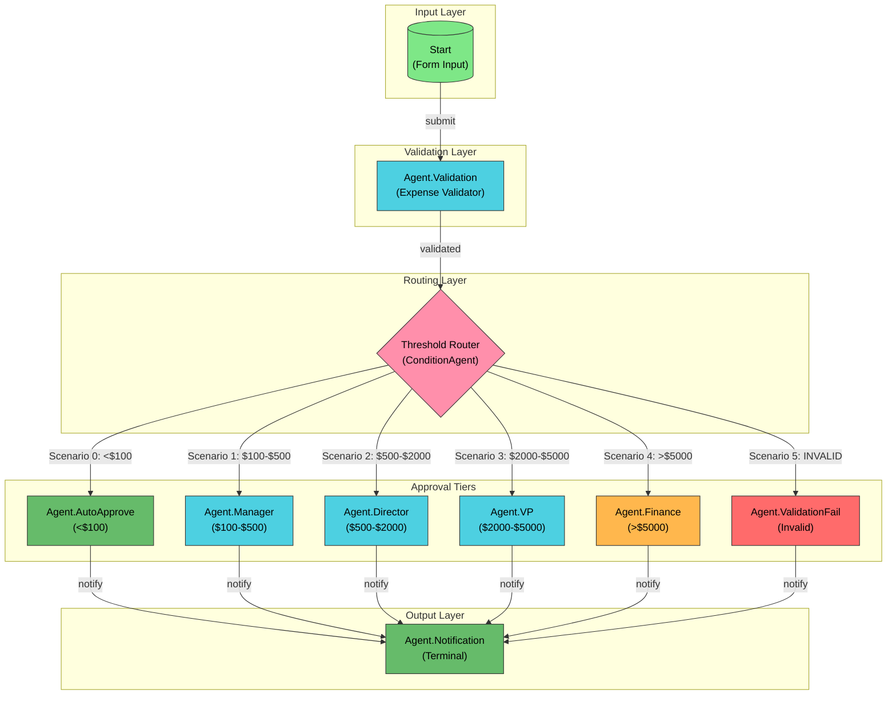

# Expense Approval Workflow - Visual Diagram

## Workflow Topology



## Workflow Statistics

| Metric | Value |
|--------|-------|
| Total Nodes | 10 |
| Total Edges | 14 |
| Pattern Type | Routing (Fan-out) |
| Approval Tiers | 5 |
| Decision Paths | 6 |

## Node Details

### Start Node
- **Type**: Start (Form Input)
- **Form Fields**: 6 (Amount, Category, Description, Receipt, Date, Submitter)
- **State Initialization**: 11 keys

### Validation Agent
- **Model**: Claude Sonnet 4.5
- **Temperature**: 0.1
- **Validation Rules**: 6 checks
- **Tools**: currentDateTime

### Threshold Router (ConditionAgent)
- **Model**: Claude Sonnet 4.5
- **Temperature**: 0.1
- **Output Scenarios**: 6

### Approval Agents

| Agent | Threshold | Color | Tools |
|-------|-----------|-------|-------|
| AutoApprove | <$100 | Green | currentDateTime |
| Manager | $100-$500 | Cyan | currentDateTime, searXNG |
| Director | $500-$2000 | Cyan | currentDateTime, searXNG |
| VP | $2000-$5000 | Cyan | currentDateTime, searXNG |
| Finance | >$5000 | Orange | currentDateTime, searXNG |
| ValidationFail | Invalid | Red | currentDateTime |

### Notification Agent (Terminal)
- **Model**: Claude Sonnet 4.5
- **Temperature**: 0.3
- **Memory**: Enabled
- **Response Type**: Assistant Message

## State Schema

```json
{
  "expense": {
    "amount": "number",
    "category": "string (travel|meals|supplies|equipment|other)",
    "description": "string",
    "receipt_attached": "boolean",
    "date": "string (ISO date)",
    "submitter": "string"
  },
  "validation": {
    "is_valid": "string",
    "errors": "string",
    "validated_at": "string (ISO datetime)"
  },
  "approval": {
    "status": "string (pending|approved|rejected|needs_info|validation_failed)",
    "approver_level": "string (auto|manager|director|vp|finance|none)",
    "decision_rationale": "string",
    "decided_at": "string (ISO datetime)"
  }
}
```

## Routing Thresholds Summary

```
Amount Range      | Approver Level   | Scenario Index
------------------|------------------|----------------
< $100            | Auto-Approve     | 0
$100 - $499.99    | Manager          | 1
$500 - $1,999.99  | Director         | 2
$2,000 - $4,999.99| VP               | 3
>= $5,000         | Finance Committee| 4
Validation Failed | Error Handler    | 5
```
