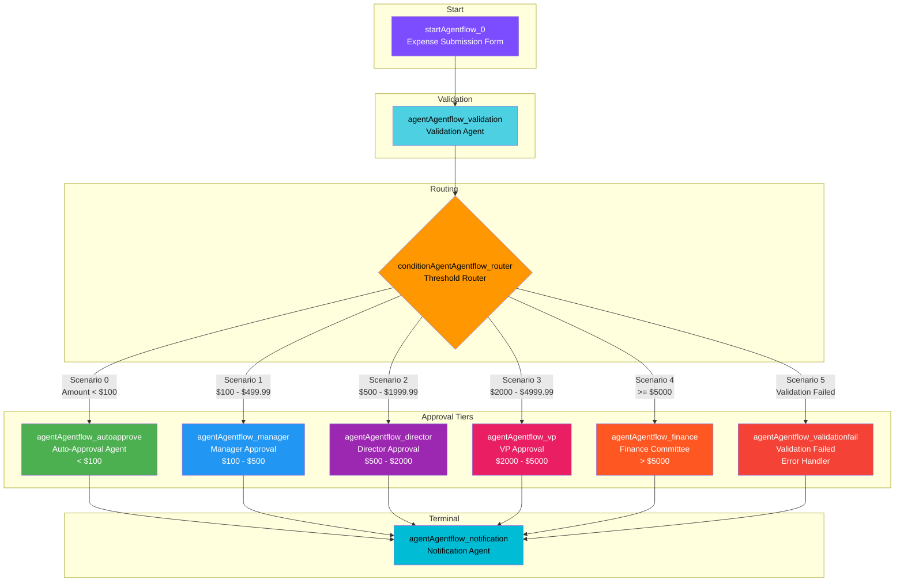

# Expense Approval Workflow - Flowise AgentFlow v2.2

## Workflow Topology



## Node Summary

| Node ID | Type | Description | Color |
|---------|------|-------------|-------|
| startAgentflow_0 | Start | Expense submission form with 6 fields | #7C4DFF |
| agentAgentflow_validation | Agent | Validates expense completeness and compliance | #4DD0E1 |
| conditionAgentAgentflow_router | ConditionAgent | Routes based on amount thresholds (6 scenarios) | #FF9800 |
| agentAgentflow_autoapprove | Agent | Auto-approves expenses < $100 | #4CAF50 |
| agentAgentflow_manager | Agent | Manager approval for $100-$500 | #2196F3 |
| agentAgentflow_director | Agent | Director approval for $500-$2000 | #9C27B0 |
| agentAgentflow_vp | Agent | VP approval for $2000-$5000 | #E91E63 |
| agentAgentflow_finance | Agent | Finance Committee for > $5000 | #FF5722 |
| agentAgentflow_validationfail | Agent | Handles validation errors | #F44336 |
| agentAgentflow_notification | Agent | Formats and sends final notification | #00BCD4 |

## Edge Connections (14 total)

### Sequential Flow
1. `startAgentflow_0` -> `agentAgentflow_validation`
2. `agentAgentflow_validation` -> `conditionAgentAgentflow_router`

### Router Fan-out (6 edges)
3. `conditionAgentAgentflow_router` --[0]--> `agentAgentflow_autoapprove`
4. `conditionAgentAgentflow_router` --[1]--> `agentAgentflow_manager`
5. `conditionAgentAgentflow_router` --[2]--> `agentAgentflow_director`
6. `conditionAgentAgentflow_router` --[3]--> `agentAgentflow_vp`
7. `conditionAgentAgentflow_router` --[4]--> `agentAgentflow_finance`
8. `conditionAgentAgentflow_router` --[5]--> `agentAgentflow_validationfail`

### Convergence to Notification (6 edges)
9. `agentAgentflow_autoapprove` -> `agentAgentflow_notification`
10. `agentAgentflow_manager` -> `agentAgentflow_notification`
11. `agentAgentflow_director` -> `agentAgentflow_notification`
12. `agentAgentflow_vp` -> `agentAgentflow_notification`
13. `agentAgentflow_finance` -> `agentAgentflow_notification`
14. `agentAgentflow_validationfail` -> `agentAgentflow_notification`

## Routing Thresholds

| Threshold | Approver Level | Scenario Index |
|-----------|----------------|----------------|
| < $100 | Auto-Approve | 0 |
| $100 - $499.99 | Manager | 1 |
| $500 - $1,999.99 | Director | 2 |
| $2,000 - $4,999.99 | VP | 3 |
| >= $5,000 | Finance Committee | 4 |
| Validation Failed | Error Handler | 5 |

## State Schema

```json
{
  "expense": {
    "amount": "number",
    "category": "string (travel|meals|supplies|equipment|other)",
    "description": "string",
    "receipt_attached": "boolean",
    "date": "string (ISO date)",
    "submitter": "string"
  },
  "validation": {
    "is_valid": "boolean",
    "errors": "array of strings",
    "validated_at": "string (ISO datetime)"
  },
  "approval": {
    "status": "string (pending|approved|rejected|needs_info|validation_failed)",
    "approver_level": "string (auto|manager|director|vp|finance|none)",
    "decision_rationale": "string",
    "decided_at": "string (ISO datetime)"
  }
}
```

## Form Input Fields

1. **expenseAmount** (number): Expense Amount ($)
2. **expenseCategory** (options): Category (travel, meals, supplies, equipment, other)
3. **expenseDescription** (string): Description
4. **receiptAttached** (boolean): Receipt Attached
5. **expenseDate** (string): Expense Date (YYYY-MM-DD)
6. **submitterName** (string): Submitter Name
