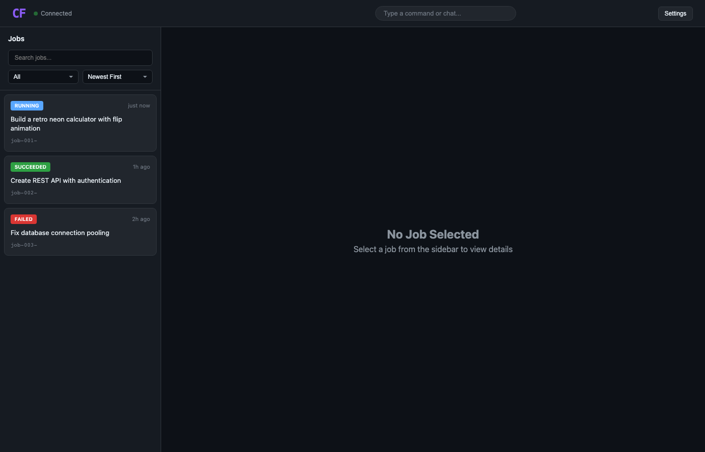
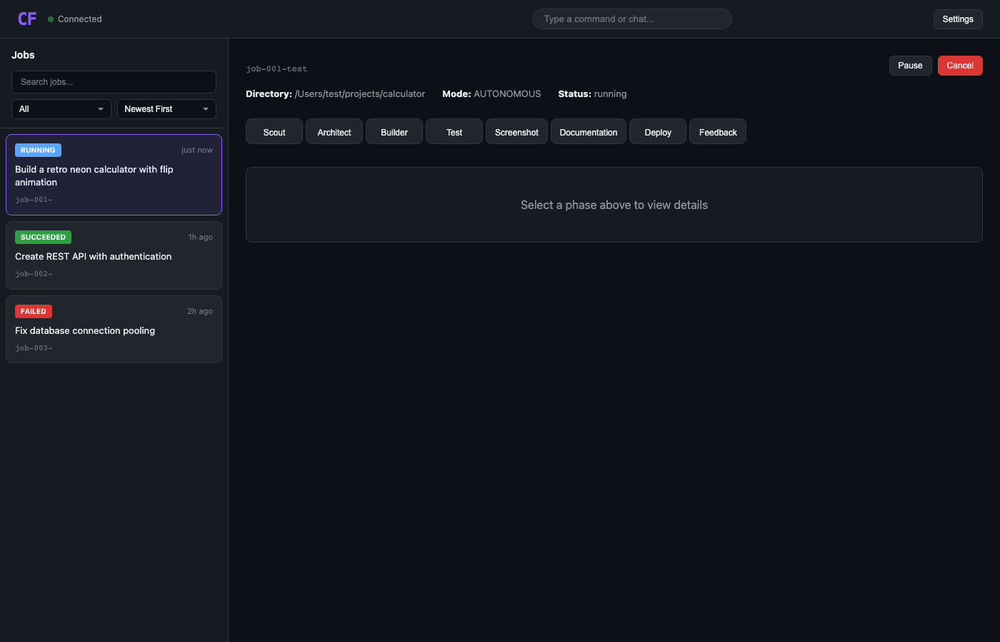
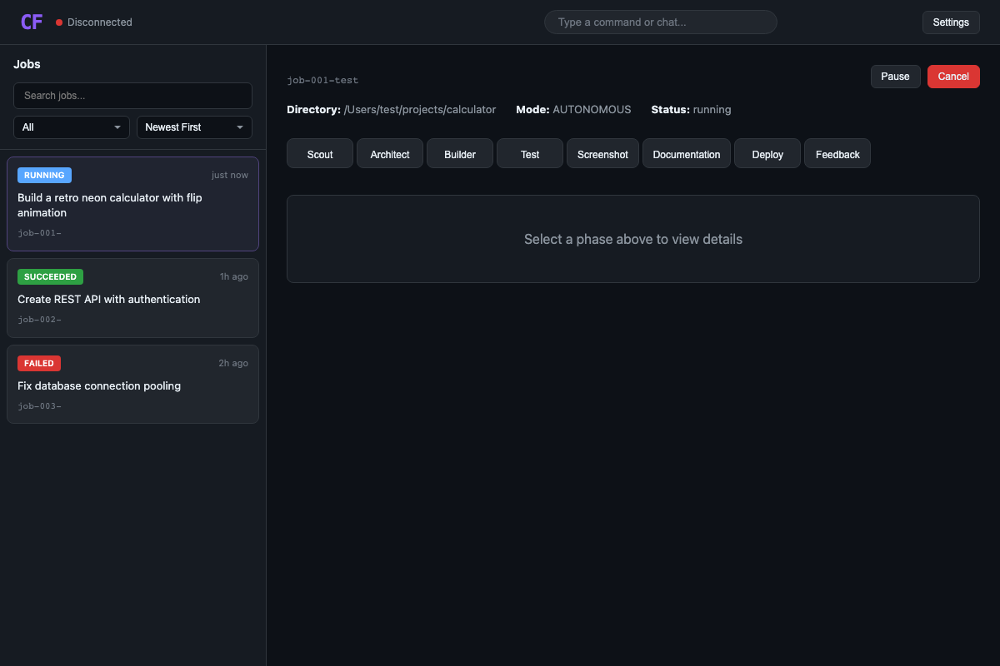

# Context Foundry Dashboard

The web-based dashboard for Context Foundry, providing a visual interface for monitoring builds and managing jobs.



## Overview

The dashboard is a React application built with:

- **React 18** - UI framework
- **TypeScript** - Type safety
- **Vite** - Build tool and dev server
- **Zustand** - State management
- **react-markdown** - Markdown rendering for conversations

## Features

### Job Management



- View all jobs with status, duration, and phase progress
- Real-time job updates via polling
- Filter and search jobs
- Cancel, pause, and resume jobs

### AI Sidekick Chat

Natural language interface to:
- Check system status
- Trigger new builds
- Get help with commands
- Approve HITL (Human-in-the-Loop) requests

### Phase Timeline

Visual progress indicator showing:
- Scout → Architect → Builder → Test → Deploy phases
- Click on phases to view conversation and artifacts

### Conversation View



- See AI thinking during each phase
- Collapsible message sections
- Syntax-highlighted code blocks

### Artifact Browser

- View generated code files
- Line numbers for easy reference
- Syntax highlighting by file type

### Live Duration Counter

- Real-time timer while builds are running
- Final duration displayed when complete
- Located in job detail header

## Development

### Prerequisites

- Node.js 18+
- CF Daemon running (`cfd start`)

### Setup

```bash
# Install dependencies
npm install

# Start development server
npm run dev
```

The dashboard runs on `http://localhost:5174` and proxies API requests to the daemon on port 8421.

### Project Structure

```
dashboard/
├── src/
│   ├── api/              # API client and SSE management
│   ├── components/       # React components
│   │   ├── Header/       # Top navigation bar
│   │   ├── Sidebar/      # Job list panel
│   │   ├── JobDetail/    # Job detail view
│   │   ├── Sidekick/     # AI chat interface
│   │   ├── Settings/     # Settings panel
│   │   └── Activity/     # Activity panel (WIP)
│   ├── stores/           # Zustand state stores
│   ├── styles/           # Global CSS styles
│   ├── types/            # TypeScript type definitions
│   ├── App.tsx           # Main app component
│   └── main.tsx          # Entry point
├── e2e/                  # Playwright E2E tests
├── vite.config.ts        # Vite configuration
└── package.json          # Dependencies
```

### Available Scripts

```bash
npm run dev           # Start dev server with hot reload
npm run build         # Build for production
npm run preview       # Preview production build
npm run typecheck     # Run TypeScript type checking
```

## Testing

### E2E Tests (Playwright)

```bash
# Install Playwright browsers (first time)
npx playwright install chromium

# Run all E2E tests
npm run test:e2e

# Run tests with UI
npm run test:e2e:ui

# Run tests in headed mode
npm run test:e2e:headed

# Generate documentation screenshots
npm run test:screenshots
```

### Test Suites

| File | Description |
|------|-------------|
| `dashboard.spec.ts` | Dashboard load, job list, filters |
| `sidekick.spec.ts` | Chat modal, messages, build triggers |
| `job-detail.spec.ts` | Job info, conversation, artifacts |
| `screenshot.spec.ts` | Generate docs screenshots |

## API Endpoints

The dashboard communicates with the CF Daemon HTTP API:

| Endpoint | Method | Description |
|----------|--------|-------------|
| `/api/jobs` | GET | List all jobs |
| `/api/jobs/:id` | GET | Get job details |
| `/api/jobs/:id/cancel` | POST | Cancel a job |
| `/api/jobs/:id/pause` | POST | Pause a job |
| `/api/jobs/:id/resume` | POST | Resume a job |
| `/api/jobs/:id/conversation` | GET | Get phase conversation |
| `/api/jobs/:id/artifacts` | GET | Get phase artifacts |
| `/api/sidekick-chat` | POST | Send chat message |
| `/api/pending-approvals` | GET | List pending approvals |

## Styling

The dashboard uses CSS custom properties for theming:

```css
:root {
  --bg-primary: #0d1117;
  --bg-secondary: #161b22;
  --accent-purple: #8b5cf6;
  --accent-blue: #58a6ff;
  --accent-green: #2ea043;
  --accent-cyan: #39c5cf;
  --accent-orange: #f97316;
}
```

## Building for Production

```bash
npm run build
```

Output is in `dist/`. The production build is served by the CF Daemon.

## Integration with Desktop App

The dashboard is also used as the frontend for the Context Foundry Desktop app (Tauri). When running inside Tauri:

- API calls go directly to `localhost:8421` instead of through Vite proxy
- The Tauri app manages daemon lifecycle
- System tray integration is handled by the Rust backend

See [Desktop App Documentation](../../apps/context-foundry-desktop/README.md) for details.

## Troubleshooting

### Dashboard shows "Disconnected"

1. Ensure daemon is running: `cfd status`
2. Check daemon logs: `cfd logs`
3. Restart daemon: `cfd stop && cfd start`

### Sidekick not responding

1. Check browser console for errors
2. Verify Claude CLI is installed: `which claude`
3. Check daemon has `job_manager` configured

### Hot reload not working

1. Ensure Vite dev server is running on port 5174
2. Check for TypeScript errors: `npm run typecheck`
3. Restart dev server: Ctrl+C, then `npm run dev`

## License

Part of Context Foundry. See main repository for license information.
