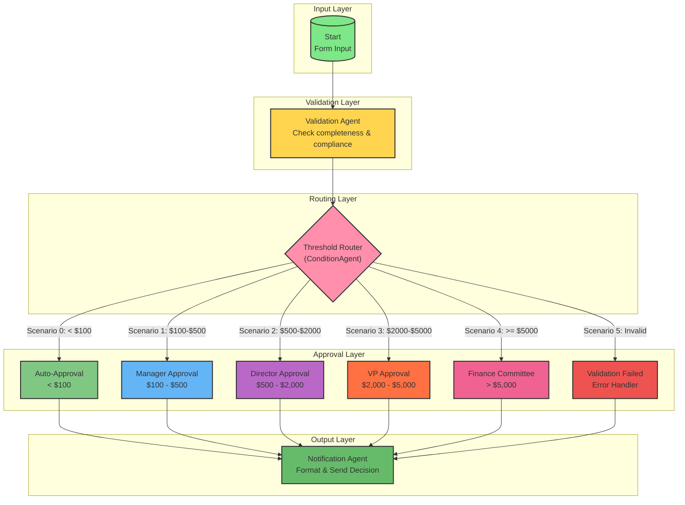

# Expense Approval Workflow - Topology Diagram

## Workflow Pattern: Routing with Threshold-Based Decision

This workflow implements an expense approval system with tiered routing based on expense amounts.

## Mermaid Diagram



## Node Summary

| Node ID | Type | Description | Color |
|---------|------|-------------|-------|
| `startAgentflow_0` | Start | Form input for expense submission | Green |
| `agentAgentflow_validation` | Agent | Validates expense completeness and compliance | Yellow |
| `conditionAgentAgentflow_router` | ConditionAgent | Routes based on amount thresholds | Pink |
| `agentAgentflow_autoapprove` | Agent | Auto-approves expenses < $100 | Light Green |
| `agentAgentflow_manager` | Agent | Manager approval $100-$500 | Blue |
| `agentAgentflow_director` | Agent | Director approval $500-$2000 | Purple |
| `agentAgentflow_vp` | Agent | VP approval $2000-$5000 | Orange |
| `agentAgentflow_finance` | Agent | Finance Committee approval > $5000 | Pink |
| `agentAgentflow_validationfail` | Agent | Handles validation failures | Red |
| `agentAgentflow_notification` | Agent | Formats and sends final notification | Green |

## Edge Summary (14 edges)

| Edge ID | Source | Target | Description |
|---------|--------|--------|-------------|
| 1 | Start | Validation | Form data to validation |
| 2 | Validation | Router | Validation result to router |
| 3 | Router (0) | Auto-Approve | < $100 expenses |
| 4 | Router (1) | Manager | $100-$500 expenses |
| 5 | Router (2) | Director | $500-$2000 expenses |
| 6 | Router (3) | VP | $2000-$5000 expenses |
| 7 | Router (4) | Finance | > $5000 expenses |
| 8 | Router (5) | ValidationFail | Invalid submissions |
| 9 | Auto-Approve | Notification | Decision to notification |
| 10 | Manager | Notification | Decision to notification |
| 11 | Director | Notification | Decision to notification |
| 12 | VP | Notification | Decision to notification |
| 13 | Finance | Notification | Decision to notification |
| 14 | ValidationFail | Notification | Error to notification |

## Routing Thresholds

```
Amount < $100          → Auto-Approve (no human review)
$100 ≤ Amount < $500   → Manager Approval
$500 ≤ Amount < $2000  → Director Approval
$2000 ≤ Amount < $5000 → VP Approval
Amount ≥ $5000         → Finance Committee Approval
Validation Failed      → Error Handler
```

## State Schema

```json
{
  "expense": {
    "amount": "number",
    "category": "travel|meals|supplies|equipment|other",
    "description": "string",
    "receipt_attached": "boolean",
    "date": "ISO date string",
    "submitter": "string"
  },
  "validation": {
    "is_valid": "VALID/INVALID string",
    "validated_at": "ISO datetime"
  },
  "approval": {
    "status": "pending|approved|rejected|needs_info|validation_failed|deferred",
    "approver_level": "auto|manager|director|vp|finance|none",
    "decision_rationale": "string",
    "decided_at": "ISO datetime"
  }
}
```

## Form Input Fields

1. **Expense Amount ($)** - number - Required
2. **Category** - options - travel, meals, supplies, equipment, other
3. **Description** - string - Required (>10 chars)
4. **Receipt Attached** - boolean - Required for amounts > $25
5. **Expense Date** - string (YYYY-MM-DD) - Required, not future
6. **Submitter Name** - string - Required
